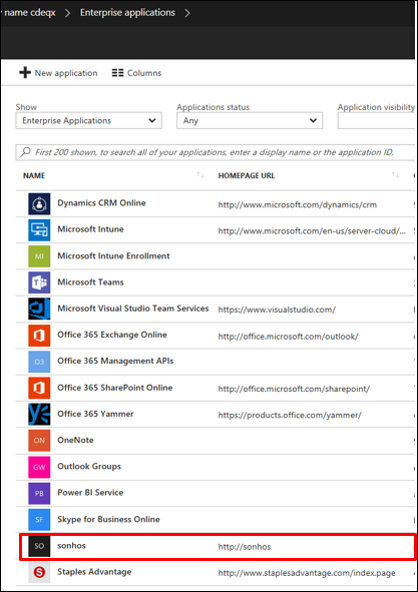
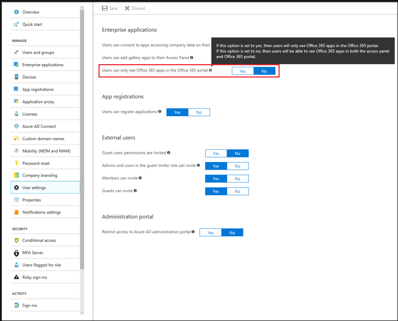

# Hide an application from user's experience in Azure Active Directory

If you have an application that you do not want to show on users’ access panels or Office 365 launchers, there are options to hide this app tile.  The following two options are available for hiding applications from user's app launchers.

- Hide a third-party application from users access panels and Office 365 app launchers
- Hide all Office 365 applications from users access panels

By hiding the app users still have permissions to the app but will not see them appear on their app launchers. You must have the appropriate permissions to manage the enterprise app, and you must be a global admin for the directory.

## Hiding an application from user's end user experiences
You can use the steps below, depending on your situation, to hide applications from the access panel.

### How do I hide a third-party app from user’s access panel and O365 app launchers?
Use the following steps to hide an application from a user's access panel and Office 365 app launchers.

1. Sign in to the [Azure portal](https://portal.azure.com) with an account that's a global admin for the directory.
2. Select **More services**, enter **Azure Active Directory** in the text box, and then select **Enter**.
3. On the <strong>Azure Active Directory - *directoryname</strong>* screen (that is, the Azure AD screen for the directory you are managing), select <strong>Enterprise applications</strong>.

   
4. On the **Enterprise applications** screen, select **All applications**. You see a list of the apps you can manage.
5. On the **Enterprise applications - All applications** screen, select an app. 
   
6. On the ***appname*** screen (that is, the screen with the name of the selected app in the title), select Properties.
7. On the ***appname* - Properties** screen, select **Yes** for **Visible to users?**.
   
8. Select the **Save** command.

### How do I hide Office 365 applications from user's access panel?

Use the following steps to hide all Office 365 applications from the access panel. These apps will still be visible in the Office 365 portal.

1. Sign in to the [Azure portal](https://portal.azure.com) with an account that's a global admin for the directory.
2. Select **More services**, enter **Azure Active Directory** in the text box, and then select **Enter**.
3. On the <strong>Azure Active Directory - *directoryname</strong>* screen (that is, the Azure AD screen for the directory you are managing), select <strong>User settings</strong>.
4. On the **User settings** screen, under **Enterprise applications** select **Yes** for **Users can only see Office 365 apps in the Office 365 portal**.

## Next steps
* [See all my groups](active-directory-groups-view-azure-portal.md)
* [Assign a user or group to an enterprise app](active-directory-coreapps-assign-user-azure-portal.md)
* [Remove a user or group assignment from an enterprise app](active-directory-coreapps-remove-assignment-azure-portal.md)
* [Change the name or logo of an enterprise app](active-directory-coreapps-change-app-logo-user-azure-portal.md)

