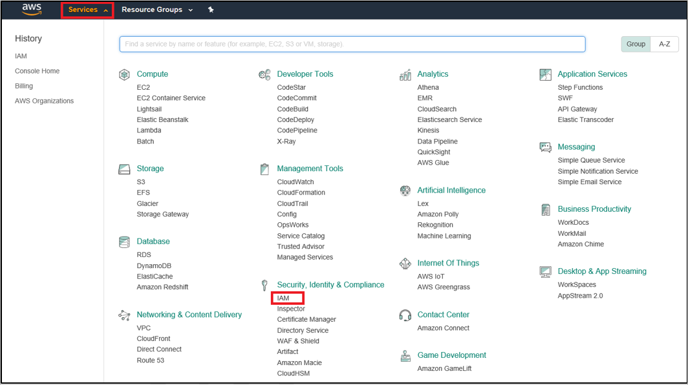
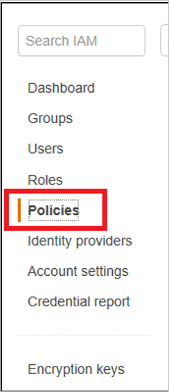
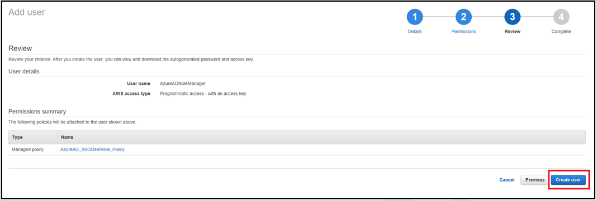

# Tutorial: Azure Active Directory integration with Amazon Web Services (AWS)

In this tutorial, you learn how to integrate Amazon Web Services (AWS) with Azure Active Directory (Azure AD).

Integrating Amazon Web Services (AWS) with Azure AD provides you with the following benefits:

- You can control in Azure AD who has access to Amazon Web Services (AWS).
- You can enable your users to automatically get signed in to Amazon Web Services (AWS) with their Azure AD accounts.
- You can manage your accounts in one central location--the Azure portal.

For more information about SaaS app integration with Azure AD, see [What is application access and single sign-on with Azure Active Directory?](active-directory-appssoaccess-whatis.md).

## Prerequisites

To configure Azure AD integration with Amazon Web Services (AWS), you need the following items:

- An Azure AD subscription
- An Amazon Web Services (AWS) single sign-on enabled subscription

> [!NOTE]
> We don't recommend using a production environment to test the steps in this tutorial.

To test the steps in this tutorial, follow these recommendations:

- Don't use your production environment unless it's necessary.
- If you don't have an Azure AD trial environment, you can [get a free one-month trial](https://azure.microsoft.com/pricing/free-trial/).

## Scenario description
In this tutorial, you test Azure AD single sign-on in a test environment. The scenario outlined in this tutorial consists of two main building blocks:

1. Adding Amazon Web Services (AWS) from the gallery
2. Configuring and testing Azure AD single sign-on

## Add Amazon Web Services (AWS) from the gallery
To configure the integration of Amazon Web Services (AWS) into Azure AD, you need to add Amazon Web Services (AWS) from the gallery to your list of managed SaaS apps.

**To add Amazon Web Services (AWS) from the gallery, take the following steps:**

1. In the **[Azure portal](https://portal.azure.com)**, in the left navigation pane, select the **Azure Active Directory** icon. 

    ![The Azure Active Directory button][1]

2. Go to **Enterprise applications**. Then go to **All applications**.

    ![The Enterprise applications blade][2]
    
3. To add a new application, select the **New application** button on the top of the dialog box.

    ![The New application button][3]

4. In the search box, type **Amazon Web Services (AWS)**. Select **Amazon Web Services (AWS)** from results panel, and then select the **Add** button to add the application.

    _addfromgallery.png)

## Configure and test Azure AD single sign-on

In this section, you configure and test Azure AD single sign-on with Amazon Web Services (AWS) based on a test user called "Britta Simon."

For single sign-on to work, Azure AD needs to know who the counterpart user in Amazon Web Services (AWS) is to a user in Azure AD. In other words, you need to establish a link  between an Azure AD user and a related user in Amazon Web Services (AWS).

To establish the link, in Amazon Web Services (AWS), give the value **Username** the same value as **user name** in Azure AD. 

To configure and test Azure AD single sign-on with Amazon Web Services (AWS), complete the following building blocks:

1. [Configure Azure AD single sign-on](#configure-azure-ad-single-sign-on) to enable your users to use this feature.
2. [Create an Azure AD test user](#create-an-azure-ad-test-user) to test Azure AD single sign-on with Britta Simon.
3. [Create an Amazon Web Services (AWS) test user](#create-an-amazon-web-services-aws-test-user) to have a counterpart of Britta Simon in Amazon Web Services (AWS) that is linked to the Azure AD representation of user.
4. [Assign the Azure AD test user](#assign-the-azure-ad-test-user) to enable Britta Simon to use Azure AD single sign-on.
5. [Test single sign-on](#test-single-sign-on) to verify that the configuration works.

### Configure Azure AD single sign-on

In this section, you enable Azure AD single sign-on in the Azure portal and configure single sign-on in your Amazon Web Services (AWS) application.

**To configure Azure AD single sign-on with Amazon Web Services (AWS), take the following steps:**

1. In the Azure portal, on the **Amazon Web Services (AWS)** application integration page, select **Single sign-on**.

    ![Configure single sign-on link][4]

2. To enable single sign-on, in the **Single sign-on** dialog box, in the **Mode** drop-down list, select **SAML-based Sign-on**.
 
    _samlbase.png)

3. In the **Amazon Web Services (AWS) Domain and URLs** section, the user doesn't have to take any steps because the app is already pre-integrated with Azure.

    _url.png)

4. The Amazon Web Services (AWS) software application expects the SAML assertions in a specific format. Configure the following claims for this application. You can manage the values of these attributes from the **User Attributes** section on the application integration page. The following screenshot shows an example:

    _attribute.png)  

5. In the **User Attributes** section in the **Single sign-on** box, configure the SAML token attribute as shown in the previous image, and then take the following steps:
    
    | Attribute name  | Attribute value | Namespace |
    | --------------- | --------------- | --------------- |
    | RoleSessionName | user.userprincipalname | https://aws.amazon.com/SAML/Attributes |
    | Role            | user.assignedroles |  https://aws.amazon.com/SAML/Attributes |
    
    >[!TIP]
    >Configure the user provisioning in Azure AD to fetch all the roles from the Amazon Web Services (AWS) console. Refer to the following provisioning steps.

    a. To open the **Add Attribute** dialog box, select **Add attribute**.

    

    

    b. In the **Name** box, type the attribute name that's shown for that row.

    c. From the **Value** list, type the attribute value that's shown for that row.

    d. In the **Namespace** box, type the namespace value that's shown for that row.
    
    d. Select **Ok**.

6. In the **SAML Signing Certificate** section, select **Metadata XML**. Then save the metadata file on your computer.

    _certificate.png) 

7. Select **Save**.

    

8. In a different browser window, sign in to your Amazon Web Services (AWS) company site as an administrator.

9. Select **Console Home**.
   
    ![Configure single sign-on home][11]

10. Select **Identity and Access Management**. 
   
    ![Configure single sign-on identity][12]

11. Select **Identity Providers**. Then select **Create Provider**. 
   
    ![Configure single sign-on provider][13]

12. In the **Configure Provider** dialog box, take the following steps: 
   
    ![Configure single sign-n dialog][14]
 
    a. For **Provider Type**, select **SAML**.

    b. In the **Provider Name** box, type a provider name (for example: *WAAD*).

    c. To upload your downloaded **metadata file** from the Azure portal, select **Choose File**.

    d. Select **Next Step**.

13. In the **Verify Provider Information** dialog box, select **Create**. 
    
    ![Configure single sign-on verification][15]

14. Select **Roles**. Then select **Create New Role**. 
    
    ![Configure single sign-on roles][16]

15. In the **Set Role Name** dialog box, take the following steps: 
    
    ![Configure single sign-on name][17] 

    a. In the **Role Name** box, type a role name (for example, *TestUser*). 

    b. Select **Next Step**.

16. In the **Select Role Type** dialog box, take the following steps: 
    
    ![Configure single sign-on role type][18] 

    a. Select **Role For Identity Provider Access**. 

    b. In the **Grant Web Single Sign-On (WebSSO) access to SAML providers** section, click **Select**.

17. In the **Establish Trust** dialog box, take the following steps:  
    
    ![Configure single sign-on trust][19] 

    a. Select the SAML provider you created previously (for example: *WAAD*). 
  
    b. Select **Next Step**.

18. In the **Verify Role Trust** dialog box, select **Next Step**. 
    
    ![Configure Single Sign-On Role Trust][32]

19. In the **Attach Policy** dialog box, select **Next Step**.  
    
    ![Configure Single Sign-On Policy][33]

20. In the **Review** dialog box, take the following steps:   
    
    ![Configure single sign-on review][34] 

    a. Select **Create Role**.

    b. Create as many roles as necessary, and then map them to the Identity Provider.

21. Use Amazon Web Services (AWS) service account credentials for fetching the roles from the Amazon Web Services (AWS) account in Azure AD user provisioning. To start this task, open the Amazon Web Services (AWS) console home.

22. Select **Services** > **Security, Identity & Compliance** > **IAM**.

    

23. In the IAM section, select the **Policies** tab.

    

24. To create a new policy, select **Create policy**.

    
 
25. To create your own policy to fetch all the roles from Amazon Web Services (AWS) accounts, take the following steps:

    

    a. In the **Create policy** section, select the **JSON** tab.

    b. In the policy document, add the following JSON:
    
    ```
    
    {

    "Version": "2012-10-17",

    "Statement": [

    {

    "Effect": "Allow",
        
    "Action": [
        
    "iam: ListRoles"
        
    ],

    "Resource": "*"

    }

    ]

    }
    
    ```

    c. To validate the policy, select the **Review Policy button**.

    

26. Define the **new policy** by taking the following steps:

    

    a. Provide the **Policy Name** as **AzureAD_SSOUserRole_Policy**.

    b. You can provide the following **Description** for the policy: **This policy will allow you to fetch the roles from AWS accounts**.
    
    c. Select the **Create Policy** button.
        
27. To create a new user account in the Amazon Web Services (AWS) IAM service, take the following steps:

    a. Select **Users** in the Amazon Web Services (AWS) IAM console.

    
    
    b.To create a new user, select the **Add user** button.

    

    c. In the **Add user** section, take the following steps:
    
    
    
    * Enter **AzureADRoleManager** in the user name box.
    
    * For Access type, select the **Programmatic access** option. This way the user can invoke the APIs and fetch the roles from the Amazon Web Services (AWS) account.
    
    * Select the **Next Permissions** button in the lower right corner.

28. Create a new policy for this user by taking the following steps:

    
    
    a. Select the **Attach existing policies directly** button.

    b. Search for the newly created policy in the filter section **AzureAD_SSOUserRole_Policy**.
    
    c. Select the **policy**. Then select the **Next: Review** button.

29. Review the policy for the attached user by taking the following steps:

    
    
    a. Review the user name, access type, and policy that are mapped to the user.
    
    b. To create the user, select the **Create user** button in the lower right corner to create the user.

30. Download the credentials of a user by taking the following steps:

    
    
    a. Copy the user **Access key ID** and **Secret access key**.
    
    b. Enter these credentials into the Azure AD user provisioning section to fetch the roles from the Amazon Web Services (AWS) console.
    
    c. Select the **Close** button in the lower right corner.

31. Navigate to the **User Provisioning** section of the Amazon Web Services (AWS) app in the Azure AD Management Portal.

    

32. Enter the **Access Key** and **Secret** in the **Client Secret** and **Secret Token** field respectively.

    
    
    a. Enter the Amazon Web Services (AWS) user access key in the **clientsecret** field.
    
    b. Enter the Amazon Web Services (AWS) user secret in the **Secret Token** field.
    
    c. Select the **Test Connection** button. You should able to successfully test this connection.

    d. Save the setting by selecting the **Save** button at the top.
 
33. Make sure that you turn the the Provisioning Status **On** in **Settings**. You do this by selecting **On**, and then selecting the **Save** button at the top.

    

> [!TIP]
> You can now read a concise version of these instructions inside the [Azure portal](https://portal.azure.com) while you are setting up the app. After you add this app from the **Active Directory > Enterprise Applications** section, select the **Single Sign-On** tab. Then access the embedded documentation through the **Configuration** section at the bottom. You can read more about the embedded documentation feature at [Azure AD embedded documentation]( https://go.microsoft.com/fwlink/?linkid=845985).
> 

### Create an Azure AD test user

The objective of this section is to create a test user in the Azure portal called Britta Simon.

   ![Create an Azure AD test user][100]

**To create a test user in Azure AD, take the following steps:**

1. In the Azure portal, in the left pane, select the **Azure Active Directory** button.

    

2. To display the list of users, go to **Users and groups**. Then select **All users**.

    

3. To open the **User** dialog box, select **Add** at the top of the **All Users** dialog box.

    

4. In the **User** dialog box, take the following steps:

    

    a. In the **Name** box, type **BrittaSimon**.

    b. In the **User name** box, type the email address of user Britta Simon.

    c. Select the **Show Password** check box, and then write down the value that's displayed in the **Password** box.

    d. Select **Create**.
 
### Create an Amazon Web Services (AWS) test user

The objective of this section is to create a user called Britta Simon in Amazon Web Services (AWS). Amazon Web Services (AWS) doesn't need a user to be created in their system for single-sign-on, so you don't need to perform any action here.

### Assign the Azure AD test user

In this section, you enable Britta Simon to use Azure single sign-on by granting them access to Amazon Web Services (AWS).

![Assign the user role][200] 

**To assign Britta Simon to Amazon Web Services (AWS), take the following steps:**

1. In the Azure portal, open the applications view. Then go to the directory view and select **Enterprise applications**. Next, select **All applications**.

    ![Assign User][201] 

2. In the applications list, select **Amazon Web Services (Amazon Web Services (AWS)**.

    _app.png)  

3. In the menu on the left, select **Users and groups**.

    ![The "Users and groups" link][202]

4. Select the **Add** button. Then, in the **Add Assignment** dialog box, select **Users and groups**.

    ![The Add Assignment pane][203]

5. In the **Users and groups** dialog box, select **Britta Simon** in the users list.

6. In the **Users and groups** dialog box, click the **Select** button. 

7. In  the **Add Assignment** dialog box, select the **Assign** button.
    
### Test single sign-on

In this section, you test your Azure AD single sign-on configuration by using the access panel.

When you select the Amazon Web Services (AWS) tile in the access panel, you should get automatically signed-in to your Amazon Web Services (AWS) application. For more information about the access panel, see [Introduction to the access panel](active-directory-saas-access-panel-introduction.md). 

## Additional resources

* [List of tutorials on how to integrate SaaS Apps with Azure Active Directory](active-directory-saas-tutorial-list.md)
* [What is application access and single sign-on with Azure Active Directory?](active-directory-appssoaccess-whatis.md)


<!--Image references-->

[1]: ./media/active-directory-saas-amazon-web-service-tutorial/tutorial_general_01.png
[2]: ./media/active-directory-saas-amazon-web-service-tutorial/tutorial_general_02.png
[3]: ./media/active-directory-saas-amazon-web-service-tutorial/tutorial_general_03.png
[4]: ./media/active-directory-saas-amazon-web-service-tutorial/tutorial_general_04.png

[100]: ./media/active-directory-saas-amazon-web-service-tutorial/tutorial_general_100.png

[200]: ./media/active-directory-saas-amazon-web-service-tutorial/tutorial_general_200.png
[201]: ./media/active-directory-saas-amazon-web-service-tutorial/tutorial_general_201.png
[202]: ./media/active-directory-saas-amazon-web-service-tutorial/tutorial_general_202.png
[203]: ./media/active-directory-saas-amazon-web-service-tutorial/tutorial_general_203.png
[11]: ./media/active-directory-saas-amazon-web-service-tutorial/ic795031.png
[12]: ./media/active-directory-saas-amazon-web-service-tutorial/ic795032.png
[13]: ./media/active-directory-saas-amazon-web-service-tutorial/ic795033.png
[14]: ./media/active-directory-saas-amazon-web-service-tutorial/ic795034.png
[15]: ./media/active-directory-saas-amazon-web-service-tutorial/ic795035.png
[16]: ./media/active-directory-saas-amazon-web-service-tutorial/ic795022.png
[17]: ./media/active-directory-saas-amazon-web-service-tutorial/ic795023.png
[18]: ./media/active-directory-saas-amazon-web-service-tutorial/ic795024.png
[19]: ./media/active-directory-saas-amazon-web-service-tutorial/ic795025.png
[32]: ./media/active-directory-saas-amazon-web-service-tutorial/ic7950251.png
[33]: ./media/active-directory-saas-amazon-web-service-tutorial/ic7950252.png
[35]: ./media/active-directory-saas-amazon-web-service-tutorial/tutorial_amazonwebservices_provisioning.png
[34]: ./media/active-directory-saas-amazon-web-service-tutorial/ic7950253.png
[36]: ./media/active-directory-saas-amazon-web-service-tutorial/tutorial_amazonwebservices_securitycredentials.png
[37]: ./media/active-directory-saas-amazon-web-service-tutorial/tutorial_amazonwebservices_securitycredentials_continue.png
[38]: ./media/active-directory-saas-amazon-web-service-tutorial/tutorial_amazonwebservices_createnewaccesskey.png
[39]: ./media/active-directory-saas-amazon-web-service-tutorial/tutorial_amazonwebservices_provisioning_automatic.png
[40]: ./media/active-directory-saas-amazon-web-service-tutorial/tutorial_amazonwebservices_provisioning_testconnection.png
[41]: ./media/active-directory-saas-amazon-web-service-tutorial/tutorial_amazonwebservices_provisioning_on.png

