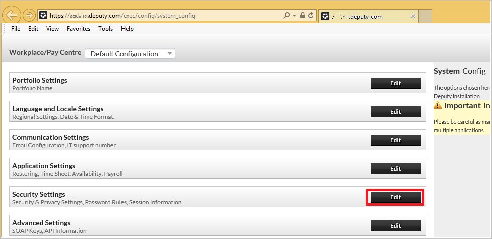
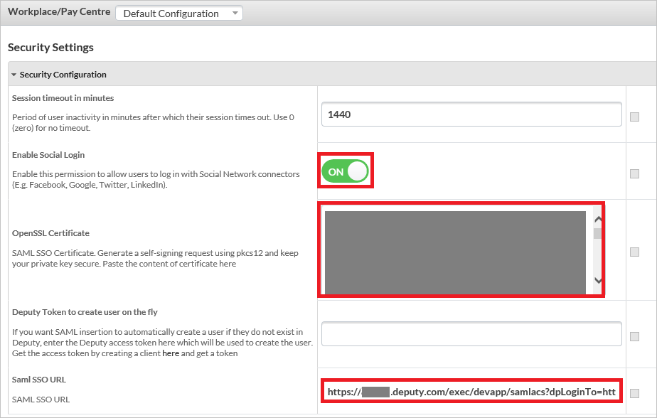
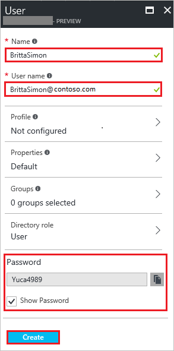
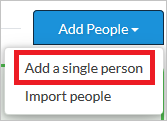
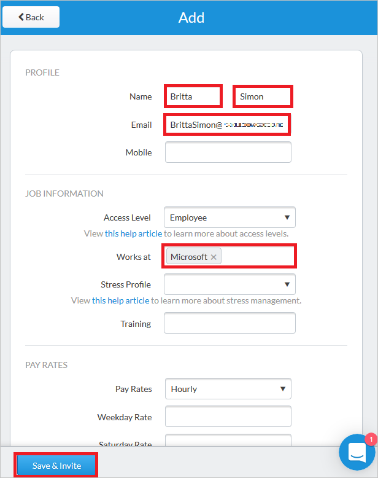
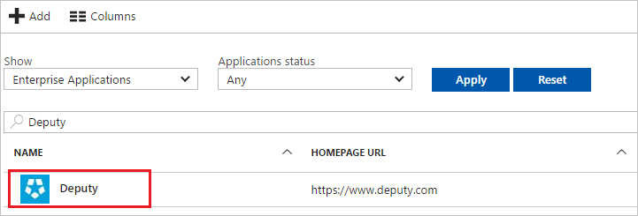

# Tutorial: Azure Active Directory integration with Deputy

In this tutorial, you learn how to integrate Deputy with Azure Active Directory (Azure AD).

Integrating Deputy with Azure AD provides you with the following benefits:

- You can control in Azure AD who has access to Deputy
- You can enable your users to automatically get signed-on to Deputy (Single Sign-On) with their Azure AD accounts
- You can manage your accounts in one central location - the Azure portal

If you want to know more details about SaaS app integration with Azure AD, see [what is application access and single sign-on with Azure Active Directory](active-directory-appssoaccess-whatis.md).

## Prerequisites

To configure Azure AD integration with Deputy, you need the following items:

- An Azure AD subscription
- A Deputy single sign-on enabled subscription

> [!NOTE]
> To test the steps in this tutorial, we do not recommend using a production environment.

To test the steps in this tutorial, you should follow these recommendations:

- Do not use your production environment, unless it is necessary.
- If you don't have an Azure AD trial environment, you can get a one-month trial [here](https://azure.microsoft.com/pricing/free-trial/).

## Scenario description
In this tutorial, you test Azure AD single sign-on in a test environment. 
The scenario outlined in this tutorial consists of two main building blocks:

1. Adding Deputy from the gallery
2. Configuring and testing Azure AD single sign-on

## Adding Deputy from the gallery
To configure the integration of Deputy into Azure AD, you need to add Deputy from the gallery to your list of managed SaaS apps.

**To add Deputy from the gallery, perform the following steps:**

1. In the **[Azure portal](https://portal.azure.com)**, on the left navigation panel, click **Azure Active Directory** icon. 

    ![Active Directory][1]

2. Navigate to **Enterprise applications**. Then go to **All applications**.

    ![Applications][2]

3. To add new application, click **New application** button on the top of dialog.

    ![Applications][3]

4. In the search box, type **Deputy**.

    

5. In the results panel, select **Deputy**, and then click **Add** button to add the application.

    

##  Configuring and testing Azure AD single sign-on
In this section, you configure and test Azure AD single sign-on with Deputy based on a test user called "Britta Simon."

For single sign-on to work, Azure AD needs to know what the counterpart user in Deputy is to a user in Azure AD. In other words, a link relationship between an Azure AD user and the related user in Deputy needs to be established.

In Deputy, assign the value of the **user name** in Azure AD as the value of the **Username** to establish the link relationship.

To configure and test Azure AD single sign-on with Deputy, you need to complete the following building blocks:

1. **[Configuring Azure AD Single Sign-On](#configuring-azure-ad-single-sign-on)** - to enable your users to use this feature.
2. **[Creating an Azure AD test user](#creating-an-azure-ad-test-user)** - to test Azure AD single sign-on with Britta Simon.
3. **[Creating a Deputy test user](#creating-a-deputy-test-user)** - to have a counterpart of Britta Simon in Deputy that is linked to the Azure AD representation of user.
4. **[Assigning the Azure AD test user](#assigning-the-azure-ad-test-user)** - to enable Britta Simon to use Azure AD single sign-on.
5. **[Testing Single Sign-On](#testing-single-sign-on)** - to verify whether the configuration works.

### Configuring Azure AD single sign-on

In this section, you enable Azure AD single sign-on in the Azure portal and configure single sign-on in your Deputy application.

**To configure Azure AD single sign-on with Deputy, perform the following steps:**

1. In the Azure portal, on the **Deputy** application integration page, click **Single sign-on**.

    ![Configure Single Sign-On][4]

2. On the **Single sign-on** dialog, select **Mode** as **SAML-based Sign-on** to enable single sign-on.

    

3. On the **Deputy Domain and URLs** section, If you wish to configure the application in **IDP** initiated mode:

    

    a. In the **Identifier** textbox, type a URL using the following pattern:

    |  |
    | ----|
    | `https://<subdomain>.<region>.au.deputy.com` |
    | `https://<subdomain>.<region>.ent-au.deputy.com` |
    | `https://<subdomain>.<region>.na.deputy.com`|
    | `https://<subdomain>.<region>.ent-na.deputy.com`|
    | `https://<subdomain>.<region>.eu.deputy.com` |
    | `https://<subdomain>.<region>.ent-eu.deputy.com` |
    | `https://<subdomain>.<region>.as.deputy.com` |
    | `https://<subdomain>.<region>.ent-as.deputy.com` |
    | `https://<subdomain>.<region>.la.deputy.com` |
    | `https://<subdomain>.<region>.ent-la.deputy.com` |
    | `https://<subdomain>.<region>.af.deputy.com` |
    | `https://<subdomain>.<region>.ent-af.deputy.com` |
    | `https://<subdomain>.<region>.an.deputy.com` |
    | `https://<subdomain>.<region>.ent-an.deputy.com` |
    | `https://<subdomain>.<region>.deputy.com` |

    b. In the **Reply URL** textbox, type a URL using the following pattern:

   |                                                                       |
   |-----------------------------------------------------------------------|
   |   `https://<subdomain>.<region>.au.deputy.com/exec/devapp/samlacs.`   |
   | `https://<subdomain>.<region>.ent-au.deputy.com/exec/devapp/samlacs.` |
   |   `https://<subdomain>.<region>.na.deputy.com/exec/devapp/samlacs.`   |
   | `https://<subdomain>.<region>.ent-na.deputy.com/exec/devapp/samlacs.` |
   |   `https://<subdomain>.<region>.eu.deputy.com/exec/devapp/samlacs.`   |
   | `https://<subdomain>.<region>.ent-eu.deputy.com/exec/devapp/samlacs.` |
   |   `https://<subdomain>.<region>.as.deputy.com/exec/devapp/samlacs.`   |
   | `https://<subdomain>.<region>.ent-as.deputy.com/exec/devapp/samlacs.` |
   |   `https://<subdomain>.<region>.la.deputy.com/exec/devapp/samlacs.`   |
   | `https://<subdomain>.<region>.ent-la.deputy.com/exec/devapp/samlacs.` |
   |   `https://<subdomain>.<region>.af.deputy.com/exec/devapp/samlacs.`   |
   | `https://<subdomain>.<region>.ent-af.deputy.com/exec/devapp/samlacs.` |
   |   `https://<subdomain>.<region>.an.deputy.com/exec/devapp/samlacs.`   |
   | `https://<subdomain>.<region>.ent-an.deputy.com/exec/devapp/samlacs.` |
   |    `https://<subdomain>.<region>.deputy.com/exec/devapp/samlacs.`     |

4. Check **Show advanced URL settings**. If you wish to configure the application in **SP** initiated mode:

    

    In the **Sign-on URL** textbox, type a URL using the following pattern: `https://<your-subdomain>.<region>.deputy.com`

    >[!NOTE]
    > Deputy region suffix is optional, or it should use one of these: 
    > au | na | eu |as |la |af |an |ent-au |ent-na |ent-eu |ent-as | ent-la | ent-af | ent-an

    > [!NOTE] 
    > These values are not real. Update these values with the actual Identifier, Reply URL, and Sign-On URL. Contact [Deputy support team](https://www.deputy.com/call-centers-customer-support-scheduling-software) to get these values. 

5. On the **SAML Signing Certificate** section, click **Certificate(Base64)** and then save the certificate file on your computer.

     

6. Click **Save** button.

    

7. On the **Deputy Configuration** section, click **Configure Deputy** to open **Configure sign-on** window. Copy the **SAML Single Sign-On Service URL** from the **Quick Reference section.**

     

8. Navigate to the following URL:[https://(your-subdomain).deputy.com/exec/config/system_config]( https://(your-subdomain).deputy.com/exec/config/system_config). Go to **Security Settings** and click **Edit**.

    

9. On this **Security Settings** page, perform below steps.

    

    a. Enable **Social Login**.

    b. Open your Base64 encoded certificate downloaded from Azure portal in notepad, copy the content of it into your clipboard, and then paste it to the **OpenSSL Certificate** textbox.

    c. In the SAML SSO URL textbox, type `https://<your subdomain>.deputy.com/exec/devapp/samlacs?dpLoginTo=<saml sso url>`

    d. In the SAML SSO URL textbox, replace `<your subdomain>` with your subdomain.

    e. In the SAML SSO URL textbox, replace `<saml sso url>` with the **SAML Single Sign-On Service URL** you have copied from the Azure portal.

    f. Click **Save Settings**.

> [!TIP]
> You can now read a concise version of these instructions inside the [Azure portal](https://portal.azure.com), while you are setting up the app!  After adding this app from the **Active Directory > Enterprise Applications** section, simply click the **Single Sign-On** tab and access the embedded documentation through the **Configuration** section at the bottom. You can read more about the embedded documentation feature here: [Azure AD embedded documentation]( https://go.microsoft.com/fwlink/?linkid=845985)
> 

### Creating an Azure AD test user
The objective of this section is to create a test user in the Azure portal called Britta Simon.

![Create Azure AD User][100]

**To create a test user in Azure AD, perform the following steps:**

1. In the **Azure portal**, on the left navigation pane, click **Azure Active Directory** icon.

     

2. To display the list of users, go to **Users and groups** and click **All users**.

     

3. To open the **User** dialog, click **Add** on the top of the dialog.

     

4. On the **User** dialog page, perform the following steps:

     

    a. In the **Name** textbox, type **BrittaSimon**.

    b. In the **User name** textbox, type the **email address** of BrittaSimon.

    c. Select **Show Password** and write down the value of the **Password**.

    d. Click **Create**.

### Creating a Deputy test user

To enable Azure AD users to log in to Deputy, they must be provisioned into Deputy. In case of Deputy, provisioning is a manual task.

#### To provision a user account, perform the following steps:
1. Log in to your Deputy company site as an administrator.

2. On the top navigation pane, click **People**.

   

3. Click the **Add People** button and click **Add a single person**.

   

4. Perform the following steps and click **Save & Invite**.

   

   a. In the **Name** textbox, type name of the user like **BrittaSimon**.

   b. In the **Email** textbox, type the email address of an Azure AD account you want to provision.

   c. In the **Work at** textbox, type the business name.

   d. Click **Save & Invite** button.

5. The AAD account holder receives an email and follows a link to confirm their account before it becomes active. You can use any other Deputy user account creation tools or APIs provided by Deputy to provision AAD user accounts.

### Assigning the Azure AD test user

In this section, you enable Britta Simon to use Azure single sign-on by granting access to Deputy.

![Assign User][200] 

**To assign Britta Simon to Deputy, perform the following steps:**

1. In the Azure portal, open the applications view, and then navigate to the directory view and go to **Enterprise applications** then click **All applications**.

    ![Assign User][201] 

2. In the applications list, select **Deputy**.

     

3. In the menu on the left, click **Users and groups**.

    ![Assign User][202] 

4. Click **Add** button. Then select **Users and groups** on **Add Assignment** dialog.

    ![Assign User][203]

5. On **Users and groups** dialog, select **Britta Simon** in the Users list.

6. Click **Select** button on **Users and groups** dialog.

7. Click **Assign** button on **Add Assignment** dialog.

### Testing single sign-on

The objective of this section is to test your Azure AD SSO configuration using the Access Panel.

When you click the Deputy tile in the Access Panel, you should get automatically signed-on to your Deputy application.

## Additional resources

* [List of Tutorials on How to Integrate SaaS Apps with Azure Active Directory](active-directory-saas-tutorial-list.md)
* [What is application access and single sign-on with Azure Active Directory?](active-directory-appssoaccess-whatis.md)

<!--Image references-->

[1]: ./media/active-directory-saas-deputy-tutorial/tutorial_general_01.png
[2]: ./media/active-directory-saas-deputy-tutorial/tutorial_general_02.png
[3]: ./media/active-directory-saas-deputy-tutorial/tutorial_general_03.png
[4]: ./media/active-directory-saas-deputy-tutorial/tutorial_general_04.png

[100]: ./media/active-directory-saas-deputy-tutorial/tutorial_general_100.png

[200]: ./media/active-directory-saas-deputy-tutorial/tutorial_general_200.png
[201]: ./media/active-directory-saas-deputy-tutorial/tutorial_general_201.png
[202]: ./media/active-directory-saas-deputy-tutorial/tutorial_general_202.png
[203]: ./media/active-directory-saas-deputy-tutorial/tutorial_general_203.png

