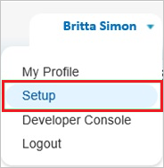
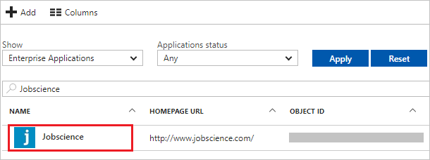

# Tutorial: Azure Active Directory integration with Jobscience

In this tutorial, you learn how to integrate Jobscience with Azure Active Directory (Azure AD).

Integrating Jobscience with Azure AD provides you with the following benefits:

- You can control in Azure AD who has access to Jobscience
- You can enable your users to automatically get signed-on to Jobscience (Single Sign-On) with their Azure AD accounts
- You can manage your accounts in one central location - the Azure portal

If you want to know more details about SaaS app integration with Azure AD, see [what is application access and single sign-on with Azure Active Directory](active-directory-appssoaccess-whatis.md).

## Prerequisites

To configure Azure AD integration with Jobscience, you need the following items:

- An Azure AD subscription
- A Jobscience single sign-on enabled subscription

> [!NOTE]
> To test the steps in this tutorial, we do not recommend using a production environment.

To test the steps in this tutorial, you should follow these recommendations:

- Do not use your production environment, unless it is necessary.
- If you don't have an Azure AD trial environment, you can get a one-month trial here: [Trial offer](https://azure.microsoft.com/pricing/free-trial/).

## Scenario description
In this tutorial, you test Azure AD single sign-on in a test environment. 
The scenario outlined in this tutorial consists of two main building blocks:

1. Adding Jobscience from the gallery
2. Configuring and testing Azure AD single sign-on

## Adding Jobscience from the gallery
To configure the integration of Jobscience into Azure AD, you need to add Jobscience from the gallery to your list of managed SaaS apps.

**To add Jobscience from the gallery, perform the following steps:**

1. In the **[Azure portal](https://portal.azure.com)**, on the left navigation panel, click **Azure Active Directory** icon. 

    ![Active Directory][1]

2. Navigate to **Enterprise applications**. Then go to **All applications**.

    ![Applications][2]
    
3. To add new application, click **New application** button on the top of dialog.

    ![Applications][3]

4. In the search box, type **Jobscience**.

    

5. In the results panel, select **Jobscience**, and then click **Add** button to add the application.

    

##  Configuring and testing Azure AD single sign-on
In this section, you configure and test Azure AD single sign-on with Jobscience based on a test user called "Britta Simon."

For single sign-on to work, Azure AD needs to know what the counterpart user in Jobscience is to a user in Azure AD. In other words, a link relationship between an Azure AD user and the related user in Jobscience needs to be established.

In Jobscience, assign the value of the **user name** in Azure AD as the value of the **Username** to establish the link relationship.

To configure and test Azure AD single sign-on with Jobscience, you need to complete the following building blocks:

1. **[Configuring Azure AD Single Sign-On](#configuring-azure-ad-single-sign-on)** - to enable your users to use this feature.
2. **[Creating an Azure AD test user](#creating-an-azure-ad-test-user)** - to test Azure AD single sign-on with Britta Simon.
3. **[Creating a Jobscience test user](#creating-a-jobscience-test-user)** - to have a counterpart of Britta Simon in Jobscience that is linked to the Azure AD representation of user.
4. **[Assigning the Azure AD test user](#assigning-the-azure-ad-test-user)** - to enable Britta Simon to use Azure AD single sign-on.
5. **[Testing Single Sign-On](#testing-single-sign-on)** - to verify whether the configuration works.

### Configuring Azure AD single sign-on

In this section, you enable Azure AD single sign-on in the Azure portal and configure single sign-on in your Jobscience application.

**To configure Azure AD single sign-on with Jobscience, perform the following steps:**

1. In the Azure portal, on the **Jobscience** application integration page, click **Single sign-on**.

    ![Configure Single Sign-On][4]

2. On the **Single sign-on** dialog, select **Mode** as **SAML-based Sign-on** to enable single sign-on.
 
    

3. On the **Jobscience Domain and URLs** section, perform the following steps:

    

    In the **Sign-on URL** textbox, type a URL using the following pattern:
    `http://<company name>.my.salesforce.com`
    
    > [!NOTE] 
    > This value is not real. Update this value with the actual Sign-On URL. Get this value by [Jobscience Client support team](https://www.jobscience.com/support) or from the SSO profile you will create which is explained later in the tutorial. 
 
4. On the **SAML Signing Certificate** section, click **Certificate (Base64)** and then save the certificate file on your computer.

     

5. Click **Save** button.

    

6. On the **Jobscience Configuration** section, click **Configure Jobscience** to open **Configure sign-on** window. Copy the **Sign-Out URL, SAML Entity ID, and SAML Single Sign-On Service URL** from the **Quick Reference section.**

     

7. Log in to your Jobscience company site as an administrator.

8. Go to **Setup**.
   
   

9. On the left navigation pane, in the **Administer** section, click **Domain Management** to expand the related section, and then click **My Domain** to open the **My Domain** page. 
   
   

10. To verify that your domain has been set up correctly, make sure that it is in “**Step 4 Deployed to Users**” and review your “**My Domain Settings**”.

    

11. On the Jobscience company site, click **Security Controls**, and then click **Single Sign-On Settings**.
    
    

12. In the **Single Sign-On Settings** section, perform the following steps:
    
    
    
    a. Select **SAML Enabled**.

    b. Click **New**.

13. On the **SAML Single Sign-On Setting Edit** dialog, perform the following steps:
    
    
    
    a. In the **Name** textbox, type a name for your configuration.

    b. In **Issuer** textbox, paste the value of **SAML Entity ID**, which you have copied from Azure portal.

    c. In the **Entity Id** textbox, type `https://salesforce-jobscience.com`

    d. Click **Browse** to upload your Azure AD certificate.

    e. As **SAML Identity Type**, select **Assertion contains the Federation ID from the User object**.

    f. As **SAML Identity Location**, select **Identity is in the NameIdentfier element of the Subject statement**.

    g. In **Identity Provider Login URL** textbox, paste the value of **SAML Single Sign-On Service URL**, which you have copied from Azure portal.

    h. In **Identity Provider Logout URL** textbox, paste the value of **Sign-Out URL**, which you have copied from Azure portal.

    i. Click **Save**.

14. On the left navigation pane, in the **Administer** section, click **Domain Management** to expand the related section, and then click **My Domain** to open the **My Domain** page. 
    
    

15. On the **My Domain** page, in the **Login Page Branding** section, click **Edit**.
    
    

16. On the **Login Page Branding** page, in the **Authentication Service** section, the name of your **SAML SSO Settings** is displayed. Select it, and then click **Save**.
    
    

17. To get the SP initiated Single Sign on Login URL click on the **Single Sign On settings** in the **Security Controls** menu section.

    
    
    Click the SSO profile you have created in the step above. This page shows the Single Sign on URL for your company (for example, [https://companyname.my.salesforce.com?so=companyid](https://companyname.my.salesforce.com?so=companyid).    

> [!TIP]
> You can now read a concise version of these instructions inside the [Azure portal](https://portal.azure.com), while you are setting up the app!  After adding this app from the **Active Directory > Enterprise Applications** section, simply click the **Single Sign-On** tab and access the embedded documentation through the **Configuration** section at the bottom. You can read more about the embedded documentation feature here: [Azure AD embedded documentation]( https://go.microsoft.com/fwlink/?linkid=845985)
> 

### Creating an Azure AD test user
The objective of this section is to create a test user in the Azure portal called Britta Simon.

![Create Azure AD User][100]

**To create a test user in Azure AD, perform the following steps:**

1. In the **Azure portal**, on the left navigation pane, click **Azure Active Directory** icon.

     

2. To display the list of users, go to **Users and groups** and click **All users**.
    
     

3. To open the **User** dialog, click **Add** on the top of the dialog.
 
     

4. On the **User** dialog page, perform the following steps:
 
     

    a. In the **Name** textbox, type **BrittaSimon**.

    b. In the **User name** textbox, type the **email address** of BrittaSimon.

    c. Select **Show Password** and write down the value of the **Password**.

    d. Click **Create**.
 
### Creating a Jobscience test user

In order to enable Azure AD users to log in to Jobscience, they must be provisioned into Jobscience. In the case of Jobscience, provisioning is a manual task.

>[!NOTE]
>You can use any other Jobscience user account creation tools or APIs provided by Jobscience to provision Azure Active Directory user accounts.
>  
        
**To configure user provisioning, perform the following steps:**

1. Log in to your **Jobscience** company site as administrator.

2. Go to Setup.
   
   
3. Go to **Manage Users \> Users**.
   
   
4. Click **New User**.
   
   
5. On the **Edit User** dialog, perform the following steps:
   
   
   
   a. In the **First Name** textbox, type a first name of the user like Britta.
   
   b. In the **Last Name** textbox, type a last name of the user like Simon.
   
   c. In the **Alias** textbox, type an alias name of the user like brittas.

   d. In the **Email** textbox, type the email address of user like Brittasimon@contoso.com.

   e. In the **User Name** textbox, type a user name of user like Brittasimon@contoso.com.

   f. In the **Nick Name** textbox, type a nick name of user like Simon.

   g. Click **Save**.

    
> [!NOTE]
> The Azure Active Directory account holder receives an email and follows a link to confirm their account before it becomes active.

### Assigning the Azure AD test user

In this section, you enable Britta Simon to use Azure single sign-on by granting access to Jobscience.

![Assign User][200] 

**To assign Britta Simon to Jobscience, perform the following steps:**

1. In the Azure portal, open the applications view, and then navigate to the directory view and go to **Enterprise applications** then click **All applications**.

    ![Assign User][201] 

2. In the applications list, select **Jobscience**.

     

3. In the menu on the left, click **Users and groups**.

    ![Assign User][202] 

4. Click **Add** button. Then select **Users and groups** on **Add Assignment** dialog.

    ![Assign User][203]

5. On **Users and groups** dialog, select **Britta Simon** in the Users list.

6. Click **Select** button on **Users and groups** dialog.

7. Click **Assign** button on **Add Assignment** dialog.
    
### Testing single sign-on

In this section, you test your Azure AD single sign-on configuration using the Access Panel.

When you click the Jobscience tile in the Access Panel, you should get automatically signed-on to your Jobscience application.
For more information about the Access Panel, see [Introduction to the Access Panel](active-directory-saas-access-panel-introduction.md).

## Additional resources

* [List of Tutorials on How to Integrate SaaS Apps with Azure Active Directory](active-directory-saas-tutorial-list.md)
* [What is application access and single sign-on with Azure Active Directory?](active-directory-appssoaccess-whatis.md)

<!--Image references-->

[1]: ./media/active-directory-saas-jobscience-tutorial/tutorial_general_01.png
[2]: ./media/active-directory-saas-jobscience-tutorial/tutorial_general_02.png
[3]: ./media/active-directory-saas-jobscience-tutorial/tutorial_general_03.png
[4]: ./media/active-directory-saas-jobscience-tutorial/tutorial_general_04.png

[100]: ./media/active-directory-saas-jobscience-tutorial/tutorial_general_100.png

[200]: ./media/active-directory-saas-jobscience-tutorial/tutorial_general_200.png
[201]: ./media/active-directory-saas-jobscience-tutorial/tutorial_general_201.png
[202]: ./media/active-directory-saas-jobscience-tutorial/tutorial_general_202.png
[203]: ./media/active-directory-saas-jobscience-tutorial/tutorial_general_203.png

