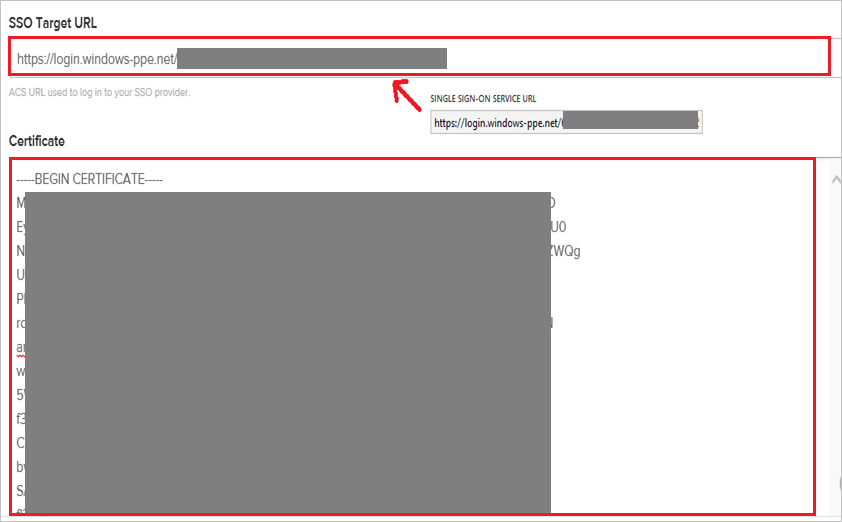
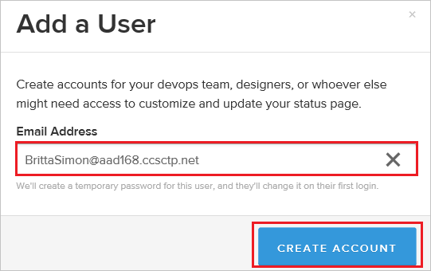
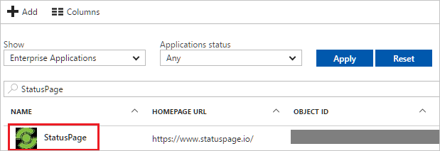

# Tutorial: Azure Active Directory integration with StatusPage

In this tutorial, you learn how to integrate StatusPage with Azure Active Directory (Azure AD).

Integrating StatusPage with Azure AD provides you with the following benefits:

- You can control in Azure AD who has access to StatusPage
- You can enable your users to automatically get signed-on to StatusPage (Single Sign-On) with their Azure AD accounts
- You can manage your accounts in one central location - the Azure portal

If you want to know more details about SaaS app integration with Azure AD, see [what is application access and single sign-on with Azure Active Directory](active-directory-appssoaccess-whatis.md).

## Prerequisites

To configure Azure AD integration with StatusPage, you need the following items:

- An Azure AD subscription
- A StatusPage single sign-on enabled subscription

> [!NOTE]
> To test the steps in this tutorial, we do not recommend using a production environment.

To test the steps in this tutorial, you should follow these recommendations:

- Do not use your production environment, unless it is necessary.
- If you don't have an Azure AD trial environment, you can get a one-month trial [here](https://azure.microsoft.com/pricing/free-trial/).

## Scenario description
In this tutorial, you test Azure AD single sign-on in a test environment. 
The scenario outlined in this tutorial consists of two main building blocks:

1. Adding StatusPage from the gallery
2. Configuring and testing Azure AD single sign-on

## Adding StatusPage from the gallery
To configure the integration of StatusPage into Azure AD, you need to add StatusPage from the gallery to your list of managed SaaS apps.

**To add StatusPage from the gallery, perform the following steps:**

1. In the **[Azure portal](https://portal.azure.com)**, on the left navigation panel, click **Azure Active Directory** icon. 

    ![Active Directory][1]

2. Navigate to **Enterprise applications**. Then go to **All applications**.

    ![Applications][2]

3. To add new application, click **New application** button on the top of dialog.

    ![Applications][3]

4. In the search box, type **StatusPage**.

    

5. In the results panel, select **StatusPage**, and then click **Add** button to add the application.

    

##  Configuring and testing Azure AD single sign-on
In this section, you configure and test Azure AD single sign-on with StatusPage based on a test user called "Britta Simon".

For single sign-on to work, Azure AD needs to know what the counterpart user in StatusPage is to a user in Azure AD. In other words, a link relationship between an Azure AD user and the related user in StatusPage needs to be established.

In StatusPage, assign the value of the **user name** in Azure AD as the value of the **Username** to establish the link relationship.

To configure and test Azure AD single sign-on with StatusPage, you need to complete the following building blocks:

1. **[Configuring Azure AD Single Sign-On](#configuring-azure-ad-single-sign-on)** - to enable your users to use this feature.
2. **[Creating an Azure AD test user](#creating-an-azure-ad-test-user)** - to test Azure AD single sign-on with Britta Simon.
3. **[Creating a StatusPage test user](#creating-a-statuspage-test-user)** - to have a counterpart of Britta Simon in StatusPage that is linked to the Azure AD representation of user.
4. **[Assigning the Azure AD test user](#assigning-the-azure-ad-test-user)** - to enable Britta Simon to use Azure AD single sign-on.
5. **[Testing Single Sign-On](#testing-single-sign-on)** - to verify whether the configuration works.

### Configuring Azure AD single sign-on

In this section, you enable Azure AD single sign-on in the Azure portal and configure single sign-on in your StatusPage application.

**To configure Azure AD single sign-on with StatusPage, perform the following steps:**

1. In the Azure portal, on the **StatusPage** application integration page, click **Single sign-on**.

    ![Configure Single Sign-On][4]

2. On the **Single sign-on** dialog, select **Mode** as **SAML-based Sign-on** to enable single sign-on.

    

3. On the **StatusPage Domain and URLs** section, perform the following steps:

    

    a. In the **Identifier** textbox, type a URL using the following pattern:

    | |
    |--|
    | `https://<subdomain>.statuspagestaging.com/` |
    | `https://<subdomain>.statuspage.io/` |

    b. In the **Reply URL** textbox, type a URL using the following pattern: 

    | |
    |--|
    | `https://<subdomain>.statuspagestaging.com/sso/saml/consume` |
    | `https://<subdomain>.statuspage.io/sso/saml/consume` |

    > [!NOTE]
    > Contact the StatusPage support team at [SupportTeam@statuspage.io](mailto:SupportTeam@statuspage.io)to request metadata necessary to configure single sign-on. 
    >
    >a. From the metadata, copy the Issuer value, and then paste it into the **Identifier** textbox.
    >
    >b. From the metadata, copy the Reply URL, and then paste it into the **Reply URL** textbox.

4. On the **SAML Signing Certificate** section, click **Certificate (Base64)** and then save the certificate file on your computer.

     

5. Click **Save** button.

    

6. On the **StatusPage Configuration** section, click **Configure StatusPage** to open **Configure sign-on** window. Copy the **SAML Single Sign-On Service URL** from the **Quick Reference section.**

     

7. In another browser window, sign on to your StatusPage company site as an administrator.

8. In the main toolbar, click **Manage Account**.

     

9. Click the **Single Sign-on** tab. 

    

10. On the SSO Setup page, perform the following steps:

     

     

    a. In the **SSO Target URL** textbox, paste the value of **SAML Single Sign-On Service URL**, which you have copied from Azure portal.

    b. Open your downloaded certificate in Notepad, copy the content, and then paste it into the **Certificate** textbox. 

    c. Click **SAVE CONFIGURATION**.

> [!TIP]
> You can now read a concise version of these instructions inside the [Azure portal](https://portal.azure.com), while you are setting up the app!  After adding this app from the **Active Directory > Enterprise Applications** section, simply click the **Single Sign-On** tab and access the embedded documentation through the **Configuration** section at the bottom. You can read more about the embedded documentation feature here: [Azure AD embedded documentation]( https://go.microsoft.com/fwlink/?linkid=845985)
> 

### Creating an Azure AD test user
The objective of this section is to create a test user in the Azure portal called Britta Simon.

![Create Azure AD User][100]

**To create a test user in Azure AD, perform the following steps:**

1. In the **Azure portal**, on the left navigation pane, click **Azure Active Directory** icon.

     

2. To display the list of users, go to **Users and groups** and click **All users**.

     

3. To open the **User** dialog, click **Add** on the top of the dialog.

     

4. On the **User** dialog page, perform the following steps:

     

    a. In the **Name** textbox, type **BrittaSimon**.

    b. In the **User name** textbox, type the **email address** of BrittaSimon.

    c. Select **Show Password** and write down the value of the **Password**.

    d. Click **Create**.

### Creating a StatusPage test user

The objective of this section is to create a user called Britta Simon in StatusPage.

StatusPage supports just-in-time provisioning. You have already enabled it in [Configuring Azure AD Single Sign-On](#configuring-azure-ad-single-sign-on).

**To create a user called Britta Simon in StatusPage, perform the following steps:**

1. Sign-on to your StatusPage company site as an administrator.

2. In the menu on the top, click **Manage Account**.

    

3. Click the **Team Members** tab. 

     

4. Click **ADD TEAM MEMBER**. 

     

5. Type the **Email Address**, **First Name**, and **Sur Name** of a valid user you want to provision into the related textboxes. 

     

6. As **Role**, choose **Client Administrator**.

7. Click **CREATE ACCOUNT**.

### Assigning the Azure AD test user

In this section, you enable Britta Simon to use Azure single sign-on by granting access to StatusPage.

![Assign User][200] 

**To assign Britta Simon to StatusPage, perform the following steps:**

1. In the Azure portal, open the applications view, and then navigate to the directory view and go to **Enterprise applications** then click **All applications**.

    ![Assign User][201] 

2. In the applications list, select **StatusPage**.

     

3. In the menu on the left, click **Users and groups**.

    ![Assign User][202] 

4. Click **Add** button. Then select **Users and groups** on **Add Assignment** dialog.

    ![Assign User][203]

5. On **Users and groups** dialog, select **Britta Simon** in the Users list.

6. Click **Select** button on **Users and groups** dialog.

7. Click **Assign** button on **Add Assignment** dialog.

### Testing single sign-on

The objective of this section is to test your Azure AD single sign-on configuration using the Access Panel.

When you click the StatusPage tile in the Access Panel, you should get automatically signed-on to your StatusPage application.

## Additional resources

* [List of Tutorials on How to Integrate SaaS Apps with Azure Active Directory](active-directory-saas-tutorial-list.md)
* [What is application access and single sign-on with Azure Active Directory?](active-directory-appssoaccess-whatis.md)

<!--Image references-->

[1]: ./media/active-directory-saas-statuspage-tutorial/tutorial_general_01.png
[2]: ./media/active-directory-saas-statuspage-tutorial/tutorial_general_02.png
[3]: ./media/active-directory-saas-statuspage-tutorial/tutorial_general_03.png
[4]: ./media/active-directory-saas-statuspage-tutorial/tutorial_general_04.png

[100]: ./media/active-directory-saas-statuspage-tutorial/tutorial_general_100.png

[200]: ./media/active-directory-saas-statuspage-tutorial/tutorial_general_200.png
[201]: ./media/active-directory-saas-statuspage-tutorial/tutorial_general_201.png
[202]: ./media/active-directory-saas-statuspage-tutorial/tutorial_general_202.png
[203]: ./media/active-directory-saas-statuspage-tutorial/tutorial_general_203.png

