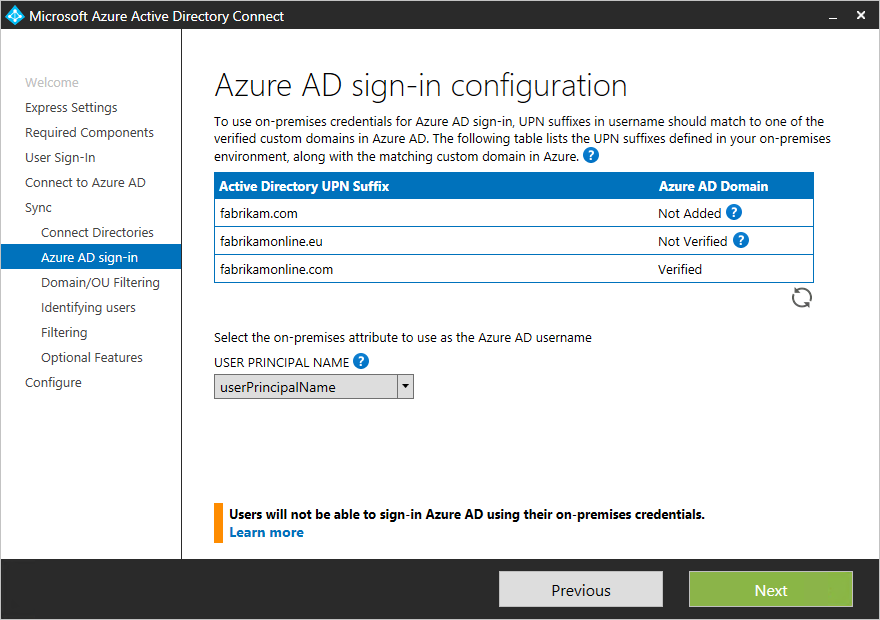
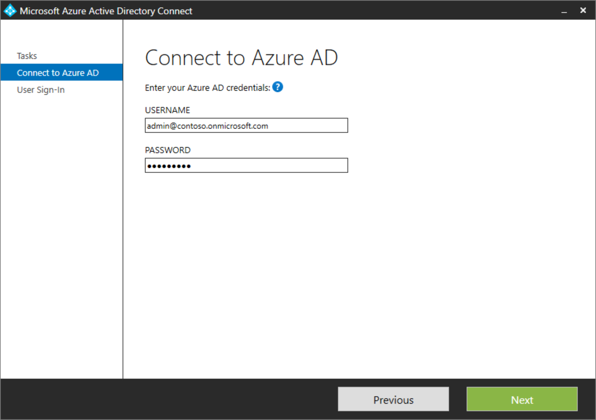
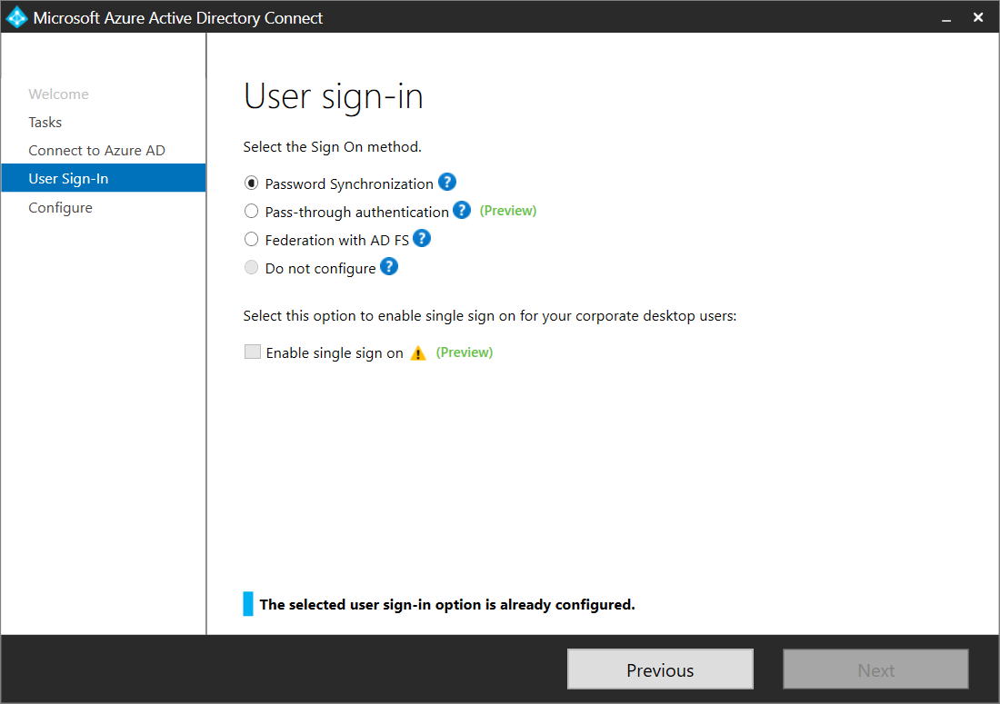

# Azure AD Connect user sign-in options
Azure Active Directory (Azure AD) Connect allows your users to sign in to both cloud and on-premises resources by using the same passwords. This article describes key concepts for each identity model to help you choose the identity that you want to use for signing in to Azure AD.

If you’re already familiar with the Azure AD identity model and want to learn more about a specific method, see the appropriate link:

* [Password hash synchronization](#password-synchronization) with [Seamless Single Sign-on (SSO)](active-directory-aadconnect-sso.md)
* [Pass-through authentication](active-directory-aadconnect-pass-through-authentication.md) with [Seamless Single Sign-on (SSO)](active-directory-aadconnect-sso.md)
* [Federated SSO (with Active Directory Federation Services (AD FS))](#federation-that-uses-a-new-or-existing-farm-with-ad-fs-in-windows-server-2012-r2)

> [!NOTE] 
> It is important to remember that by configuring federation for Azure AD, you establish trust between your Azure AD tenant and your federated domains. With this trust federated domain users will have access to Azure AD cloud resources within the tenant.  
>

## Choosing the user sign-in method for your organization
For most organizations that just want to enable user sign-in to Office 365, SaaS applications, and other Azure AD-based resources, we recommend the default password hash synchronization option. Some organizations, however, have a particular reason that they aren't able to use this option. They can choose either a federated sign-in option, such as AD FS, or pass-through authentication. You can use the following table to help you make the right choice.

I need to | PHS with SSO| PTA with SSO| AD FS |
 --- | --- | --- | --- |
Sync new user, contact, and group accounts in on-premises Active Directory to the cloud automatically.|x|x|x|
Set up my tenant for Office 365 hybrid scenarios.|x|x|x|
Enable my users to sign in and access cloud services by using their on-premises password.|x|x|x|
Implement single sign-on by using corporate credentials.|x|x|x|
Ensure that no passwords are stored in the cloud.||x*|x|
Enable on-premises multi-factor authentication solutions.|||x|

*Through a lightweight agent.

### Password hash synchronization
With password hash synchronization, hashes of user passwords are synchronized from on-premises Active Directory to Azure AD. When passwords are changed or reset on-premises, the new password hashes are synchronized to Azure AD immediately so that your users can always use the same password for cloud resources and on-premises resources. The passwords are never sent to Azure AD or stored in Azure AD in clear text. You can use password hash synchronization together with password write-back to enable self-service password reset in Azure AD.

In addition, you can enable [Seamless SSO](active-directory-aadconnect-sso.md) for users on domain-joined machines that are on the corporate network. With single sign-on, enabled users only need to enter a username to help them securely access cloud resources.

For more information, see the [password hash synchronization](active-directory-aadconnectsync-implement-password-synchronization.md) article.

### Pass-through authentication
With pass-through authentication, the user’s password is validated against the on-premises Active Directory controller. The password doesn't need to be present in Azure AD in any form. This allows for on-premises policies, such as sign-in hour restrictions, to be evaluated during authentication to cloud services.

Pass-through authentication uses a simple agent on a Windows Server 2012 R2 domain-joined machine in the on-premises environment. This agent listens for password validation requests. It doesn't require any inbound ports to be open to the Internet.

In addition, you can also enable single sign-on for users on domain-joined machines that are on the corporate network. With single sign-on, enabled users only need to enter a username to help them securely access cloud resources.

For more information, see:
- [Pass-through authentication](active-directory-aadconnect-pass-through-authentication.md)
- [Single sign-on](active-directory-aadconnect-sso.md)

### Federation that uses a new or existing farm with AD FS in Windows Server 2012 R2
With federated sign-in, your users can sign in to Azure AD-based services with their on-premises passwords. While they're on the corporate network, they don't even have to enter their passwords. By using the federation option with AD FS, you can deploy a new or existing farm with AD FS in Windows Server 2012 R2. If you choose to specify an existing farm, Azure AD Connect configures the trust between your farm and Azure AD so that your users can sign in.

#### Deploy federation with AD FS in Windows Server 2012 R2

If you're deploying a new farm, you need:

* A Windows Server 2012 R2 server for the federation server.
* A Windows Server 2012 R2 server for the Web Application Proxy.
* A .pfx file with one SSL certificate for your intended federation service name. For example: fs.contoso.com.

If you're deploying a new farm or using an existing farm, you need:

* Local administrator credentials on your federation servers.
* Local administrator credentials on any workgroup servers (not domain-joined) that you intend to deploy the Web Application Proxy role on.
* The machine that you run the wizard on to be able to connect to any other machines that you want to install AD FS or Web Application Proxy on by using Windows Remote Management.

For more information, see [Configuring SSO with AD FS](active-directory-aadconnect-get-started-custom.md#configuring-federation-with-ad-fs).

#### Sign in by using an earlier version of AD FS or a third-party solution
If you've already configured cloud sign-in by using an earlier version of AD FS (such as AD FS 2.0) or a third-party federation provider, you can choose to skip user sign-in configuration through Azure AD Connect. This will enable you to get the latest synchronization and other capabilities of Azure AD Connect while still using your existing solution for sign-in.

For more information, see the [Azure AD third-party federation compatibility list](active-directory-aadconnect-federation-compatibility.md).

## User sign-in and user principal name
### Understanding user principal name
In Active Directory, the default user principal name (UPN) suffix is the DNS name of the domain where the user account was created. In most cases, this is the domain name that's registered as the enterprise domain on the Internet. However, you can add more UPN suffixes by using Active Directory Domains and Trusts.

The UPN of the user has the format username@domain. For example, for an Active Directory domain named "contoso.com", a user named John might have the UPN "john@contoso.com". The UPN of the user is based on RFC 822. Although the UPN and email share the same format, the value of the UPN for a user might or might not be the same as the email address of the user.

### User principal name in Azure AD
The Azure AD Connect wizard uses the userPrincipalName attribute or lets you specify the attribute (in a custom installation) to be used from on-premises as the user principal name in Azure AD. This is the value that is used for signing in to Azure AD. If the value of the userPrincipalName attribute doesn't correspond to a verified domain in Azure AD, then Azure AD replaces it with a default .onmicrosoft.com value.

Every directory in Azure Active Directory comes with a built-in domain name, with the format contoso.onmicrosoft.com, that lets you get started using Azure or other Microsoft services. You can improve and simplify the sign-in experience by using custom domains. For information on custom domain names in Azure AD and how to verify a domain, see [Add your custom domain name to Azure Active Directory](../add-custom-domain.md#add-the-custom-domain-name-to-your-directory).

## Azure AD sign-in configuration
### Azure AD sign-in configuration with Azure AD Connect
The Azure AD sign-in experience depends on whether Azure AD can match the user principal name suffix of a user that's being synced to one of the custom domains that are verified in the Azure AD directory. Azure AD Connect provides help while you configure Azure AD sign-in settings, so that the user sign-in experience in the cloud is similar to the on-premises experience.

Azure AD Connect lists the UPN suffixes that are defined for the domains and tries to match them with a custom domain in Azure AD. Then it helps you with the appropriate action that needs to be taken.
The Azure AD sign-in page lists the UPN suffixes that are defined for on-premises Active Directory and displays the corresponding status against each suffix. The status values can be one of the following:

| State | Description | Action needed |
|:--- |:--- |:--- |
| Verified |Azure AD Connect found a matching verified domain in Azure AD. All users for this domain can sign in by using their on-premises credentials. |No action is needed. |
| Not verified |Azure AD Connect found a matching custom domain in Azure AD, but it isn't verified. The UPN suffix of the users of this domain will be changed to the default .onmicrosoft.com suffix after synchronization if the domain isn't verified. | [Verify the custom domain in Azure AD.](../add-custom-domain.md#verify-the-custom-domain-name-in-azure-ad) |
| Not added |Azure AD Connect didn't find a custom domain that corresponded to the UPN suffix. The UPN suffix of the users of this domain will be changed to the default .onmicrosoft.com suffix if the domain isn't added and verified in Azure. | [Add and verify a custom domain that corresponds to the UPN suffix.](../add-custom-domain.md) |

The Azure AD sign-in page lists the UPN suffixes that are defined for on-premises Active Directory and the corresponding custom domain in Azure AD with the current verification status. In a custom installation, you can now select the attribute for the user principal name on the **Azure AD sign-in** page.

You can click the refresh button to re-fetch the latest status of the custom domains from Azure AD.

### Selecting the attribute for the user principal name in Azure AD
The attribute userPrincipalName is the attribute that users use when they sign in to Azure AD and Office 365. You should verify the domains (also known as UPN suffixes) that are used in Azure AD before the users are synchronized.

We strongly recommend that you keep the default attribute userPrincipalName. If this attribute is nonroutable and can't be verified, then it's possible to select another attribute (email, for example) as the attribute that holds the sign-in ID. This is known as the Alternate ID. The Alternate ID attribute value must follow the RFC 822 standard. You can use an Alternate ID with both password SSO and federation SSO as the sign-in solution.

> [!NOTE]
> Using an Alternate ID isn't compatible with all Office 365 workloads. For more information, see [Configuring Alternate Login ID](https://technet.microsoft.com/library/dn659436.aspx).
>
>

#### Different custom domain states and their effect on the Azure sign-in experience
It's very important to understand the relationship between the custom domain states in your Azure AD directory and the UPN suffixes that are defined on-premises. Let's go through the different possible Azure sign-in experiences when you're setting up synchronization by using Azure AD Connect.

For the following information, let's assume that we're concerned with the UPN suffix contoso.com, which is used in the on-premises directory as part of UPN--for example user@contoso.com.

###### Express settings/Password hash synchronization

|    State     | Effect on user Azure sign-in experience                                                                                                                                                                                                                                                                                                                                                                                                                                                                                                                   |
|:------------:|:----------------------------------------------------------------------------------------------------------------------------------------------------------------------------------------------------------------------------------------------------------------------------------------------------------------------------------------------------------------------------------------------------------------------------------------------------------------------------------------------------------------------------------------------------------|
|  Not added   | In this case, no custom domain for contoso.com has been added in the Azure AD directory. Users who have UPN on-premises with the suffix @contoso.com won't be able to use their on-premises UPN to sign in to Azure. They'll instead have to use a new UPN that's provided to them by Azure AD by adding the suffix for the default Azure AD directory. For example, if you're syncing users to the Azure AD directory azurecontoso.onmicrosoft.com, then the on-premises user user@contoso.com will be given a UPN of user@azurecontoso.onmicrosoft.com. |
| Not verified | In this case, we have a custom domain contoso.com that's added in the Azure AD directory. However, it's not yet verified. If you go ahead with syncing users without verifying the domain, then the users will be assigned a new UPN by Azure AD, just like in the "Not added" scenario.                                                                                                                                                                                                                                                                  |
|   Verified   | In this case, we have a custom domain contoso.com that's already added and verified in Azure AD for the UPN suffix. Users will be able to use their on-premises user principal name, for example user@contoso.com, to sign in to Azure after they're synced to Azure AD.                                                                                                                                                                                                                                                                                  |

###### AD FS federation
You can't create a federation with the default .onmicrosoft.com domain in Azure AD or an unverified custom domain in Azure AD. When you're running the Azure AD Connect wizard, if you select an unverified domain to create a federation with, then Azure AD Connect prompts you with the necessary records to be created where your DNS is hosted for the domain. For more information, see [Verify the Azure AD domain selected for federation](active-directory-aadconnect-get-started-custom.md#verify-the-azure-ad-domain-selected-for-federation).

If you selected the user sign-in option **Federation with AD FS**, then you must have a custom domain to continue creating a federation in Azure AD. For our discussion, this means that we should have a custom domain contoso.com added in the Azure AD directory.

| State | Effect on the user Azure sign-in experience |
|:---:|:--- |
| Not added |In this case, Azure AD Connect didn't find a matching custom domain for the UPN suffix contoso.com in the Azure AD directory. You need to add a custom domain contoso.com if you need users to sign in by using AD FS with their on-premises UPN (like user@contoso.com). |
| Not verified |In this case, Azure AD Connect prompts you with appropriate details on how you can verify your domain at a later stage. |
| Verified |In this case, you can go ahead with the configuration without any further action. |

## Changing the user sign-in method
You can change the user sign-in method from federation, password hash synchronization, or pass-through authentication by using the tasks that are available in Azure AD Connect after the initial configuration of Azure AD Connect with the wizard. Run the Azure AD Connect wizard again, and you'll see a list of tasks that you can perform. Select **Change user sign-in** from the list of tasks.

On the next page, you're asked to provide the credentials for Azure AD.

On the **User sign-in** page, select the desired user sign-in.

> [!NOTE]
> If you're only making a temporary switch to password hash synchronization, then select the **Do not convert user accounts** check box. Not checking the option will convert each user to federated, and it can take several hours.
>
>

## Next steps
- Learn more about [integrating your on-premises identities with Azure Active Directory](active-directory-aadconnect.md).
- Learn more about [Azure AD Connect design concepts](active-directory-aadconnect-design-concepts.md).
