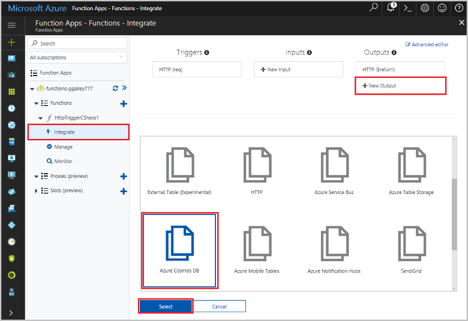
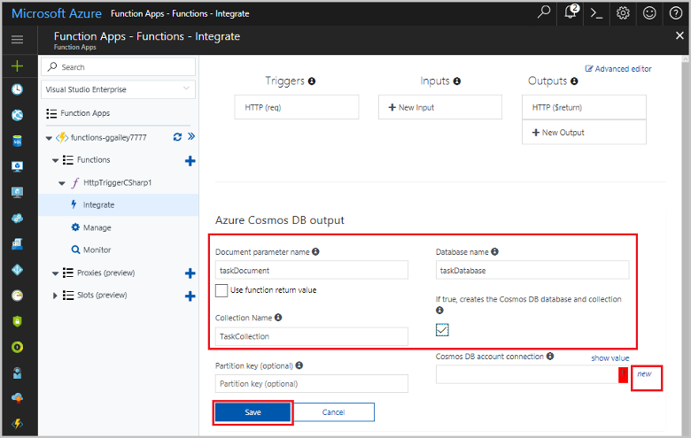

# Store unstructured data using Azure Functions and Azure Cosmos DB

[Azure Cosmos DB](https://azure.microsoft.com/services/cosmos-db/) is a great way to store unstructured and JSON data. Combined with Azure Functions, Cosmos DB makes storing data quick and easy with much less code than required for storing data in a relational database.

> [!NOTE]
> At this time, the Azure Cosmos DB trigger, input bindings, and output bindings work with SQL API and Graph API accounts only.

In Azure Functions, input and output bindings provide a declarative way to connect to external service data from your function. In this topic, learn how to update an existing C# function to add an output binding that stores unstructured data in a Cosmos DB document. 


## Prerequisites

To complete this tutorial:

[!INCLUDE [Previous quickstart note](../../includes/functions-quickstart-previous-topics.md)]

## Add an output binding

1. Expand both your function app and your function.

1. Select **Integrate** and **+ New Output**, which is at the top right of the page. Choose **Azure Cosmos DB**, and click **Select**.

    

3. Use the **Azure Cosmos DB output** settings as specified in the table: 

    

    | Setting      | Suggested value  | Description                                |
    | ------------ | ---------------- | ------------------------------------------ |
    | **Document parameter name** | taskDocument | Name that refers to the Cosmos DB object in code. |
    | **Database name** | taskDatabase | Name of database to save documents. |
    | **Collection name** | TaskCollection | Name of the database collection. |
    | **If true, creates the Cosmos DB database and collection** | Checked | The collection doesn't already exist, so create it. |

4. Select **New** next to the **Azure Cosmos DB document connection** label, and select **+ Create new**. 

5. Use the **New account** settings as specified in the table: 

    

    | Setting      | Suggested value  | Description                                |
    | ------------ | ---------------- | ------------------------------------------ |
    | **ID** | Name of database | Unique ID for the Azure Cosmos DB database  |
    | **API** | SQL | Select the SQL API. At this time, the Azure Cosmos DB trigger, input bindings, and output bindings work with SQL API and Graph API accounts only. |
    | **Subscription** | Azure Subscription | Azure Subscription  |
    | **Resource Group** | myResourceGroup |  Use the existing resource group that contains your function app. |
    | **Location**  | WestEurope | Select a location near to either your function app or to other apps that use the stored documents.  |

6. Click **OK** to create the database. It may take a few minutes to create the database. After the database is created, the database connection string is stored as a function app setting. The name of this app setting is inserted in **Azure Cosmos DB account connection**. 

8. After the connection string is set, select **Save** to create the binding.

## Update the function code

Replace the existing C# function code with the following code:

```csharp
using System.Net;

public static HttpResponseMessage Run(HttpRequestMessage req, out object taskDocument, TraceWriter log)
{
    string name = req.GetQueryNameValuePairs()
        .FirstOrDefault(q => string.Compare(q.Key, "name", true) == 0)
        .Value;

    string task = req.GetQueryNameValuePairs()
        .FirstOrDefault(q => string.Compare(q.Key, "task", true) == 0)
        .Value;

    string duedate = req.GetQueryNameValuePairs()
        .FirstOrDefault(q => string.Compare(q.Key, "duedate", true) == 0)
        .Value;

    taskDocument = new {
        name = name,
        duedate = duedate.ToString(),
        task = task
    };

    if (name != "" && task != "") {
        return req.CreateResponse(HttpStatusCode.OK);
    }
    else {
        return req.CreateResponse(HttpStatusCode.BadRequest);
    }
}
```
This code sample reads the HTTP Request query strings and assigns them to fields in the `taskDocument` object. The `taskDocument` binding sends the object data from this binding parameter to be stored in the bound document database. The database is created the first time the function runs.

## Test the function and database

1. Expand the right window and select **Test**. Under **Query**, click **+ Add parameter** and add the following parameters to the query string:

    + `name`
    + `task`
    + `duedate`

2. Click **Run** and verify that a 200 status is returned.

    

1. On the left side of the Azure portal, expand the icon bar, type `cosmos` in the search field, and select **Azure Cosmos DB**.

    

2. Choose your Azure Cosmos DB account, then select the **Data Explorer**. 

3. Expand the **Collections** nodes, select the new document, and confirm that the document contains your query string values, along with some additional metadata. 

    

You have successfully added a binding to your HTTP trigger that stores unstructured data in a Azure Cosmos DB.

[!INCLUDE [Clean-up section](../../includes/clean-up-section-portal.md)]

## Next steps

[!INCLUDE [functions-quickstart-next-steps](../../includes/functions-quickstart-next-steps.md)]

For more information about binding to a Cosmos DB database, see [Azure Functions Cosmos DB bindings](functions-bindings-cosmosdb.md).
