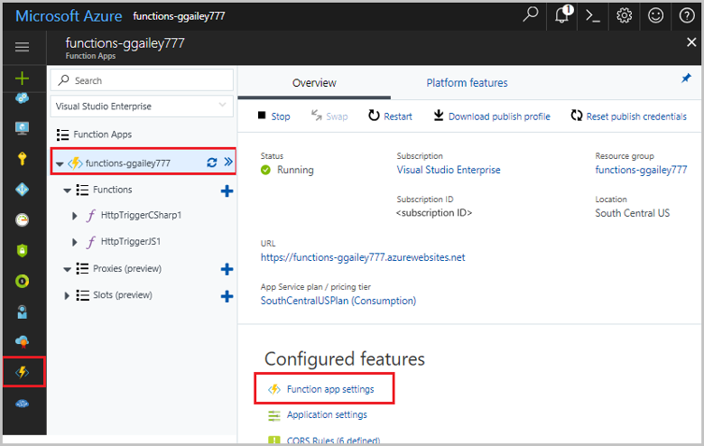
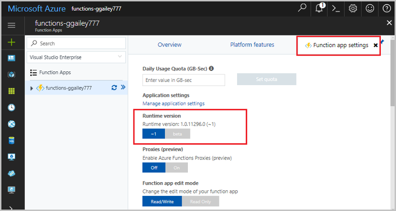
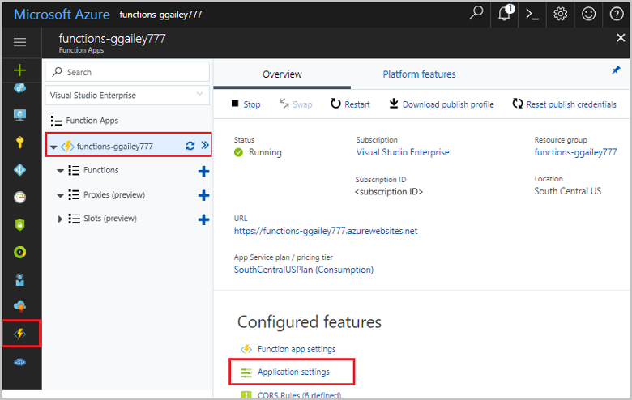
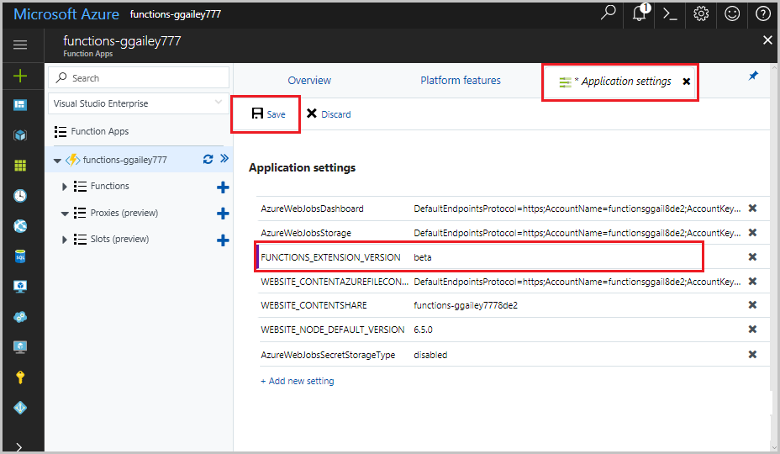

# How to target Azure Functions runtime versions

A function app runs on a specific version of the Azure Functions runtime. There are two major versions: [1.x and 2.x](functions-versions.md). This article explains how to configure a function app in Azure to run on the version you choose. For information about how to configure a local development environment for a specific version, see [Code and test Azure Functions locally](functions-run-local.md).

>[!IMPORTANT]   
> Azure Functions runtime 2.0 is in preview and currently not all features of Azure Functions are supported. For more information, see [Azure Functions runtime versions overview](functions-versions.md).

## Automatic and manual version updates

Functions lets you target a specific version of the runtime by using the `FUNCTIONS_EXTENSION_VERSION` application setting in a function app. The function app is kept on the specified major version until you explicitly choose to move to a new version.

If you specify only the major version ("~1" for 1.x or "beta" for 2.x), the function app is automatically updated to new minor versions of the runtime when they become available. New minor versions do not introduce breaking changes. If you specify a minor version (for example, "1.0.11360"), the function app is kept on that version until you explicitly change it. 

When a new version is publicly available, a prompt in the portal gives you the chance to move up to that version. After moving to a new version, you can always use the `FUNCTIONS_EXTENSION_VERSION` application setting to move back to a previous version.

A change to the runtime version causes a function app to restart.

The values you can set in the `FUNCTIONS_EXTENSION_VERSION` app setting to enable automatic updates are currently "~1" for the 1.x runtime and "beta" for 2.x.

## View the current runtime version

Use the following procedure to view the runtime version currently used by a function app. 

1. In the [Azure portal](https://portal.azure.com), navigate to the function app, and under **Configured Features**, choose **Function app settings**. 

    

2. In the **Function app settings** tab, locate the **Runtime version**. Note the specific runtime version and the requested major version. In the example below, the FUNCTIONS\_EXTENSION\_VERSION app setting is set to `~1`.
 
   

## Target a version using the portal

When you need to target a version other than the current major version or version 2.0, set the `FUNCTIONS_EXTENSION_VERSION` application setting.

1. In the [Azure portal](https://portal.azure.com), navigate to your function app, and under **Configured Features**, choose **Application settings**.

    

2. In the **Application settings** tab, find the `FUNCTIONS_EXTENSION_VERSION` setting and change the value to a valid version of the 1.x runtime or `beta` for version 2.0. A tilde with major version means use the latest version of that major version (for example, "~1"). 

    

3. Click **Save** to save the application setting update. 

## Target a version using Azure CLI

 You can also set the `FUNCTIONS_EXTENSION_VERSION` from the Azure CLI. Using the Azure CLI, update the application setting in the function app with the [az functionapp config appsettings set](/cli/azure/functionapp/config/appsettings#set) command.

```azurecli-interactive
az functionapp config appsettings set --name <function_app> \
--resource-group <my_resource_group> \
--settings FUNCTIONS_EXTENSION_VERSION=<version>
```
In this code, replace `<function_app>` with the name of your function app. Also replace `<my_resource_group>` with the name of the resource group for your function app. Replace `<version>` with a valid version of the 1.x runtime or `beta` for version 2.0. 

You can run this command from the [Azure Cloud Shell](../cloud-shell/overview.md) by choosing **Try it** in the preceding code sample. You can also use the [Azure CLI locally](/cli/azure/install-azure-cli) to execute this command after executing [az login](/cli/azure#az_login) to sign in.

## Next steps

> [!div class="nextstepaction"]
> [Target the 2.0 runtime in your local development environment](functions-run-local.md)

> [!div class="nextstepaction"]
> [See Release notes for runtime versions](https://github.com/Azure/azure-webjobs-sdk-script/releases)