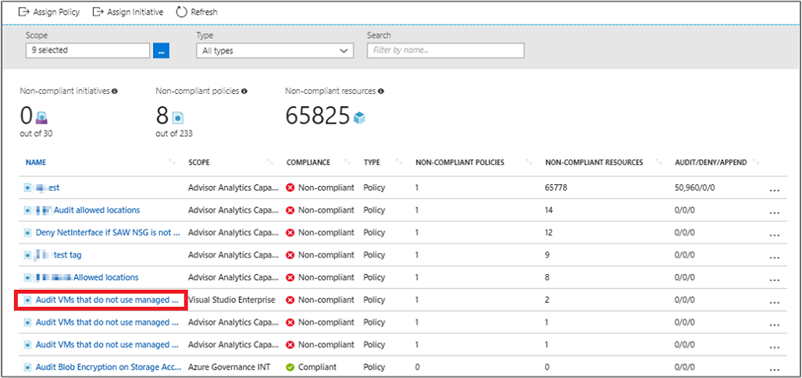

# Create a policy assignment to identify non-compliant resources in your Azure environment using PowerShell

The first step in understanding compliance in Azure is to identify the status of your resources. This quickstart steps you through the process of creating a policy assignment to identify virtual machines that are not using managed disks.

At the end of this process, you will successfully identify virtual machines that are not using managed disks. They are *non-compliant* with the policy assignment.

PowerShell is used to create and manage Azure resources from the command line or in scripts. This guide details using PowerShell to create a policy assignment to identify non-compliant resources in your Azure environment.

This guide requires the Azure PowerShell module version 4.0 or later. Run `Get-Module -ListAvailable AzureRM` to find the version. If you need to install or upgrade, see [Install Azure PowerShell module](/powershell/azure/install-azurerm-ps).

Before you start, make sure that the latest version of PowerShell is installed. See [How to install and configure Azure PowerShell](/powershell/azureps-cmdlets-docs) for detailed information.

If you don't have an Azure subscription, create a [free](https://azure.microsoft.com/free/) account before you begin.


## Create a policy assignment

In this quickstart, you create a policy assignment and assign the *Audit Virtual Machines without Managed Disks* definition. This policy definition identifies resources that do not comply with the conditions set in the policy definition.

Follow these steps to create a new policy assignment.

1. To ensure that your subscription works with the resource provider, register the Policy Insights resource provider. To register a resource provider, you must have permission to perform the register action operation for the resource provider. This operation is included in the Contributor and Owner roles.

    Run the following command to register the resource provider:

    ```
Register-AzureRmResourceProvider -ProviderNamespace Microsoft.PolicyInsights
```

    You cannot unregister a resource provider while you have resource types from the resource provider in your subscription.

    For more details about registering and viewing resource providers, see [Resource Providers and Types](../azure-resource-manager/resource-manager-supported-services.md).

2. After you register the resource provider, run the following command to view all policy definitions and find the one you want to assign:

    ```powershell
$definition = Get-AzureRmPolicyDefinition
```

    Azure Policy comes with already built-in policy definitions you can use. You will see built-in policy definitions such as:

    - Enforce tag and its value
    - Apply tag and its value
    - Require SQL Server Version 12.0

3. Next, assign the policy definition to the desired scope by using the `New-AzureRmPolicyAssignment` cmdlet.

For this tutorial, use the following information for the command:

- Display **Name** for the policy assignment. In this case, use Audit Virtual Machines without Managed Disks.
- **Policy** – The policy definition, based off which you’re using to create the assignment. In this case, it is the policy definition – *Audit Virtual Machines without Managed Disks*
- A **scope** - A scope determines what resources or grouping of resources the policy assignment gets enforced on. It could range from a subscription to resource groups. In this example, you are assigning the policy definition to the **FabrikamOMS** resource group.
- **$definition** – You need to provide the resource ID of the policy definition – In this case, you're using the ID for the policy definition - *Audit Virtual Machines without Managed Disks*.

```powershell
$rg = Get-AzureRmResourceGroup -Name "FabrikamOMS"
$definition = Get-AzureRmPolicyDefinition -Id /providers/Microsoft.Authorization/policyDefinitions/e5662a6-4747-49cd-b67b-bf8b01975c4c
New-AzureRMPolicyAssignment -Name Audit Virtual Machines without Managed Disks Assignment -Scope $rg.ResourceId -PolicyDefinition $definition
```

You’re now ready to identify non-compliant resources to understand the compliance state of your environment.

## Identify non-compliant resources

1. Navigate back to the Azure Policy landing page.
2. Select **Compliance** on the left pane, and search for the **Policy Assignment** you created.

   

   If there are any existing resources that are not compliant with this new assignment, they appear under the **Non-compliant resources** tab.

## Clean up resources

Other guides in this collection build upon this quickstart. If you plan to continue to work with subsequent tutorials, do not clean up the resources created in this quickstart. If you do not plan to continue, delete the assignment you created by running this command:

```powershell
Remove-AzureRmPolicyAssignment -Name “Audit Virtual Machines without Managed Disks Assignment” -Scope /subscriptions/ bc75htn-a0fhsi-349b-56gh-4fghti-f84852/resourceGroups/FabrikamOMS
```

## Next steps

In this quickstart, you assigned a policy definition to identify non-compliant resources in your Azure environment.

To learn more about assigning policies, to ensure that **future** resources that get created are compliant, continue to the tutorial for:

> [!div class="nextstepaction"]
> [Creating and managing policies](./create-manage-policy.md)
