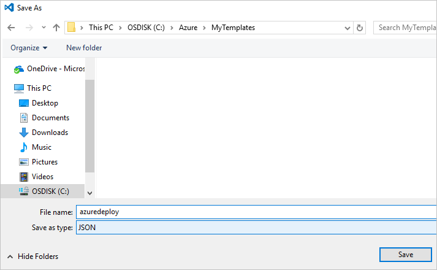
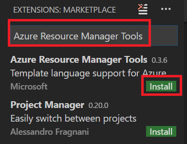
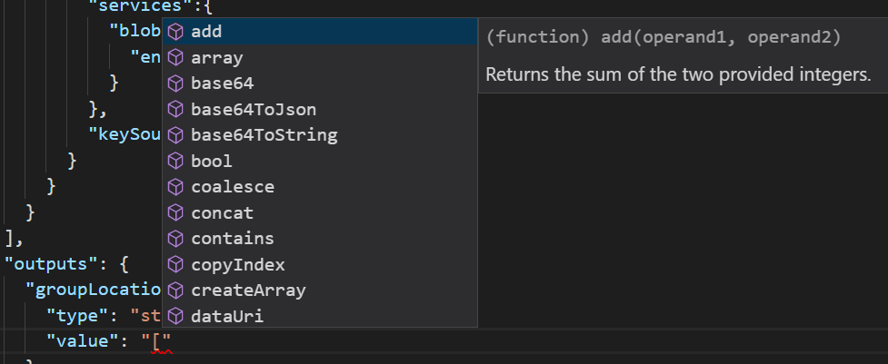
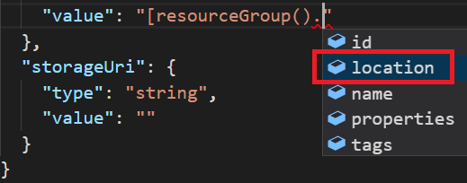

# Use Visual Studio Code extension to create Azure Resource Manager template
This article shows you the benefits of installing and using the Azure Resource Manager Tools extension in Visual Studio Code. You can create Resource Manager templates in VS Code without the extension, but the extension provides autocomplete options that simplify template development. It suggests template functions, parameters, and variables that are available in the template.

To complete this article, you need [Visual Studio Code](https://code.visualstudio.com/).

To understand the concepts associated with deploying and managing your Azure solutions, see [Azure Resource Manager overview](resource-group-overview.md).

## Create the template

This article builds on the template you created in [Create and deploy your first Azure Resource Manager template](resource-manager-create-first-template.md). If you already have that template, you can skip this section.

1. If you need to create the template, start VS Code. Select **File** > **New File**. 

   

2. Copy and paste the following JSON syntax into your file:

   ```json
   {
     "$schema": "http://schema.management.azure.com/schemas/2015-01-01/deploymentTemplate.json#",
     "contentVersion": "1.0.0.0",
     "parameters": {
       "storageSKU": {
         "type": "string",
         "allowedValues": [
           "Standard_LRS",
           "Standard_ZRS",
           "Standard_GRS",
           "Standard_RAGRS",
           "Premium_LRS"
         ],
         "defaultValue": "Standard_LRS",
         "metadata": {
           "description": "The type of replication to use for the storage account."
         }
       },   
       "storageNamePrefix": {
         "type": "string",
         "maxLength": 11,
         "defaultValue": "storage",
         "metadata": {
           "description": "The value to use for starting the storage account name. Use only lowercase letters and numbers."
         }
       }
     },
     "variables": {
       "storageName": "[concat(toLower(parameters('storageNamePrefix')), uniqueString(resourceGroup().id))]"
     },
     "resources": [
       {
         "name": "[variables('storageName')]",
         "type": "Microsoft.Storage/storageAccounts",
         "apiVersion": "2016-01-01",
         "sku": {
           "name": "[parameters('storageSKU')]"
         },
         "kind": "Storage",
         "location": "[resourceGroup().location]",
         "tags": {},
         "properties": {
           "encryption":{
             "services":{
               "blob":{
                 "enabled":true
               }
             },
             "keySource":"Microsoft.Storage"
           }
         }
       }
     ],
     "outputs": {  }
   }
   ```

3. Save this file as **azuredeploy.json** to a local folder.

   

## Install the extension

1. In VS Code, select **Extensions**.

   

2. Search for **Azure Resource Manager Tools** and select **Install**.

   

3. To finish the extension installation, select **Reload**.

## Edit the template

1. Open your azuredeploy.json file.

2. The extension retrieves all available [template functions](resource-group-template-functions.md). It also reads the parameters and variables that you defined in the template. To see this functionality, you add two values to the output section. In the template, replace the outputs section with:

   ```json
   "outputs": { 
       "groupLocation": {
         "type": "string",
         "value": ""
       },
       "storageUri": {
         "type": "string",
         "value": ""
       }
   }
   ```

3. Place the cursor inside the quotation marks for value in **groupLocation**. Type the left bracket (`[`). Notice that the extension immediately suggests available template functions.

   

4. Start typing **resourceGroup**. When the `resourceGroup()` function is displayed, press Tab or Enter.

   

5. The extension fills in the function syntax. The [resourceGroup](resource-group-template-functions-resource.md#resourcegroup) function does not accept parameters. Add a period after the right parenthesis. The extension provides the properties that are available for the object returned by the `resourceGroup()` function. Select `location`.

   

6. After **location**, add the closing right bracket.

   ```json
   "outputs": { 
       "groupLocation": {
         "type": "string",
         "value": "[resourceGroup().location]"
       },
       "storageUri": {
         "type": "string",
         "value": ""
       }
   }
   ```

7. Now, place the cursor inside the quotation marks for **storageUri**. Again, type the left bracket. Start typing **reference**. When that function is selected, press Tab or Enter.

   

8. The [reference](resource-group-template-functions-resource.md#reference) accepts the resource ID or resource name as a parameter. You already have the name of the storage account in a variable. Type **var** and then select Ctrl+space. The extension suggests the variables function.

   

   Press Tab or Enter.

9. The [variables](resource-group-template-functions-deployment.md#variables) function requires the name of the variable. Inside the parentheses, add a single quotation mark. The extension provides the names of variables you defined in the template.

    

10. Select the **storageName** variable. Add the right bracket. The following example shows the outputs section:

    ```json
    "outputs": { 
       "groupLocation": {
         "type": "string",
         "value": "[resourceGroup().location]"
       },
       "storageUri": {
         "type": "string",
         "value": "[reference(concat('Microsoft.Storage/storageAccounts/',variables('storageName'))).primaryEndpoints.blob]"
       }
    }
    ```

The final template is:

```json
{
  "$schema": "http://schema.management.azure.com/schemas/2015-01-01/deploymentTemplate.json#",
  "contentVersion": "1.0.0.0",
  "parameters": {
    "storageSKU": {
      "type": "string",
      "allowedValues": [
        "Standard_LRS",
        "Standard_ZRS",
        "Standard_GRS",
        "Standard_RAGRS",
        "Premium_LRS"
      ],
      "defaultValue": "Standard_LRS",
      "metadata": {
        "description": "The type of replication to use for the storage account."
      }
    },   
    "storageNamePrefix": {
      "type": "string",
      "maxLength": 11,
      "defaultValue": "storage",
      "metadata": {
        "description": "The value to use for starting the storage account name. Use only lowercase letters and numbers."
      }
    }
  },
  "variables": {
    "storageName": "[concat(toLower(parameters('storageNamePrefix')), uniqueString(resourceGroup().id))]"
  },
  "resources": [
    {
      "name": "[variables('storageName')]",
      "type": "Microsoft.Storage/storageAccounts",
      "apiVersion": "2016-01-01",
      "sku": {
        "name": "[parameters('storageSKU')]"
      },
      "kind": "Storage",
      "location": "[resourceGroup().location]",
      "tags": {},
      "properties": {
        "encryption":{
          "services":{
            "blob":{
              "enabled":true
            }
          },
          "keySource":"Microsoft.Storage"
        }
      }
    }
  ],
  "outputs": { 
    "groupLocation": {
      "type": "string",
      "value": "[resourceGroup().location]"
    },
    "storageUri": {
      "type": "string",
      "value": "[reference(concat('Microsoft.Storage/storageAccounts/',variables('storageName'))).primaryEndpoints.blob]"
    }
  }
}
```

## Deploy template

You are ready to deploy this template. You use either PowerShell or Azure CLI to create a resource group. Then, you deploy a storage account to that resource group.

* For PowerShell, use the following commands from the folder containing the template:

   ```powershell
   Login-AzureRmAccount
   
   New-AzureRmResourceGroup -Name examplegroup -Location "South Central US"
   New-AzureRmResourceGroupDeployment -ResourceGroupName examplegroup -TemplateFile azuredeploy.json
   ```

* For a local installation of Azure CLI, use the following commands from the folder containing the template:

   ```azurecli
   az login

   az group create --name examplegroup --location "South Central US"
   az group deployment create --resource-group examplegroup --template-file azuredeploy.json
   ```

When deployment finishes, the output values are returned.

## Clean up resources

When no longer needed, clean up the resources you deployed by deleting the resource group.

For PowerShell, use:

```powershell
Remove-AzureRmResourceGroup -Name examplegroup
```

For Azure CLI, use:

```azurecli
az group delete --name examplegroup
```

## Next steps
* To learn more about the structure of a template, see [Authoring Azure Resource Manager templates](resource-group-authoring-templates.md).
* To learn about the properties for a storage account, see [storage accounts template reference](/azure/templates/microsoft.storage/storageaccounts).
* To view complete templates for many different types of solutions, see the [Azure Quickstart Templates](https://azure.microsoft.com/documentation/templates/).
