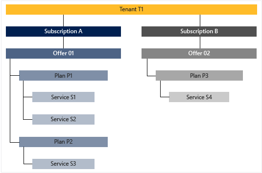
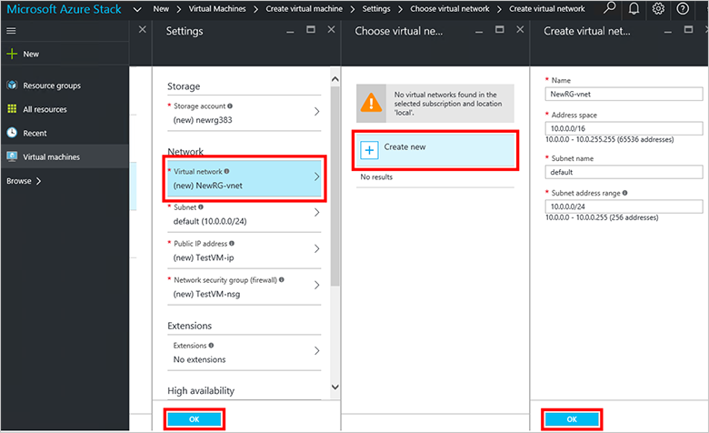
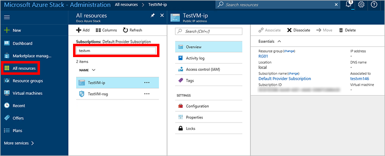

# Make virtual machines available to your Azure Stack users

*Applies to: Azure Stack integrated systems and Azure Stack Development Kit*

As an Azure Stack cloud administrator, you can create offers that your users (sometimes referred to as tenants) can subscribe to. Using their subscription, users can then consume Azure Stack services.

This article shows you how to create an offer, and then test it. 
For the test, you will log in to the portal as a user, subscribe to the offer, and then create a virtual machine using the subscription.

What you will learn:

> [!div class="checklist"]
> * Create an offer
> * Add an image
> * Test the offer

In Azure Stack, services are delivered to users using subscriptions, offers, and plans. Users can subscribe to multiple offers. Offers can have one or more plans, and plans can have one or more services.

To learn more, see [Key features and concepts in Azure Stack](azure-stack-key-features.md).

## Create an offer

Now you can get things ready for your users. When you start the process, you are first prompted to create the offer, then a plan, and finally quotas.

3. **Create an offer**

   Offers are groups of one or more plans that providers present to users to purchase or subscribe to.

   a. [Sign in](azure-stack-connect-azure-stack.md) to the portal as a cloud administrator and then click **New** > **Offers + Plans** > **Offer**.
   

   b. In the **New Offer** section, fill in **Display Name** and **Resource Name**, and then select a new or existing **Resource Group**. The Display Name is the offer's friendly name. Only the cloud operator can see the Resource Name. It's the name that admins use to work with the offer as an Azure Resource Manager resource.

   

   c. Click **Base plans**, and in the **Plan** section, click **Add** to add a new plan to the offer.

   

   d. In the **New Plan** section, fill in **Display Name** and **Resource Name**. The Display Name is the plan's friendly name that users see. Only the cloud operator can see the Resource Name. It's the name that cloud operators use to work with the plan as an Azure Resource Manager resource.

   

   e. Click **Services**, select **Microsoft.Compute**, **Microsoft.Network**, and **Microsoft.Storage**, and then click **Select**.

   

   f. Click **Quotas**, and then select the first service for which you want to create a quota. For an IaaS quota, follow these steps for the Compute, Network, and Storage services.

   In this example, we first create a quota for the Compute service. In the namespace list, select the **Microsoft.Compute** namespace and then click **Create new quota**.
   
   

   g. On the **Create quota** section, type a name for the quota and set the desired parameters for the quota and click **OK**.

   

   h. Now, for **Microsoft.Compute**, select the quota that you created.

   

   Repeat these steps for the Network and Storage services, and then click **OK** on the **Quotas** section.

   i. Click **OK** on the **New plan** section.

   j. On the **Plan** section, select the new plan and click **Select**.

   k. On the **New offer** section, click **Create**. You see a notification when the offer has been created.

   l. On the dashboard menu, click **Offers** and then click the offer you created.

   m. Click **Change State**, and then click **Public**.

   

## Add an image

Before you can provision virtual machines, you must add an image to the Azure Stack marketplace. You can add the image of your choice, including Linux images, from the Azure Marketplace.

If you are operating in a connected scenario and if you have registered your Azure Stack instance with Azure, then you can download the Windows Server 2016 VM image from the Azure Marketplace by using the steps described in the [Download marketplace items from Azure to Azure Stack](azure-stack-download-azure-marketplace-item.md) topic.

For information about adding different items to the marketplace, see [The Azure Stack Marketplace](azure-stack-marketplace.md).

## Test the offer

Now that you’ve created an offer, you can test it. Log in as a user and subscribe to the offer and then add a virtual machine.

1. **Subscribe to an offer**

   Now you can log in to the portal as a user to subscribe to an offer.

   a. Log in to the user portal as a user and click **Get a Subscription**.
   - For an integrated system, the URL varies based on your operator’s region and external domain name, and will be in the format https://portal.&lt;<em>region</em>&gt;.&lt;<em>FQDN</em>&gt;.
   - If you’re using the Azure Stack Development Kit, the portal address is https://portal.local.azurestack.external.

   

   b. In the **Display Name** field, type a name for your subscription, click **Offer**, click one of the offers in the **Choose an offer** section, and then click **Create**.

   

   c. To view the subscription you created, click **More services**, click **Subscriptions**, then click your new subscription.  

   After you subscribe to an offer, refresh the portal to see which services are part of the new subscription.

2. **Provision a virtual machine**

   Now you can log in to the portal as a user to provision a virtual machine using the subscription. 

   a. Log in to the user portal as a user.
   - For an integrated system, the URL varies based on your operator’s region and external domain name, and will be in the format https://portal.&lt;<em>region</em>&gt;.&lt;<em>FQDN</em>&gt;.
     - If you’re using the Azure Stack Development Kit, the portal address is https://portal.local.azurestack.external.

   b.  On the dashboard, click **New** > **Compute** > **Windows Server 2016 Datacenter Eval**, and then click **Create**.

   c. In the **Basics** section, type a **Name**, **User name**, and **Password**, choose a **Subscription**, create a **Resource group** (or select an existing one), and then click **OK**.

   d. In the **Choose a size** section, click **A1 Standard**, and then click **Select**.  

   e. In the **Settings** section, click **Virtual network**. In the **Choose virtual network** section, click **Create new**. In the **Create virtual network** section, accept all the defaults, and click **OK**. In the **Settings** section, click **OK**.

   

   f. In the **Summary** section, click **OK** to create the virtual machine.  

   g. To see the new virtual machine, click **All resources**, then search for the virtual machine and click its name.

    

What you learned in this tutorial:

> [!div class="checklist"]
> * Create an offer
> * Add an image
> * Test the offer

> [!div class="nextstepaction"]
> [Make web, mobile, and API apps available to your Azure Stack users](azure-stack-tutorial-app-service.md)