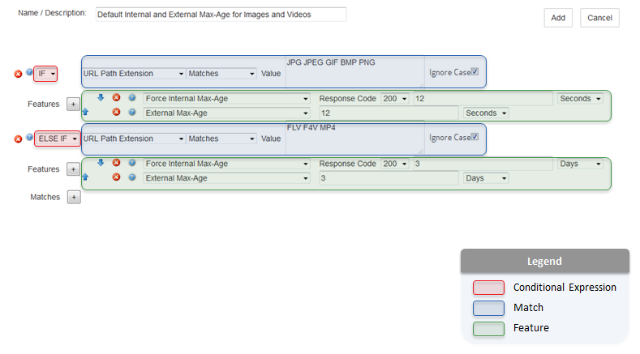

# Azure CDN rules engine
This topic lists detailed descriptions of the available match conditions and features for Azure Content Delivery Network (CDN) [Rules Engine](cdn-rules-engine.md).

The HTTP Rules Engine is designed to be the final authority on how specific types of requests are processed by the CDN.

**Common uses**:

- Override or define a custom cache policy.
- Secure or deny requests for sensitive content.
- Redirect requests.
- Store custom log data.

## Terminology
A rule is defined through the use of [**conditional expressions**](cdn-rules-engine-reference-conditional-expressions.md), [**matches**](cdn-rules-engine-reference-match-conditions.md), and [**features**](cdn-rules-engine-reference-features.md). These elements are highlighted in the following illustration.

 

## Syntax

The manner in which special characters will be treated varies according to how a match condition or feature handles text values. A match condition or feature may interpret text in one of the following ways:

1. [**Literal Values**](#literal-values) 
2. [**Wildcard Values**](#wildcard-values)
3. [**Regular Expressions**](#regular-expressions)

### Literal Values
Text that is interpreted as a literal value will treat all special characters, with the exception of the % symbol, as a part of the value that must be matched. In other words, a literal match condition set to `\'*'\` will only be satisfied when that exact value (i.e., `\'*'\`) is found.

A percentage symbol is used to indicate URL encoding (e.g., `%20`).

### Wildcard Values
Text that is interpreted as a wildcard value will assign additional meaning to special characters. The following table describes how the following set of characters will be interpreted.

| Character |                                                                                                                                                                                                                                                                                                                                                                                                                                                                                                                                                                                                                                                                                          Description                                                                                                                                                                                                                                                                                                                                                                                                                                                                                                                                                                                                                                                                                           |
|-----------|------------------------------------------------------------------------------------------------------------------------------------------------------------------------------------------------------------------------------------------------------------------------------------------------------------------------------------------------------------------------------------------------------------------------------------------------------------------------------------------------------------------------------------------------------------------------------------------------------------------------------------------------------------------------------------------------------------------------------------------------------------------------------------------------------------------------------------------------------------------------------------------------------------------------------------------------------------------------------------------------------------------------------------------------------------------------------------------------------------------------------------------------------------------------------------------------------------------------------------------------------------------------------------------------------------------------------------------------------------------------------------------------|
|     \     |                                                                                                                                                                                                                                                                                                                                                                                                                                                                                                                                                                            A backslash is used to escape any of the characters specified in this table. A backslash must be specified directly before the special character that should be escaped. For example, the following syntax escapes an asterisk: `\*`                                                                                                                                                                                                                                                                                                                                                                                                                                                                                                                                                                            |
|     %     |                                                                                                                                                                                                                                                                                                                                                                                                                                                                                                                                                                                                                                                              A percentage symbol is used to indicate URL encoding (e.g., `%20`).                                                                                                                                                                                                                                                                                                                                                                                                                                                                                                                                                                                                                                                               |
|     *     |                                                                                                                                                                                                                                                                                                                                                                                                                                                                                                                                                                                                                                                               An asterisk is a wildcard that represents one or more characters.                                                                                                                                                                                                                                                                                                                                                                                                                                                                                                                                                                                                                                                                |
|   Space   |                                                                                                                                                                                                                                                                                                                                                                                                                                                                                                                                                                                                                                       A space character indicates that a match condition may be satisfied by either of the specified values or patterns.                                                                                                                                                                                                                                                                                                                                                                                                                                                                                                                                                                                                                                       |
|  'value'  | A single quote does not have special meaning. However, a set of single quotes is used to indicate that a value should be treated as a literal value. It can be used in the following ways:  - It allows a match condition to be satisfied whenever the specified value matches any portion of the comparison value.  For example, `'ma'` would match any of the following strings:   /business/<strong>ma</strong>rathon/asset.htm <strong>ma</strong>p.gif /business/template.<strong>ma</strong>p  - It allows a special character to be specified as a literal character. For example, you may specify a literal space character by enclosing a space character within a set of single quotes (i.e., `' '` or `'sample value'`). - It allows a blank value to be specified. Specify a blank value by specifying a set of single quotes (i.e., '').  <strong>Important:</strong> - If the specified value does not contain a wildcard, then it will automatically be considered a literal value. This means that it is not necessary to specify a set of single quotes. - If a backslash does not escape another character in this table, then it will be ignored when specified within a set of single quotes. - Another way to specify a special character as a literal character is to escape it using a backslash (i.e., `\`). |

### Regular Expressions

Regular expressions define a pattern that will be searched for within a text value. Regular expression notation defines specific meanings to a variety of symbols. The following table indicates how special characters are treated by match conditions and features that support regular expressions.

| Special Character |                                                                                                                                                                                   Description                                                                                                                                                                                   |
|-------------------|---------------------------------------------------------------------------------------------------------------------------------------------------------------------------------------------------------------------------------------------------------------------------------------------------------------------------------------------------------------------------------|
|         \         |                                                                         A backslash escapes the character the follows it. This causes that character to be treated as a literal value instead of taking on its regular expression meaning. For example, the following syntax escapes an asterisk: `\*`                                                                          |
|         %         | The meaning of a percentage symbol depends on its usage.   `%{HTTPVariable}`: This syntax identifies an HTTP variable. `%{HTTPVariable%Pattern}`: This syntax uses a percentage symbol to identify an HTTP variable and as a delimiter. `\%`: Escaping a percentage symbol allows it to be used as a literal value or to indicate URL encoding (e.g., `\%20`). |
|         *         |                                                                                                                                                  An asterisk allows the preceding character to be matched zero or more times.                                                                                                                                                   |
|       Space       |                                                                                                                                                         A space character is typically treated as a literal character.                                                                                                                                                          |
|      'value'      |                                                                                                                                     Single quotes are treated as literal characters. A set of single quotes does not have special meaning.                                                                                                                                      |

## Next steps
* [Rules Engine Match Conditions](cdn-rules-engine-reference-match-conditions.md)
* [Rules Engine Conditional Expressions](cdn-rules-engine-reference-conditional-expressions.md)
* [Rules Engine Features](cdn-rules-engine-reference-features.md)
* [Overriding default HTTP behavior using the rules engine](cdn-rules-engine.md)
* [Azure CDN Overview](cdn-overview.md)
