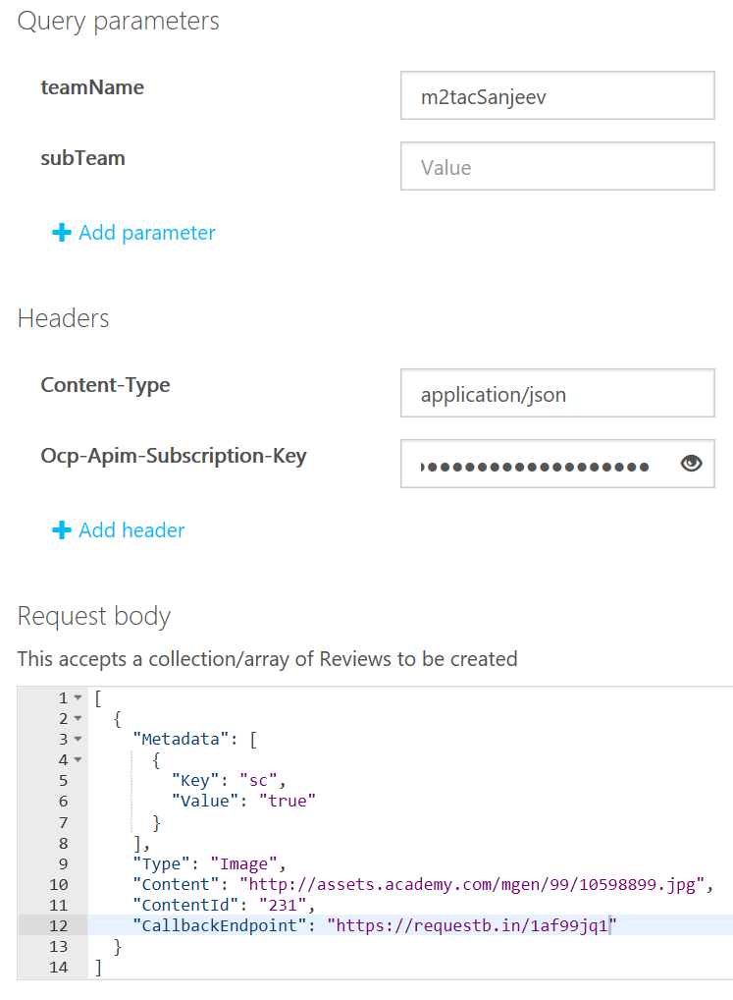
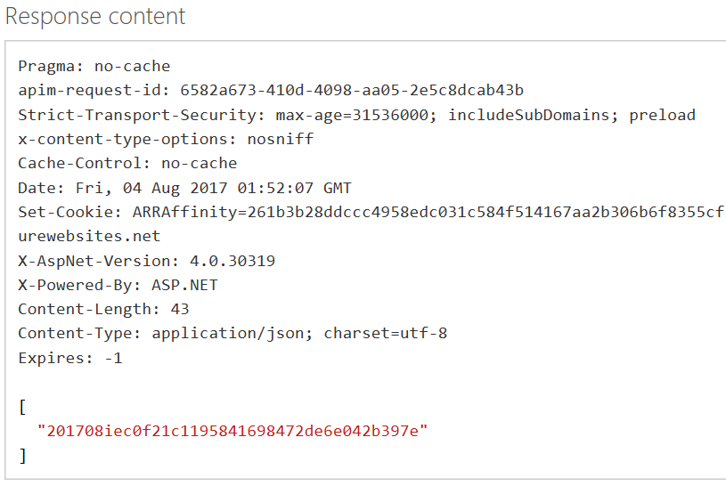
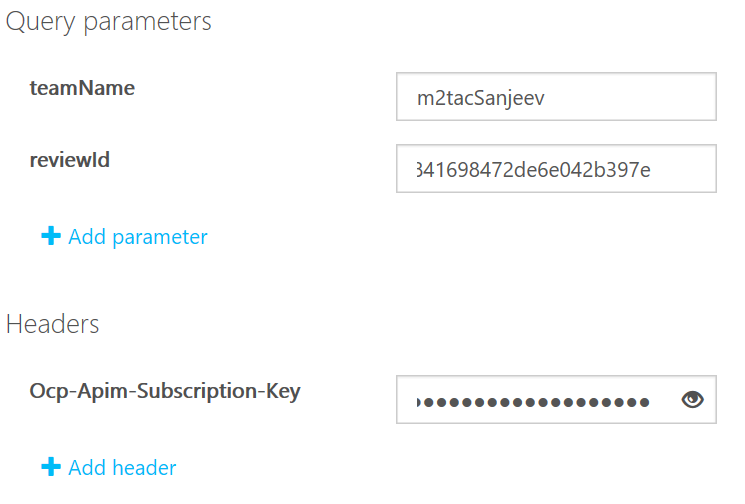
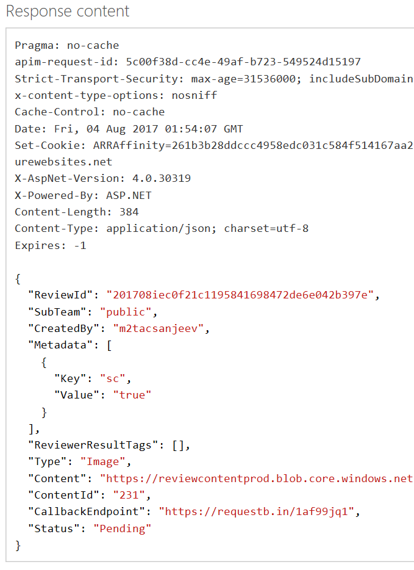

# Create reviews from the API console

Use the Review API's [review operations](https://westus.dev.cognitive.microsoft.com/docs/services/580519463f9b070e5c591178/operations/580519483f9b0709fc47f9c4) to create image or text reviews for human moderation. Human moderators use the the Review tool to review the content. Use this operation based on your post-moderation business logic. Use it after you have scanned your content by using any of the Content Moderator image or text APIs, or other Cognitive Services APIs. 

After a human moderator reviews the auto-assigned tags and prediction data and submits a final moderation decision, the Review API submits all information to your API endpoint.

## Use the API console
To test-drive the API by using the online console, you need a few values to enter into the console:

- **teamName**: The team name that you created when you set up your Review tool account. 
- **ContentId**: This string is passed to the API and returned through the callback. The ContentId is useful for associating internal identifiers or metadata with the results of a moderation job.
- **Metadata**: Custom key-value pairs returned to your API endpoint during the callback. If the key is a short code that is defined in the Review tool, it appears as a tag.
- **Ocp-Apim-Subscription-Key**: Located on the **Settings** tab. For more information, see [Overview](overview.md).

The simplest way to access a testing console is from the **Credentials** window.

1. In the **Credentials** window, select [Review API reference](https://westus.dev.cognitive.microsoft.com/docs/services/580519463f9b070e5c591178/operations/580519483f9b0709fc47f9c4).

   The **Review - Create** page opens.

2. For **Open API testing console**, select the region that most closely describes your location.

   

   The **Review - Create** API console opens.
  
3. Enter values for the required query parameters, content type, and your subscription key. In the **Request body** box, specify the content (for example, image location), metadata, and other information associated with the content.

   
  
4. Select **Send**. A review ID is created. Copy this ID to use in the following steps.

   
  
5. Select **Get**, and then open the API by selecting the button that matches your region. On the resulting page, enter the values for **teamName**, **ReviewID**, and **subscription key**. Select the **Send** button on the page. 

   
  
6. You will see the results of the scan.

   
  
7. On the Content Moderator Dashboard, select **Review** > **Image**. The image that you scanned appears, ready for human review.

   

## Next steps

Use the REST API in your code or start with the [Reviews .NET quickstart](moderation-reviews-quickstart-dotnet.md) to integrate with your application.
