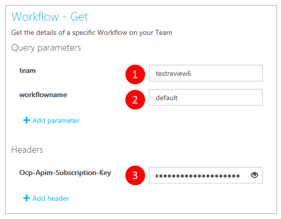
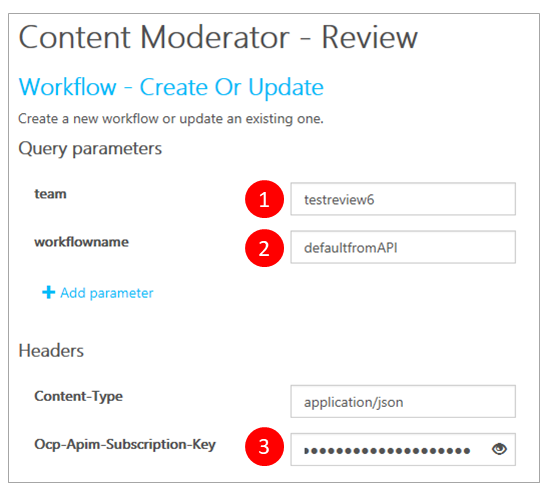
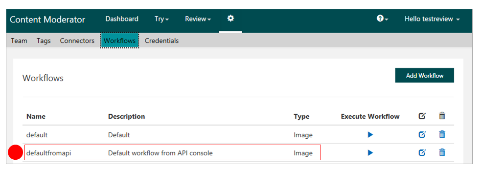
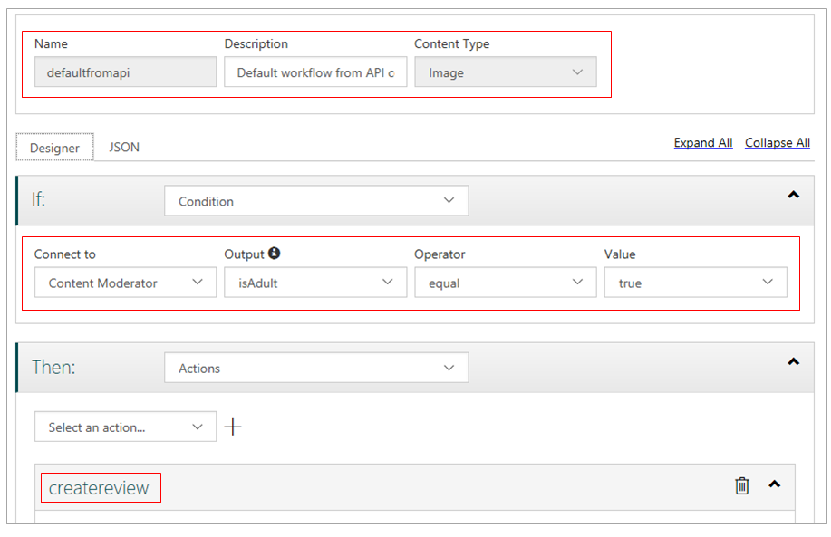

# Workflows from the API console

Use the Review API's [workflow operations](https://westus.dev.cognitive.microsoft.com/docs/services/580519463f9b070e5c591178/operations/5813b46b3f9b0711b43c4c59) in Azure Content Moderator to create or update or get workflow details by using the Review API. You define simple, complex, and even nested expressions for your workflows by using this API. The workflows appear in the Review tool for your team to use. The workflows are also used by the Review API's **Job** operations.

## Prerequisites

Navigate to the [review tool](https://contentmoderator.cognitive.microsoft.com/). Sign up if you have not done so yet. Within the review tool, Navigate to the **Workflows** tab under **Settings** as shown in the review tool's [workflow tutorial](Review-Tool-User-Guide/Workflows.md).

### Navigate to the workflows screen

On the Content Moderator Dashboard, select **Review** > **Settings** > **Workflows**. You see a **default** workflow.

  

### Get the JSON definition of the default workflow

Click the **Edit** option for your workflow, and then select the **JSON** tab. You see the following JSON **Expression**.

	{
		"Type": "Logic",
		"If": {
    		"ConnectorName": "moderator",
    		"OutputName": "isAdult",
    		"Operator": "eq",
    		"Value": "true",
    		"Type": "Condition"
			},
		"Then": {
		"Perform": [
      	{
        	"Name": "createreview",
        	"CallbackEndpoint": null,
        	"Tags": []
      	}
    	],
    	"Type": "Actions"
		}
	}

## Get workflow details

Start with using the **Workflow - Get** operation to get details of your existing, **default** workflow.

Go to the [review tool's Credentials](Review-Tool-User-Guide/credentials.md#the-review-tool) section in the review tool.

### Navigate to the API Reference

In the **Credentials** view, select [API reference](https://westus.dev.cognitive.microsoft.com/docs/services/580519463f9b070e5c591178/operations/5813b46b3f9b0711b43c4c59).

  The 'Workflow - Create Or Update' page opens. Navigate to the [Workflow - Get](https://westus.dev.cognitive.microsoft.com/docs/services/580519463f9b070e5c591178/operations/5813b44b3f9b0711b43c4c58) reference.

### Select your region

For **Open API testing console**, select the region that most closely describes your location.

  

  The **Workflow - Get** API console opens.

### Enter parameters

Enter values for **team**, **workflowname**, and **Ocp-Apim-Subscription-Key** (your subscription key).

- **team**: The team ID that you created when you set up your [review tool account](https://contentmoderator.cognitive.microsoft.com/). 
- **workflowname**: The name of your workflow. Use `default`.
- **Ocp-Apim-Subscription-Key**: Located on the **Settings** tab. For more information, see [Overview](overview.md).

  

### Submit your request
  
Select **Send**. If the operation succeeds, the **Response status** is `200 OK` and the **Response content** box displays the following JSON workflow:

	{
		"Name": "default",
		"Description": "Default",
		"Type": "Image",
		"Expression": {
    	"If": {
      		"ConnectorName": "moderator",
      		"OutputName": "isadult",
      		"Operator": "eq",
      		"Value": "true",
      		"AlternateInput": null,
      		"Type": "Condition"
    		},
    	"Then": {
      		"Perform": [{
        		"Name": "createreview",
        		"Subteam": null,
        		"CallbackEndpoint": null,
        		"Tags": []
      		}],
      		"Type": "Actions"
    		},
    		"Else": null,
    		"Type": "Logic"
			}
	}

## Create a workflow

Go to the [review tool's Credentials](Review-Tool-User-Guide/credentials.md#the-review-tool) section in the review tool.

### Navigate to the API Reference

In the **Credentials** view, select [API reference](https://westus.dev.cognitive.microsoft.com/docs/services/580519463f9b070e5c591178/operations/5813b46b3f9b0711b43c4c59).

  The **Workflow - Create Or Update** page opens.

### Select your region

For **Open API testing console**, select the region that most closely describes your location.

  

  The **Workflow - Create Or Update** API console opens.

### Enter parameters

Enter values for **team**, **workflowname**, and **Ocp-Apim-Subscription-Key** (your subscription key).

- **team**: The team ID that you created when you set up your [review tool account](https://contentmoderator.cognitive.microsoft.com/). 
- **workflowname**: The name of your new workflow.
- **Ocp-Apim-Subscription-Key**: Located on the **Settings** tab. For more information, see [Overview](overview.md).

  

### Enter the workflow definition

Edit the **Request body** box to enter the JSON request with details for **Description** and **Type** (Image or Text).
For the **Expression**, copy the default workflow **Expression** from the preceding section as shown here.

	{
		"Description": "Default workflow from API console",
		"Type": "Image",
		"Expression": 
			// Copy the default workflow expression from the preceding section
	}

Your request body looks like the following JSON request:

	{
		"Description": "Default workflow from API console",
		"Type": "Image",
		"Expression": {
		    "Type": "Logic",
    		"If": {
      			"ConnectorName": "moderator",
      			"OutputName": "isAdult",
      			"Operator": "eq",
      			"Value": "true",
      			"Type": "Condition"
    			},
    		"Then": {
      		"Perform": [
        	{
         		"Name": "createreview",
          		"CallbackEndpoint": null,
          		"Tags": [ ]
        	}
      		],
      		"Type": "Actions"
			}
		}
	}
 
### Submit your request
  
Select **Send**. If the operation succeeds, the **Response status** is `200 OK` and the **Response content** box displays `true`.

### Check out the new workflow

In the review tool, select **Review** > **Settings** > **Workflows**. Your new workflow appears, and is ready to use.

  
  
### Review your new workflow details

Select the **Edit** option for your workflow, and then select the **Designer** and **JSON** tabs.

  

To see the JSON view of the workflow, select the **JSON** tab.

## Next steps

For more complex workflow examples, see the [workflows overview](workflow-api.md).

Learn how to use workflows with [content moderation jobs](try-review-api-job.md).
