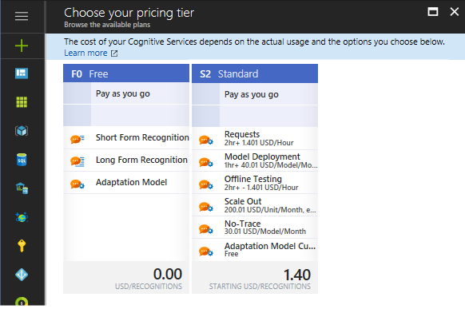
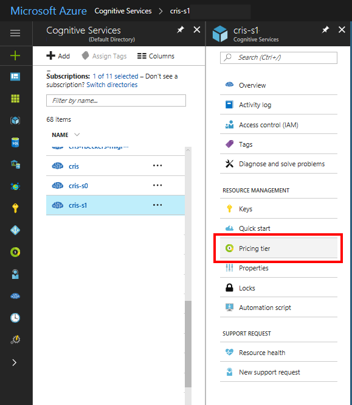
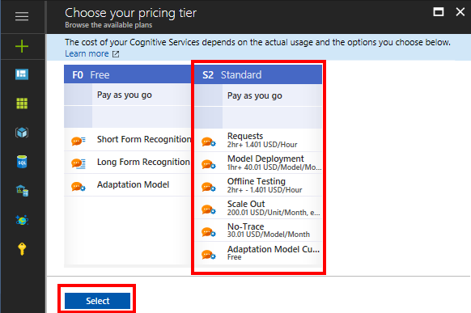
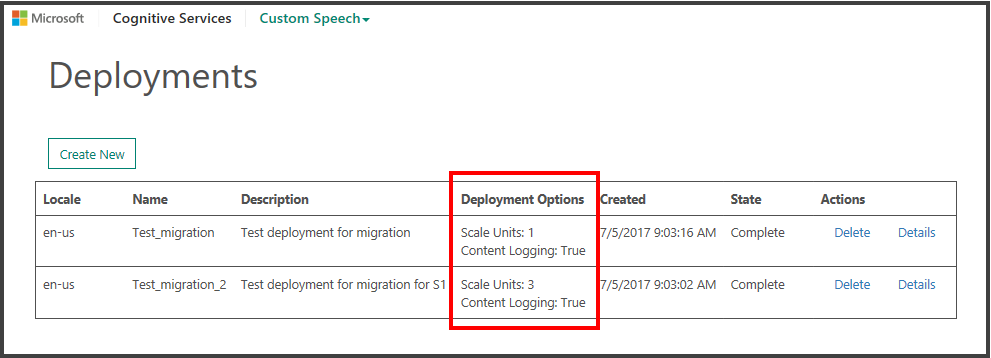

# Migrate deployments to the new pricing model
As of July 2017, Custom Speech Service offers a [new pricing model](https://azure.microsoft.com/en-us/pricing/details/cognitive-services/custom-speech-service/). The new model is *easier to understand*, *simpler to calculate costs*, and *more flexible* in terms of scaling. For scaling, Microsoft has introduced the concept of a scale unit. Each scale unit can handle five concurrent requests. The scaling for concurrent requests in the old model was set at 5 concurrent requests for tier S0, and it was set at 12 concurrent requests for tier S1. We have opened these limits to offer you greater flexibility with your use-case requirements.

If you run an old S0 or S1 tier, we recommend that you migrate your existing deployments to the new S2 tier. The new S2 tier covers both the S0 and S1 tiers. You can see the available options in the following figure:

Microsoft handles the migration in a semi-automated way. First, you trigger the migration by selecting the new pricing tier. Then, we migrate your deployment automatically.

The mapping from the old tiers to scale units is shown in the following table:

| Tier | Concurrent requests (old model) | Migration | Concurrent requests |
|----- | ----- | ---- | ---- |
| S0 |  5   |   => **S2** with 1 scale unit |   5 |
| S1 |  12  |   => **S2** with 3 scale units |  15 |

To migrate to the new tier, do the following:

## Step 1: Check your existing deployment
Go to the [Custom Speech Service portal](http://cris.ai), and check your existing deployments. In our example, there are two deployments. One deployment runs on an S0 tier, and the other deployment runs on an S1 tier. The deployments are shown in the **Deployment Options** column of the following table:

## Step 2: Select your new pricing tier in the Azure portal
1. Open a new browser tab, and sign in to the [Azure portal](http://ms.portal.azure.com/). 

2. In the **Cognitive Services** pane, in the **Subscriptions** list, select your custom speech subscription. 

3. In the pane for your subscription, select **Pricing tier**.

    

4. On the **Choose your pricing tier** page, select **S2 Standard**. This pricing tier is the new, simplified, and more flexible pricing tier.

5. Select the **Select** button.

    

## Step 3: Check the migration status in the Custom Speech Service portal
Return to the Custom Speech Service portal, and check your deployments. (If your browser window is still open, refresh it.) 

The status of the related deployment should have switched to *Processing*. You can also validate the migration by checking the **Deployment Options** column. There you can now find information about scale units and logging. The scale units should reflect your previous pricing tier. The logging should also be turned on, as shown in the table:

> [!NOTE]
> If you have any problems during the migration, contact us.
>

## Next steps
For more tutorials, see:
* [Create a custom acoustic model](cognitive-services-custom-speech-create-acoustic-model.md)
* [Create a custom language model](cognitive-services-custom-speech-create-language-model.md)
* [Create a custom speech-to-text endpoint](cognitive-services-custom-speech-create-endpoint.md)
