# Example utterances

Utterances are examples of user questions or commands. A variety of [example utterances](luis-concept-utterance.md) need to be added to an [intent](luis-concept-intent.md) to teach LUIS.

You can create entities and label utterances on the intent page after an utterance is added. If you would rather create entities first, see [Add entities](Add-entities.md).

In the following example, use the "BookFlight" intent in the TravelAgent app. 

## Add an utterance

1. Open the TravelAgent app by selecting its name on **My Apps** page, and then select **Intents** in the left panel. 

2. On the **Intents** page, select the intent name "BookFlight" to open the details page.

3. Type `book 2 adult business tickets to Paris tomorrow on Air France` as a new utterance in the text box, and then press Enter. 
 
    >[!NOTE]
    >LUIS converts all utterances to lower case.

    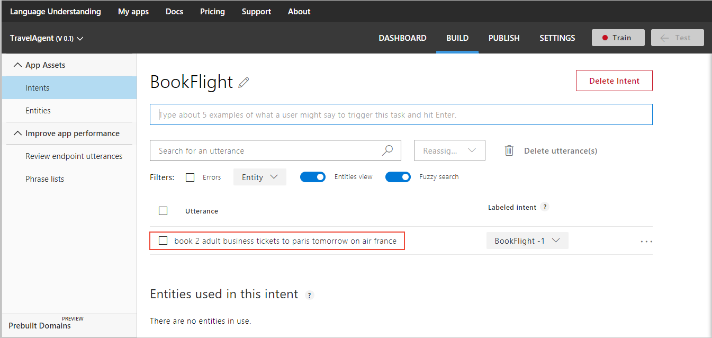 

Utterances are added to the utterances list for the current intent. 

## Edit an utterance

To edit an utterance, select the three dots (...) icon at the right end of the line for that utterance then select **Edit**. 

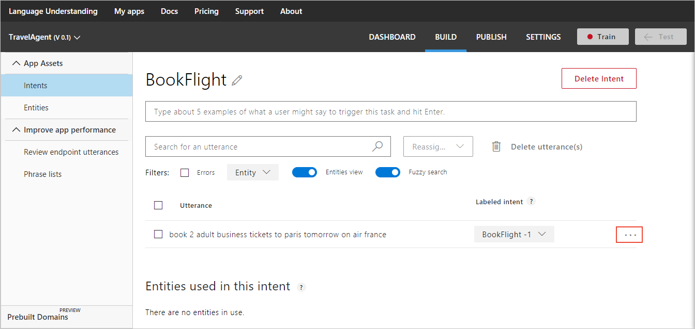 

## Delete an utterance

To delete an utterance, select the three dots (...) icon at the right end of the line for that utterance then select **Delete utterance**. 

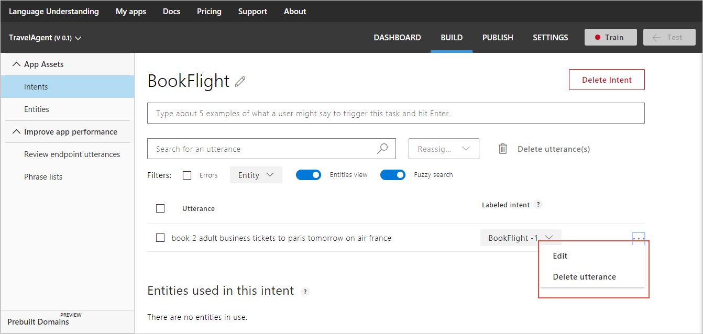

## Reassign an utterance
Adding an utterance to an intent means that it is labeled under that intent. You can change the intent label of one or more utterances by moving them to another intent. To change the intent label, select the utterances, select **Reassign predicted intent**, and then select the intent where you want to move them.

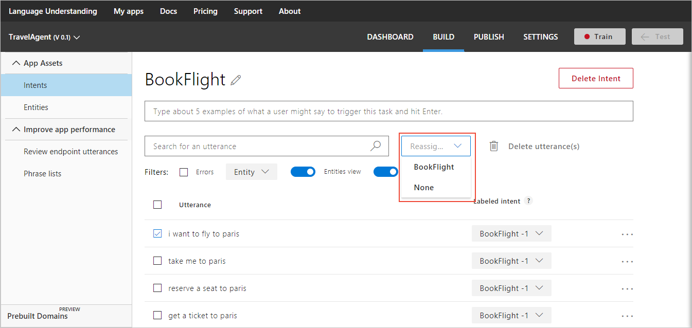 


## Add prebuilt entity label

If you add the prebuilt entities to your LUIS app, you don't need to label utterances with these entities. To learn more about prebuilt entities and how to add them, see [Add entities](Add-entities.md).

## Add simple entity label
In the following procedure, you create and label custom entities within the following utterance on the intent page:

```
book me 2 adult business tickets to Paris tomorrow on Air France
```

1. Select "Air France" in the utterance to label it as a simple entity.

    > [!NOTE]
    > When selecting words to label them as entities:
    > * For a single word, just select it. 
    > * For a set of two or more words, select at the beginning and then at the end of the set.

2. In the entity drop-down box that appears, you can either select an existing entity to select it, or add a new entity by typing its name in the text box and selecting **Create new entity**. To create the simple entity "Airline," type "Airline" in the text box and then select **Create new entity**.
 
    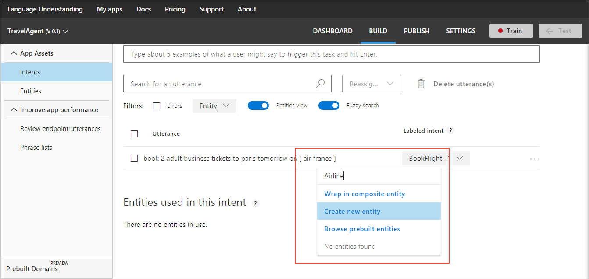
 
    > [!NOTE]
    > This method is used to create a simple entity on the intent page as part of labeling utterances. Composite entity children must be created from the **Entities** page before labeling an utterance with that entity. For more instructions, see [Add entities](Add-entities.md). 

A dialog pops up allowing you to choose which type of entity. For the entity "Airline," keep the entity type of "Simple" and select **Done.**

## Add hierarchical entity and label

The city "Paris" can be either a ToLocation or a FromLocation when booking a plane ticket. In order for LUIS to understand both entity types, this step builds a hierarchical entity. 

1. Select "Paris" in the same utterance, then create entity "Location". "Location" is a hierarchical entity containing "ToLocation" and "FromLocation" simple entity types.

    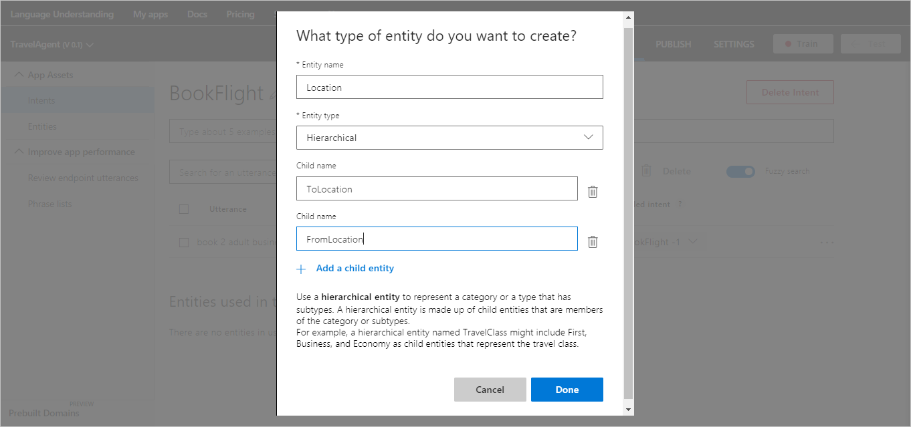

    The text "Paris" is now labeled as a top-level hierarchical entity. 

2. Once the hierarchical entity is created, select "Paris" and change the entity from "Location" to "ToLocation" entity.

    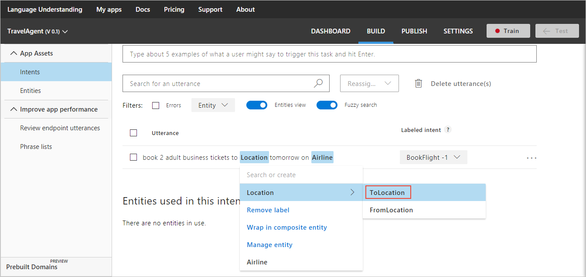

    To learn more about hierarchical entities and how to add them, see [Add entities](Add-entities.md).

## Add list entity and label

A list entity identifies known synonyms of words. Add a list entity for the different seat types: first, business, and economy. When labeling an utterance by creating a new list entity, you create the list with one item in the list, such as "business". 

1. In the utterance 
`book me 2 adult business tickets to Paris tomorrow on Air France`,
select "business," then create a new entity named "Seat".  

    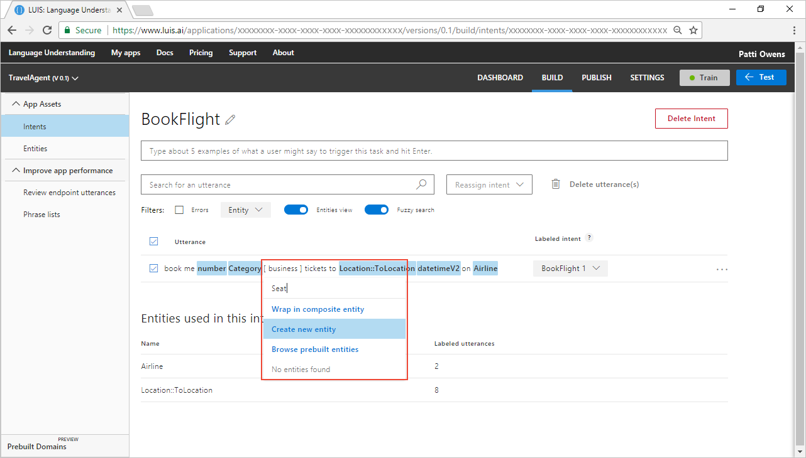

2. In the **What type of entity do you want to create** dialog, add `Bus.`, `bus`, and `biz`.

    

3. Select **Done**.

The **Seat** list entity contains one item of business with synonyms: `Bus.`, `bus`, and `biz` . 

## Add synonyms to the list entity 
Add a list to the list entity by selecting the word or phrase in the utterance.

1. Add a new utterance to the BookFlight intent `Book an economy class seat to seattle`. This utterance has a new Seat list item, `economy`.
2. Select the word `economy` in the utterance, then select `Seat` in the pop-up dialog, then select `Create a new synonym`.

    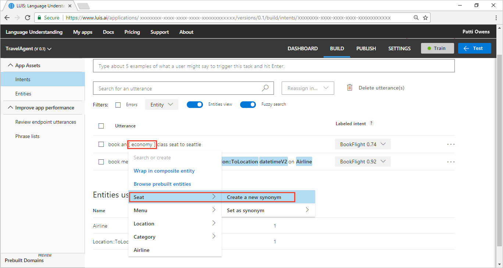

## Wrap entities in composite label
In the following procedure, you create and label a composite entity named `TicketsOrder` for the existing utterance:

`book me 2 adult business tickets to Paris tomorrow on Air France`

The composite entity contains three child entities: number (of tickets), Seat, and Category. The Seat hierarchical category was created in [a previous section](#add-list-entity-and-label). Label the word "business" as a Seat category. 

1. Follow these [steps](Add-entities.md#add-prebuilt-entity) to add the **number** prebuilt entity. After the entity is created, the `2` will be blue indicating it is a labeled entity. Prebuilt entities are labeled by LUIS. 

2. Follow these [steps](#add-hierarchical-entity-and-label) to create a **Category** [hierarchical entity] with values of Adult, Child, and Infant. Label the word "adult" as a Category entity. At this point, all three words should be labeled with the blue background. 

3. Select on the left-most word of the phrase, "2", labeled as number.

    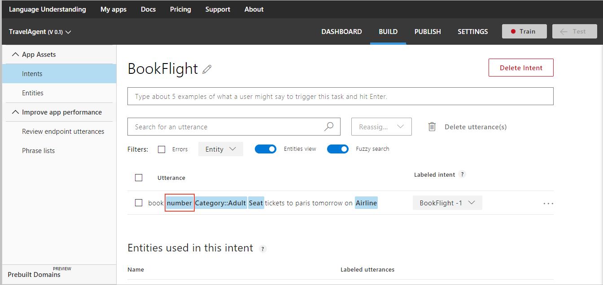

4. In the pop-up menu, select **Wrap in composite entity**.

    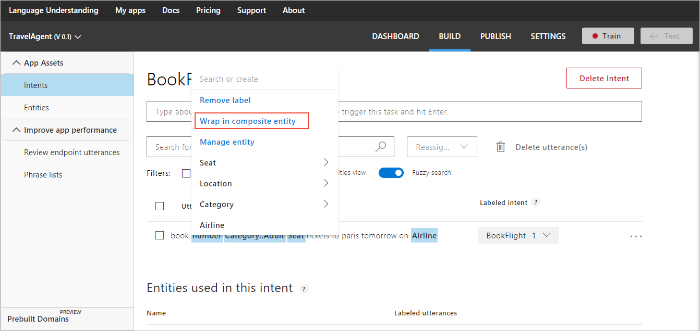

5. Select third word in phrase, `business`. A green bar appears below entire phrase. 

6. Enter `TicketsOrder` then select **Create new composite entity**.

    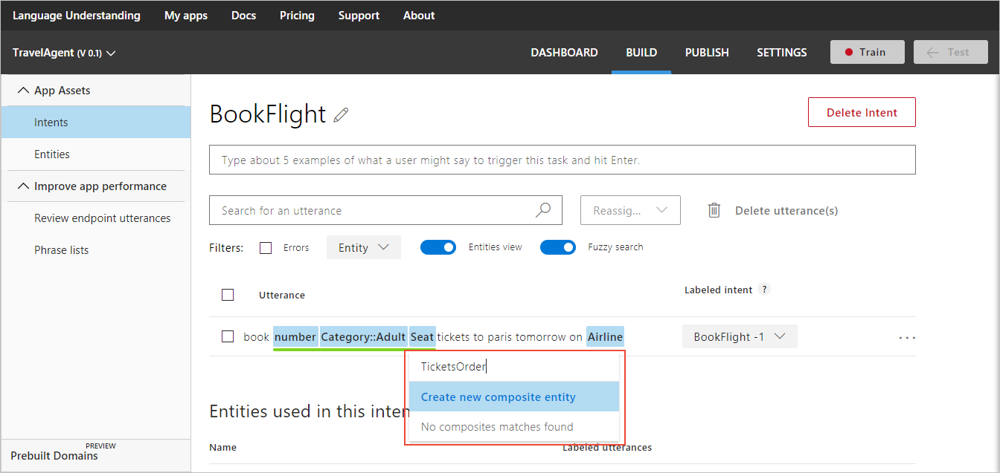

7. In the pop-up box, enter three existing entity children: number, Category, TravelClass. 

    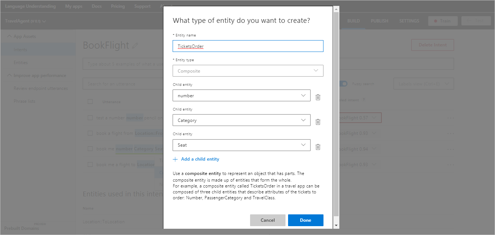

8. Select **Done**. 

9. Verify the new composite entity by hovering on the green bar under the three words. The composite name, **TicketsOrder** pops up.

    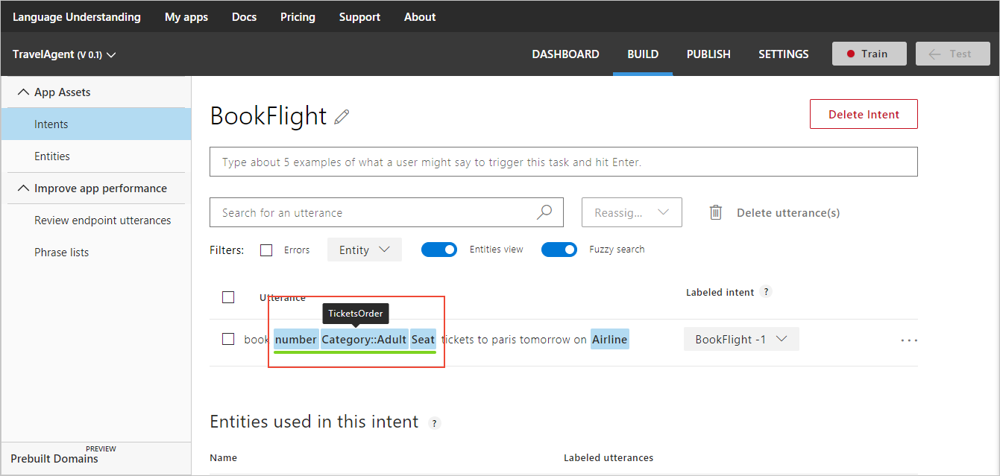

## Remove custom entity label

In order to remove your own custom entity label from an utterance, select the entity in the utterance and select **Remove label** in the entity drop-down box that appears.

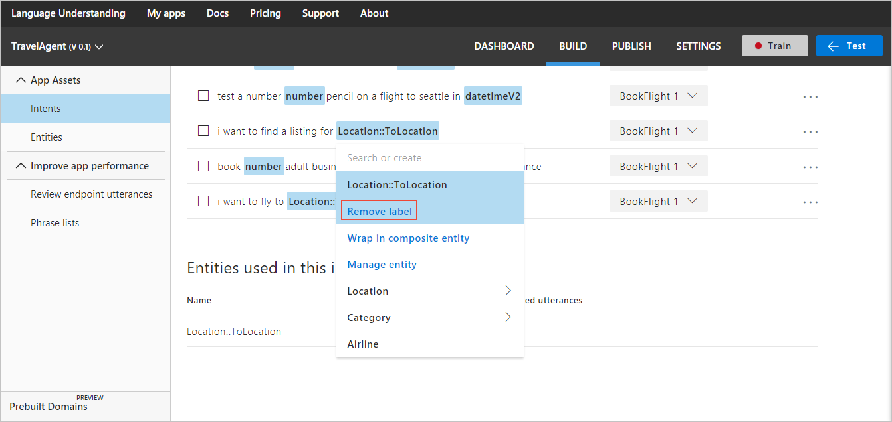 

Custom list entities cannot be removed because they are predicted by LUIS.

## Search in utterances

Searching allows you to find utterances that contain text (words/phrases). For example, sometimes you notice an error that involves a particular word, and may want to find all the examples including that particular word. 

Type the search text in the search box at the top right corner of the utterances list and press Enter. The utterances list is updated to display only the utterances including your search text. [Fuzzy search](#switch-from-fuzzy-search-to-prefix-search) is turned on by default.

To cancel the search and restore your full list of utterances, delete the search text you've typed.

## Filter by intent prediction discrepancy errors
An utterance in an intent may have a discrepancy between the selected intent and the prediction score. LUIS indicates this discrepancy with a red box around the score. Use the **Errors** checkbox to filter the utterance list to only utterances with an intent prediction discrepancy. 

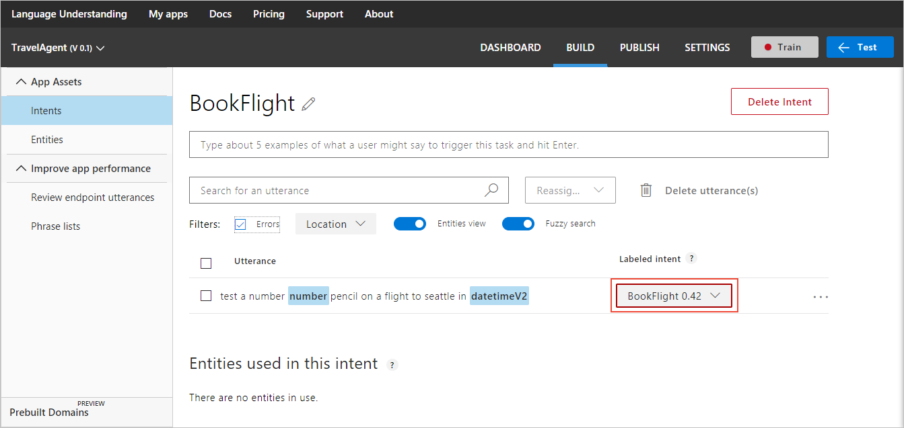 

## Filter by entity type
Use the **Entity** drop-down list to filter the utterances by entity. The new filter is shown under **Filters**. To remove the filter, select on the blue filter box with that word or phrase.  

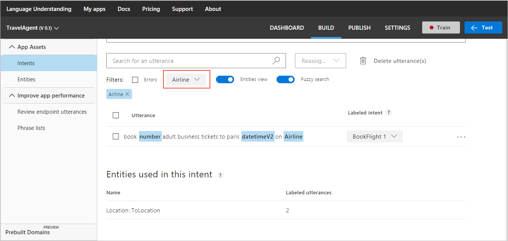 

## Switch to token view
Toggle **Tokens View** to view the tokens instead of the entity type names. The keyboard command, control + e, also switches between tokens and entities. 

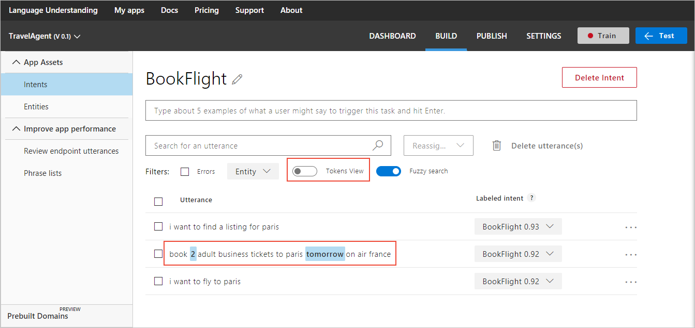

## Switch from fuzzy search to prefix search
Fuzzy search is the default search method. This search method is the ability to search for letters in order but not necessarily in consecutive order. For example, a fuzzy search of 'fy' returns all utterances such as 'fly' because the 'f' and the 'y' are in non-consecutive, left-to-right order. A non-fuzzy search does not return 'fly' because the letters are not in consecutive order. 

|utterance (search for 'fl') |found in fuzzy search|found in prefix search|
|--|--|--|
|book a **fl**ight to seattle| ✔ | ✔ |
|book a trip to **F**ort Worth from **L**os Angeles | ✔ | X |

The following list of utterances uses fuzzy search:

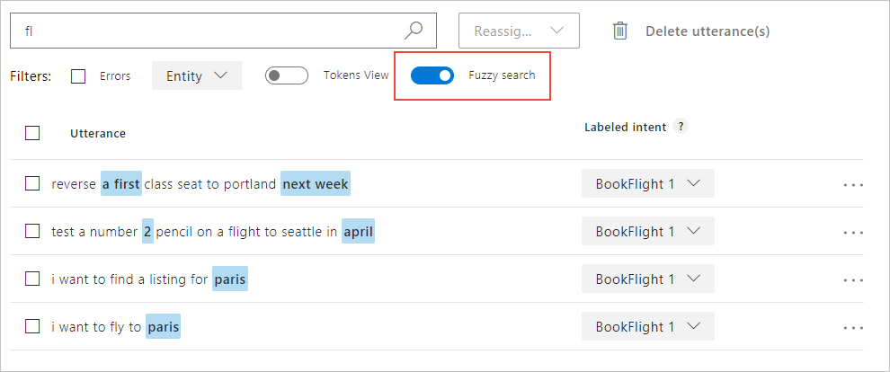

## Next steps

After labeling utterances in your intents, now your next task is to create a [composite entity](Add-entities.md).
