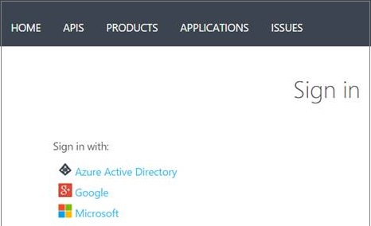
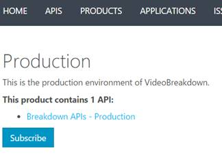

# Use Azure Video Indexer API

Video Indexer consolidates various audio and video artificial intelligence (AI) technologies offered by Microsoft in one integrated service, making development simpler. The APIs are designed to enable developers to focus on consuming Media AI technologies without worrying about scale, global reach, availability, and reliability of cloud platform. You can use the API to upload your files, get detailed video insights, get URLs of insight and player widgets in order to embed them into your application, and other tasks.

This article shows how the developers can take advantage of the [Video Indexer API](https://videobreakdown.portal.azure-api.net/docs/services/582074fb0dc56116504aed75/operations/5857caeb0dc5610f9ce979e4). To read a more detailed overview of the Video Indexer service, see the [overview](video-indexer-overview.md) article.

## Subscribe to the API

1. Sign in.

    To start developing with Video Indexer, you must first Sign In to the [Video Indexer](https://videobreakdown.portal.azure-api.net) portal. 
    
    

    If signing in with an AAD account (for example, alice@contoso.onmicrosoft.com) you must go through two preliminary steps: 
    
    1.  Contact us at visupport@microsoft.com to register your AAD organization’s domain (contoso.onmicrosoft.com).
    2.  Your AAD organization’s admin must first sign in to grant the portal permissions to your org. To do this, the organization's admin must navigate to https://videobreakdown.portal.azure-api.net/signin-callback?provider=Aad, sign in and give consent.
    
2. Subscribe.

    Select the [Products](https://videobreakdown.portal.azure-api.net/products) tab. Then, select Production and subscribe. 
    
    
    
    Once you subscribe, you will be able to see your subscription and your primary and secondary keys. The keys should be protected. The keys should only be used by your server code. They should not be available on the client side (.js, .html, etc.).

    

3.  Start developing.
 
    You are ready to start integrating with the API. Find [the detailed description of each Video Indexer REST API](https://videobreakdown.portal.azure-api.net/docs/services/582074fb0dc56116504aed75/operations/5857caeb0dc5610f9ce979e4).

## Recommendations

This section lists some recommendations when using Video Indexer API.

- If you are planning to upload a video, it is recommended to place the file in some public network location (for example, OneDrive). Get the link to the video and provide the URL as the upload file param. 
- When you call the API that gets video breakdowns for the specified video, you get a detailed JSON output as the response content. [See details about the returned JSON in this topic](video-indexer-output-json.md).

## Code sample

The following C# code snippet demonstrates the usage of all the Video Indexer APIs together.

```csharp
    var apiUrl = "https://videobreakdown.azure-api.net/Breakdowns/Api/Partner/Breakdowns";
    var client = new HttpClient();
    client.DefaultRequestHeaders.Add("Ocp-Apim-Subscription-Key", "...");

    var content = new MultipartFormDataContent();

    Console.WriteLine("Uploading...");
    var videoUrl = "https:/...";
    var result = client.PostAsync(apiUrl + "?name=some_name&description=some_description&privacy=private&partition=some_partition&videoUrl=" + videoUrl, content).Result;
    var json = result.Content.ReadAsStringAsync().Result;

    Console.WriteLine();
    Console.WriteLine("Uploaded:");
    Console.WriteLine(json);

    var id = JsonConvert.DeserializeObject<string>(json);

    while (true)
    {
        Thread.Sleep(10000);

        result = client.GetAsync(string.Format(apiUrl + "/{0}/State", id)).Result;
        json = result.Content.ReadAsStringAsync().Result;

        Console.WriteLine();
        Console.WriteLine("State:");
        Console.WriteLine(json);

        dynamic state = JsonConvert.DeserializeObject(json);
        if (state.state != "Uploaded" && state.state != "Processing")
        {
            break;
        }
    }

    result = client.GetAsync(string.Format(apiUrl + "/{0}", id)).Result;
    json = result.Content.ReadAsStringAsync().Result;
    Console.WriteLine();
    Console.WriteLine("Full JSON:");
    Console.WriteLine(json);

    result = client.GetAsync(string.Format(apiUrl + "/Search?id={0}", id)).Result;
    json = result.Content.ReadAsStringAsync().Result;
    Console.WriteLine();
    Console.WriteLine("Search:");
    Console.WriteLine(json);

    result = client.GetAsync(string.Format(apiUrl + "/{0}/InsightsWidgetUrl", id)).Result;
    json = result.Content.ReadAsStringAsync().Result;
    Console.WriteLine();
    Console.WriteLine("Insights Widget url:");
    Console.WriteLine(json);

    result = client.GetAsync(string.Format(apiUrl + "/{0}/PlayerWidgetUrl", id)).Result;
    json = result.Content.ReadAsStringAsync().Result;
    Console.WriteLine();
    Console.WriteLine("Player token:");
    Console.WriteLine(json);
```

## Next steps

[Examine details of the output JSON](video-indexer-output-json.md).

## See also

[Video Indexer overview](video-indexer-overview.md)
