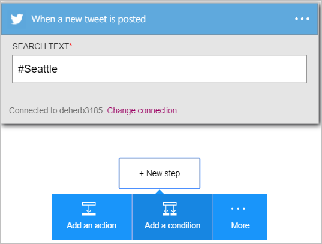
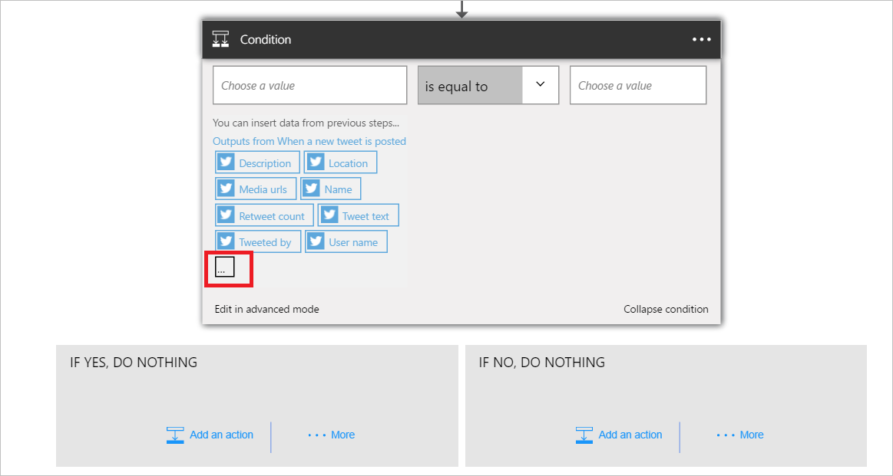
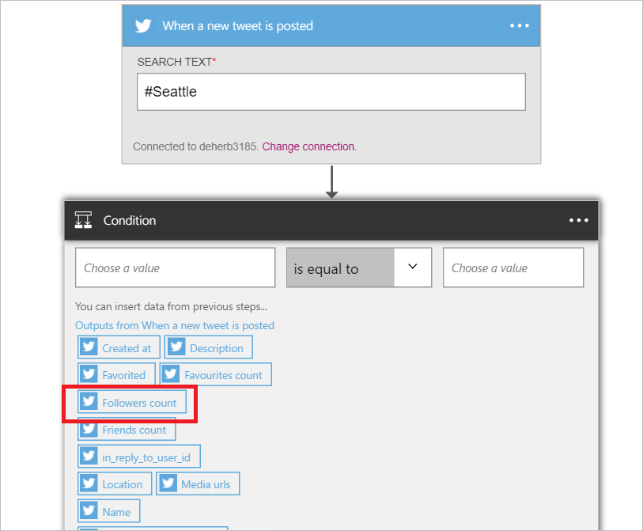
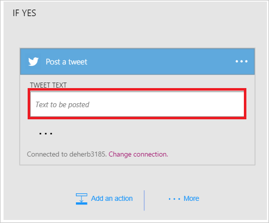

# Get started with the Twitter connector
With the Twitter connector you can:

* Post tweets and get tweets
* Access timelines, friends and followers
* Perform any of the other actions and triggers described below  

To use [any connector](apis-list.md), you first need to create a logic app. You can get started by [creating a logic app now](../logic-apps/quickstart-create-first-logic-app-workflow.md).  

## Connect to Twitter
Before your logic app can access any service, you first need to create a *connection* to the service. A [connection](connectors-overview.md) provides connectivity between a logic app and another service.  

### Create a connection to Twitter
> [!INCLUDE [Steps to create a connection to Twitter](../../includes/connectors-create-api-twitter.md)]
> 
> 

## Use a Twitter trigger
A trigger is an event that can be used to start the workflow defined in a logic app. [Learn more about triggers](../logic-apps/logic-apps-overview.md#logic-app-concepts).

In this example, I will show you how to use the **When a new tweet is posted**  trigger to search for #Seattle and, if #Seattle is found, update a file in Dropbox with the text from the tweet. In an enterprise example, you could search for the name of your company and update a SQL database with the text from the tweet.

1. Enter *twitter* in the search box on the logic apps designer then select the **Twitter - When a new tweet is posted**  trigger   
     
2. Enter *#Seattle* in the **Search Text** control  
    

At this point, your logic app has been configured with a trigger that will begin a run of the other triggers and actions in the workflow. 

> [!NOTE]
> For a logic app to be functional, it must contain at least one trigger and one action. Follow the steps in the next section to add an action.  
> 
> 

## Add a condition
Since we are only interested in tweets from users with more than 50 users, a condition that confirms the number of followers must first be added to the logic app.  

1. Select **+ New step** to add the action you would like to take when #Seattle is found in a new tweet  
     
2. Select the **Add a condition** link.  
      
   This opens the **Condition** control where you can check conditions such as *is equal to*, *is less than*, *is greater than*, *contains*, etc.  
      
3. Select the **Choose a value** control.  
   In this control, you can select one or more of the properties from any previous actions or triggers as the value whose condition will be evaluated to true or false.
      
4. Select the **...** to expand the list of properties so you can see all the properties that are available.        
      
5. Select the **Followers count** property.    
      
6. Notice the Followers count property is now in the value control.    
      
7. Select **is greater than** from the operators list.    
      
8. Enter 50 as the operand for the *is greater than* operator.  
   The condition is now added. Save your work using the **Save** link on the menu above.    
      

## Use a Twitter action
An action is an operation carried out by the workflow defined in a logic app. [Learn more about actions](../logic-apps/logic-apps-overview.md#logic-app-concepts).  

Now that you have added a trigger, follow these steps to add an action that will post a new tweet with the contents of the tweets found by the trigger. For the purposes of this walk-through only tweets from users with more than 50 followers will be posted.  

In the next step, you will add a Twitter action that will post a tweet using some of the properties of each tweet that has been posted by a user who has more than 50 followers.  

1. Select **Add an action**. This opens the search control where you can search for other actions and triggers.  
      
2. Enter *twitter* into the search box then select the **Twitter - Post a tweet** action. This opens the **Post a tweet** control where you will enter all details for the tweet being posted.      
      
3. Select the **Tweet text** control. All outputs from previous actions and triggers in the logic app are now visible. You can select any of these and use them as part of the tweet text of the new tweet.     
      
4. Select **User name**   
5. Enter *says:* in the tweet text control. Do this just after User name.  
6. Select *Tweet text*.       
      
7. Save your work and send a tweet with the #Seattle hashtag to activate your workflow.  

## Connector-specific details

View any triggers and actions defined in the swagger, and also see any limits in the [connector details](/connectors/twitterconnector/). 

## Next steps
[Create a logic app](../logic-apps/quickstart-create-first-logic-app-workflow.md)

