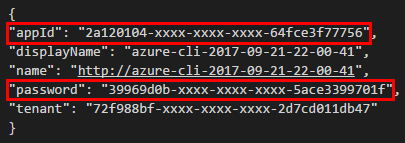
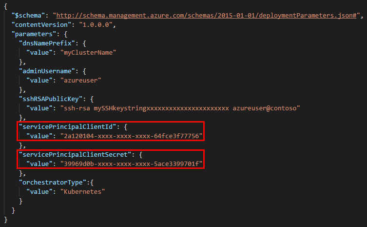

# Set up an Azure AD service principal for a Kubernetes cluster in Container Service

[!INCLUDE [aks-preview-redirect.md](../../../includes/aks-preview-redirect.md)]

In Azure Container Service, a Kubernetes cluster requires an [Azure Active Directory service principal](../../active-directory/develop/active-directory-application-objects.md) to interact with Azure APIs. The service principal is needed to dynamically manage
resources such as [user-defined routes](../../virtual-network/virtual-networks-udr-overview.md)
and the [Layer 4 Azure Load Balancer](../../load-balancer/load-balancer-overview.md).


This article shows different options to set up a service principal for your Kubernetes cluster. For example, if you installed and set up the [Azure CLI 2.0](/cli/azure/install-az-cli2), you can run the [`az acs create`](/cli/azure/acs#az_acs_create) command to create the Kubernetes cluster and the service principal at the same time.


## Requirements for the service principal

You can use an existing Azure AD service principal that meets the following requirements, or create a new one.

* **Scope**: Resource group

* **Role**: Contributor

* **Client secret**: Must be a password. Currently, you can't use a service principal set up for certificate authentication.

> [!IMPORTANT]
> To create a service principal, you must have permissions to register an application with your Azure AD tenant, and to assign the application to a role in your subscription. To see if you have the required permissions, [check in the Portal](../../azure-resource-manager/resource-group-create-service-principal-portal.md#required-permissions).
>

## Option 1: Create a service principal in Azure AD

If you want to create an Azure AD service principal before you deploy your Kubernetes cluster, Azure provides several methods.

The following example commands show you how to do this with the [Azure CLI 2.0](../../azure-resource-manager/resource-group-authenticate-service-principal-cli.md). You can alternatively create a service principal using [Azure PowerShell](../../azure-resource-manager/resource-group-authenticate-service-principal.md), the [portal](../../azure-resource-manager/resource-group-create-service-principal-portal.md), or other methods.

```azurecli
az login

az account set --subscription "mySubscriptionID"

az group create --name "myResourceGroup" --location "westus"

az ad sp create-for-rbac --role="Contributor" --scopes="/subscriptions/<subscriptionID>/resourceGroups/<resourceGroupName>"
```

Output is similar to the following (shown here redacted):



Highlighted are the **client ID** (`appId`) and the **client secret** (`password`) that you use as service principal parameters for cluster deployment.


### Specify service principal when creating the Kubernetes cluster

Provide the **client ID** (also called the `appId`, for Application ID) and **client secret** (`password`) of an existing service principal as parameters when you create the Kubernetes cluster. Make sure the service principal meets the requirements at the beginning this article.

You can specify these parameters when deploying the Kubernetes cluster using the [Azure Command-Line Interface (CLI) 2.0](container-service-kubernetes-walkthrough.md), [Azure portal](../dcos-swarm/container-service-deployment.md), or other methods.

>[!TIP]
>When specifying the **client ID**, be sure to use the `appId`, not the `ObjectId`, of the service principal.
>

The following example shows one way to pass the parameters with the Azure CLI 2.0. This example uses the [Kubernetes quickstart template](https://github.com/Azure/azure-quickstart-templates/tree/master/101-acs-kubernetes).

1. [Download](https://raw.githubusercontent.com/Azure/azure-quickstart-templates/master/101-acs-kubernetes/azuredeploy.parameters.json) the template parameters file `azuredeploy.parameters.json` from GitHub.

2. To specify the service principal, enter values for `servicePrincipalClientId` and `servicePrincipalClientSecret` in the file. (You also need to provide your own values for `dnsNamePrefix` and `sshRSAPublicKey`. The latter is the SSH public key to access the cluster.) Save the file.

    

3. Run the following command, using `--parameters` to set the path to the azuredeploy.parameters.json file. This command deploys the cluster in a resource group you create called `myResourceGroup` in the West US region.

    ```azurecli
    az login

    az account set --subscription "mySubscriptionID"

    az group create --name "myResourceGroup" --location "westus"

    az group deployment create -g "myResourceGroup" --template-uri "https://raw.githubusercontent.com/Azure/azure-quickstart-templates/master/101-acs-kubernetes/azuredeploy.json" --parameters @azuredeploy.parameters.json
    ```


## Option 2: Generate a service principal when creating the cluster with `az acs create`

If you run the [`az acs create`](/cli/azure/acs#az_acs_create) command to create the Kubernetes cluster, you have the option to generate a service principal automatically.

As with other Kubernetes cluster creation options, you can specify parameters for an existing service principal when you run `az acs create`. However, when you omit these parameters, the Azure CLI creates one automatically for use with Container Service. This takes place transparently during the deployment.

The following command creates a Kubernetes cluster and generates both SSH keys and service principal credentials:

```console
az acs create -n myClusterName -d myDNSPrefix -g myResourceGroup --generate-ssh-keys --orchestrator-type kubernetes
```

> [!IMPORTANT]
> If your account doesn't have the Azure AD and subscription permissions to create a service principal, the command generates an error similar to `Insufficient privileges to complete the operation.`
>

## Additional considerations

* If you don't have permissions to create a service principal in your subscription, you might need to ask your Azure AD or subscription administrator to assign the necessary permissions, or ask them for a service principal to use with Azure Container Service.

* The service principal for Kubernetes is a part of the cluster configuration. However, don't use the identity to deploy the cluster.

* Every service principal is associated with an Azure AD application. The service principal for a Kubernetes cluster can be associated with any valid Azure AD application name (for example: `https://www.contoso.org/example`). The URL for the application doesn't have to be a real endpoint.

* When specifying the service principal **Client ID**, you can use the value of the `appId` (as shown in this article) or the corresponding service principal `name` (for example,`https://www.contoso.org/example`).

* On the master and agent VMs in the Kubernetes cluster, the service principal credentials are stored in the file `/etc/kubernetes/azure.json`.

* When you use the `az acs create` command to generate the service principal automatically, the service principal credentials are written to the file `~/.azure/acsServicePrincipal.json` on the machine used to run the command.

* When you use the `az acs create` command to generate the service principal automatically, the service principal can also authenticate with an [Azure container registry](../../container-registry/container-registry-intro.md) created in the same subscription.

* Service principal credentials can expire, causing your cluster nodes to enter a **NotReady** state. See the [Credential expiration](#credential-expiration) section for mitigation information.

## Credential expiration

Unless you specify a custom validity window with the `--years` parameter when you create a service principal, its credentials are valid for 1 year from time of creation. When the credential expires, your cluster nodes might enter a **NotReady** state.

To check the expiration date of a service principal, execute the [az ad app show](/cli/azure/ad/app#az_ad_app_show) command with the `--debug` parameter, and look for the `endDate` value of `passwordCredentials` near the bottom of the output:

```azurecli
az ad app show --id <appId> --debug
```

Output (shown here truncated):

```json
...
"passwordCredentials":[{"customKeyIdentifier":null,"endDate":"2018-11-20T23:29:49.316176Z"
...
```

If your service principal credentials have expired, use the [az ad sp reset-credentials](/cli/azure/ad/sp#az_ad_sp_reset_credentials) command to update the credentials:

```azurecli
az ad sp reset-credentials --name <appId>
```

Output:

```json
{
  "appId": "4fd193b0-e6c6-408c-a21a-803441ad2851",
  "name": "4fd193b0-e6c6-408c-a21a-803441ad2851",
  "password": "404203c3-0000-0000-0000-d1d2956f3606",
  "tenant": "72f988bf-0000-0000-0000b-2d7cd011db47"
}
```

Then, update `/etc/kubernetes/azure.json` with the new credentials on all cluster nodes, and restart the nodes.

## Next steps

* [Get started with Kubernetes](container-service-kubernetes-walkthrough.md) in your container service cluster.

* To troubleshoot the service principal for Kubernetes, see the [ACS Engine documentation](https://github.com/Azure/acs-engine/blob/master/docs/kubernetes.md#troubleshooting).