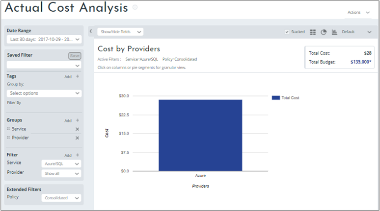
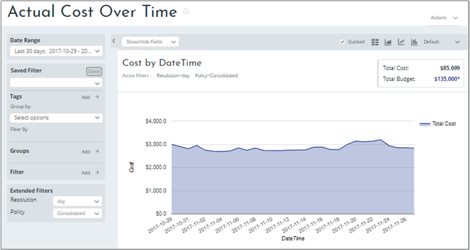
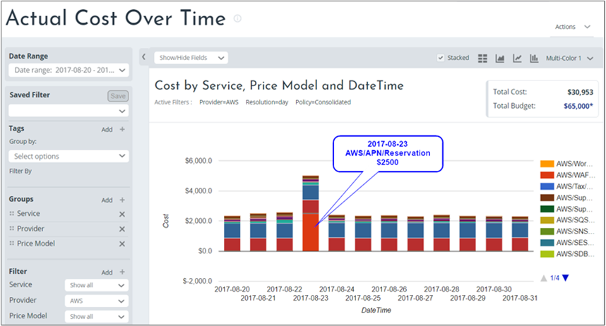
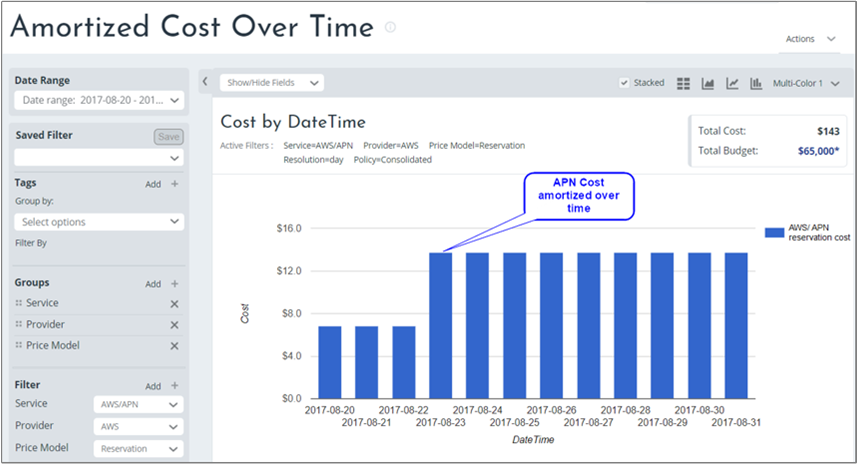
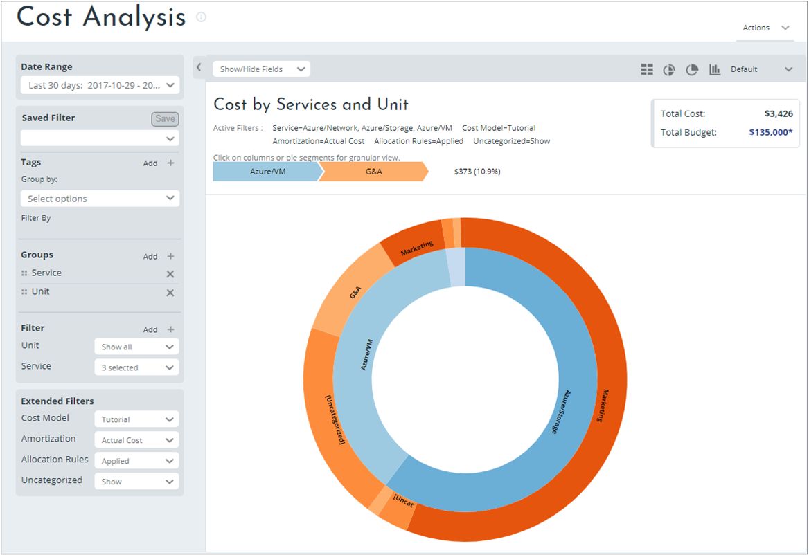
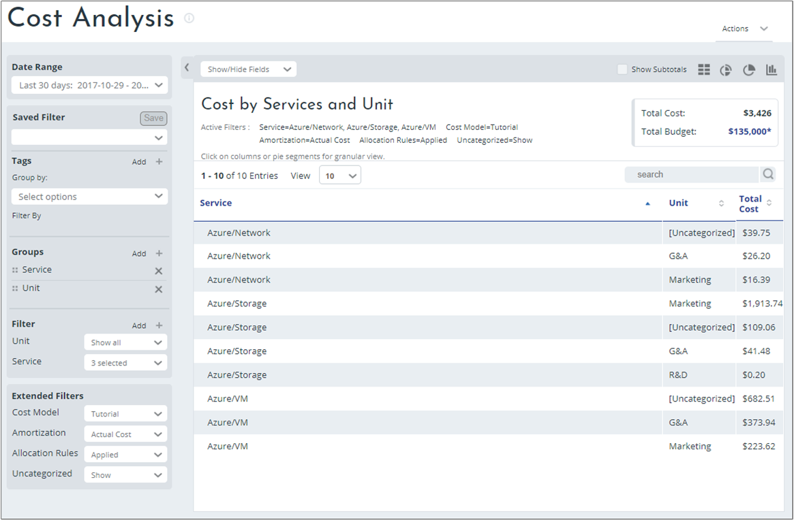
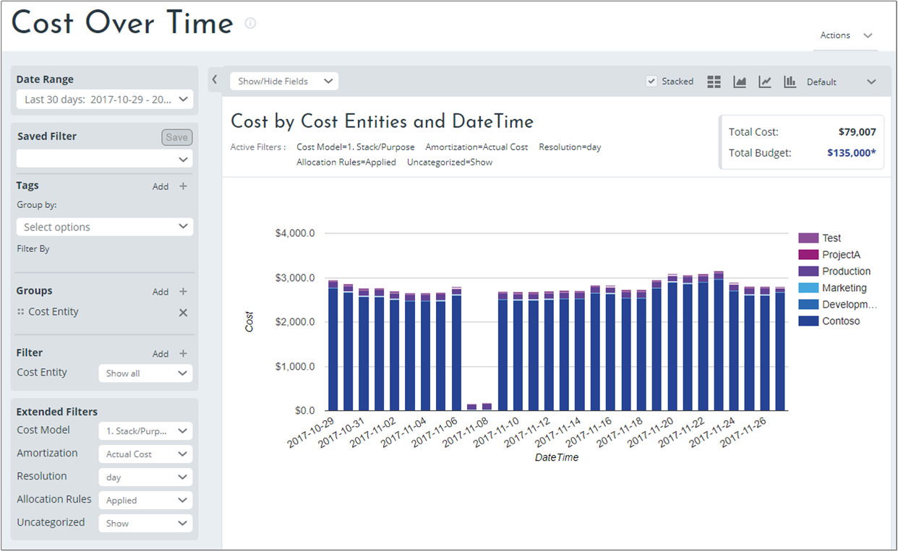

# Use Cost Management reports

This article describes how to use various Cost Management reports in the Cloudyn portal. Most Cloudyn reports are intuitive and have a uniform look and feel. For an overview about Cloudyn reports, see [Understanding cost reports](understading-cost-reports.md). The article also describes various options and fields used in most reports.

## Cost Analysis reports

Cost Analysis reports display billing data from your Cloud providers. Using the reports, you can group and drill into various data segments itemized in the billing file. The reports enable granular cost navigation across the cloud vendors' raw billing data.

Cost Analysis reports do not group costs by tags. Tag-based reporting is only available in the Cost Allocation reports set after you create a cost model using Cost Allocation 360.

### Actual Cost Analysis

The Actual Cost Analysis report shows your main cost contributors, including ongoing costs and one-time fees.

 Use the Actual Cost Analysis report to:

- Analyze and monitor actual costs spent during a specified time frame
- Schedule a threshold alert
- Analyze showback and chargeback costs

#### To use the Actual Cost Analysis report

At a minimum, perform the following steps. You can also use other options and fields.

1. Select a date range.
2. Select a filter.

You can right-click report results to drill into them and view more detailed information.

### Actual Cost Over Time

The Actual Cost Over Time report is a standard cost analysis report distributing cost over a defined time resolution. The report displays spending over time to allow you to observe trends and detect spending irregularities. This report shows your main cost contributors including ongoing costs and one-time reserved instance fees that are being spent during a selected time frame.

Use the Actual Cost Over Time report to:

- See cost trends over time.
- Find irregularities in cost.
- Find all cost-related questions related to Amazon Web Services.

#### To use the Actual Cost Over Time report:

At a minimum, perform the following steps. You can also use other options and fields.

- Select a date range.

For example, you can select groups to view their cost over time. And then add filters to narrow your results.

### Amortized Cost reports

This set of amortized cost reports shows linearized non-usage based service fees, or one-time payable costs and spread their cost over time evenly during their lifespan.

For example, one-time fees might include:

- Annual support fees
- Annual security component fees
- Reserved Instances purchase fees
- Some Azure Marketplace items

In the billing file, one-time fees are characterized when the service consumption start and end dates, or timestamp, have equal values. Cloudyn then recognizes them as one-time fees that can be amortized. Other consumption-based services with on-demand usage costs cannot be amortized.

To illustrate amortized costs, review the following example image of an Actual Cost Over time report. In the example, it shows a cost spike on August 23. It might seem an anomaly compared to the usual daily cost trend. Root cause analysis and data navigation identified this cost as an annual AWS service APN reservation, which is a one-time fee purchased and billed on that day. You can see how this cost is amortized in the next section.

#### To use the Amortized Cost Over Time report:

At a minimum, perform the following steps. You can also use other options and fields.

1. Select a date range.
2. Select a Service and a Provider.

Carrying-forward the previous example, you can see that the one-time cost is now amortized in the following image:

The preceding image shows the amortized cost for the APN reservation cost over time. This report shows the one-time fee amortization and the APN cost as an annual reservation purchase. The APN cost is spread evenly on a daily basis as 1/365th of the reservation up-front cost.

## Cost Allocation Analysis reports

Cost Allocation Analysis reports are available after you create a cost model using Cost Allocation 360. Cloudyn processes cost/billing data and matches the data to the usage and tag data of your cloud accounts. To match the data, Cloudyn requires access to your usage data. Accounts that are missing credentials, are labeled as uncategorized resources.

### Cost Analysis report

The Cost Analysis report provides insight into your cloud consumption and spending during a selected time frame. The policies set in the Cost Allocation Manager are used in the Cost Analysis report.

How does Cloudyn calculate this report?

Cloudyn ensures allocation retains the integrity of each linked account by applying Account Affinity. Affinity ensures an account that does not use a specific service does not have any costs of this service allocated to it. The costs accrued in that account remain in that account and are not calculated by the allocation policies. For example, you might have five linked accounts. If only three of them use storage services, then the cost of storage services is only allocated across tags in the three accounts.

 Use the Cost Analysis report to:

- Display an aggregated view of your entire deployment for a specific time frame.
- View costs by tag categories based on policies created in the cost model.

#### To use the Cost Analysis report:

1. Select a date range.
2. Add tags, as needed.
3. Add groups.
4. Choose a cost model that you created previously.

The following image shows an example Cost Analysis report in sunburst format. The rings show groups. The outer ring shows Service and the inner circle shows Unit.

Here's example of the same information in a table view.

### Cost Over Time report

The Cost Over Time report displays spending over time so you can observe trends and detect irregularities in your deployment. It essentially shows costs distributed over a defined period. The report includes your main cost contributors including ongoing costs and one-time reserved instance fees that are being spent during a selected time frame. Policies set in Cost Manager 360° can be used in this report.

Use the Cost Over Time report to:

- See changes over time and which influences change from one day (or date range) to the next.
- Analyze costs over time for a specific instance.
- Understand why there was a cost increase for a specific instance.

#### To use the Cost Over Time report:

1. Select a date range.
2. Add tags, as needed.
3. Add groups.
4. Choose a cost model that you created previously.
5. Select actual costs or amortized costs.
6. Choose whether to apply allocation rules to view raw billing data view or to recalculated cost by Cloudyn view.

Here's an example of the report.

## Next steps

- If you haven't already completed the first tutorial for Cost Management, read it at [Review usage and costs](tutorial-review-usage.md).
