# Invoke an SSIS package using stored procedure activity in Azure Data Factory
This article describes how to invoke an SSIS package from an Azure Data Factory pipeline by using a stored procedure activity. 

> [!NOTE]
> This article applies to version 2 of Data Factory, which is currently in preview. If you are using version 1 of the Data Factory service, which is generally available (GA), see [Invoke SSIS packages using stored procedure activity in version 1](v1/how-to-invoke-ssis-package-stored-procedure-activity.md).

## Prerequisites

### Azure SQL Database 
The walkthrough in this article uses an Azure SQL database that hosts the SSIS catalog. You can also use an Azure SQL Managed Instance (Private Preview).

## Create an Azure-SSIS integration runtime
Create an Azure-SSIS integration runtime if you don't have one by following the step-by-step instruction in the [Tutorial: Deploy SSIS packages](tutorial-create-azure-ssis-runtime-portal.md).

## Data Factory UI (Azure portal)
In this section, you use Data Factory UI to create a Data Factory pipeline with a stored procedure activity that invokes an SSIS package.

### Create a data factory
First step is to create a data factory by using the Azure portal. 

1. Launch **Microsoft Edge** or **Google Chrome** web browser. Currently, Data Factory UI is supported only in Microsoft Edge and Google Chrome web browsers.
2. Navigate to the [Azure portal](https://portal.azure.com). 
3. Click **New** on the left menu, click **Data + Analytics**, and click **Data Factory**. 
   
   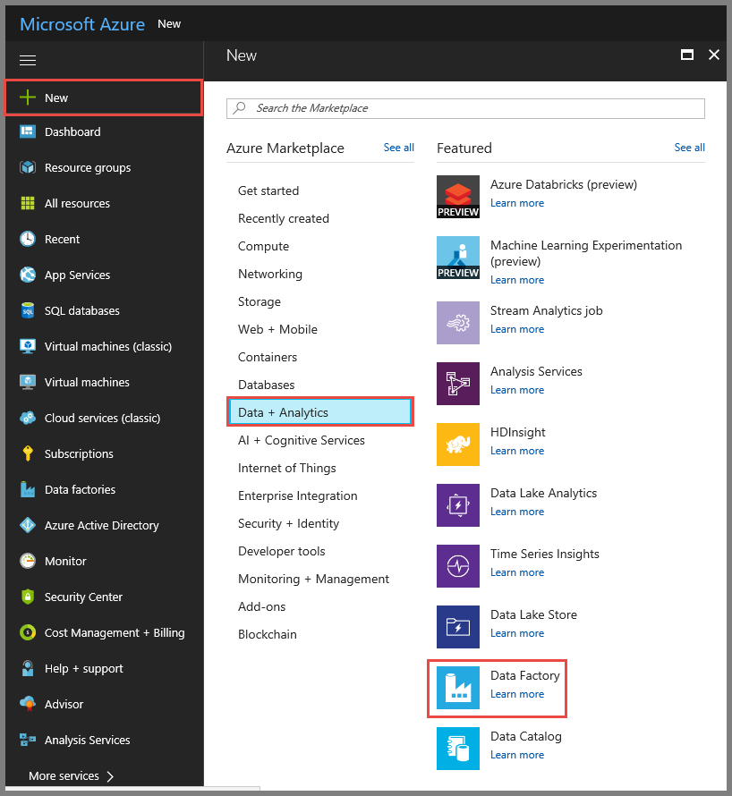
2. In the **New data factory** page, enter **ADFTutorialDataFactory** for the **name**. 
      
     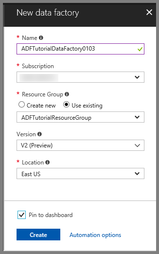
 
   The name of the Azure data factory must be **globally unique**. If you see the following error for the name field, change the name of the data factory (for example, yournameADFTutorialDataFactory). See [Data Factory - Naming Rules](naming-rules.md) article for naming rules for Data Factory artifacts.
  
     
3. Select your Azure **subscription** in which you want to create the data factory. 
4. For the **Resource Group**, do one of the following steps:
     
      - Select **Use existing**, and select an existing resource group from the drop-down list. 
      - Select **Create new**, and enter the name of a resource group.   
         
    To learn about resource groups, see [Using resource groups to manage your Azure resources](../azure-resource-manager/resource-group-overview.md).  
4. Select **V2 (Preview)** for the **version**.
5. Select the **location** for the data factory. Only locations that are supported by Data Factory are shown in the drop-down list. The data stores (Azure Storage, Azure SQL Database, etc.) and computes (HDInsight, etc.) used by data factory can be in other locations.
6. Select **Pin to dashboard**.     
7. Click **Create**.
8. On the dashboard, you see the following tile with status: **Deploying data factory**. 

    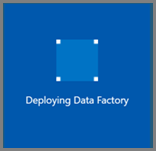
9. After the creation is complete, you see the **Data Factory** page as shown in the image.
   
    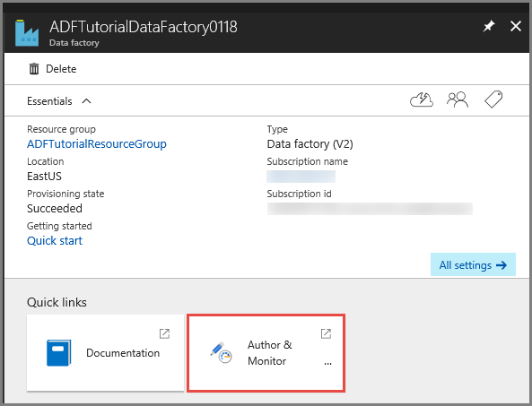
10. Click **Author & Monitor** tile to launch the Azure Data Factory user interface (UI) application in a separate tab. 

### Create a pipeline with stored procedure activity
In this step, you use the Data Factory UI to create a pipeline. You add a stored procedure activity to the pipeline and configure it to run the SSIS package by using the sp_executesql stored procedure. 

1. In the get started page, click **Create pipeline**: 

    
2. In the **Activities** toolbox, expand **SQL Database**, and drag-drop **Stored Procedure** activity to the pipeline designer surface. 

    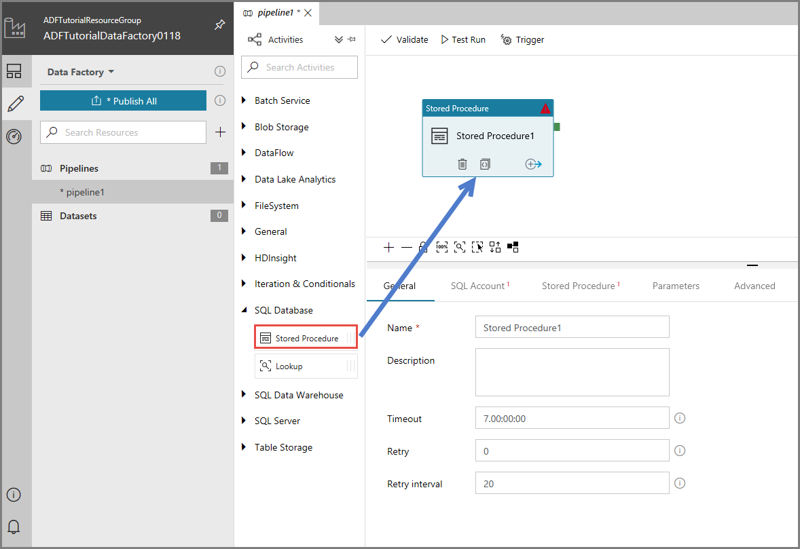
3. In the properties window for the stored procedure activity, switch to the **SQL Account** tab, and click **+ New**. You create a connection to the Azure SQL database that hosts the SSIS Catalog (SSIDB database). 
   
    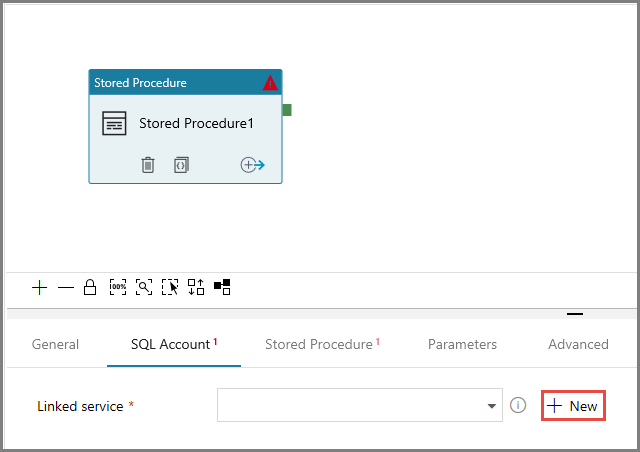
4. In the **New Linked Service** window, do the following steps: 

    1. Select **Azure SQL Database** for **Type**.
    2. Select your Azure SQL server that hosts the SSISDB database for the **Server name** field.
    3. Select **SSISDB** for **Database name**.
    4. For **User name**, enter the name of user who has access to the database.
    5. For **Password**, enter the password of the user. 
    6. Test the connection to the database by clicking **Test connection** button.
    7. Save the linked service by clicking the **Save** button. 

        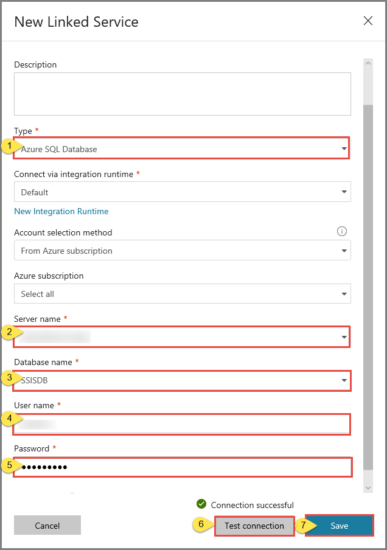
5. In the properties window, switch to the **Stored Procedure** tab from the **SQL Account** tab, and do the following steps: 

    1. For the **Stored procedure name** field, Enter `sp_executesql`. 
    2. Click **+ New** in the **Stored procedure parameters** section. 
    3. For **name** of the parameter, enter **stmt**. 
    4. For **type** of the parameter, enter **String**. 
    5. For **value** of the parameter, enter the following SQL query:

        In the SQL query, specify the right values for the **folder_name**, **project_name**, and **package_name** parameters. 

        ```sql
        DECLARE @return_value INT, @exe_id BIGINT, @err_msg NVARCHAR(150)    EXEC @return_value=[SSISDB].[catalog].[create_execution] @folder_name=N'<FOLDER name in SSIS Catalog>', @project_name=N'<PROJECT name in SSIS Catalog>', @package_name=N'<PACKAGE name>.dtsx', @use32bitruntime=0, @runinscaleout=1, @useanyworker=1, @execution_id=@exe_id OUTPUT    EXEC [SSISDB].[catalog].[set_execution_parameter_value] @exe_id, @object_type=50, @parameter_name=N'SYNCHRONIZED', @parameter_value=1    EXEC [SSISDB].[catalog].[start_execution] @execution_id=@exe_id, @retry_count=0    IF(SELECT [status] FROM [SSISDB].[catalog].[executions] WHERE execution_id=@exe_id)<>7 BEGIN SET @err_msg=N'Your package execution did not succeed for execution ID: ' + CAST(@exe_id AS NVARCHAR(20)) RAISERROR(@err_msg,15,1) END
        ```

        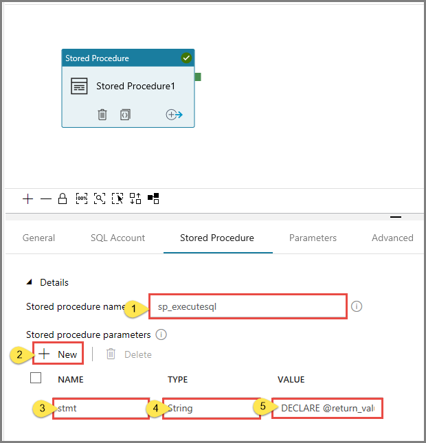
6. To validate the pipeline configuration, click **Validate** on the toolbar. To close the **Pipeline Validation Report**, click **>>**.

    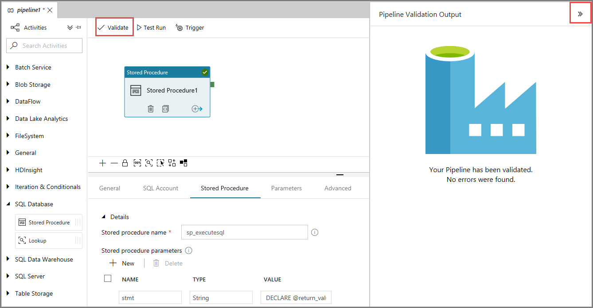
7. Publish the pipeline to Data Factory by clicking **Publish All** button. 

    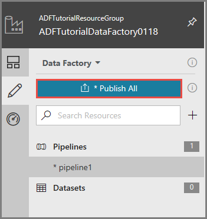    

### Run and monitor the pipeline
In this section, you trigger a pipeline run and then monitor it. 

1. To trigger a pipeline run, click **Trigger** on the toolbar, and click **Trigger now**. 

    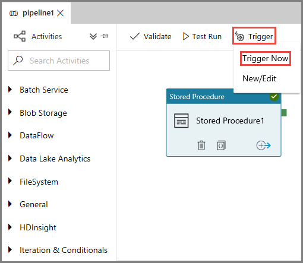
2. Switch to the **Monitor** tab on the left. You see the pipeline run and its status along with other information (such as Run Start time). To refresh the view, click **Refresh**.

    
3. Click **View Activity Runs** link in the **Actions** column. You see only one activity run as the pipeline has only one activity (stored procedure activity).

    
4.You can run the following **query** against the SSISDB database in your Azure SQL server to verify that the package executed. 

    ```sql
    select * from catalog.executions
    ```

    


> [!NOTE]
> You can also create a scheduled trigger for your pipeline so that the pipeline runs on a schedule (hourly, daily, etc.). For an example, see [Create a data factory - Data Factory UI](quickstart-create-data-factory-portal.md#trigger-the-pipeline-on-a-schedule).

## Azure PowerShell
In this section, you use Azure PowerShell to create a Data Factory pipeline with a stored procedure activity that invokes an SSIS package. 

Install the latest Azure PowerShell modules by following instructions in [How to install and configure Azure PowerShell](/powershell/azure/install-azurerm-ps). 

### Create a data factory
You can either use the same data factory that has the Azure-SSIS IR or create a separate data factory. The following procedure provides steps to create a data factory. You create a pipeline with a stored procedure activity in this data factory. The stored procedure activity executes a stored procedure in the SSISDB database to run your SSIS package. 

1. Define a variable for the resource group name that you use in PowerShell commands later. Copy the following command text to PowerShell, specify a name for the [Azure resource group](../azure-resource-manager/resource-group-overview.md) in double quotes, and then run the command. For example: `"adfrg"`. 
   
     ```powershell
    $resourceGroupName = "ADFTutorialResourceGroup";
    ```

    If the resource group already exists, you may not want to overwrite it. Assign a different value to the `$ResourceGroupName` variable and run the command again
2. To create the Azure resource group, run the following command: 

    ```powershell
    $ResGrp = New-AzureRmResourceGroup $resourceGroupName -location 'eastus'
    ``` 
    If the resource group already exists, you may not want to overwrite it. Assign a different value to the `$ResourceGroupName` variable and run the command again. 
3. Define a variable for the data factory name. 

    > [!IMPORTANT]
    >  Update the data factory name to be globally unique. 

    ```powershell
    $DataFactoryName = "ADFTutorialFactory";
    ```

5. To create the data factory, run the following **Set-AzureRmDataFactoryV2** cmdlet, using the Location and ResourceGroupName property from the $ResGrp variable: 
    
    ```powershell       
    $DataFactory = Set-AzureRmDataFactoryV2 -ResourceGroupName $ResGrp.ResourceGroupName -Location $ResGrp.Location -Name $dataFactoryName 
    ```

Note the following points:

* The name of the Azure data factory must be globally unique. If you receive the following error, change the name and try again.

    ```
    The specified Data Factory name 'ADFv2QuickStartDataFactory' is already in use. Data Factory names must be globally unique.
    ```
* To create Data Factory instances, the user account you use to log in to Azure must be a member of **contributor** or **owner** roles, or an **administrator** of the Azure subscription.
* Currently, Data Factory version 2 allows you to create data factories only in the East US, East US2, and West Europe regions. The data stores (Azure Storage, Azure SQL Database, etc.) and computes (HDInsight, etc.) used by data factory can be in other regions.

### Create an Azure SQL Database linked service
Create a linked service to link your Azure SQL database that hosts the SSIS catalog to your data factory. Data Factory uses information in this linked service to connect to SSISDB database, and executes a stored procedure to run an SSIS package. 

1. Create a JSON file named **AzureSqlDatabaseLinkedService.json** in **C:\ADF\RunSSISPackage** folder with the following content: 

	> [!IMPORTANT]
	> Replace &lt;servername&gt;, &lt;username&gt;, and &lt;password&gt; with values of your Azure SQL Database before saving the file.

    ```json
    {
        "name": "AzureSqlDbLinkedService",
        "properties": {
            "type": "AzureSqlDatabase",
            "typeProperties": {
                "connectionString": {
                    "type": "SecureString",
                    "value": "Server=tcp:<servername>.database.windows.net,1433;Database=SSISDB;User ID=<username>;Password=<password>;Trusted_Connection=False;Encrypt=True;Connection Timeout=30"
                }
            }
        }
    }
    ```

2. In **Azure PowerShell**, switch to the **C:\ADF\RunSSISPackage** folder.

3. Run the **Set-AzureRmDataFactoryV2LinkedService** cmdlet to create the linked service: **AzureSqlDatabaseLinkedService**. 

    ```powershell
    Set-AzureRmDataFactoryV2LinkedService -DataFactoryName $DataFactory.DataFactoryName -ResourceGroupName $ResGrp.ResourceGroupName -Name "AzureSqlDatabaseLinkedService" -File ".\AzureSqlDatabaseLinkedService.json"
    ```

### Create a pipeline with stored procedure activity 
In this step, you create a pipeline with a stored procedure activity. The activity invokes the sp_executesql stored procedure to run your SSIS package. 

1. Create a JSON file named **RunSSISPackagePipeline.json** in the **C:\ADF\RunSSISPackage** folder with the following content:

    > [!IMPORTANT]
	> Replace &lt;FOLDER NAME&gt;, &lt;PROJECT NAME&gt;, &lt;PACKAGE NAME&gt; with names of folder, project, and package in the SSIS catalog before saving the file. 

    ```json
    {
        "name": "RunSSISPackagePipeline",
        "properties": {
            "activities": [
                {
                    "name": "My SProc Activity",
                    "description":"Runs an SSIS package",
                    "type": "SqlServerStoredProcedure",
                    "linkedServiceName": {
                        "referenceName": "AzureSqlDbLinkedService",
                        "type": "LinkedServiceReference"
                    },
                    "typeProperties": {
                        "storedProcedureName": "sp_executesql",
                        "storedProcedureParameters": {
                            "stmt": {
                                "value": "DECLARE @return_value INT, @exe_id BIGINT, @err_msg NVARCHAR(150)    EXEC @return_value=[SSISDB].[catalog].[create_execution] @folder_name=N'<FOLDER NAME>', @project_name=N'<PROJECT NAME>', @package_name=N'<PACKAGE NAME>', @use32bitruntime=0, @runinscaleout=1, @useanyworker=1, @execution_id=@exe_id OUTPUT    EXEC [SSISDB].[catalog].[set_execution_parameter_value] @exe_id, @object_type=50, @parameter_name=N'SYNCHRONIZED', @parameter_value=1    EXEC [SSISDB].[catalog].[start_execution] @execution_id=@exe_id, @retry_count=0    IF(SELECT [status] FROM [SSISDB].[catalog].[executions] WHERE execution_id=@exe_id)<>7 BEGIN SET @err_msg=N'Your package execution did not succeed for execution ID: ' + CAST(@exe_id AS NVARCHAR(20)) RAISERROR(@err_msg,15,1) END"
                            }
                        }
                    }
                }
            ]
        }
    }
    ```

2. To create the pipeline: **RunSSISPackagePipeline**, Run the **Set-AzureRmDataFactoryV2Pipeline** cmdlet.

    ```powershell
    $DFPipeLine = Set-AzureRmDataFactoryV2Pipeline -DataFactoryName $DataFactory.DataFactoryName -ResourceGroupName $ResGrp.ResourceGroupName -Name "RunSSISPackagePipeline" -DefinitionFile ".\RunSSISPackagePipeline.json"
    ```

    Here is the sample output:

    ```
    PipelineName      : Adfv2QuickStartPipeline
    ResourceGroupName : <resourceGroupName>
    DataFactoryName   : <dataFactoryName>
    Activities        : {CopyFromBlobToBlob}
    Parameters        : {[inputPath, Microsoft.Azure.Management.DataFactory.Models.ParameterSpecification], [outputPath, Microsoft.Azure.Management.DataFactory.Models.ParameterSpecification]}
    ```

### Create a pipeline run
Use the **Invoke-AzureRmDataFactoryV2Pipeline** cmdlet to run the pipeline. The cmdlet returns the pipeline run ID for future monitoring.

```powershell
$RunId = Invoke-AzureRmDataFactoryV2Pipeline -DataFactoryName $DataFactory.DataFactoryName -ResourceGroupName $ResGrp.ResourceGroupName -PipelineName $DFPipeLine.Name
```

### Monitor the pipeline run

Run the following PowerShell script to continuously check the pipeline run status until it finishes copying the data. Copy/paste the following script in the PowerShell window, and press ENTER. 

```powershell
while ($True) {
    $Run = Get-AzureRmDataFactoryV2PipelineRun -ResourceGroupName $ResGrp.ResourceGroupName -DataFactoryName $DataFactory.DataFactoryName -PipelineRunId $RunId

    if ($Run) {
        if ($run.Status -ne 'InProgress') {
            Write-Output ("Pipeline run finished. The status is: " +  $Run.Status)
            $Run
            break
        }
        Write-Output  "Pipeline is running...status: InProgress"
    }

    Start-Sleep -Seconds 10
}   
```

### Create a trigger
In the previous step, you invoked the pipeline on-demand. You can also create a schedule trigger to run the pipeline on a schedule (hourly, daily, etc.).

1. Create a JSON file named **MyTrigger.json** in **C:\ADF\RunSSISPackage** folder with the following content: 

    ```json
    {
        "properties": {
            "name": "MyTrigger",
            "type": "ScheduleTrigger",
            "typeProperties": {
                "recurrence": {
                    "frequency": "Hour",
                    "interval": 1,
                    "startTime": "2017-12-07T00:00:00-08:00",
                    "endTime": "2017-12-08T00:00:00-08:00"
                }
            },
            "pipelines": [{
                    "pipelineReference": {
                        "type": "PipelineReference",
                        "referenceName": "RunSSISPackagePipeline"
                    },
                    "parameters": {}
                }
            ]
        }
    }    
    ```
2. In **Azure PowerShell**, switch to the **C:\ADF\RunSSISPackage** folder.
3. Run the **Set-AzureRmDataFactoryV2Trigger** cmdlet, which creates the trigger. 

    ```powershell
    Set-AzureRmDataFactoryV2Trigger -ResourceGroupName $ResGrp.ResourceGroupName -DataFactoryName $DataFactory.DataFactoryName -Name "MyTrigger" -DefinitionFile ".\MyTrigger.json"
    ```
4. By default, the trigger is in stopped state. Start the trigger by running the **Start-AzureRmDataFactoryV2Trigger** cmdlet. 

    ```powershell
    Start-AzureRmDataFactoryV2Trigger -ResourceGroupName $ResGrp.ResourceGroupName -DataFactoryName $DataFactory.DataFactoryName -Name "MyTrigger" 
    ```
5. Confirm that the trigger is started by running the **Get-AzureRmDataFactoryV2Trigger** cmdlet. 

    ```powershell
    Get-AzureRmDataFactoryV2Trigger -ResourceGroupName $ResourceGroupName -DataFactoryName $DataFactoryName -Name "MyTrigger"     
    ```    
6. Run the following command after the next hour. For example, if the current time is 3:25 PM UTC, run the command at 4 PM UTC. 
    
    ```powershell
    Get-AzureRmDataFactoryV2TriggerRun -ResourceGroupName $ResourceGroupName -DataFactoryName $DataFactoryName -TriggerName "MyTrigger" -TriggerRunStartedAfter "2017-12-06" -TriggerRunStartedBefore "2017-12-09"
    ```

    You can run the following query against the SSISDB database in your Azure SQL server to verify that the package executed. 

    ```sql
    select * from catalog.executions
    ```


## Next steps
You can also monitor the pipeline using the Azure portal. For step-by-step instructions, see [Monitor the pipeline](quickstart-create-data-factory-resource-manager-template.md#monitor-the-pipeline).
