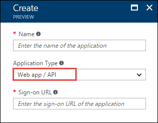
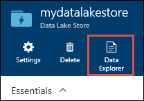
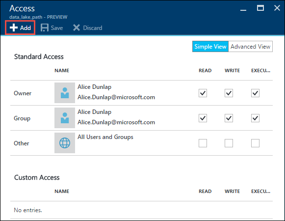
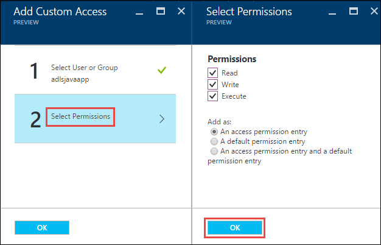
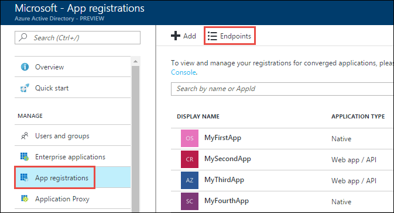

# Service-to-service authentication with Data Lake Store using Azure Active Directory
> [!div class="op_single_selector"]
> * [End-user authentication](data-lake-store-end-user-authenticate-using-active-directory.md)
> * [Service-to-service authentication](data-lake-store-service-to-service-authenticate-using-active-directory.md)
> 
>  

Azure Data Lake Store uses Azure Active Directory for authentication. Before authoring an application that works with Azure Data Lake Store, you must decide how to authenticate your application with Azure Active Directory (Azure AD). The two main options available are:

* End-user authentication 
* Service-to-service authentication (this article) 

Both these options result in your application being provided with an OAuth 2.0 token, which gets attached to each request made to Azure Data Lake Store.

This article talks about how to create an **Azure AD web application for service-to-service authentication**. For instructions on Azure AD application configuration for end-user authentication, see [End-user authentication with Data Lake Store using Azure Active Directory](data-lake-store-end-user-authenticate-using-active-directory.md).

## Prerequisites
* An Azure subscription. See [Get Azure free trial](https://azure.microsoft.com/pricing/free-trial/).

## Step 1: Create an Active Directory web application

Create and configure an Azure AD web application for service-to-service authentication with Azure Data Lake Store using Azure Active Directory. For instructions, see [Create an Azure AD application](../azure-resource-manager/resource-group-create-service-principal-portal.md).

While following the instructions at the preceding link, make sure you select **Web App / API** for application type, as shown in the following screenshot:

## Step 2: Get application ID, authentication key, and tenant ID
When programmatically logging in, you need the ID for your application. If the application runs under its own credentials, you also need an authentication key.

* For instructions on how to retrieve the application ID and authentication key (also called the client secret) for your application, see [Get application ID and authentication key](../azure-resource-manager/resource-group-create-service-principal-portal.md#get-application-id-and-authentication-key).

* For instructions on how to retrieve the tenant ID, see [Get tenant ID](../azure-resource-manager/resource-group-create-service-principal-portal.md#get-tenant-id).

## Step 3: Assign the Azure AD application to the Azure Data Lake Store account file or folder

1. Sign on to the [Azure portal](https://portal.azure.com). Open the Azure Data Lake Store account that you want to associate with the Azure Active Directory application you created earlier.
2. In your Data Lake Store account blade, click **Data Explorer**.
   
    
3. In the **Data Explorer** blade, click the file or folder for which you want to provide access to the Azure AD application, and then click **Access**. To configure access to a file, you must click **Access** from the **File Preview** blade.
   
    
4. The **Access** blade lists the standard access and custom access already assigned to the root. Click the **Add** icon to add custom-level ACLs.
   
    
5. Click the **Add** icon to open the **Add Custom Access** blade. In this blade, click **Select User or Group**, and then in **Select User or Group** blade, look for the Azure Active Directory application you created earlier. If you have many groups to search from, use the text box at the top to filter on the group name. Click the group you want to add and then click **Select**.
   
    
6. Click **Select Permissions**, select the permissions and whether you want to assign the permissions as a default ACL, access ACL, or both. Click **OK**.
   
    
   
    For more information about permissions in Data Lake Store, and Default/Access ACLs, see [Access Control in Data Lake Store](data-lake-store-access-control.md).
7. In the **Add Custom Access** blade, click **OK**. The newly added group, with the associated permissions, are listed in the **Access** blade.
   
    

> [!NOTE]
> If you want to use the SDKs to create a Data Lake Store account, you must assign the Azure AD web application as a role to the Resource Group in which you create the Data Lake Store account.
> 
>

## Step 4: Get the OAuth 2.0 token endpoint (only for Java-based applications)

1. Sign on to the [Azure portal](https://portal.azure.com) and click Active Directory from the left pane.

2. From the left pane, click **App registrations**.

3. From the top of the App registrations blade, click **Endpoints**.

	

4. From the list of endpoints, copy the OAuth 2.0 token endpoint.

	   

## Next steps
In this article, you created an Azure AD web application and gathered the information you need in your client applications that you author using .NET SDK, Java, Python, REST API, etc. You can now proceed to the following articles that talk about how to use the Azure AD native application to first authenticate with Data Lake Store and then perform other operations on the store.

* [Service-to-service authentication with Data Lake Store using Java](data-lake-store-service-to-service-authenticate-java.md)
* [Service-to-service authentication with Data Lake Store using .NET SDK](data-lake-store-service-to-service-authenticate-net-sdk.md)
* [Service-to-service authentication with Data Lake Store using Python](data-lake-store-service-to-service-authenticate-python.md)
* [Service-to-service authentication with Data Lake Store using REST API](data-lake-store-service-to-service-authenticate-rest-api.md)

