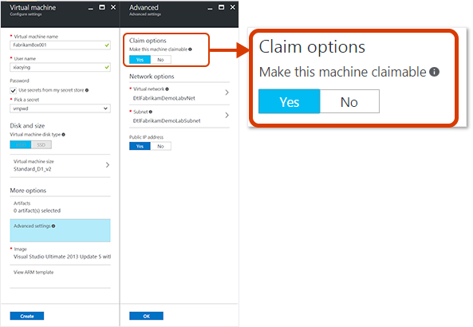
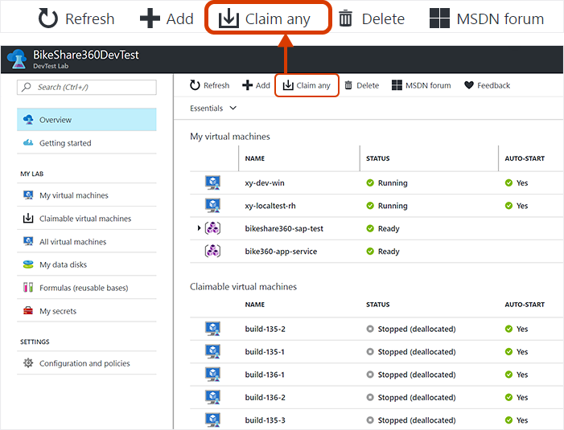
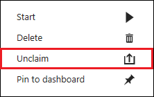

# Create and manage claimable VMs in Azure DevTest Labs
You add a claimable VM to a lab in a similar manner to how you [add a standard VM](devtest-lab-add-vm.md) – from a *base* that is either a [custom image](devtest-lab-create-template.md), [formula](devtest-lab-manage-formulas.md), or [Marketplace image](devtest-lab-configure-marketplace-images.md). This tutorial walks you through using the Azure portal to add a claimable VM to a lab in DevTest Labs, and shows the processes a user follows to claim and unclaim the VM.

## Steps to add a claimable VM to a lab in Azure DevTest Labs
1. Sign in to the [Azure portal](http://go.microsoft.com/fwlink/p/?LinkID=525040).
2. Select **More Services**, and then select **DevTest Labs** from the list.
3. From the list of labs, select the lab in which you want to create the claimable VM.  
4. On the lab's **Overview** pane, select **+ Add**.  

    

5. On the **Choose a base** area, select a base for the VM.
6. In the **Virtual machine** pane, enter a name for the new virtual machine in the **Virtual machine name** text box.

    

7. Enter a **User Name** that is granted administrator privileges on the virtual machine.  
8. If you want to use a password stored in your [secret store](https://azure.microsoft.com/updates/azure-devtest-labs-keep-your-secrets-safe-and-easy-to-use-with-the-new-personal-secret-store), select **Use a saved secret**, and specify a key value that corresponds to your secret (password). Otherwise, enter a password in the text field labeled **Type a value**.
9. The **Virtual machine disk type** determines which storage disk type is allowed for the virtual machines in the lab.
10. Select **Virtual machine size** and select one of the predefined items that specify the processor cores, RAM size, and the hard drive size of the VM to create.
11. Select **Artifacts** and from the list of artifacts, select and configure the artifacts that you want to add to the base image. If you're new to DevTest Labs or configuring artifacts, refer to the [Add an existing artifact to a VM](devtest-lab-add-vm.md#add-an-existing-artifact-to-a-vm) section, and then return here when finished.
12. Select **Advanced settings** to configure the VM's network options and expiration options. Under **Claim options**, choose **Yes** to make the machine claimable.

    

13. If you want to view or copy the Azure Resource Manager template, refer to the [Save Azure Resource Manager template](devtest-lab-add-vm.md#save-azure-resource-manager-template) section, and return here when finished.
14. Select **Create** to add the specified VM to the lab.

    The status of the VM's creation is displayed, first as **Creating**, then as **Running** after the VM has been started.

> [!NOTE]
> If you deploy lab VMs through [Azure Resource Manager templates](devtest-lab-create-environment-from-arm.md), you can create claimable VMs by setting the **allowClaim** property to true in the properties section.
>
>

## Using a claimable VM

A user can claim any VM from the list of "Claimable virtual machines" by doing one of these steps:

* From the list of "Claimable virtual machines" at the bottom of the lab's "Overview" pane, right-click on one of the VMs in the list and choose **Claim machine**.

  

* At the top of the "Overview" pane, choose **Claim any**. A random virtual machine is assigned from the list of claimable VMs.

  

After a user claims a VM, it is moved up into their list of "My virtual machines" and is no longer claimable by any other user.

## Unclaim a VM

When a user is finished using a claimed VM and wants to make it available to someone else, they can return the claimed VM to the list of claimable virtual machines by doing one of these steps:

- From the list of "My virtual machines", right-click on one of the VMs in the list – or select its ellipsis (...) – and choose **Unclaim**.

  

- In the list of "My virtual machines", select a VM to open its management pane, then select **Unclaim** from the top menu bar.

  

When a user unclaims a VM, they no longer have any permissions for that specific lab VM.

### Transferring the data disk
If a claimable VM has a data disk attached to it and a user unclaims it, the data disk stays with the VM. When another user then claims that VM, that new user claims the data disk as well as the VM.

This is known as "transferring the data disk". The data disk then becomes available in the new user's list of **My data disks** for them to manage.

## Next steps
* Once it is created, you can connect to the VM by selecting **Connect** on its management pane.
* Explore the [DevTest Labs Azure Resource Manager quickStart template gallery](https://github.com/Azure/azure-devtestlab/tree/master/Samples).
