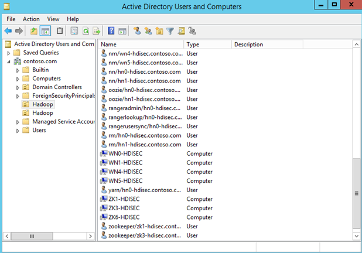

# Plan Azure domain-joined Hadoop clusters in HDInsight

The standard HDInsight cluster is a single-user cluster. It is suitable for most companies that have smaller application teams building large data workloads. As Hadoop gained popularity, many enterprises started moving toward a model in which clusters are managed by IT teams and multiple application teams share clusters. Thus, functionalities involving multiuser clusters are among the most requested functionalities in Azure HDInsight.

Instead of building its own multiuser authentication and authorization, HDInsight relies on the most popular identity provider--Active Directory (AD). The powerful security functionality in AD can be used to manage multiuser authentication in HDInsight. By integrating HDInsight with AD, you can communicate with the clusters by using your AD credentials. The VMs in HDInsight are domain-joined to your AD, and that is how HDInsight maps an AD user to a local Hadoop user, so all the services running on HDInsight (Ambari, Hive server, Ranger, Spark thrift server, and others) work seamlessly for the authenticated user. Administrators can then create strong authorization policies using Apache Ranger to provide role-based access control for resources in HDInsight.

## Integrate HDInsight with Active Directory

When integrating HDInsight with Active Directory, HDInsight cluster nodes are domain-joined to an AD domain. Kerberos security is configured for the Hadoop components on the cluster. For each of the Hadoop components, a service principal is created on the Active Directory. A corresponding machine principal is also created for each machine that is joined to the domain. These service principals and machine principals can clutter your Active Directory. As a result, it is required to provide an Organizational Unit (OU) within the Active Directory, where these principals are placed. 

To summarize, you need set up an environment with:

- An Active Directory domain controller with LDAPS configured.
- Connectivity from HDInsight’s Virtual Network to your Active Directory domain controller.
- An Organizational Unit created on Active Directory.
- A service account that has permissions to:

    - Create Service principals in the OU.
    - Join machines to domain and create machine principals in the OU.

The following screenshot shows an OU created in contoso.com. Some of the service principals and machine principals are shown in the screenshot as well.

.

### Two ways of bringing your own Active Directory domain controllers

There are two ways you can bring Active Directory domain controllers to create Domain-joined HDInsight clusters. 

- **Azure Active Directory Domain Services**: This service provides a managed Active Directory domain, which is fully compatible with Windows Server Active Directory. Microsoft takes care of managing, patching, and monitoring the AD domain. You can deploy your cluster without worrying about maintaining domain controllers. Users, groups, and passwords are synchronized from your Azure Active Directory, enabling users to sign in to the cluster using their corporate credentials. For more information, see [Configure Domain-joined HDInsight clusters using Azure Active Directory Domain Services](./apache-domain-joined-configure-using-azure-adds.md).

- **Active Directory on Azure IaaS VMs**: In this option, you deploy and manage your own Windows Server Active Directory domain on Azure IaaS VMs. For more information, see [Configure domain joined sandbox environment](./apache-domain-joined-configure.md).

## Next steps
* To configure a domain-joined HDInsight cluster, see [Configure domain-joined HDInsight clusters](apache-domain-joined-configure.md).
* To manage domain-joined HDInsight clusters, see [Manage domain-joined HDInsight clusters](apache-domain-joined-manage.md).
* To configure Hive policies and run Hive queries, see [Configure Hive policies for domain-joined HDInsight clusters](apache-domain-joined-run-hive.md).
* To run Hive queries by using SSH on domain-joined HDInsight clusters, see [Use SSH with HDInsight](../hdinsight-hadoop-linux-use-ssh-unix.md).
