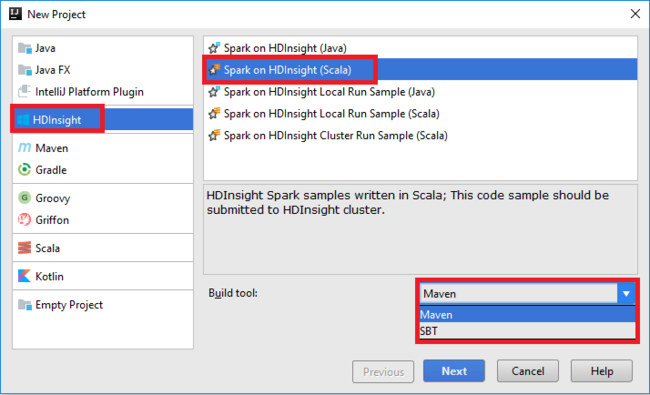
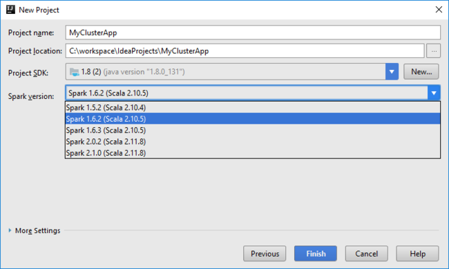
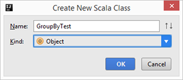
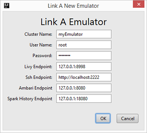

# Use HDInsight Tools for IntelliJ with Hortonworks Sandbox

Learn how to use HDInsight Tools for IntelliJ to develop Apache Scala applications, and then test the applications on [Hortonworks Sandbox](http://hortonworks.com/products/sandbox/) running on your computer. 

[IntelliJ IDEA](https://www.jetbrains.com/idea/) is a Java integrated development environment (IDE) for developing computer software. After you develop and test your applications on Hortonworks Sandbox, you can move the applications to [Azure HDInsight](apache-hadoop-introduction.md).

## Prerequisites

Before you begin this tutorial, you must have the following items:

- Hortonworks Data Platform (HDP) 2.4 on Hortonworks Sandbox running on your local computer. To set up HDP, see [Get started in the Hadoop ecosystem with a Hadoop sandbox on a virtual machine](apache-hadoop-emulator-get-started.md). 
    > [!NOTE]
    > HDInsight Tools for IntelliJ has been tested only with HDP 2.4. To get HDP 2.4, expand **Hortonworks Sandbox Archive** on the [Hortonworks Sandbox downloads site](http://hortonworks.com/downloads/#sandbox).

- [Java Developer Kit (JDK) version 1.8 or later](http://www.oracle.com/technetwork/java/javase/downloads/jdk8-downloads-2133151.html). Azure Toolkit for IntelliJ requires JDK.

- [IntelliJ IDEA community edition](https://www.jetbrains.com/idea/download) with the [Scala](https://plugins.jetbrains.com/idea/plugin/1347-scala) plug-in and the [Azure Toolkit for IntelliJ](https://docs.microsoft.com/java/azure/intellij/azure-toolkit-for-intellij) plug-in. HDInsight Tools for IntelliJ is available as part of Azure Toolkit for IntelliJ. 

To install the plug-ins:

  1. Open IntelliJ IDEA.
  2. On the **Welcome** page, select **Configure**, and then select **Plugins**.
  3. In the lower-left corner, select **Install JetBrains plugin**.
  4. Use the search function to search for **Scala**, and then select **Install**.
  5. To complete the installation, select **Restart IntelliJ IDEA**.
  6. Repeat steps 4 and 5 to install **Azure Toolkit for IntelliJ**. For more information, see [Install Azure Toolkit for IntelliJ](https://docs.microsoft.com/azure/azure-toolkit-for-intellij-installation).

## Create a Spark Scala application

In this section, you create a sample Scala project by using IntelliJ IDEA. In the next section, you link IntelliJ IDEA to the Hortonworks Sandbox (emulator) before you submit the project.

1. Open IntelliJ IDEA on your computer. In the **New Project** dialog box, complete these steps:

   1. Select **HDInsight** > **Spark on HDInsight (Scala)**.
   2. In the **Build tool** list, select one of the following, based on your scenario:

      * **Maven**: For Scala project-creation wizard support.
      * **SBT**: For managing dependencies and building for the Scala project.

   

2. Select **Next**.
3. In the next **New Project** dialog box, complete the following steps:

   1. In the **Project name** box, enter a project name.
   2. In the **Project location** box, enter a project location.
   3. Next to the **Project SDK** drop-down list, select **New**, select **JDK**, and then specify the folder for Java JDK version 1.7 or later. Select **Java 1.8** for the Spark 2.x cluster. Select **Java 1.7** for the Spark 1.x cluster. The default location is C:\Program Files\Java\jdk1.8.x_xxx.
   4. In the **Spark version** drop-down list, the Scala project creation wizard integrates the correct version for the Spark SDK and Scala SDK. If the Spark cluster version is earlier than 2.0, select **Spark 1.x**. Otherwise, select **Spark2.x**. This example uses Spark 1.6.2 (Scala 2.10.5). Ensure that you are using the repository marked **Scala 2.10.x**. Do not use the repository marked Scala 2.11.x.
    
      

4. Select **Finish**.
5. If the **Project** view is not already open, press **Alt+1** to open it.
6. In **Project Explorer**, expand the project, and then select **src**.
7. Right-click **src**, point to **New**, and then select **Scala class**.
8. In the **Name** box, enter a name. In the **Kind** box, select **Object**. Then, select **OK**.

    

9. In the .scala file, paste the following code:

        import java.util.Random
        import org.apache.spark.{SparkConf, SparkContext}
        import org.apache.spark.SparkContext._

        /**
        * Usage: GroupByTest [numMappers] [numKVPairs] [valSize] [numReducers]
        */
        object GroupByTest {
            def main(args: Array[String]) {
                val sparkConf = new SparkConf().setAppName("GroupBy Test")
                var numMappers = 3
                var numKVPairs = 10
                var valSize = 10
                var numReducers = 2

                val sc = new SparkContext(sparkConf)

                val pairs1 = sc.parallelize(0 until numMappers, numMappers).flatMap { p =>
                val ranGen = new Random
                var arr1 = new Array[(Int, Array[Byte])](numKVPairs)
                for (i <- 0 until numKVPairs) {
                    val byteArr = new Array[Byte](valSize)
                    ranGen.nextBytes(byteArr)
                    arr1(i) = (ranGen.nextInt(Int.MaxValue), byteArr)
                }
                arr1
                }.cache
                // Enforce that everything has been calculated and in cache.
                pairs1.count

                println(pairs1.groupByKey(numReducers).count)
            }
        }

10. On the **Build** menu, select **Build project**. Ensure that the compilation finishes successfully.

## Link to the Hortonworks Sandbox

Before you can link to a Hortonworks Sandbox (emulator), you must have an existing IntelliJ application.

To link to an emulator:

1. Open the project in IntelliJ.
2. On the **View** menu, select **Tools Windows**, and then select **Azure Explorer**.
3. Expand **Azure**, right-click **HDInsight**, and then select **Link an Emulator**.
4. In the **Link A New Emulator** dialog box, enter the password that you've set for the root account of the Hortonworks Sandbox. Next, enter values similar to those used in the following screenshot. Then, select **OK**. 

   

5. To configure the emulator, select **Yes**.

When the emulator is successfully connected, the emulator (Hortonworks Sandbox) is listed on the HDInsight node.

## Submit the Spark Scala application to the Hortonworks Sandbox

After you have linked IntelliJ IDEA to the emulator, you can submit your project.

To submit a project to an emulator:

1. In **Project Explorer**, right-click the project, and then select **Submit Spark application to HDInsight**.
2. Complete the following steps:

    1. In the **Spark cluster (Linux only)** drop-down list, select your local Hortonworks Sandbox.
    2. In the **Main class name** box, select or enter the main class name. For this tutorial, the name is **GroupByTest**.

3. Select **Submit**. The job submission logs are shown in the Spark submission tool window.

## Next steps

- Learn how to [use HDInsight Tools in Azure Toolkit for IntelliJ to create Spark applications for an HDInsight Spark Linux cluster](../spark/apache-spark-intellij-tool-plugin.md).

- For a video about HDInsight Tools for IntelliJ, see [Introduce HDInsight Tools for IntelliJ for Spark development](https://www.youtube.com/watch?v=YTZzYVgut6c).

- Learn how to [remotely debug Spark applications on an HDInsight cluster with Azure Toolkit for IntelliJ through SSH](../spark/apache-spark-intellij-tool-debug-remotely-through-ssh.md).

- Learn how to [use HDInsight Tools in Azure Toolkit for IntelliJ to debug Spark applications remotely on an HDInsight Spark Linux cluster](../spark/apache-spark-intellij-tool-plugin-debug-jobs-remotely.md).

- Learn how to [Use HDInsight Tools in Azure Toolkit for Eclipse to create Spark applications](../spark/apache-spark-eclipse-tool-plugin.md).

- For a video about HDInsight Tools for Eclipse, see [Use HDInsight Tools for Eclipse to create Spark applications](https://mix.office.com/watch/1rau2mopb6fha).
