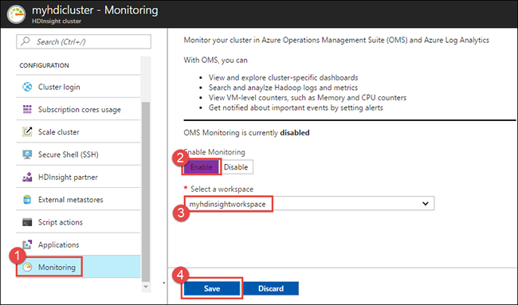
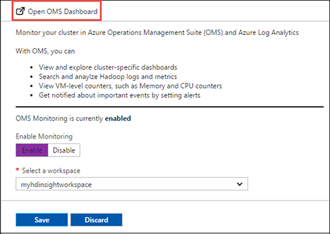
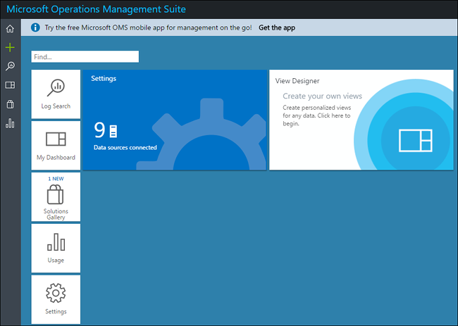

# Use Azure Log Analytics to monitor HDInsight clusters

Learn how to use Azure Log Analytics to monitor Hadoop cluster operations in HDInsight.

[Log Analytics](../log-analytics/log-analytics-overview.md) is a service in [Operations Management Suite (OMS)](../operations-management-suite/operations-management-suite-overview.md) that monitors your cloud and on-premises environments to maintain their availability and performance. It collects data generated by resources in your cloud and on-premises environments and from other monitoring tools to provide analysis across multiple sources. 

## Prerequisites

* **An Azure subscription**. Before you begin this tutorial, you must have an Azure subscription. See [Create your free Azure account today](https://azure.microsoft.com/free).

* **An Azure HDInsight cluster**. Currently, you can use Azure Operations Management Suite with the following HDInsight cluster types:

  * Hadoop
  * HBase
  * Interactive Query
  * Kafka
  * Spark
  * Storm

    For the instructions on how to create an HDInsight cluster, see [Get started with Azure HDInsight](hadoop/apache-hadoop-linux-tutorial-get-started.md).

* **A Log Analytics workspace**. You can think of this workspace as a unique Log Analytics environment with its own data repository, data sources, and solutions. You must have one such workspace already created that you can associate with Azure HDInsight clusters. For instructions, see [Create a Log Analytics workspace](../log-analytics/log-analytics-quick-collect-azurevm.md#create-a-workspace).

## Enable Log Analytics by using the portal

In this section, you configure an existing HDInsight Hadoop cluster to use an Azure Log Analytics workspace to monitor jobs, debug logs, etc.

1. Open an HDInsight cluster in the Azure portal.
2. In the left pane, click **Monitoring**.
3. In the right pane, click **Enable**, select an existing Log Analytics workspace, and then click **Save**.

    

    It takes a few moments to save the setting.  Once it is done, you can see an **Open OMS Dashboard** button on the top. 

    

5. Click **Open OMS dashboard**.
6. Enter your Azure credentials if prompted.

    

## Enable Log Analytics by using Azure PowerShell

You can enable Log Analytics using Azure PowerShell. The cmdlet is:

```powershell
Enable-AzureRmHDInsightOperationsManagementSuite
```

See [Enable-AzureRmHDInsightOperationsManagementSuite](https://docs.microsoft.com/powershell/module/azurerm.hdinsight/Enable-AzureRmHDInsightOperationsManagementSuite?view=azurermps-5.0.0).

To disable, the cmdlet is 

```powershell
Disable-AzureRmHDInsightOperationsManagementSuite
```

See [Disable-AzureRmHDInsightOperationsManagementSuite](https://docs.microsoft.com/powershell/module/azurerm.hdinsight/disable-azurermhdinsightoperationsmanagementsuite?view=azurermps-5.0.0).


## Next steps
* [Add HDInsight cluster management solutions to Log Analytics](hdinsight-hadoop-oms-log-analytics-management-solutions.md)
