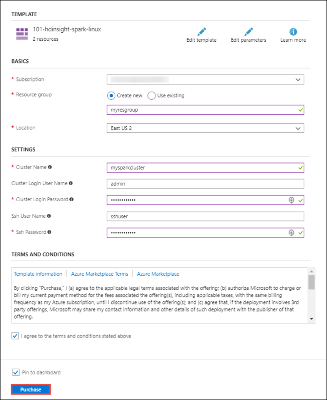
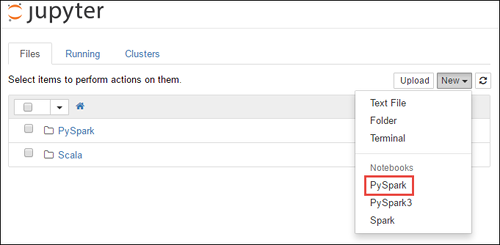
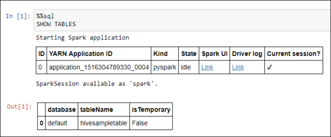

# Create an Apache Spark cluster in Azure HDInsight

Learn how to create Apache Spark cluster on Azure HDInsight, and how to run Spark SQL queries against Hive tables. For information on Spark on HDInsight, see [Overview: Apache Spark on Azure HDInsight](apache-spark-overview.md).

## Prerequisites

* **An Azure subscription**. Before you begin this tutorial, you must have an Azure subscription. See [Create your free Azure account](https://azure.microsoft.com/free).

## Create HDInsight Spark cluster

Create an HDInsight Spark cluster using an [Azure Resource Manager template](../hdinsight-hadoop-create-linux-clusters-arm-templates.md). The template can be found in [github](https://azure.microsoft.com/resources/templates/101-hdinsight-spark-linux/). For other cluster creation methods, see [Create HDInsight clusters](../hdinsight-hadoop-provision-linux-clusters.md).

1. Click the following image to open the template in the Azure portal.         

    <a href="https://portal.azure.com/#create/Microsoft.Template/uri/https%3A%2F%2Fraw.githubusercontent.com%2FAzure%2Fazure-quickstart-templates%2Fmaster%2F101-hdinsight-spark-linux%2Fazuredeploy.json" target="_blank"></a>

2. Enter the following values:

    

	* **Subscription**: Select your Azure subscription used for creating this cluster.
	* **Resource group**: Create a resource group or select an existing one. Resource group is used to manage Azure resources for your projects.
	* **Location**: Select a location for the resource group. The template uses this location for creating the cluster as well as for the default cluster storage.
	* **ClusterName**: Enter a name for the HDInsight cluster that you want to create.
	* **Cluster login name and password**: The default login name is admin.
	* **SSH user name and password**.

3. Select **I agree to the terms and conditions stated above**, select **Pin to dashboard**, and then click **Purchase**. You can see a new tile titled **Deploying Template deployment**. It takes about 20 minutes to create the cluster.

If you run into an issue with creating HDInsight clusters, it could be that you do not have the right permissions to do so. For more information, see [Access control requirements](../hdinsight-administer-use-portal-linux.md#create-clusters).

> [!NOTE]
> This article creates a Spark cluster that uses [Azure Storage Blobs as the cluster storage](../hdinsight-hadoop-use-blob-storage.md). You can also create a Spark cluster that uses [Azure Data Lake Store](../hdinsight-hadoop-use-data-lake-store.md) as the default storage. For instructions, see [Create an HDInsight cluster with Data Lake Store](../../data-lake-store/data-lake-store-hdinsight-hadoop-use-portal.md).
>
>

## Create a Jupyter notebook

[Jupyter Notebook](http://jupyter.org) is an interactive notebook environment that supports various programming languages that allow you to interact with your data, combine code with markdown text and perform simple visualizations. Spark on HDInsight also includes [Zeppelin Notebook](apache-spark-zeppelin-notebook.md). Jupyter Notebook is used in this tutorial.

**To create a Jupyter notebook**

1. Open the [Azure portal](https://portal.azure.com/).

2. Open the Spark cluster you created. For the instructions, see [List and show clusters](../hdinsight-administer-use-portal-linux.md#list-and-show-clusters).

3. From the portal, click **Cluster dashboards**, and then click **Jupyter Notebook**. If prompted, enter the admin credentials for the cluster.

   

   > [!NOTE]
   > You may also access the Jupyter Notebook for your cluster by opening the following URL in your browser. Replace **CLUSTERNAME** with the name of your cluster:
   >
   > `https://CLUSTERNAME.azurehdinsight.net/jupyter`
   >
   >
3. Click **New**, and then click **PySpark** to create a notebook. Jupyter notebooks on HDInsight clusters support three kernels - **PySpark**, **PySpark3**, and **Spark**. The **PySpark** kernel is used in this tutorial. For more information about the kernels, and the benefits of using **PySpark**, see [Use Jupyter notebook kernels with Apache Spark clusters in HDInsight](apache-spark-jupyter-notebook-kernels.md).

   

   A new notebook is created and opened with the name Untitled(Untitled.pynb).

4. Click the notebook name at the top, and enter a friendly name if you want.

    

## Run Spark SQL statements on a Hive table

SQL (Structured Query Language) is the most common and widely used language for querying and defining data. Spark SQL functions as an extension to Apache Spark for processing structured data, using the familiar SQL syntax.

Spark SQL supports both SQL and HiveQL as query languages. Its capabilities include binding in Python, Scala, and Java. With it, you can query data stored in many locations, such as external databases, structured data files (example: JSON), and Hive tables.

For an example of reading data from a csv file instead of a Hive table, see [Run interactive queries on Spark clusters in HDInsight](apache-spark-load-data-run-query.md).

**To run Spark SQL**

1. When you start the notebook for the first time, the kernel performs some tasks in the background. Wait for the kernel to be ready. The kernel is ready when you see a hollow circle next to the kernel name in the notebook. Solid circle denotes that the kernel is busy.

    

2. When the kernel is ready, paste the following code in an empty cell, and then press **SHIFT + ENTER** to run the code. The output should list a `hivesampletable` that is available on the cluster, by default.

    ```PySpark
	%%sql
    SHOW TABLES
    ```

    

    When you use a Jupyter Notebook with your HDInsight Spark cluster, you get a preset `sqlContext` that you can use to run Hive queries using Spark SQL. `%%sql` tells Jupyter Notebook to use the preset `sqlContext` to run the Hive query. The query retrieves the top 10 rows from a Hive table (**hivesampletable**) that comes with all HDInsight clusters by default. For more information on the `%%sql` magic and the preset contexts, see [Jupyter kernels available for an HDInsight cluster](apache-spark-jupyter-notebook-kernels.md).

    Every time you run a query in Jupyter, your web browser window title shows a **(Busy)** status along with the notebook title. You also see a solid circle next to the **PySpark** text in the top-right corner.
    
2. Run another query to see the data in `hivesampletable`.

    ```PySpark
	%%sql
    SELECT * FROM hivesampletable LIMIT 10
    ```
    
    The screen shall refresh to show the query output.

    

2. From the **File** menu on the notebook, click **Close and Halt**. Shutting down the notebook releases the cluster resources.

3. If you plan to complete the next steps at a later time, make sure you delete the HDInsight cluster you created in this article. 

[!INCLUDE [delete-cluster-warning](../../../includes/hdinsight-delete-cluster-warning.md)]

## Next steps 

In this article, you learned how to create an HDInsight Spark cluster and run a basic Spark SQL query. Advance to the next article to learn how to use an HDInsight Spark cluster to run interactive queries on sample data.

> [!div class="nextstepaction"]
>[Run interactive queries on an HDInsight Spark cluster](apache-spark-load-data-run-query.md)


