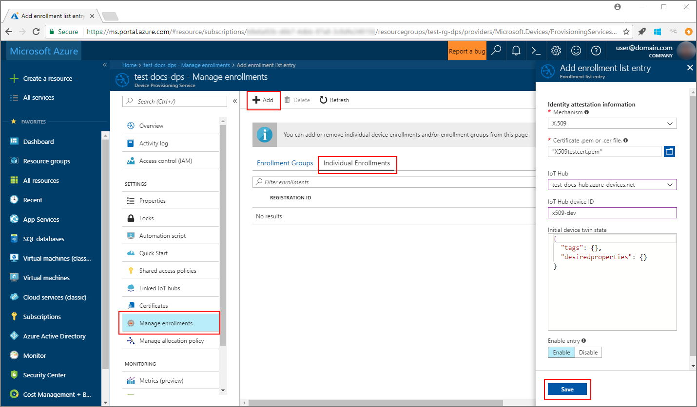
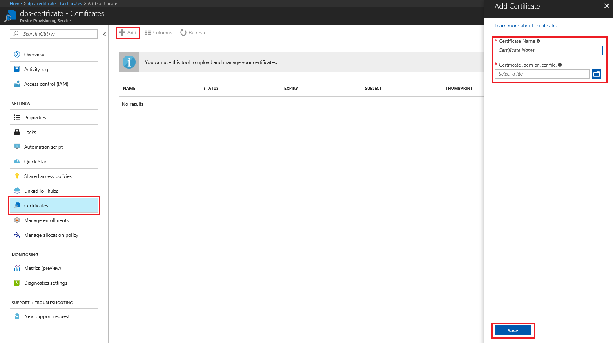
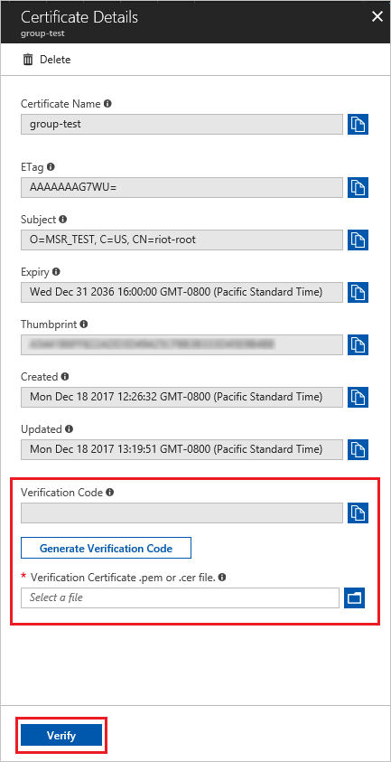
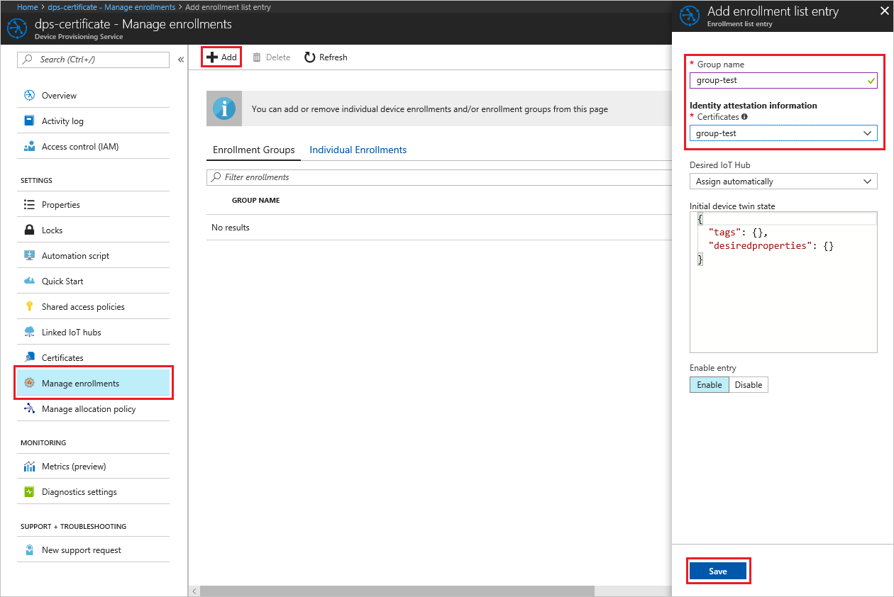
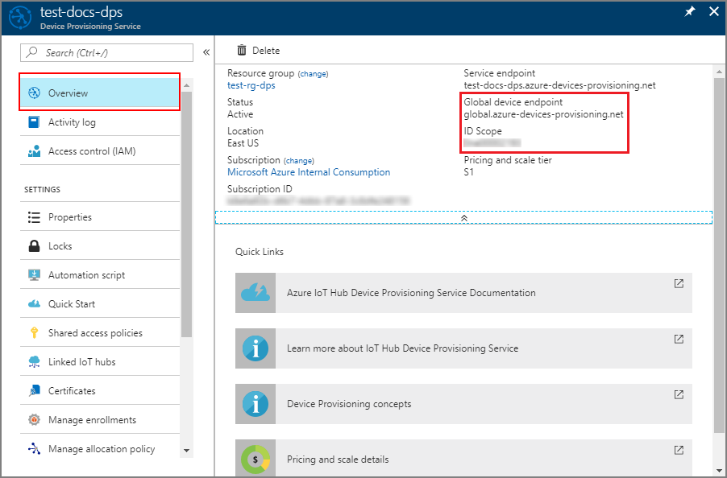

# Create and provision an X.509 simulated device using Node.js device SDK for IoT Hub Device Provisioning Service
[!INCLUDE [iot-dps-selector-quick-create-simulated-device-x509](../../includes/iot-dps-selector-quick-create-simulated-device-x509.md)]

IoT Hub Device Provisioning Service is a helper service for IoT Hub that provides zero-touch device provisioning to the IoT hub. With the Device Provisioning Service, you can provision millions of devices in a secure and scalable manner.

Device provisioning consists of two steps. The first step is creating the appropriate enrollment entry in the Device Provisioning Service based on the specific requirements of the solution.  The second step is establishing a connection between the device and the Device Provisioning Service and registering the device with the IoT hub. Once both steps have been completed, the device is considered fully provisioned. Device Provisioning Service automates both steps to provide a seamless provisioning experience for the device. For more information, see [Device Provisioning Service concepts](https://docs.microsoft.com/en-us/azure/iot-dps/concepts-service).

These steps show how to create an enrollment entry in the Device Provisioning Service, simulate an X.509 device on your development machine, connect the simulated device with the Device Provisioning Service, and register the device on your IoT hub using the [Azure IoT Hub Node.js Device SDK](https://github.com/Azure/azure-iot-sdk-node).


## Prepare the environment 

1. Complete the steps in the [Setup IoT Hub Device Provisioning Service with the Azure portal](./quick-setup-auto-provision.md) before you proceed.

1. Make sure you have [Node.js v4.0 or above](https://nodejs.org) installed on your machine.

1. Make sure [Git](https://git-scm.com/download/) is installed on your machine and is added to the environment variables accessible to the command window. 

1. Make sure [OpenSSL](https://www.openssl.org/) is installed on your machine and is added to the environment variables accessible to the command window. This library can either be built and installed from source or downloaded and installed from a [third party](https://wiki.openssl.org/index.php/Binaries) such as [this](https://sourceforge.net/projects/openssl/). 

    > [!NOTE]
    > If you have already created your _root_, _intermediate_, and/or _leaf_ X.509 certificates, you may skip this step and all following steps regarding certificate generation.
    >


## Create an enrollment entry

An enrollment is the record of devices or groups of devices that may at some point register stored in the Device Provisioning Service. The enrollment record contains the information about the device or group of devices, including X.509 certificate details, and additional registration information. There are two types of enrollments supported by Device Provisioning Service, _Individual enrollment_ and _Enrollment group_. For more information, see [Enrollment concepts](https://docs.microsoft.com/en-us/azure/iot-dps/concepts-service#enrollment).

If you are creating your own X.509 test certificates, refer to [Security concepts](https://docs.microsoft.com/en-us/azure/iot-dps/concepts-security#x509-certificates) on which certificates are necessary for your solution, and [Tools for the Azure IoT Device Provisioning Device SDK for Node.js](https://github.com/azure/azure-iot-sdk-node/tree/master/provisioning/tools) for implementation details.

1. Open a command prompt. Clone the GitHub repo for the code samples:
    
    ```cmd/sh
    git clone https://github.com/Azure/azure-iot-sdk-node.git --recursive
    ```

1. Navigate to the certificate generator script and build the project. 

    ```cmd/sh
    cd azure-iot-sdk-node/provisioning/tools
    npm install
    ```

1. Create the enrollment information in either of the following ways, as per your setup:

    - **Individual enrollment**:

        1. Create the _leaf_ certificate by running the script using your own _certificate-name_. Note that the leaf certificate's common name becomes the [Registration ID](https://docs.microsoft.com/en-us/azure/iot-dps/concepts-device#registration-id) so be sure to only use lower-case alphanumerics and hyphens.

        ```cmd/sh
        node create_test_cert.js device {certificate-name}
        ```
         
        1. In the **Azure** portal, open the **Device Provisioning Service** summary blade. Select **Manage enrollments**, then the **Individual Enrollments** tab, and click the **Add** button at the top. 

        1. Under the **Add enrollment list entry**, enter the following information:
            - Select **X.509** as the identity attestation *Mechanism*.
            - Under the *Certificate .pem or .cer file*, select the certificate file **_{certificate-name}\_cert.pem_** created in the previous steps using the *File Explorer* widget.
            - Optionally, you may provide the following information:
                - Select an IoT hub linked with your provisioning service.
                - Enter a unique device ID. Make sure to avoid sensitive data while naming your device. 
                - Update the **Initial device twin state** with the desired initial configuration for the device.
            - Once complete, click the **Save** button. 

          

    On successful enrollment, your X.509 device appears as **{certificatename}** under the *Registration ID* column in the *Individual Enrollments* tab. Note this value for later.

    - **Enrollment groups**: 

        1. Create the _root_ certificate by running the script using your own _root-name_.

        ```cmd/sh
        node create_test_cert.js root {root-name}
        ```

        1. In the **Azure** portal, open the **Device Provisioning Service** summary blade. Select **Certificates** and click the **Add** button at the top.

        1. Under the **Add Certificate**, enter the following information:
            - Enter a unique certificate name.
            - Select the **_{root-name}\_cert.pem_** file you created previously.
            - Once complete, click the **Save** button.

        

        1. Select the newly created certificate:
            - Click **Generate Verification Code**. Copy the code generated.
            - Create the _verification_ certificate. Enter the _verification code_ or right-click to paste in your running Node script window with the following command:

                ```cmd/sh
                node create_test_cert.js verification {rootname_cert} {verification code}
                ```

            - Under the *Verification certificate .pem or .cer file*, select the certificate file **_verification_cert.pem_** created in the previous steps using the *File Explorer* widget. Click **Verify**.

            

        1. Select **Manage enrollments**. Select **Enrollment Groups** tab and click the **Add** button at the top.
            - Enter a unique group name.
            - Select the unique certificate name created previously
            - Optionally, you may provide the following information:
                - Select an IoT hub linked with your provisioning service.
                - Update the **Initial device twin state** with the desired initial configuration for the device.

        

        On successful enrollment, your X.509 device group appears under the *Group Name* column in the *Enrollment Groups* tab. Note this value for later.

        1. Create the _leaf_ certificate by running the script using your own _certficate-name_ followed by the _root-name_ used previously. The leaf certificate's common name becomes the [Registration ID](https://docs.microsoft.com/en-us/azure/iot-dps/concepts-device#registration-id) so be sure to only use lower-case alphanumerics and hyphens.

            ```cmd/sh
            node create_test_cert.js device {certificate-name} {root-name}
            ```

        > [!NOTE]
        > You can also create _intermediate_ certificates using `node create_test_cert.js intermediate {certificate-name} {parent-name}`. Just be sure to create the _leaf_ certificate as the last step using the last _intermediate_ as its root/parent. For more information, see [Controlling device access](https://docs.microsoft.com/en-us/azure/iot-dps/concepts-security#controlling-device-access-to-the-provisioning-service-with-x509-certificates).
        >


## Simulate the device

The [Azure IoT Hub Node.js Device SDK](https://github.com/Azure/azure-iot-sdk-node) provides an easy way to simulate a device. For further reading see [Device concepts](https://docs.microsoft.com/en-us/azure/iot-dps/concepts-device).

1. In the Azure portal, select the **Overview** blade for your Device Provisioning service and note down the **_GLobal Device Endpoint_** and **_ID Scope_** values.

     

1. Copy your _certificate_ and _key_ to the sample folder.

    ```cmd/sh
    copy .\{certificate-name}_cert.pem ..\device\samples\{certificate-name}_cert.pem
    copy .\{certificate-name}_key.pem ..\device\samples\{certificate-name}_key.pem
    ```

1. Navigate to the device test script and build the project. 

    ```cmd/sh
    cd ..\device\samples
    npm install
    ```

1. Edit the **register\_x509.js** file. Save the file after making the following changes.
    - Replace `provisioning host` with the **_Global Device Endpoint_** noted in **Step 1** above.
    - Replace `id scope` with the **_Id Scope_** noted in **Step 1** above. 
    - Replace `reigstration id` with the **_Registration Id_** or **_Group Name_** noted in the previous section.
    - Replace `cert filename` and `key filename` with the files you copied in **Step 2** above. 

1. Execute the script and verify the device was provisioned successfully.

    ```cmd/sh
    node register_x509.js
    ```   

1. In the portal, navigate to the IoT hub linked to your provisioning service and open the **IoT Devices** blade. On successful provisioning of the simulated X.509 device to the hub, its device ID appears on the **IoT Devices** blade, with *STATUS* as **enabled**. You might need to click the **Refresh** button at the top if you already opened the blade prior to running the sample device application. 

     

    If you changed the *initial device twin state* from the default value in the enrollment entry for your device, it can pull the desired twin state from the hub and act accordingly. For more information, see [Understand and use device twins in IoT Hub](../iot-hub/iot-hub-devguide-device-twins.md).


## Clean up resources

If you plan to continue working on and exploring the device client sample, do not clean up the resources created in this Quickstart. If you do not plan to continue, use the following steps to delete all resources created by this Quickstart.

1. Close the device client sample output window on your machine.
1. From the left-hand menu in the Azure portal, click **All resources** and then select your Device Provisioning service. Open the **Manage Enrollments** blade for your service, and then click the **Individual Enrollments** or **Enrollment Groups** tab. Select the *REGISTRATION ID* or *GROUP NAME* of the device you enrolled in this Quickstart, and click the **Delete** button at the top. 
1. From the left-hand menu in the Azure portal, click **All resources** and then select your IoT hub. Open the **IoT Devices** blade for your hub, select the *DEVICE ID* of the device you registered in this Quickstart, and then click **Delete** button at the top.


## Next steps

In this Quickstart, you’ve created a simulated X.509 device and provisioned it to your IoT hub using the Azure IoT Hub Device Provisioning Service on the portal. To learn how to enroll your X.509 device programmatically, continue to the Quickstart for programmatic enrollment of X.509 devices. 

> [!div class="nextstepaction"]
> [Azure Quickstart - Enroll X.509 devices to Azure IoT Hub Device Provisioning Service](quick-enroll-device-x509-node.md)
