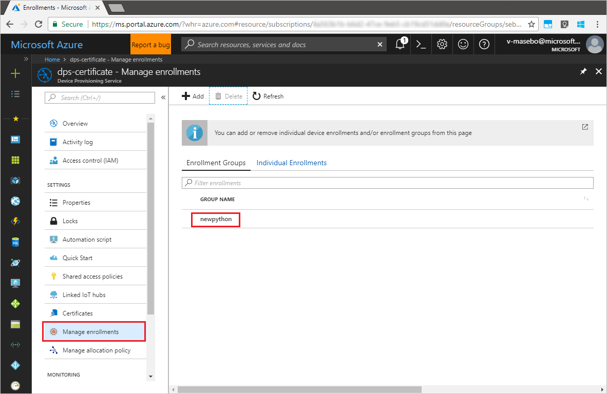

# Enroll X.509 devices to IoT Hub Device Provisioning Service using Python provisioning service SDK
[!INCLUDE [iot-dps-selector-quick-enroll-device-x509](../../includes/iot-dps-selector-quick-enroll-device-x509.md)]

These steps show how to enroll a group of X.509 simulated devices programmatically to the Azure IoT Hub Device Provisioning Service, using the [Python Provisioning Service SDK](https://github.com/Azure/azure-iot-sdk-python/tree/master/provisioning_service_client) with the help of a sample Python application. Although the Java Service SDK works on both Windows and Linux machines, this article uses a Windows development machine to walk through the enrollment process.

Make sure to [set up IoT Hub Device Provisioning Service with the Azure portal](./quick-setup-auto-provision.md) before you proceed.

> [!NOTE]
> This quickstart only supports **Enrollment Group**. **Individual Enrollment** via the _Python Provisioning Service SDK_ is a work in progress.
> 

<a id="prepareenvironment"></a>


## Prepare the environment 

1. Download and install [Python 2.x or 3.x](https://www.python.org/downloads/). Make sure to use the 32-bit or 64-bit installation as required by your setup. When prompted during the installation, make sure to add Python to your platform-specific environment variables. 

1. Choose one of the following options:

    - Build and compile the **Azure IoT Python SDK**. Follow [these instructions](https://github.com/Azure/azure-iot-sdk-python/blob/master/doc/python-devbox-setup.md) to build the Python packages. If you are using Windows OS, then also install [Visual C++ redistributable package](http://www.microsoft.com/download/confirmation.aspx?id=48145) to allow the use of native DLLs from Python.

    - [Install or upgrade *pip*, the Python package management system](https://pip.pypa.io/en/stable/installing/) and install the package via the following command:

        ```cmd/sh
        pip install azure-iothub-provisioningserviceclient
        ```

1. You need a .pem file that contains an intermediate or root CA X.509 certificate that has been uploaded to and verified with your provisioning service. The **Azure IoT C SDK** contains tooling that can help you create an X.509 certificate chain, upload a root or intermediate certificate from that chain, and perform proof-of-possession with the service to verify the certificate. To use this tooling, clone the [Azure IoT C SDK](https://github.com/Azure/azure-iot-sdk-c) and follow the steps in [azure-iot-sdk-c\tools\CACertificates\CACertificateOverview.md](https://github.com/Azure/azure-iot-sdk-c/blob/master/tools/CACertificates/CACertificateOverview.md) on your machine.


## Modify the Python sample code

This section shows how to add the provisioning details of your X.509 device to the sample code. 

1. Using a text editor, create a new **EnrollmentGroup.py** file.

1. Add the following `import` statements and variables at the start of the **EnrollmentGroup.py** file. Then replace `dpsConnectionString` with your connection string found under **Shared access policies** in your **Device Provisioning Service** on the **Azure Portal**. Replace the certificate placeholder with the certificate created previously in [Prepare the environment](quick-enroll-device-x509-python.md#prepareenvironment). Finally, create a unique `registrationid` and be sure that it only consists of lower-case alphanumerics and hyphens.  

    ```python
    from provisioningserviceclient import ProvisioningServiceClient
    from provisioningserviceclient.models import EnrollmentGroup, AttestationMechanism

    CONNECTION_STRING = "{dpsConnectionString}"

    SIGNING_CERT = """-----BEGIN CERTIFICATE-----
    XXXXXXXXXXXXXXXXXXXXXXXXXXXXXXXXXXXXXXXXXXXXXXXXXXXXXXXXXXXXXXXX
    XXXXXXXXXXXXXXXXXXXXXXXXXXXXXXXXXXXXXXXXXXXXXXXXXXXXXXXXXXXXXXXX
    XXXXXXXXXXXXXXXXXXXXXXXXXXXXXXXXXXXXXXXXXXXXXXXXXXXXXXXXXXXXXXXX
    XXXXXXXXXXXXXXXXXXXXXXXXXXXXXXXXXXXXXXXXXXXXXXXXXXXXXXXXXXXXXXXX
    XXXXXXXXXXXXXXXXXXXXXXXXXXXXXXXXXXXXXXXXXXXXXXXXXXXXXXXXXXXXXXXX
    XXXXXXXXXXXXXXXXXXXXXXXXXXXXXXXXXXXXXXXXXXXXXXXXXXXXXXXXXXXXXXXX
    XXXXXXXXXXXXXXXXXXXXXXXXXXXXXXXXXXXXXXXXXXXXXXXXXXXXXXXXXXXXXXXX
    XXXXXXXXXXXXXXXXXXXXXXXXXXXXXXXXXXXXXXXXXXXXXXXXXXXXXXXXXXXXXXXX
    XXXXXXXXXXXXXXXXXXXXXXXXXXXXXXXXXXXXXXXXXXXXXXXXXXXXXXXXXXXXXXXX
    XXXXXXXXXXXXXXXXXXXXXXXXXXXXXXXXXXXXXXXXXXXXXXXXXXXXXXXXXXXXXXXX
    XXXXXXXXXXXXXXXXXXXXXXXXXXXXXXXXXXXXXXXXXXXXXXXXXXXXXXXXXXXXXXXX
    XXXXXXXXXXXXXXXXXXXXXXXXXXXXXXXXXXXXXXXXXXXXXXXXXXXXXXXXXXXXXXXX
    XXXXXXXXXXXXXXXXXXXXXXXXXXXXXXXXXXXXXXXXXXXXXXXXXXXXXXXXXXXXXXXX
    XXXXXXXXXXXXXXXXXXXXXXXXXXXXXXXXXXXXXXXXXXXXXXXXXXXXXXXXXXXXXXXX
    XXXXXXXXXXXXXXXXXXXXXXXXXXXXXXXXXXXXXXXXXXXXXXXXXXXXXXXX
    -----END CERTIFICATE-----"""

    GROUP_ID = "{registrationid}"
    ```

1. Add the following function and function call to implement the group enrollment creation:

    ```python
    def main():
        print ( "Initiating enrollment group creation..." )

        psc = ProvisioningServiceClient.create_from_connection_string(CONNECTION_STRING)
        att = AttestationMechanism.create_with_x509_signing_certs(SIGNING_CERT)
        eg = EnrollmentGroup.create(GROUP_ID, att)

        eg = psc.create_or_update(eg)

        print ( "Enrollment group created." )

    if __name__ == '__main__':
        main()
    ```

1. Save and close the **EnrollmentGroup.py** file.


## Run the sample group enrollment

1. Open a command prompt, and run the script.

    ```cmd/sh
    python EnrollmentGroup.py
    ```

1. Observe the output for the successful enrollment.

1. Navigate to your provisioning service in the Azure portal. Click **Manage enrollments**. Notice that your group of X.509 devices appears under the **Enrollment Groups** tab, with the name `registrationid` created earlier. 

      


## Clean up resources
If you plan to explore the Java service sample, do not clean up the resources created in this Quickstart. If you do not plan to continue, use the following steps to delete all resources created by this Quickstart.

1. Close the Java sample output window on your machine.
1. Close the _X509 Cert Generator_ window on your machine.
1. Navigate to your Device Provisioning service in the Azure portal, click **Manage enrollments**, and then select the **Enrollment Groups** tab. Select the *GROUP NAME* for the X.509 devices you enrolled using this Quickstart, and click the **Delete** button at the top of the blade.  


## Next steps
In this Quickstart, you enrolled a simulated group of X.509 devices to your Device Provisioning service. To learn about device provisioning in depth, continue to the tutorial for the Device Provisioning Service setup in the Azure portal. 

> [!div class="nextstepaction"]
> [Azure IoT Hub Device Provisioning Service tutorials](./tutorial-set-up-cloud.md)
