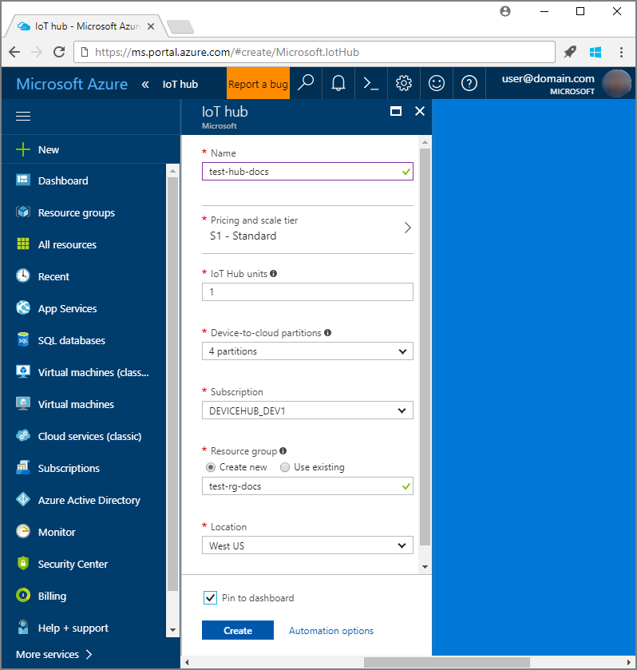
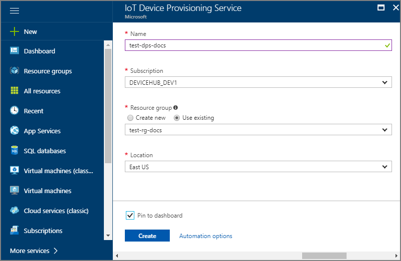
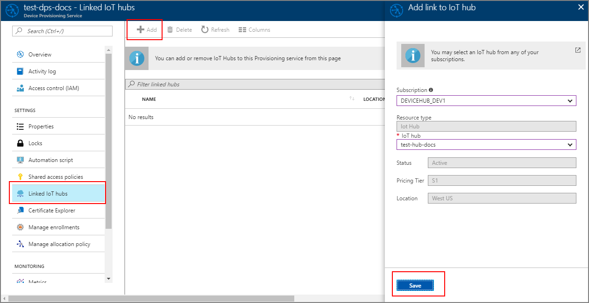

# Set up the IoT Hub Device Provisioning Service with the Azure portal

These steps show how to set up the Azure cloud resources in the portal for provisioning your devices. This includes creating your IoT hub, creating a new IoT Hub Device Provisioning Service and linking the two services together. 

If you don't have an Azure subscription, create a [free account](https://azure.microsoft.com/free/?WT.mc_id=A261C142F) before you begin.

## Log in to the Azure portal

Log in to the [Azure portal](https://portal.azure.com/).

## Create an IoT hub

1. Click the **New** button found on the upper left-hand corner of the Azure portal.

2. Select **Internet of Things**, select **IoT Hub**, and click the **Create** button. 

3. **Name** your IoT hub. Select from available options for pricing, enter the [IoT Hub units](https://azure.microsoft.com/pricing/details/iot-hub/), select the number of partitions for device-to-cloud messages, and the subscription that would be used for this resource. Enter the name of a new or existing resource group and select the location. When complete, click **Create**.

      

4. Once the IoT hub is successfully deployed, the hub summary blade automatically opens.

## Create a new instance for the IoT Hub Device Provisioning Service

1. Click the **New** button found on the upper left-hand corner of the Azure portal.

2. *Search the Marketplace* for the **Device provisioning service**. Select **IoT Device Provisioning Service** and click the **Create** button. 

3. **Name** your Device Provisioning Service instance. Select the subscription that would be used for this instance, and name a new or existing resource group. Select the location. When complete, click **Create**.

      

4. Once the service is successfully deployed, its summary blade automatically opens.

## Link the IoT hub and your Device Provisioning service

1. Click the **All resources** button from the left-hand menu of the Azure portal. Select the Device Provisioning Service instance that you created in the preceding section.  

2. On the Device Provisioning Service summary blade, select **Linked IoT hubs**. Click the **+ Add** button seen at the top. 

3. In the **Add link to IoT hub** portal blade, select either the current subscription or enter the name and connection string for another subscription. Select the name of the hub from the drop-down list. When complete, click **Save**. 

      

3. Now you should see the selected hub under the **Linked IoT hubs** blade. You might need to click **Refresh** to show **Linked IoT hubs**.

## Clean up resources

Other Quickstarts in this collection build upon this Quickstart. If you plan to continue on to work with subsequent Quickstarts or with the tutorials, do not clean up the resources created in this Quickstart. If you do not plan to continue, use the following steps to delete all resources created by this Quickstart in the Azure portal.

1. From the left-hand menu in the Azure portal, click **All resources** and then select your Device Provisioning service. At the top of the **All resources** blade, click **Delete**.  
2. From the left-hand menu in the Azure portal, click **All resources** and then select your IoT hub. At the top of the **All resources** blade, click **Delete**.  

## Next steps

In this Quickstart, you’ve deployed an IoT hub and a Device Provisioning Service instance, and linked the two resources. To learn how to use this set up to provision a simulated device, continue to the Quickstart for creating simulated device.

> [!div class="nextstepaction"]
> [Quickstart to create simulated device](./quick-create-simulated-device.md)
