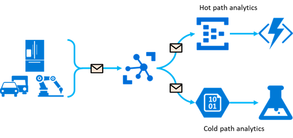

# Save IoT hub messages that contain sensor data to your Azure blob storage

[!INCLUDE [iot-hub-get-started-note](../../includes/iot-hub-get-started-note.md)]

## What you learn

You learn how to create an Azure storage account and an Azure function app to store IoT hub messages in your blob storage.

## What you do

- Create an Azure storage account.
- Prepare your IoT hub to route messages to storage.

## What you need

- [Set up your device](iot-hub-raspberry-pi-kit-node-get-started.md) to cover the following requirements:
  - An active Azure subscription
  - An IoT hub under your subscription 
  - A running application that sends messages to your IoT hub

## Create an Azure storage account

1. In the [Azure portal](https://portal.azure.com/), click **New** > **Storage** > **Storage account** > **Create**.

2. Enter the necessary information for the storage account:

   

   * **Name**: The name of the storage account. The name must be globally unique.

   * **Resource group**: Use the same resource group that your IoT hub uses.

   * **Pin to dashboard**: Select this option for easy access to your IoT hub from the dashboard.

3. Click **Create**.

## Prepare your IoT hub to route messages to storage

IoT Hub natively supports routing messages to Azure storage as blobs.

### Add storage as a custom endpoint

Navigate to your IoT hub in the Azure portal. Click **Endpoints** > **Add**. Name the endpoint and select **Azure Storage Container** as the endpoint type. Use the picker to select the storage account you created in the previous section. Create a storage container and select it, then click **OK**.

  

### Add a route to route data to storage

Click **Routes** > **Add** and enter a name for the route. Select **Device Messages** as the data source, and select the storage endpoint you just created as the endpoint in the route. Enter `true` as the query string, then click **Save**.

  

### Add a route for hot path telemetry (optional)

By default, IoT Hub routes all messages which do not match any other routes to the built-in endpoint. Since all telemetry messages now match the rule which routes the messages to storage, you need to add another route for messages to be written to the built-in endpoint. There is no additional charge to route messages to multiple endpoints.

> [!NOTE]
> You can skip this step if you are not doing additional processing on your telemetry messages.

Click **Add** from the Routes pane and enter a name for the route. Select **Device Messages** as the data source and **events** as the endpoint. Enter `true` as the query string, then click **Save**.

  

## Verify your message in your storage container

1. Run the sample application on your device to send messages to your IoT hub.

2. [Download and install Azure Storage Explorer](http://storageexplorer.com/).

3. Open Storage Explorer, click **Add an Azure Account** > **Sign in**, and then sign in to your Azure account.

4. Click your Azure subscription > **Storage Accounts** > your storage account > **Blob Containers** > your container.

   You should see messages sent from your device to your IoT hub logged in the blob container.

## Next steps

You’ve successfully created your Azure storage account and routed messages from IoT Hub to a blob container in that storage account.

[!INCLUDE [iot-hub-get-started-next-steps](../../includes/iot-hub-get-started-next-steps.md)]

