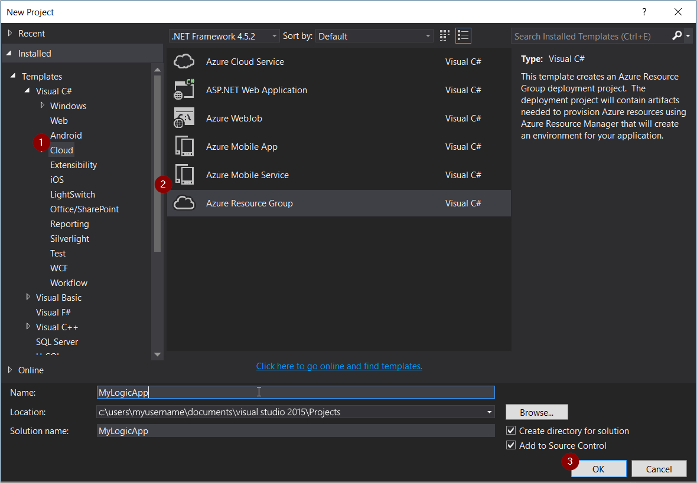
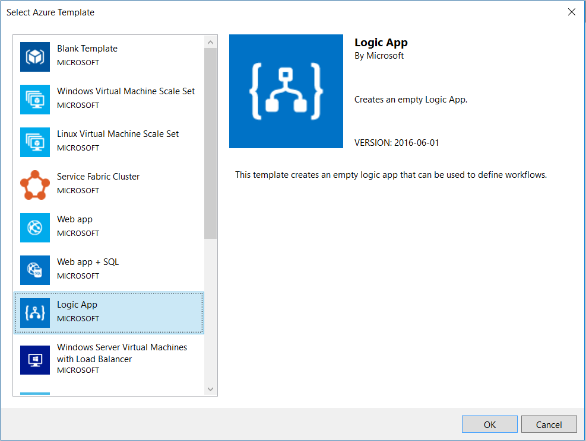
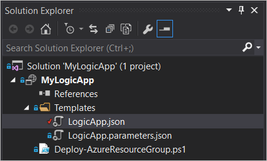
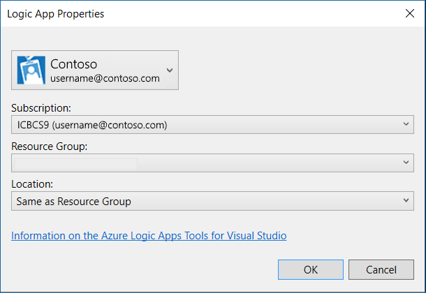
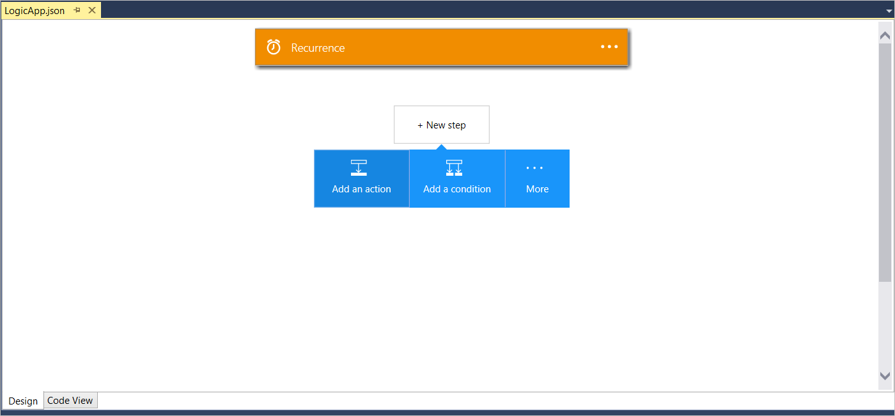
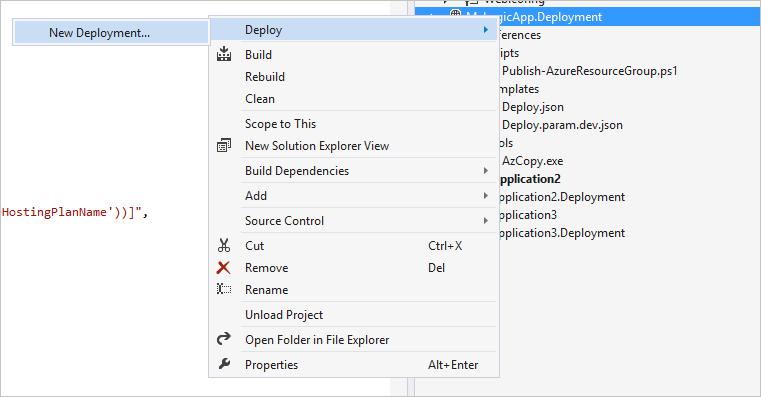
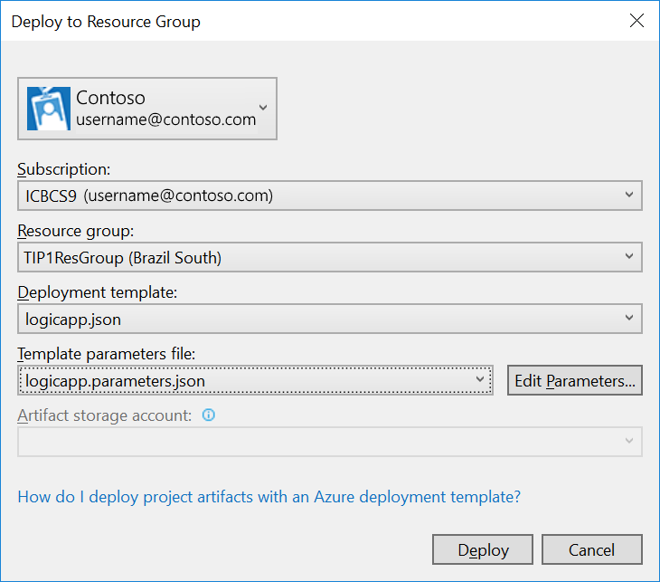
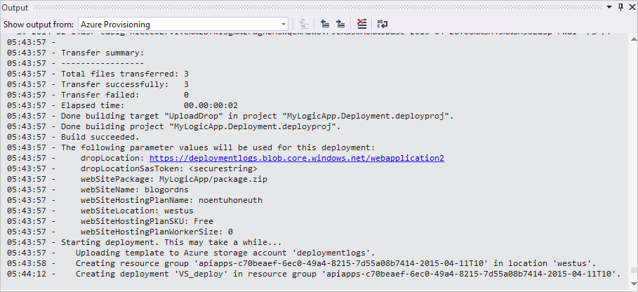
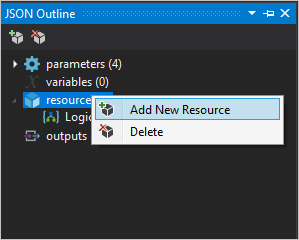

# Design, build, and deploy Azure Logic Apps in Visual Studio

Although the [Azure portal](https://portal.azure.com/) 
offers a great way for you to create and manage Azure Logic Apps, 
you can use Visual Studio for designing, building, 
and deploying your logic apps. Visual Studio provides rich tools 
like the Logic App Designer for you to create logic apps, 
configure deployment and automation templates, 
and deploy to any environment. 

To get started with Azure Logic Apps, learn 
[how to create your first logic app in the Azure portal](quickstart-create-first-logic-app-workflow.md).

## Installation steps

To install and configure Visual Studio tools for Azure Logic Apps, 
follow these steps.

### Prerequisites

* [Visual Studio 2017](https://www.visualstudio.com/downloads/download-visual-studio-vs.aspx) or Visual Studio 2015
* [Latest Azure SDK](https://azure.microsoft.com/downloads/) (2.9.1 or greater)
* [Azure PowerShell](https://github.com/Azure/azure-powershell#installation)
* Access to the web when using the embedded designer

### Install Visual Studio tools for Azure Logic Apps

After you install the prerequisites:

1. Open Visual Studio. On the **Tools** menu, 
select **Extensions and Updates**.
2. Expand the **Online** category so you can search online.
3. Browse or search for **Logic Apps** until 
you find **Azure Logic Apps Tools for Visual Studio**.
4. To download and install the extension, click **Download**.
5. Restart Visual Studio after installation.

> [!NOTE]
> You can also download [Azure Logic Apps Tools for Visual Studio 2017](https://marketplace.visualstudio.com/items?itemName=VinaySinghMSFT.AzureLogicAppsToolsforVisualStudio-18551) 
> and the [Azure Logic Apps Tools for Visual Studio 2015](https://marketplace.visualstudio.com/items?itemName=VinaySinghMSFT.AzureLogicAppsToolsforVisualStudio)
> directly from the Visual Studio Marketplace.

After you finish installation, 
you can use the Azure Resource Group project with Logic App Designer.

## Create your project

1. On the **File** menu, go to **New**, and select **Project**. 
Or to add your project to an existing solution, 
go to **Add**, and select **New Project**.

	

2. In the **New Project** window, 
find **Cloud**, and select **Azure Resource Group**. 
Name your project, and click **OK**.

	

3. Select the **Logic App** template, which creates a 
blank logic app deployment template for you to use. 
After you select your template, click **OK**.

	

	You've now added your logic app project to your solution. 
	In the Solution Explorer, your deployment file should appear.

	

## Create your logic app with Logic App Designer

When you have an Azure Resource Group project that contains a logic app, 
you can open the Logic App Designer in Visual Studio to create your workflow. 

> [!NOTE]
> The designer requires an internet connection to 
> query connectors for available properties and data. 
> For example, if you use the Dynamics CRM Online connector, 
> the designer queries your CRM instance to show available 
> custom and default properties.

1. Right-click your `<template>.json` file, 
and select **Open with Logic App Designer**. (`Ctrl+L`)

2. Choose your Azure subscription, resource group, 
and location for your deployment template.

    > [!NOTE]
    > Designing a logic app creates API Connection 
    > resources that query for properties during design. 
    > Visual Studio uses your selected resource group to create 
    > those connections during design time. 
    > To view or change any API Connections, 
    > go to the Azure portal, and browse for **API Connections**.

	

	The designer uses the definition in the `<template>.json` file for rendering.

4. Create and design your logic app. 
Your deployment template is updated with your changes.

	

Visual Studio adds `Microsoft.Web/connections` resources to 
your resource file for any connections your logic app needs to function. 
These connection properties can be set when you deploy, 
and managed after you deploy in **API Connections** in the Azure portal.

### Switch to JSON code view

To show the JSON representation for your logic app, 
select the **Code View** tab at the bottom of the designer.

To switch back to the full resource JSON, 
right-click the `<template>.json` file, and select **Open**.

### Add references for dependent resources to Visual Studio deployment templates

When you want your logic app to reference dependent resources, you can use 
[Azure Resource Manager template functions](https://docs.microsoft.com/azure/azure-resource-manager/resource-group-template-functions) in your logic app deployment template. 
For example, you might want your logic app to reference an Azure Function 
or integration account that you want to deploy alongside your logic app. 
Follow these guidelines about how to use parameters in your deployment template 
so that the Logic App Designer renders correctly. 

You can use logic app parameters in these kinds of triggers and actions:

*   Child workflow
*   Function app
*   APIM call
*   API connection runtime URL
*   API connection path

And you can use template functions such as parameters, variables, resourceId, concat, etc. 
For example, here's how you can replace the Azure Function resource ID:

```
"parameters":{
	"functionName": {
		"type":"string",
		"minLength":1,
		"defaultValue":"<FunctionName>"
	}
},
```

And where you would use parameters:

```
"MyFunction": {
	"type": "Function",
	"inputs": {
		"body":{},
		"function":{
			"id":"[resourceid('Microsoft.Web/sites/functions','functionApp',parameters('functionName'))]"
		}
	},
	"runAfter":{}
}
```
As another example you can parameterize the Service Bus send message operation:

```
"Send_message": {
	"type": "ApiConnection",
		"inputs": {
			"host": {
				"connection": {
					"name": "@parameters('$connections')['servicebus']['connectionId']"
				}
			},
			"method": "post",
			"path": "[concat('/@{encodeURIComponent(''', parameters('queueuname'), ''')}/messages')]",
			"body": {
				"ContentData": "@{base64(triggerBody())}"
			},
			"queries": {
				"systemProperties": "None"
			}
		},
		"runAfter": {}
	}
```
> [!NOTE] 
> host.runtimeUrl is optional and can be removed from your template if present.
> 


> [!NOTE] 
> For the Logic App Designer to work when you use parameters, 
> you must provide default values, for example:
> 
> ```
> "parameters": {
>     "IntegrationAccount": {
>     "type":"string",
>     "minLength":1,
>     "defaultValue":"/subscriptions/<subscriptionID>/resourceGroups/<resourceGroupName>/providers/Microsoft.Logic/integrationAccounts/<integrationAccountName>"
>     }
> },
> ```

### Save your logic app

To save your logic app at anytime, 
go to **File** > **Save**. (`Ctrl+S`) 

If your logic app has any errors when you save your app, 
they appear in the Visual Studio **Outputs** window.

## Deploy your logic app from Visual Studio

After configuring your app, 
you can deploy directly from Visual Studio in just a couple steps. 

1. In Solution Explorer, right-click your project, 
and go to **Deploy** > **New Deployment...**

	

2. When you're prompted, sign in to your Azure subscription. 

3. Now you must select the details for the resource group where 
you want to deploy your logic app. When you're done, select **Deploy**.

	> [!NOTE]
	> Make sure that you select the correct template 
   > and parameters file for the resource group. For example, 
   > if you want to deploy to a production 
	> environment, choose the production parameters file.

	

	The deployment status appears in the **Output** window. 
	You might have to select **Azure Provisioning** in the **Show output from** list.

	

In the future, you can edit your logic app in source control, 
and use Visual Studio to deploy new versions.

> [!NOTE]
> If you change the definition in the Azure portal directly, 
> those changes are overwritten when you deploy from Visual Studio next time. 

## Add your logic app to an existing Resource Group project

If you have an existing Resource Group project, 
you can add your logic app to that project in 
the JSON Outline window. You can also add another 
logic app alongside the app you previously created.

1. Open the `<template>.json` file.

2. To open the JSON Outline window, 
go to **View** > **Other Windows** > **JSON Outline**.

3. To add a resource to the template file, 
click **Add Resource** at the top of the JSON Outline window. 
Or in the JSON Outline window, 
right-click **resources**, and select **Add New Resource**.

	
    
4. In the **Add Resource** dialog box, find and select **Logic App**. 
Name your logic app, and choose **Add**.

	

## Next Steps

* [Manage logic apps with Visual Studio Cloud Explorer](logic-apps-manage-from-vs.md)
* [View common examples and scenarios](logic-apps-examples-and-scenarios.md)
* [Learn how to automate business processes with Azure Logic Apps](http://channel9.msdn.com/Events/Build/2016/T694)
* [Learn how to integrate your systems with Azure Logic Apps](http://channel9.msdn.com/Events/Build/2016/P462)
