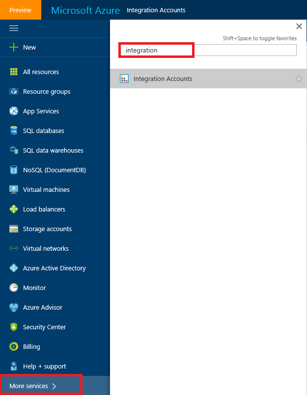
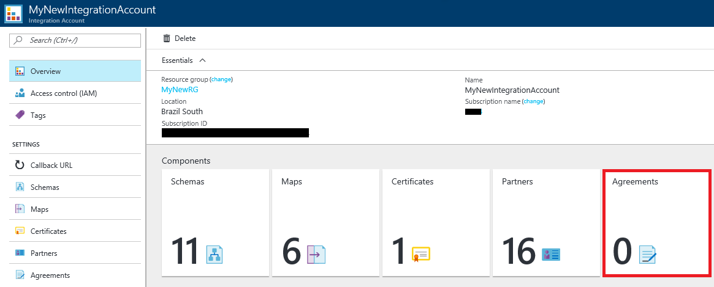
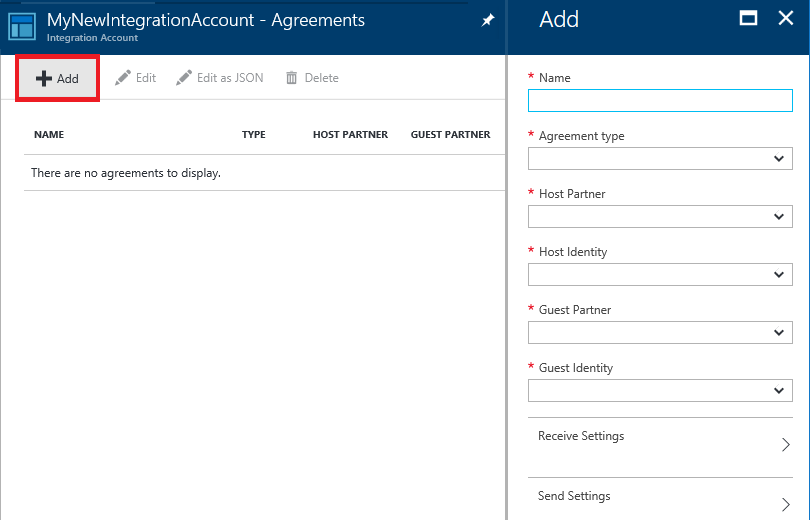
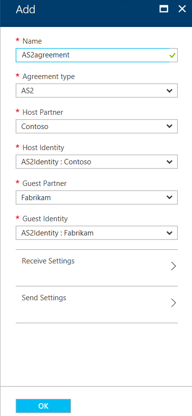
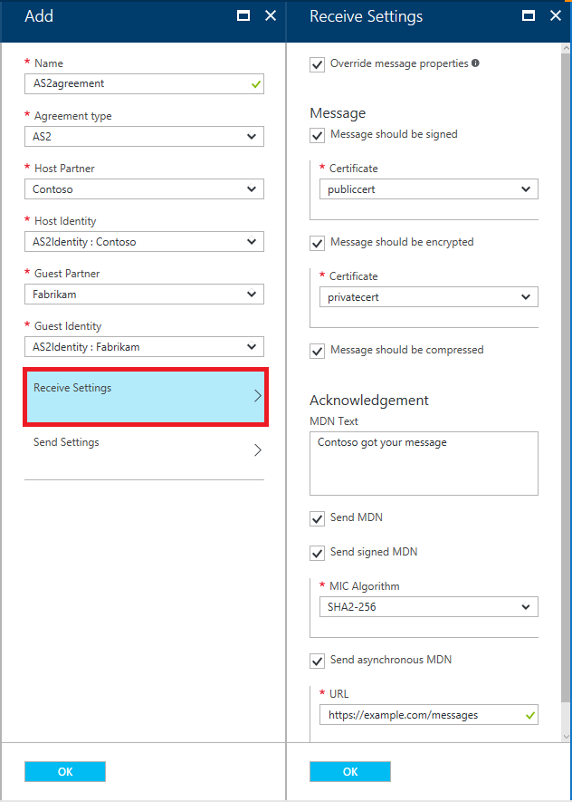
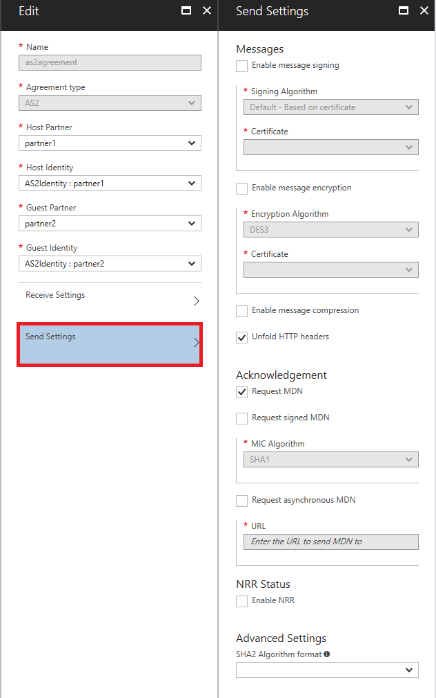
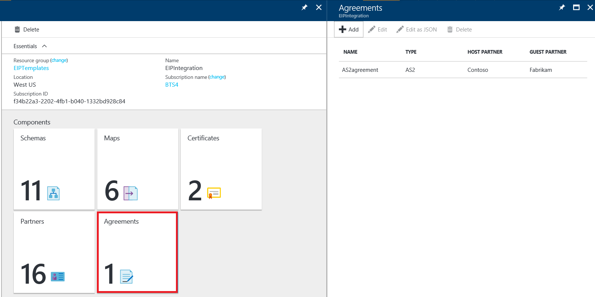

# Exchange AS2 messages for enterprise integration with logic apps

Before you can exchange AS2 messages for Azure Logic Apps, 
you must create an AS2 agreement and 
store that agreement in your integration account. 
Here are the steps for how to create an AS2 agreement.

## Before you start

Here's the items you need:

* An [integration account](../logic-apps/logic-apps-enterprise-integration-accounts.md) 
that's already defined and associated with your Azure subscription
* At least two [partners](logic-apps-enterprise-integration-partners.md) 
that are already defined in your integration account and configured with the AS2 qualifier under **Business Identities**

> [!NOTE]
> When you create an agreement, the content in the agreement file must match the agreement type.    

After you [create an integration account](../logic-apps/logic-apps-enterprise-integration-accounts.md) 
and [add partners](logic-apps-enterprise-integration-partners.md), 
you can create an AS2 agreement by following these steps.

## Create an AS2 agreement

1.  Sign in to the [Azure portal](http://portal.azure.com "Azure portal").  

2.  From the left menu, select **More services**. 
In the search box, enter **integration** as your filter. 
In the results list, select **Integration Accounts**.

    > [!TIP]
    > If you don't see **More services**, you might have to expand the menu first. 
    > At the top of the collapsed menu, select **Show menu**.

    

3. In the **Integration Accounts** blade that opens, 
select the integration account where you want to create the agreement.
If you don't see any integration accounts, 
[create one first](../logic-apps/logic-apps-enterprise-integration-accounts.md "All about integration accounts").  

    

4. Choose the **Agreements** tile. If you don't have an Agreements tile, 
add the tile first.

    

5. In the Agreements blade that opens, choose **Add**.

    

6. Under **Add**, enter a **Name** for your agreement. 
For **Agreement type**, select **AS2**. 
Select the **Host Partner**, **Host Identity**, 
**Guest Partner**, and **Guest Identity** for your agreement.

      

    | Property | Description |
    | --- | --- |
    | Name |Name of the agreement |
    | Agreement Type | Should be AS2 |
    | Host Partner |An agreement needs both a host and guest partner. The host partner represents the organization that configures the agreement. |
    | Host Identity |An identifier for the host partner |
    | Guest Partner |An agreement needs both a host and guest partner. The guest partner represents the organization that's doing business with the host partner. |
    | Guest Identity |An identifier for the guest partner |
    | Receive Settings |These properties apply to all messages received by an agreement. |
    | Send Settings |These properties apply to all messages sent by an agreement. |

## Configure how your agreement handles received messages

Now that you've set the agreement properties, 
you can configure how this agreement identifies and 
handles incoming messages received from your partner through this agreement.

1.  Under **Add**, select **Receive Settings**.
Configure these properties based on your agreement 
with the partner that exchanges messages with you. 
For property descriptions, see the table in this section.

    

2. Optionally, you can override the properties of incoming messages by selecting **Override message properties**.

3. To require all incoming messages to be signed, select **Message should be signed**. 
From the **Certificate** list, select an existing 
[guest partner public certificate](../logic-apps/logic-apps-enterprise-integration-certificates.md) 
for validating the signature on the messages. Or create the certificate, if you don't have one.

4.  To require all incoming messages to be encrypted, select **Message should be encrypted**. 
From the **Certificate** list, select an existing 
[host partner private certificate](../logic-apps/logic-apps-enterprise-integration-certificates.md) 
for decrypting incoming messages. Or create the certificate, if you don't have one.

5. To require messages to be compressed, select **Message should be compressed**.

6. To send a synchronous message disposition notification (MDN) for received messages, 
select **Send MDN**.

7. To send signed MDNs for received messages, select **Send signed MDN**.

8. To send asynchronous MDNs for received messages, 
select **Send asynchronous MDN**.

9. After you're done, 
make sure to save your settings by choosing **OK**.

Now your agreement is ready to handle incoming 
messages that conform to your selected settings.

| Property | Description |
| --- | --- |
| Override message properties |Indicates that properties in received messages can be overridden. |
| Message should be signed |Requires messages to be digitally signed. Configure the guest partner public certificate for signature verification.  |
| Message should be encrypted |Requires messages to be encrypted. Non-encrypted messages are rejected. Configure the host partner private certificate for decrypting the messages.  |
| Message should be compressed |Requires messages to be compressed. Non-compressed messages are rejected. |
| MDN Text |The default message disposition notification (MDN) to be sent to the message sender. |
| Send MDN |Requires MDNs to be sent. |
| Send signed MDN |Requires MDNs to be signed. |
| MIC Algorithm |Select the algorithm to use for signing messages. |
| Send asynchronous MDN | Requires messages to be sent asynchronously. |
| URL | Specify the URL where to send the MDNs. |

## Configure how your agreement sends messages

You can configure how this agreement identifies and handles outgoing 
messages that you send to your partners through this agreement.

1.  Under **Add**, select **Send Settings**.
Configure these properties based on your agreement 
with the partner that exchanges messages with you. 
For property descriptions, see the table in this section.

    

2. To send signed messages to your partner, select **Enable message signing**. 
For signing the messages, in the **MIC Algorithm** list, 
select the *host partner private certificate MIC Algorithm*. 
And in the **Certificate** list, select an existing 
[host partner private certificate](../logic-apps/logic-apps-enterprise-integration-certificates.md).

3. To send encrypted messages to the partner, select **Enable message encryption**. 
For encrypting the messages, in the **Encryption Algorithm** list, 
select the *guest partner public certificate algorithm*.
And in the **Certificate** list, select an existing 
[guest partner public certificate](../logic-apps/logic-apps-enterprise-integration-certificates.md).

4. To compress the message, select **Enable message compression**.

5. To unfold the HTTP content-type header into a single line, select **Unfold HTTP headers**.

6. To receive synchronous MDNs for the sent messages, select **Request MDN**.

7. To receive signed MDNs for the sent messages, select **Request signed MDN**.

8. To receive asynchronous MDNs for the sent messages, select **Request asynchronous MDN**. 
If you select this option, enter the URL for where to send the MDNs.

9. To require non-repudiation of receipt, select **Enable NRR**.  

10. To specify algorithm format to use in the MIC or signing in the outgoing headers of the AS2 message or MDN, select **SHA2 Algorithm format**.  

11. After you're done, 
make sure to save your settings by choosing **OK**.

Now your agreement is ready to handle outgoing 
messages that conform to your selected settings.

| Property | Description |
| --- | --- |
| Enable message signing |Requires all messages that are sent from the agreement to be signed. |
| MIC Algorithm |The algorithm to use for signing messages. Configures the host partner private certificate MIC Algorithm for signing the messages. |
| Certificate |Select the certificate to use for signing messages. Configures the host partner private certificate for signing the messages. |
| Enable message encryption |Requires encryption of all messages that are sent from this agreement. Configures the guest partner public certificate algorithm for encrypting the messages. |
| Encryption Algorithm |The encryption algorithm to use for message encryption. Configures the guest partner public certificate for encrypting the messages. |
| Certificate |The certificate to use to encrypt messages. Configures the guest partner private certificate for encrypting the messages. |
| Enable message compression |Requires compression of all messages that are sent from this agreement. |
| Unfold HTTP headers |Places the HTTP content-type header onto a single line. |
| Request MDN |Requires an MDN for all messages that are sent from this agreement. |
| Request signed MDN |Requires all MDNs that are sent to this agreement to be signed. |
| Request asynchronous MDN |Requires asynchronous MDNs to be sent to this agreement. |
| URL |Specify the URL where to send the MDNs. |
| Enable NRR |Requires non-repudiation of receipt (NRR), a communication attribute that provides evidence that the data was received as addressed. |
| SHA2 Algorithm format |Select algorithm format to use in the MIC or signing in the outgoing headers of the AS2 message or MDN |

## Find your created agreement

1.  After you finish setting all your agreement properties, 
on the **Add** blade, choose **OK** to finish creating your agreement 
and return to your integration account blade.

    Your newly added agreement now appears in your **Agreements** list.

2.  You can also view your agreements in your integration account overview. 
On your integration account blade, choose **Overview**, then select the **Agreements** tile. 

    

## View the swagger
See the [swagger details](/connectors/as2/). 

## Next steps
* [Learn more about the Enterprise Integration Pack](logic-apps-enterprise-integration-overview.md "Learn about Enterprise Integration Pack")  
