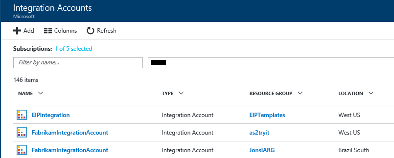
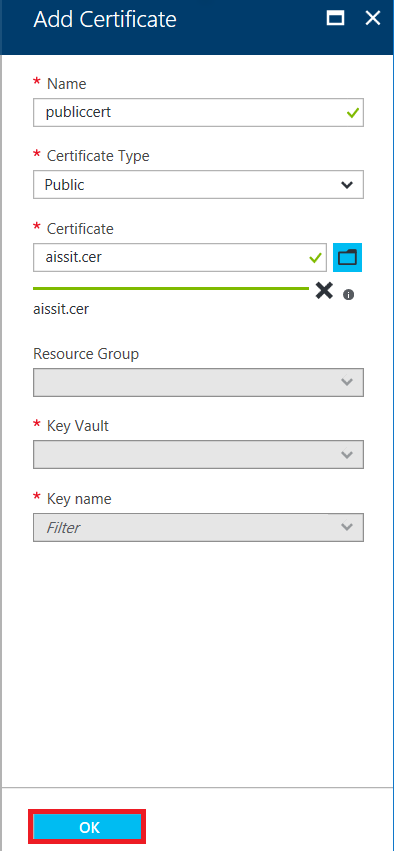
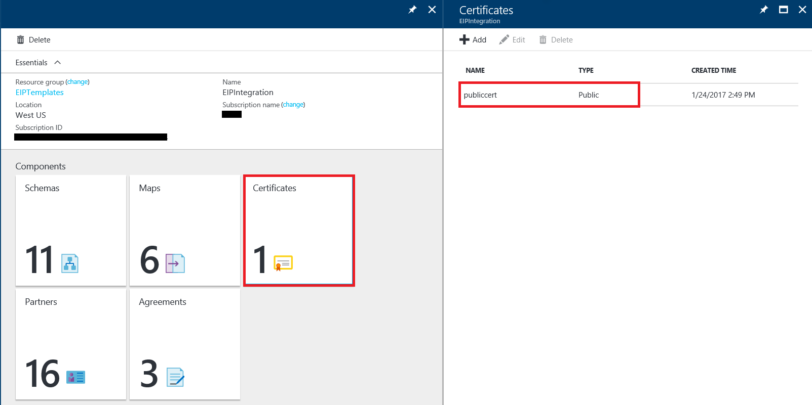
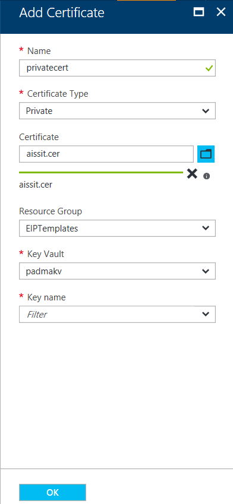
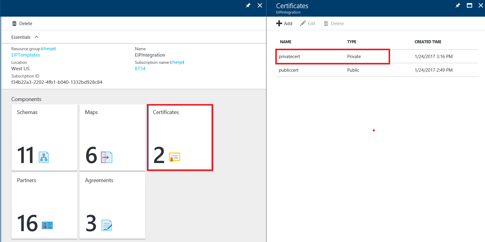

# Learn about certificates and Enterprise Integration Pack
## Overview
Enterprise integration uses certificates to secure B2B communications. You can use two types of certificates in your enterprise integration apps:

* Public certificates, which must be purchased from a certification authority (CA).
* Private certificates, which you can issue yourself. These certificates are sometimes referred to as self-signed certificates.

## What are certificates?
Certificates are digital documents that verify the identity of the participants in electronic communications and that also secure electronic communications.

## Why use certificates?
Sometimes B2B communications must be kept confidential. Enterprise integration uses certificates to secure these communications in two ways:

* By encrypting the contents of messages
* By digitally signing messages  

## Upload a public certificate

To use a *public certificate* in your logic apps with B2B capabilities, you first need to upload the certificate into your integration account.  

After you upload a certificate, it's available to help you secure your B2B messages when you define their properties in the [agreements](logic-apps-enterprise-integration-agreements.md) that you create.  

Here are the detailed steps for uploading your public certificates into your integration account after you sign in to the Azure portal:

1. Select **More services** and enter **integration** in the filter search box. Select **Integration Accounts** from the results list     
  
2. Select the integration account to which you want to add the certificate.  
  
3. Select the **Certificates** tile.  

4. In the **Certificates** blade that opens, select the **Add** button.   

5. Enter a **Name** for your certificate, and then select the certificate type as **public** from the dropdown.  
6. Select the folder icon on the right side of the **Certificate** text box. When the file picker opens, find and select the certificate file that you want to upload to your integration account.
7. Select the certificate, and then select **OK** in the file picker. This validates and uploads the certificate to your integration account.
8. Finally, back on the **Add certificate** blade, select the **OK** button.  
  
9. Select the **Certificates** tile. You should see the newly added certificate.  
  

## Upload a private certificate

To use a *private certificate* in your logic apps with B2B capabilities, You can upload a private certificate to your integration account by taking the following steps

1. [Upload your private key to Key Vault](../key-vault/key-vault-get-started.md "Learn about Key Vault") and provide a **Key Name** 
   
   > [!TIP]
   > You must authorize Logic Apps to perform operations on Key Vault. You can grant access to the Logic Apps service principal by using the following PowerShell command: `Set-AzureRmKeyVaultAccessPolicy -VaultName 'TestcertKeyVault' -ServicePrincipalName '7cd684f4-8a78-49b0-91ec-6a35d38739ba' -PermissionsToKeys decrypt, sign, get, list`  
   > 
   > 

After you've taken the previous step, add a private certificate to integration account.

Following are the detailed steps for uploading your private certificates into your integration account after you sign in to the Azure portal:  
 
1. Select the integration account to which you want to add the certificate and select the **Certificates** tile.  
  
2. In the **Certificates** blade that opens, select the **Add** button.   

3. Enter a **Name** for your certificate, and select the certificate type as **private** from the dropdown.   
4. select the folder icon on the right side of the **Certificate** text box. When the file picker opens, find the corresponding public certificate that you want to upload to your integration account.   
   
   > [!Note]
   > While adding a private certificate it is important to add corresponding public certificate to show in [AS2 agreement](logic-apps-enterprise-integration-as2.md) receive and send settings for signing and encrypting the messages.
   > 
   >   

5. Select the **Resource Group**, **Key Vault**, **Key Name** and select the **OK** button.  
  
6. Select the **Certificates** tile. You should see the newly added certificate.
  

* [Create a B2B agreement](logic-apps-enterprise-integration-agreements.md)  
* [Learn more about Key Vault](../key-vault/key-vault-get-started.md "Learn about Key Vault")  

