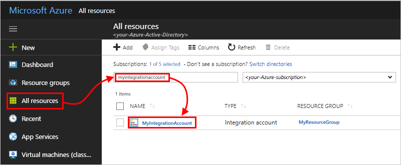
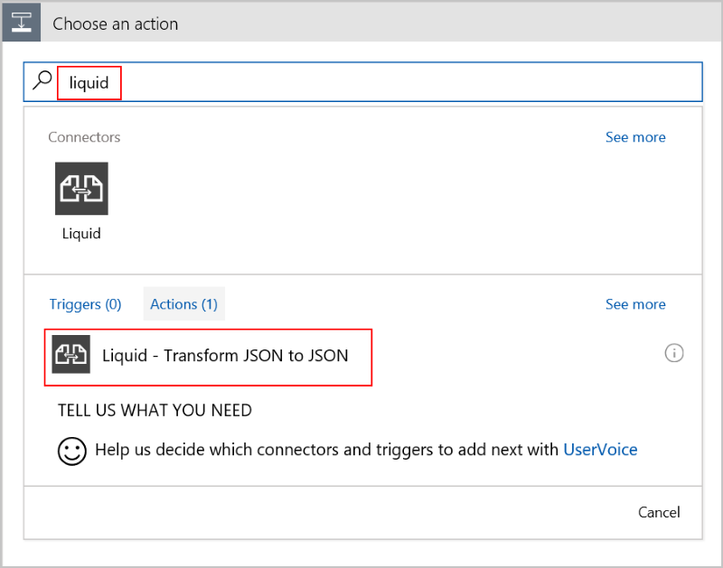
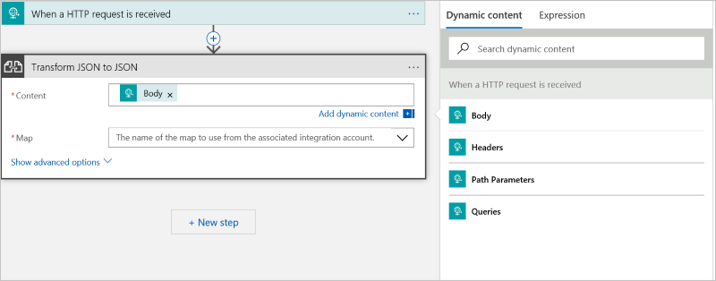
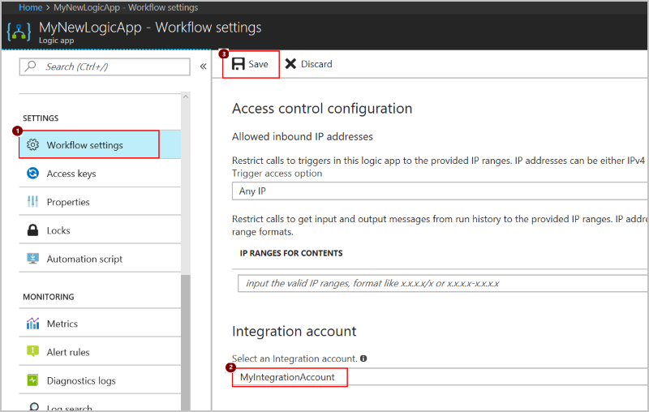
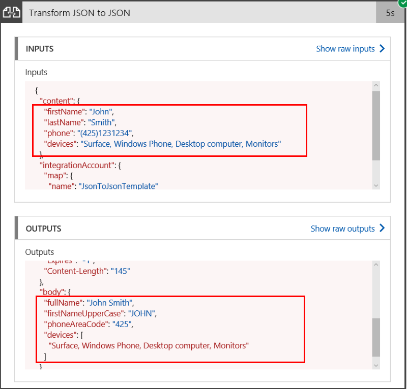

# Perform advanced JSON transformations with a Liquid template

Azure Logic Apps supports basic JSON transformations through 
native data operation actions such as **Compose** or **Parse JSON**. 
For advanced JSON transformations, you can use Liquid templates with your logic apps. 
[Liquid](https://shopify.github.io/liquid/) is an open-source template language for flexible web apps.
 
In this article, learn how to use a Liquid map or template, 
which supports more complex JSON transformations, 
such as iterations, control flows, variables, and so on. 
Before you can perform a Liquid transformation in your logic app, 
you must define the mapping from JSON to JSON with a Liquid map 
and store that map in your integration account.

## Prerequisites

* An Azure subscription. If you don't have a subscription, you can 
[start with a free Azure account](https://azure.microsoft.com/free/). 
Otherwise, you can [sign up for a Pay-As-You-Go subscription](https://azure.microsoft.com/pricing/purchase-options/).

* Basic knowledge about [how to create logic apps](../logic-apps/quickstart-create-first-logic-app-workflow.md)

* A basic [Integration Account](logic-apps-enterprise-integration-create-integration-account.md)


## Create a Liquid template or map for your integration account

1. Create the sample Liquid template for this example. 
   The Liquid template defines how to transform JSON input as described here:

   ``` json
   
      {
        "fullName": "{{content.firstName | Append: ' ' | Append: content.lastName}}",
        "firstNameUpperCase": "{{content.firstName | Upcase}}",
        "phoneAreaCode": "{{content.phone | Slice: 1, 3}}",
        "devices" : [
        
            
            "{{device}}"
            
            "{{device}}",
            
        
        ]
      }
   ```
   > [!NOTE]
   > If your Liquid template uses any 
   > [filters](https://shopify.github.io/liquid/basics/introduction/#filters), 
   > those filters must start with uppercase. 

2. Sign in to the [Azure portal](https://portal.azure.com).

3. On the main Azure menu, choose **All resources**. 

4. In the search box, find and select your integration account.

   

5. On the integration account tile, select **Maps**.

   

6. Choose **Add** and provide these details for your map:

   * **Name**: The name for your map, which is "JsontoJsonTemplate" in this example
   * **Map type**: The type for your map. For JSON to JSON transformation, you must select **liquid**.
   * **Map**: An existing Liquid template or map file to use for transformation, 
   which is "SimpleJsonToJsonTemplate.liquid" in this example. To find this file, you can use the file picker.

   
    
## Add the Liquid action for JSON transformation

1. [Create a logic app](../logic-apps/quickstart-create-first-logic-app-workflow.md).

2. Add the [Request trigger](../connectors/connectors-native-reqres.md#use-the-http-request-trigger) to your logic app.

3. Choose **+ New step > Add an action**. In the search box, enter *liquid*, 
and select **Liquid - Transform JSON to JSON**.

   

4. In the **Content** box, select **Body** from dynamic content list or parameters list, whichever appears.
  
   
 
5. From the **Map** list, select your Liquid template, which is "JsonToJsonTemplate" in this example.

   

   If the list is empty, your logic app is likely not linked to your integration account. 
   To link your logic app to the integration account that has the Liquid template or map, 
   follow these steps:

   1. On your logic app menu, select **Workflow settings**.
   2. From the **Select an Integration account** list, 
   select your integration account, and choose **Save**.

   

## Test your logic app

Post JSON input to your logic app from [Postman](https://www.getpostman.com/postman) or a similar tool. 
The transformed JSON output from your logic app looks like this example:
  


## Next steps

* [Learn more about the Enterprise Integration Pack](../logic-apps/logic-apps-enterprise-integration-overview.md "Learn about Enterprise Integration Pack")  
* [Learn more about maps](../logic-apps/logic-apps-enterprise-integration-maps.md "Learn about enterprise integration maps")  

