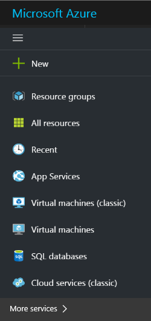
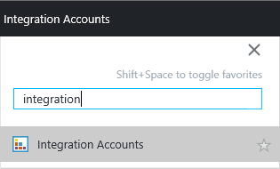
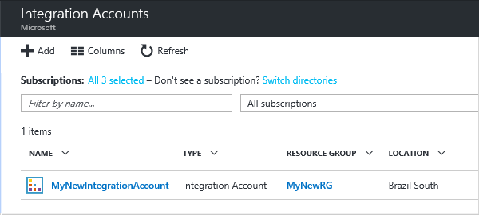
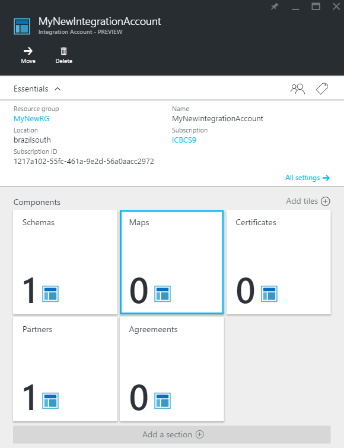
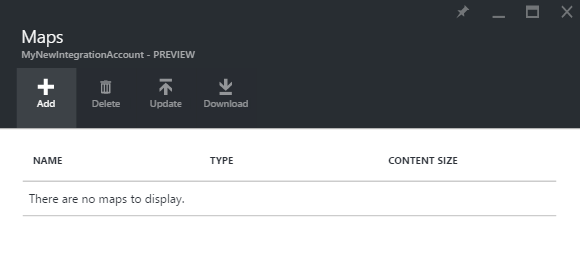
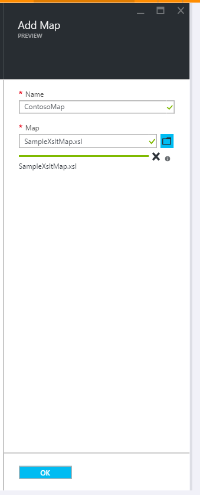
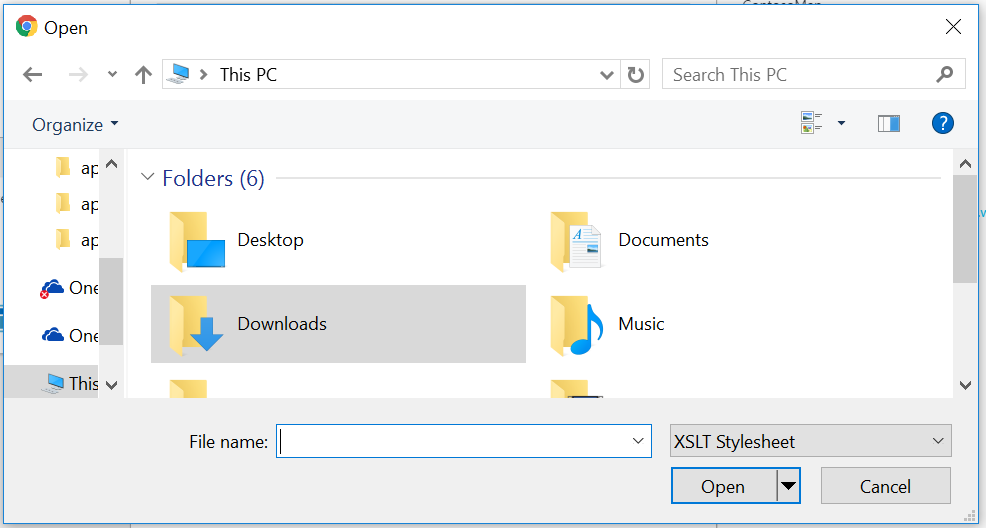

# Add maps for XML data transform

Enterprise integration uses maps to transform XML data between formats. 
A map is an XML document that defines the data in a document that 
should be transformed into another format. 

## Why use maps?

Suppose that you regularly receive B2B orders or invoices from a customer who uses the YYYMMDD format for dates. However, in your organization, you store dates in the MMDDYYY format. You can use a map to *transform* the YYYMMDD date format into the MMDDYYY before storing the order or invoice details in your customer activity database.

## How do I create a map?

You can create BizTalk Integration projects with the 
[Enterprise Integration Pack](logic-apps-enterprise-integration-overview.md "Learn about the enterprise integration pack") for Visual Studio 2015. 
You can then create an Integration Map file that lets you 
visually map items between two XML schema files. 
After you build this project, you will have an XSLT document.

## How do I add a map?

1. In the Azure portal, select **Browse**.

    

2. In the filter search box, enter **integration**, 
then select **Integration Accounts** from the results list.

    

3. Select the integration account where you want to add the map.

    

4. Select the **Maps** tile.

    

5. After the Maps blade opens, choose **Add**.

      

6. Enter a **Name** for your map. To upload the map file, 
choose the folder icon on the right side of the **Map** text box. 
After the upload process completes, choose **OK**.

    

7. After Azure adds the map to your integration account, 
you get an onscreen message that shows whether your map file 
was added or not. After you get this message, 
choose the **Maps** tile so you can view the newly added map.

    

## How do I edit a map?

You must upload a new map file with the changes that you want. 
You can first download the map for editing.

To upload a new map that replaces the existing map, 
follow these steps.

1. Choose the **Maps** tile.

2. After the Maps blade opens, select the map that you want to edit.

3. On the **Maps** blade, choose **Update**.

    

4. In the file picker, select the map file that you want to upload, 
then select **Open**.

    

## How to delete a map?

1. Choose the **Maps** tile.

2. After the Maps blade opens, select the map you want to delete.

3. Choose **Delete**.

    

4. Confirm that you want to delete the map.

    

## Next Steps
* [Learn more about the Enterprise Integration Pack](logic-apps-enterprise-integration-overview.md "Learn about Enterprise Integration Pack")  
* [Learn more about agreements](../logic-apps/logic-apps-enterprise-integration-agreements.md "Learn about enterprise integration agreements")  
* [Learn more about transforms](logic-apps-enterprise-integration-transform.md "Learn about enterprise integration transforms")  

