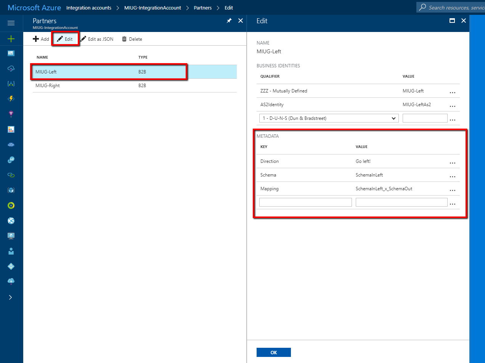
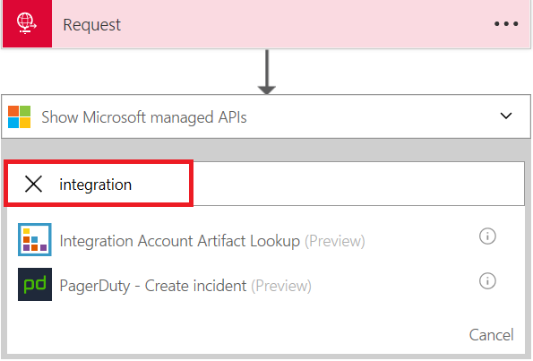
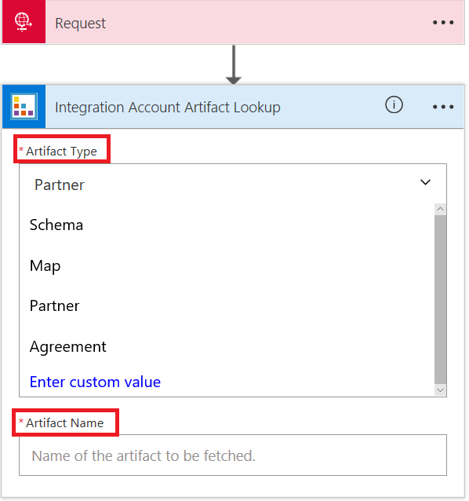
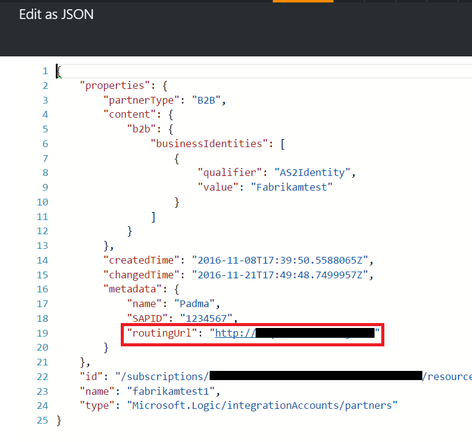
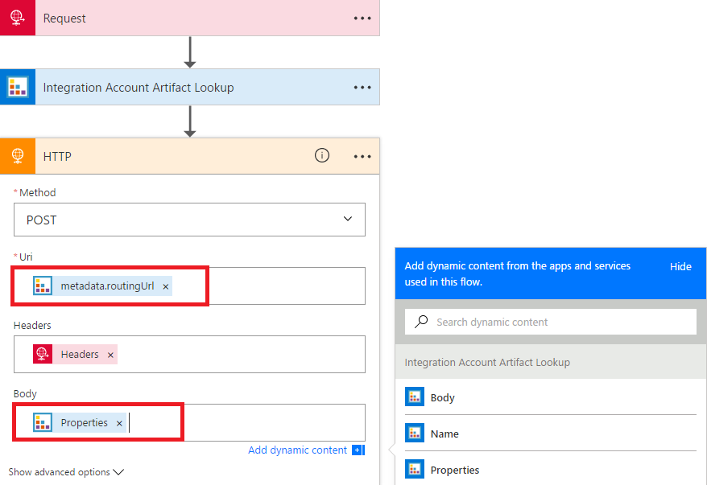

# Manage artifact metadata in integration accounts for logic apps

You can define custom metadata for artifacts in integration accounts and retrieve 
that metadata during runtime for your logic app. For example, you can specify metadata 
for artifacts like partners, agreements, schemas, and maps - all store metadata using key-value pairs. 
Currently, artifacts can't create metadata through UI, but you can use REST APIs to create metadata. 
To add metadata when you create or select a partner, 
agreement, or schema in the Azure portal, choose **Edit**. To retrieve artifact 
metadata in logic apps, you can use the Integration Account Artifact Lookup feature.

## Add metadata to artifacts in integration accounts

1. Create an [integration account](logic-apps-enterprise-integration-create-integration-account.md).

2. Add an artifact to your integration account, for example, 
a [partner](logic-apps-enterprise-integration-partners.md#how-to-create-a-partner), 
[agreement](logic-apps-enterprise-integration-agreements.md#how-to-create-agreements), 
or [schema](logic-apps-enterprise-integration-schemas.md).

3.	Select the artifact, choose **Edit**, and enter metadata details.

	

## Retrieve metadata from artifacts for logic apps

1. Create a [logic app](quickstart-create-first-logic-app-workflow.md).

2. Create a [link from your logic app to your integration account](logic-apps-enterprise-integration-create-integration-account.md#link-an-integration-account-to-a-logic-app). 

3. In Logic App Designer, add a trigger like *Request* or *HTTP* to your logic app.

4.	Choose **Next Step** > **Add an action**. Search for *integration* 
so you can find and then select **Integration Account - Integration Account Artifact Lookup**.

	

5. Select the **Artifact Type**, and provide the **Artifact Name**.

	

## Example: Retrieve partner metadata

Partner metadata has these `routingUrl` details:

1. In your logic app, add your trigger, 
an **Integration Account - Integration Account Artifact Lookup** action for your partner, 
and an **HTTP**.

	

2. To retrieve the URI, go to Code View for your logic app. Your logic app definition 
should look like this example:

	

## Next steps
* [Learn more about agreements](logic-apps-enterprise-integration-agreements.md "Learn about enterprise integration agreements")  
