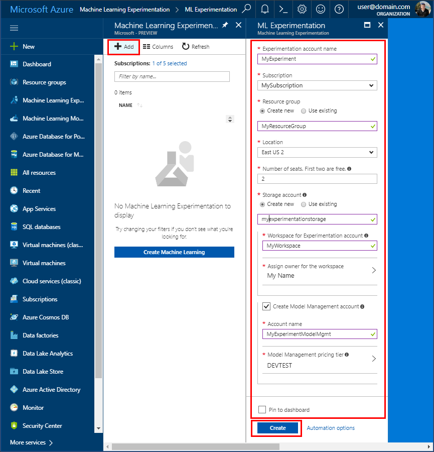
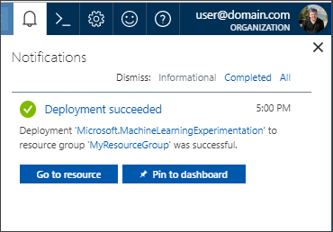
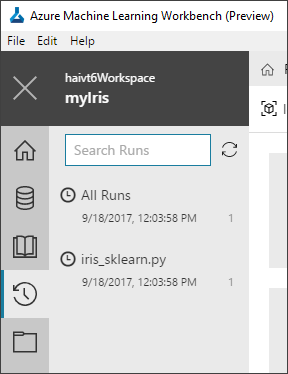
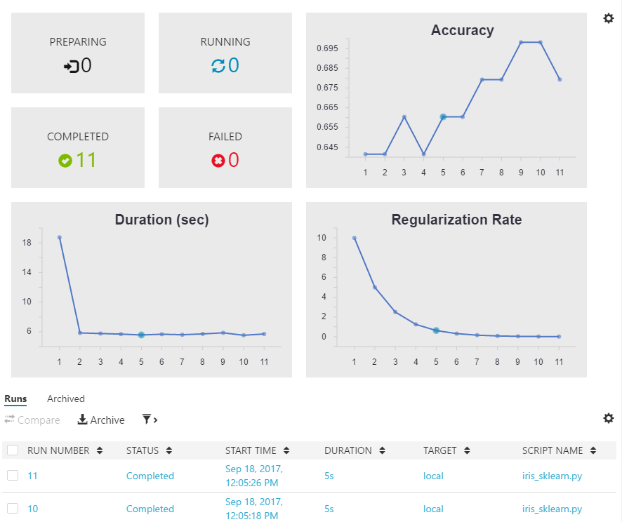

# Create Azure Machine Learning Preview accounts and install Azure Machine Learning Workbench
Azure Machine Learning services (preview) is an integrated, end-to-end data science and advanced analytics solution. It helps professional data scientists to prepare data, develop experiments, and deploy models at cloud scale.

This Quickstart shows you how to create experimentation and model management accounts in Azure Machine Learning Preview. It also shows you how to install the Azure Machine Learning Workbench desktop application and CLI tools. Next, you take a quick tour of Azure Machine Learning Preview features by using the [Iris flower dataset](https://en.wikipedia.org/wiki/iris_flower_data_set) to build a model that predicts the type of iris based on some of its physical characteristics.  

If you don't have an Azure subscription, create a [free account](https://azure.microsoft.com/free/?WT.mc_id=A261C142F) before you begin.

## Prerequisites

Currently, you can install the Azure Machine Learning Workbench desktop app on only the following operating systems: 
- Windows 10
- Windows Server 2016
- macOS Sierra
- macOS High Sierra

## Sign in to the Azure portal
Sign in to the [Azure portal](https://portal.azure.com/).

## Create Azure Machine Learning accounts
Use the Azure portal to provision Azure Machine Learning accounts: 
1. Select the **New** button (+) in the upper-left corner of the portal.

2. Enter **Machine Learning** in the search bar. Select the search result named **Machine Learning Experimentation (preview)**.  Click the star icon to make this selection a favorite in the Azure portal.

   

3. Select **+ Add** to configure a new Machine Learning Experimentation account. The detailed form opens.

   

4. Fill out the Machine Learning Experimentation form with the following information:

   Setting|Suggested value|Description
   ---|---|---
   Experimentation account name | _Unique name_ |Choose a unique name that identifies your account. You can use your own name, or a departmental or project name that best identifies the experiment. The name should be 2 to 32 characters. It should include only alphanumeric characters and the dash (-) character. 
   Subscription | _Your subscription_ |Choose the Azure subscription that you want to use for your experiment. If you have multiple subscriptions, choose the appropriate subscription in which the resource is billed.
   Resource group | _Your resource group_ | You can make a new resource group name, or you can use an existing one from your subscription.
   Location | _The region closest to your users_ | Choose the location that's closest to your users and the data resources.
   Number of seats | 2 | Enter the number of seats. This selection affects the [pricing](https://azure.microsoft.com/pricing/details/machine-learning/). The first two seats are free. Use two seats for the purposes of this Quickstart. You can update the number of seats later as needed in the Azure portal.
   Storage account | _Unique name_ | Select **Create new** and provide a name to create an Azure storage account. Or, select **Use existing** and select your existing storage account from the drop-down list. The storage account is required and is used to hold project artifacts and run history data. 
   Workspace for Experimentation account | _Unique name_ | Provide a name for the new workspace. The name should be 2 to 32 characters. It should include only alphanumeric characters and the dash (-) character.
   Assign owner for the workspace | _Your account_ | Select your own account as the workspace owner.
   Create Model Management account | *check* | As part of the Experimentation account creation experience, you have the option of also creating the Machine Learning Model Management account. This resource is used when you're ready to deploy and manage your models as real-time web services. We recommend creating the Model Management account at the same time as the Experimentation account.
   Account name | _Unique name_ | Choose a unique name that identifies your Model Management account. You can use your own name, or a departmental or project name that best identifies the experiment. The name should be 2 to 32 characters. It should include only alphanumeric characters and the dash (-) character. 
   Model Management pricing tier | **DEVTEST** | Select **No pricing tier selected** to specify the pricing tier for your new Model Management account. For cost savings, select the **DEVTEST** pricing tier if it's available on your subscription (limited availability). Otherwise, select the S1 pricing tier for cost savings. Click **Select** to save the pricing tier selection. 
   Pin to dashboard | _check_ | Select the **Pin to dashboard** option to allow easy tracking of your Machine Learning Experimentation account on the front dashboard page of the Azure portal.

5. Select **Create** to begin the creation process.

6. On the Azure portal toolbar, click **Notifications** (bell icon) to monitor the deployment process. 

   The notification shows **Deployment in progress**. The status changes to **Deployment succeeded** when it's done. Your Machine Learning Experimentation account page opens upon success.
   
   

Now, depending on which operating system you use on your local computer, follow one of the next two sections to install Azure Machine Learning Workbench. 

## Install Azure Machine Learning Workbench on Windows
Install Azure Machine Learning Workbench on your computer running Windows 10, Windows Server 2016, or newer.

1. Download the latest Azure Machine Learning Workbench installer
[AmlWorkbenchSetup.msi](https://aka.ms/azureml-wb-msi).

2. Double-click the downloaded installer **AmlWorkbenchSetup.msi** from File Explorer.

   >[!IMPORTANT]
   >Download the installer fully on disk, and then run it from there. Do not run it directly from your browser's download widget.

3. Finish the installation by following the on-screen instructions.

   The installer downloads all the necessary dependent components, such as Python, Miniconda, and other related libraries. The installation might take around half an hour to finish all the components. 

4. Azure Machine Learning Workbench is now installed in the following directory:
   
   `C:\Users\<user>\AppData\Local\AmlWorkbench`

## Install Azure Machine Learning Workbench on macOS
Install Azure Machine Learning Workbench on your computer running macOS Sierra or later.

1. Download the latest Azure Machine Learning Workbench installer,
[AmlWorkbench.dmg](https://aka.ms/azureml-wb-dmg).

   >[!IMPORTANT]
   >Download the installer fully on disk, and then run it from there. Do not run it directly from your browser's download widget.

2. Double-click the downloaded installer **AmlWorkbench.dmg** from Finder.

3. Finish the installation by following the on-screen instructions.

   The installer downloads all the necessary dependent components, such as Python, Miniconda, and other related libraries. The installation might take around half an hour to finish all the components. 

4. Azure Machine Learning Workbench is now installed in the following directory: 

   `/Applications/Azure ML Workbench.app`

## Run Azure Machine Learning Workbench to sign in for the first time
1. After the installation process is complete, select the **Launch Workbench** button on the last screen of the installer. If you have closed the installer, find the shortcut to Machine Learning Workbench on your desktop and **Start** menu named **Azure Machine Learning Workbench** to start the app.

2. Sign in to Workbench by using the same account that you used earlier to provision your Azure resources. 

3. When the sign-in process has succeeded, Workbench attempts to find the Machine Learning Experimentation accounts that you created earlier. It searches for all Azure subscriptions to which your credential has access. When at least one Experimentation account is found, Workbench opens with that account. It then lists the workspaces and projects found in that account. 

   >[!TIP]
   > If you have access to more than one Experimentation account, you can switch to a different one by selecting the avatar icon in the lower-left corner of the Workbench app.

For information about creating an environment for deploying your web services, see [Deployment environment setup](deployment-setup-configuration.md).

## Create a new project
1. Start the Azure Machine Learning Workbench app and sign in. 

2. Select **File** > **New Project** (or select the **+** sign in the **PROJECTS** pane). 

3. Fill in the **Project name** and **Project directory** boxes. **Project description** is optional but helpful. Leave the **Visualstudio.com GIT Repository URL** box blank for now. Choose a workspace, and select **Classifying Iris** as the project template.

   >[!TIP]
   >Optionally, you can fill in the Git repo text box with the URL of a Git repo that is hosted in a [Visual Studio Team Services](https://www.visualstudio.com) project. This Git repo must already exist, and it must be empty with no master branch. And you must have write access to it. Adding a Git repo now lets you enable roaming and sharing scenarios later. [Read more](using-git-ml-project.md).

4. Select the **Create** button to create the project. A new project is created and opened for you. At this point, you can explore the project home page, data sources, notebooks, and source code files. 

    >[!TIP]
    >You can also open the project in Visual Studio Code or other editors simply by configuring an integrated development environment (IDE) link, and then opening the project directory in it. [Read more](how-to-configure-your-IDE.md). 

## Run a Python script
Let's run a script on your local computer. 

1. Each project opens to its own **Project Dashboard** page. Select **local** as the execution target from the command bar near the top of the application, and select **iris_sklearn.py** as the script to run. There are other files included in the sample that you can check out later. 

   

2. In the **Arguments** text box, enter **0.01**. This number is used in the code to set the regularization rate. It's a value that's used to configure how the linear regression model is trained. 

3. Select the **Run** button to begin running **iris_sklearn.py** on your computer. 

   This code uses the [logistic regression](https://en.wikipedia.org/wiki/logistic_regression) algorithm from the popular Python [scikit-learn](http://scikit-learn.org/stable/index.html) library to build the model.

4. The **Jobs** panel slides out from the right if it is not already visible, and an **iris_sklearn** job is added in the panel. Its status transitions from **Submitting** to **Running** as the job begins to run, and then to **Completed** in a few seconds. 

   Congratulations. You have successfully executed a Python script in Azure Machine Learning Workbench.

6. Repeat steps 2 to 4 several times. Each time, use different argument values that range from **10** to **0.001**.

## View run history
1. Go to the **Runs** view, and select **iris_sklearn.py** in the run list. The run history dashboard for **iris_sklearn.py** opens. It shows every run that was executed on **iris_sklearn.py**. 

   

2. The run history dashboard also displays the top metrics, a set of default graphs, and a list of metrics for each run. You can customize this view by sorting, filtering, and adjusting the configurations. Just select the configuration icon or the filter icon.

   

3. Select a completed run, and you can see a detailed view for that specific execution. Details include additional metrics, the files that it produced, and other potentially useful logs.

## Next steps
You have now successfully created an Azure Machine Learning Experimentation account and an Azure Machine Learning Model Management account. You have installed the Azure Machine Learning Workbench desktop app and command-line interface. You have created a new project, created a model by running a script, and explored the run history of the script.

For a more in-depth experience of this workflow, including how to deploy your Iris model as a web service, follow the full-length *Classifying Iris* tutorial. The tutorial contains detailed steps for [data preparation](tutorial-classifying-iris-part-1.md), [experimentation](tutorial-classifying-iris-part-2.md), and [model management](tutorial-classifying-iris-part-3.md). 

> [!div class="nextstepaction"]
> [Classifying Iris tutorial](tutorial-classifying-iris-part-1.md)
