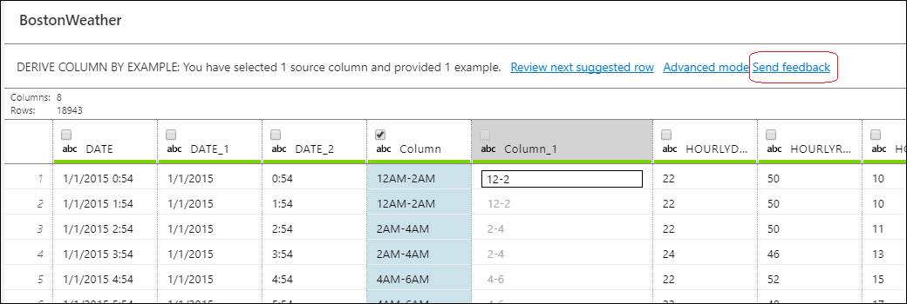

---
title: Azure ML Workbench release notes for sprint 3 January 2018
description: This document details the updates for the sprint 3 release of Azure ML 
services: machine-learning
author: raymondlaghaeian
ms.author: raymondl
manager: mwinkle
ms.reviewer: garyericson, jasonwhowell, mldocs
ms.service: machine-learning
ms.workload: data-services
ms.topic: article
ms.date: 01/22/2018
---

# Sprint 3 - January 2018 

#### Version number: 0.1.1712.18263

>Here is how you can [find the version number](https://docs.microsoft.com/en-us/azure/machine-learning/preview/known-issues-and-troubleshooting-guide).

Welcome to the fourth update of Azure Machine Learning Workbench. The following are the updates and improvements in this sprint. Many of these updates are made as direct result of user feedback. 

## Notable New Features and Changes
- Updates to the authentication stack forces login and account selection at startup

## Detailed Updates
Following is a list of detailed updates in each component area of Azure Machine Learning in this sprint.

### Workbench
- Ability to install/uninstall the app from Add/Remove Programs
- Updates to the authentication stack forces login and account selection at start-up
- Improved Single Sign On (SSO) experience on Windows
- Users that belong to multiple tenants with different credentials will now be able to sign into Workbench

#### UI
- General improvements and bug fixes

### Notebooks
- General improvements and bug fixes

### Data preparation 
- Improved auto-suggestions while performing By Example transformations
- Improved algorithm for Pattern Frequency inspector
- Ability to send sample data and feedback while performing By Example transformations 

- Spark Runtime Improvements
- Scala has replaced Pyspark
- Fixed inability to close Data Not Applicable for the Time Series Inspector 
- Fixed the hang time for Data Prep execution for HDI

### Model Management CLI updates 
  - Ownership of the subscription is no longer required for provisioning resources. Contributor access to the resource group will be sufficient to set up the deployment environment.
  - Enabled local environment setup for free subscriptions 
