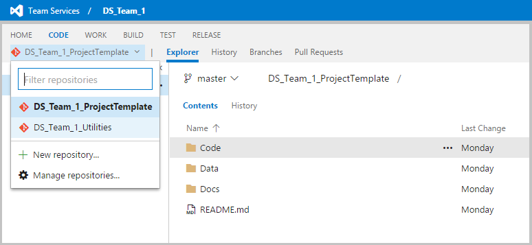
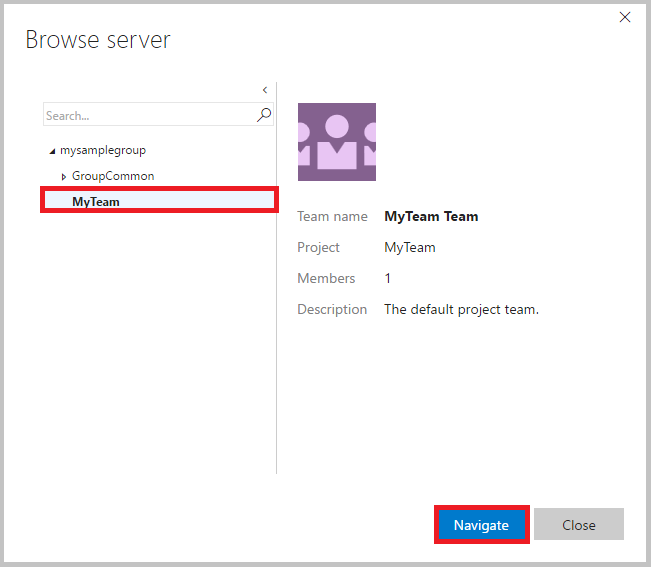
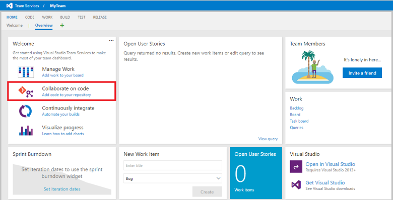
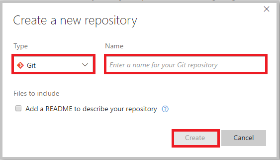
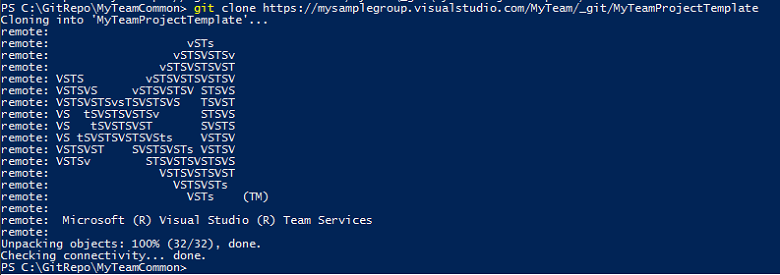
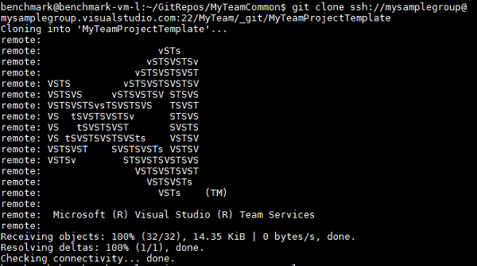
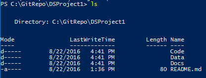

# Project Lead tasks

This tutorial outlines the tasks that a project lead is expected to complete for his/her project team. The objective is to establish collaborative team environment that standardizes on the [Team Data Science Process](overview.md) (TDSP). The TDSP is a framework developed by Microsoft that provides a structured sequence of activities to execute cloud-based, predictive analytics solutions efficiently. For an outline of the personnel roles and their associated tasks that are handled by a data science team standardizing on this process, see [Team Data Science Process roles and tasks](roles-tasks.md).

A **Project Lead** manages the daily activities of individual data scientists on a specific data science project. The workflow for the tasks to be completed by project leads to set up this environment are depicted in the following figure:

This topic currently covers tasks 1,2 and 6 of this workflow for project leads.

>[AZURE.NOTE] We outline the steps needed to set up a TDSP team environment for a project using Visual Studio Team Services (VSTS) in the following instructions. We specify how to accomplish these tasks with VSTS because that is how we implement TDSP at Microsoft. If another code-hosting platform is used for your group, the tasks that need to be completed by the team lead generally do not change. But the way to complete these tasks is going to be different.

## Repositories and directories

This tutorial uses abbreviated names for repositories and directories. These names make it easier to follow the operations between the repositories and directories. This notation (R for Git repositories and D for local directories on your DSVM) is used in the following sections:

- **R3**: The team **ProjectTemplate** repository on Git your team lead has set up.
- **R5**: The project repository on Git you setup for your project.
- **D3**: The local directory cloned from R3.
- **D5**: The local directory cloned from R5.

## 0. Prerequisites

The prerequisites are satisfied by completing the tasks assigned to your group manager outlined in [Group Manager tasks for a data science team](group-manager-tasks.md) and to you team lead outlined in [Team lead tasks for a data science team](team-lead-tasks.md). 

To summarize here, the following requirements need to meet before you begin the team lead tasks: 

- Your **group VSTS server** (or group account on some other code-hosting platform) has been set up by your group manager.
- Your **TeamProjectTemplate repository** (R3) has been set up under your group account by your team lead on the code-hosting platform you plan to use.
- You have been **authorized** by your team lead to create repositories on your group account for your team.
- Git must be installed on your machine. If you are using a Data Science Virtual Machine (DSVM), Git has been pre-installed and you are good to go. Otherwise, see the [Platforms and tools appendix](platforms-and-tools.md#appendix).  
- If you are using a **Windows DSVM**, you need to have [Git Credential Manager (GCM)](https://github.com/Microsoft/Git-Credential-Manager-for-Windows) installed on your machine. In the README.md file, scroll down to the **Download and Install** section and click the *latest installer*. This takes you to the latest installer page. Download the .exe installer from here and run it. 
- If you are using **Linux DSVM**, create an SSH public key on your DSVM and add it to your group VSTS server. For more information about SSH, see the **Create SSH public key** section in the [Platforms and tools appendix](platforms-and-tools.md#appendix). 

## 1. Create a project repository (R5)

- Log in to your group VSTS server at *https://\<VSTS Server Name\>.visualstudio.com*. 
- Under **Recent projects & teams**, click **Browse**. A window that pops up lists all team projects on the VSTS server. 

    

- Click the team project name in which you are going to create your project repository. In this example, click **MyTeam**. 
- Then, click **Navigate** to be directed to the home page of the team project **MyTeam**:

    

- Click **Collaborate on code** to be directed to the git home page of your team project.  

    

- Click the downward arrow at the top left corner, and select **+ New repository**. 
    
    

- In the **Create a new repository** window, input a name for your project git repository. Make sure that you select **Git** as the type of the repository. In this example, we use the name *DSProject1*. 

    

- To create your ***DSProject1*** project git repository, click **Create**.

## 2. Seed the DSProject1 project repository

The task here is to seed the **DSProject1** project repository (R5) from your team project template repository (R3). The seeding procedure uses the directories D3 and D5 on your local DSVM as intermediate staging sites. In summary, the seeding path is: R3 -> D3 -> D5 -> R5.

If you need to customize your **DSProject1** project repository to meet some specific project needs, you do so in the penultimate step of following procedure. Here is a summary of the steps used to seed the content of the **DSProject1** project repository. The individual steps correspond to the subsections in the seeding procedure:

- Clone team project template repository into local directory: team R3 - cloned to -> local D3.
- Clone DSProject1 repository to a local directory: team R5 - cloned to -> local D5.
- Copy cloned team project template content to local clone of DSProject1 repository:  D3 - contents copied to -> D5.
- (Optional) Customization local D5.
- Push local DSProject1 content to team repositories: D5 - contents add to -> team R5.

### Clone your team project template repository (R3) to a directory (D3) on your local machine.

On your local machine, create a directory:

- *C:\GitRepos\MyTeamCommon* for Windows 
- *$home/GitRepos/MyTeamCommon* for Linux

Change to that directory. Then, run the following command to clone your team project template repository to your local machine. 

**Windows**
            
    git clone <the HTTPS URL of the TeamProjectTemplate repository>
    
If you are using VSTS as the code-hosting platform, typically, the *HTTPS URL of your team project template repository* is:

 ***https://\<VSTS Server Name\>.visualstudio.com/\<Your team project name\>/_git/\<Your team project template repository name\>***. 

In this example, we have:

***https://mysamplegroup.visualstudio.com/MyTeam/_git/MyTeamProjectTemplate***. 

            
**Linux**

    git clone <the SSH URL of the TeamProjectTemplate repository>
        

If you are using VSTS as the code-hosting platform, typically, the *SSH URL of the team project template repository* is:

***ssh://\<VSTS Server Name\>@\<VSTS Server Name\>.visualstudio.com:22/\<Your Team Project Name>/_git/\<Your team project template repository name\>.*** 

In this example, we have:

***ssh://mysamplegroup@mysamplegroup.visualstudio.com:22/MyTeam/_git/MyTeamProjectTemplate***. 

### Clone DSProject1 repository (R5) to a directory (D5) on your local machine

Change directory to **GitRepos**, and run the following command to clone your project repository to your local machine. 

**Windows**
            
    git clone <the HTTPS URL of the Project repository>

If you are using VSTS as the code-hosting platform, typically, the _HTTPS URL of the Project repository_ is ***https://\<VSTS Server Name\>.visualstudio.com/\<Your Team Project Name>/_git/<Your project repository name\>***. In this example, we have ***https://mysamplegroup.visualstudio.com/MyTeam/_git/DSProject1***.

**Linux**

    git clone <the SSH URL of the Project repository>

If you are using VSTS as the code-hosting platform, typically, the _SSH URL of the project repository_ is _ssh://<VSTS Server Name\>@<VSTS Server Name\>.visualstudio.com:22/<Your Team Project Name>/\_git/<Your project repository name\>. In this example, we have ***ssh://mysamplegroup@mysamplegroup.visualstudio.com:22/MyTeam/_git/DSProject1***.

### Copy contents of D3 to D5 

Now in your local machine, you need to copy the content of _D3_ to _D5_, except the git metadata in .git directory. The following scripts will do the job. Make sure to type in the correct and full paths to the directories. Source folder is the one for your team (_D3_); destination folder is the one for your project (_D5_).    

**Windows**
    
    wget "https://raw.githubusercontent.com/Azure/Azure-MachineLearning-DataScience/master/Misc/TDSP/tdsp_local_copy_win.ps1" -outfile "tdsp_local_copy_win.ps1"
    .\tdsp_local_copy_win.ps1 -role 3
    

Now you can see in _DSProject1_ folder, all the files (excluding the .git) are copied from _MyTeamProjectTemplate_.

**Linux**
            
    wget "https://raw.githubusercontent.com/Azure/Azure-MachineLearning-DataScience/master/Misc/TDSP/tdsp_local_copy_linux.sh"
    bash tdsp_local_copy_linux.sh 3
        

Now you can see in _DSProject1_ folder, all the files (except the metadata in .git) are copied from _MyTeamProjectTemplate_.

### Customize D5 if you need to (Optional)

If your project needs some specific directories or documents, other than the ones you get from your team project template (copied to your D5 directory in the previous step), you can customize the content of D5 now. 

### Add contents of DSProject1 in D5 to R5 on your group VSTS server

You now need to push contents in **_DSProject1_** to _R5_ repository in your team project on your group's VSTS server. 

- Change to directory **D5**. 
- Use the following git commands to add the contents in **D5** to **R5**. The commands are the same for both Windows and Linux systems. 
    
    git status
    git add .
    git commit -m"push from win DSVM"
    git push
    
- Commit the change and push. 

>[AZURE.NOTE] If this is the first time you commit to a Git repository, you need to configure global parameters *user.name* and *user.email* before you run the `git commit` command. Run the following two commands:
        
    git config --global user.name <your name>
    git config --global user.email <your email address>
 
> If you are committing to multiple Git repositories, use the same name and email address across all of them. Using the same name and email address proves convenient later on when you build PowerBI dashboards to track your Git activities on multiple repositories.

## 6. Create and mount Azure file storage as project resources (Optional)

If you want to create Azure file storage to share data, such as the project raw data or the features generated for your project, so that all project members have access to the same datasets from multiple DSVMs, follow the instructions in sections 3 and 4 of [Team Lead tasks for a data science team](team-lead-tasks.md). 

## Next steps

Here are links to the more detailed descriptions of the roles and tasks defined by the Team Data Science Process:

- [Group Manager tasks for a data science team](group-manager-tasks.md)
- [Team Lead tasks for a data science team](team-lead-tasks.md)
- [Project Lead tasks for a data science team](project-lead-tasks.md)
- [Project Individual Contributors for a data science team](project-ic-tasks.md)