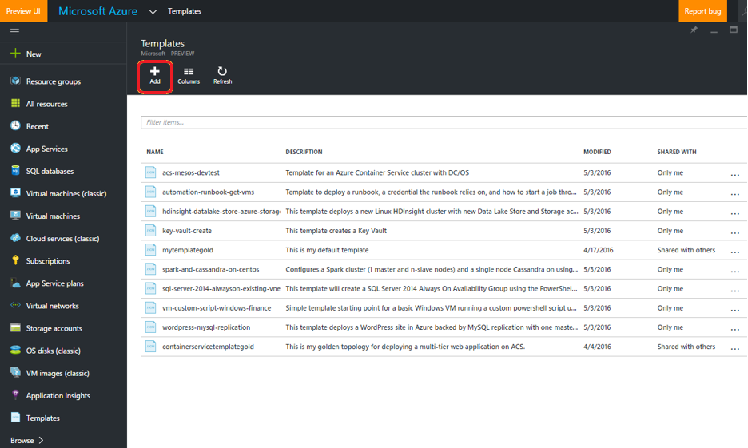
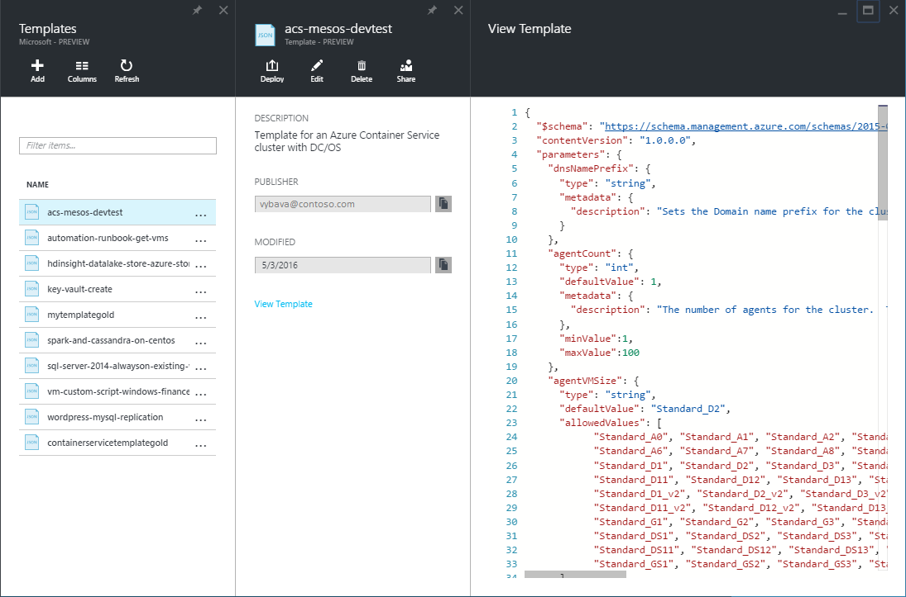
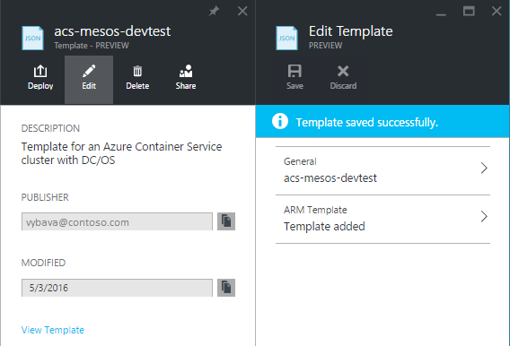
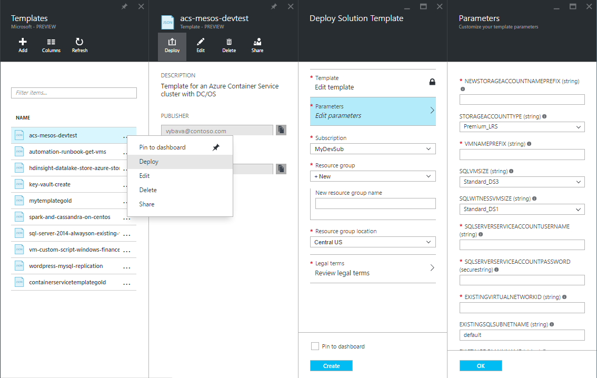
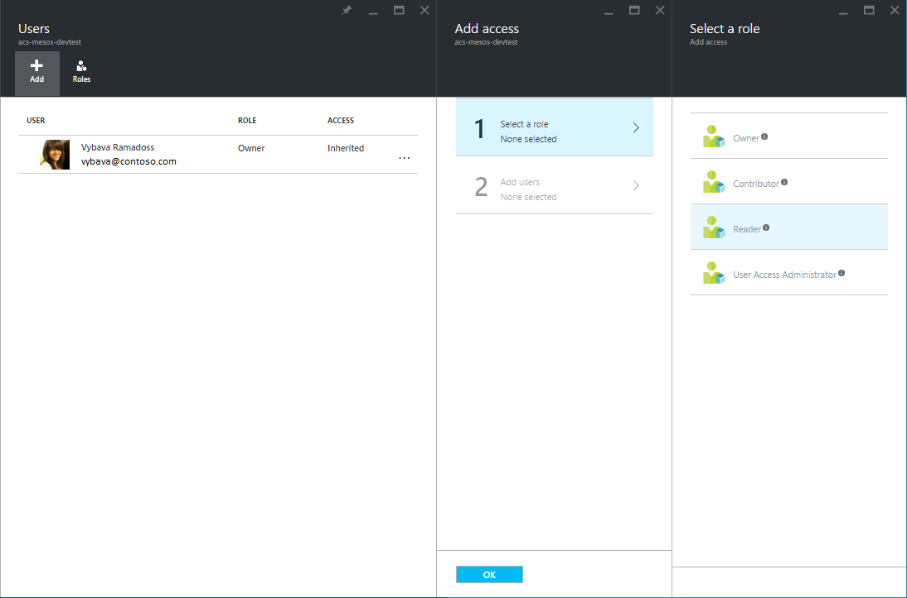
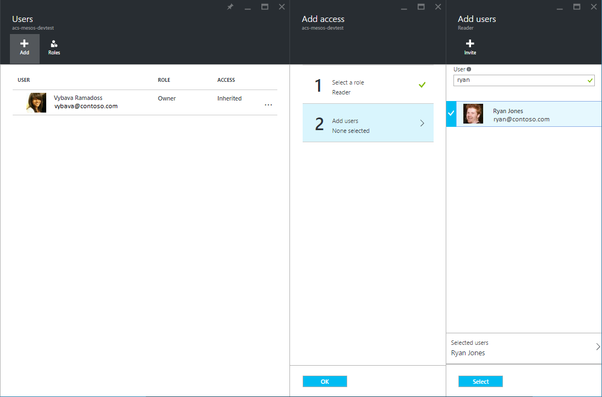

# Get started with private Templates on the Azure portal
An [Azure Resource Manager](../azure-resource-manager/resource-group-authoring-templates.md) template is a declarative template used to define your deployment. You can define the resources to deploy for a solution, and specify parameters and variables that enable you to input values for different environments. The template consists of JSON and expressions, which you can use to construct values for your deployment.

You can use the new **Templates** capability in the [Azure portal](https://portal.azure.com) along with the **Microsoft.Gallery** resource provider as an extension of the [Azure Marketplace](https://azure.microsoft.com/marketplace/) to enable users to create, manage, and deploy private templates from a personal library.

> [!NOTE]
> Instead of using private templates in the portal, Microsoft recommends that you create a service catalog application through [Managed Applications](../managed-applications/overview.md). You can make the service catalog application available to users in your organization.

This document walks you through adding, managing, and sharing a private **Template** using the Azure portal.

## Guidance
The following suggestions help you take full advantage of **Templates** when working with your solutions:

* A **Template** is an encapsulating resource that contains a Resource Manager template and additional metadata. It behaves similarly to an item in the Marketplace. The key difference is that it is a private item as opposed to the public Marketplace items.
* The **Templates** library works well for users who need to customize their deployments.
* **Templates** work well for users who need a simple repository within Azure.
* Start with an existing Resource Manager template. Find templates in [github](https://github.com/Azure/azure-quickstart-templates) or [Export template](../azure-resource-manager/resource-manager-export-template.md) from an existing resource group.
* **Templates** are tied to the user who publishes them. The publisher name is visible to everyone who has read access to it.
* **Templates** are Resource Manager resources and cannot be renamed once published.

## Add a Template resource
There are two ways to create a **Template** resource in the Azure portal.

### Method 1: Create a new Template resource from a running resource group
1. Navigate to an existing resource group on the Azure portal. Select **Export template** in **Settings**.
2. Once the Resource Manager template is exported, use the **Save Template** button to save it to the **Templates** repository. Find complete details for Export template [here](../azure-resource-manager/resource-manager-export-template.md).
     
   
3. Select the **Save to Template** command button.
     
4. Enter the following information:
   
   * Name – Name of the template object (NOTE: This field is an Azure Resource Manager based name. All naming restrictions apply and it cannot be changed once created).
   * Description – Quick summary about the template.
     
     
5. Click **Save**.
   
   > [!NOTE]
   > The portal shows notifications when the exported Resource Manager template has errors, but you will still be able to save this Resource Manager template to the Templates. Ensure that you check and fix any Resource Manager template issues before redeploying the exported Resource Manager template.
   > 
   > 

### Method 2: Add a new Template resource from browse
You can also add a new **Template** from scratch using the +Add command button in **Browse > Templates**. Provide a Name, Description, and the Resource Manager template JSON.

> [!NOTE]
> Microsoft.Gallery is a Tenant-based Azure resource provider. The Template resource is tied to the user who created it. It is not tied to any specific subscription. Choose a subscription when deploying a template.
> 
> 

## View Template resources
All **Templates** available to you can be seen at **Browse > Templates**. The available templates include ones have created as well as ones that have been shared with you with varying levels of permissions. For more information, see [access control](#access-control-for-a-tenant-resource-provider).

You can view the details of a **Template** by clicking into an item in the list.

## Edit a Template resource
You can initiate the edit flow for a **Template** by right-clicking the item on the Browse list or by choosing the Edit command button.

You can edit the description or Resource Manager template text. You cannot edit the name since it is a Resource Manager resource name. When you edit the Resource Manager template JSON, we validate to ensure that it is valid JSON. Choose **OK** and then **Save** to save your updated template.

Once the Template is saved, you see a confirmation notification.

## Deploy a Template resource
You can deploy any **Template** that you have **Read** permissions on. Fill out the values for the Resource Manager template parameters to proceed with the deployment.

## Share a Template resource
A **Template** resource can be shared with your peers. Sharing behaves similarly to [role assignment for any resource on Azure](../active-directory/role-based-access-control-configure.md). The **Template** owner provides permissions to other users who can interact with a Template resource. The person or group of people you share the **Template** are able to see the Resource Manager template and its gallery properties.

### Access control for the Microsoft.Gallery resources
| Role | Permissions |
| --- | --- |
| Owner |Allows full control on the Template resource including Share |
| Reader |Allows Read and Execute(Deploy) on the Template resource |
| Contributor |Allows Edit and Delete permission on the Template resource. User cannot Share the Template with others |

Select **Share** on the browse item by right-clicking or when viewing a specific item.

 You can now choose a role and a user or group to provide access to a particular **Template**. The available roles are Owner, Reader, and Contributor.

Click **Select** and **Ok**. You can now see the users or groups you added to the resource.

> [!NOTE]
> A Template can only be shared with users and groups in the same Azure Active Directory tenant. If you share a Template with an email address that is not in your tenant, an invitation is sent asking the user to join the tenant as a guest.
> 
> 

## Next steps
* To learn about creating Resource Manager templates, see [Authoring templates](../azure-resource-manager/resource-group-authoring-templates.md)
* To understand the functions you can use in a Resource Manager template, see [Template functions](../azure-resource-manager/resource-group-template-functions.md)

