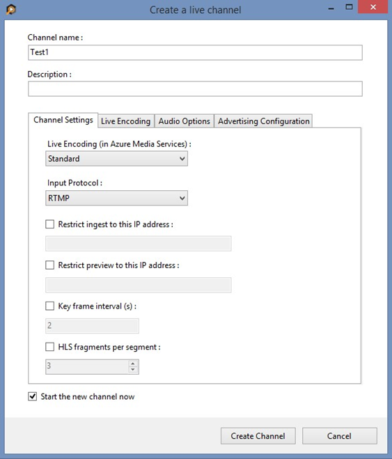
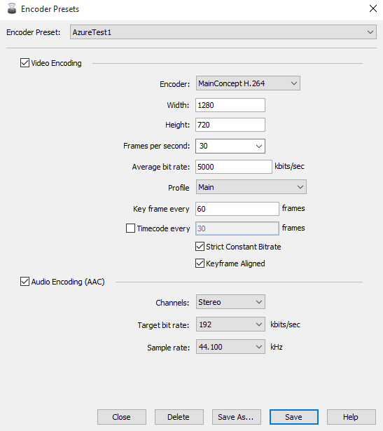

# Use the Wirecast encoder to send a single bitrate live stream
> [!div class="op_single_selector"]
> * [Wirecast](media-services-configure-wirecast-live-encoder.md)
> * [Elemental Live](media-services-configure-elemental-live-encoder.md)
> * [Tricaster](media-services-configure-tricaster-live-encoder.md)
> * [FMLE](media-services-configure-fmle-live-encoder.md)
>
>

This article shows how to configure the [Telestream Wirecast](http://www.telestream.net/wirecast/overview.htm) live encoder to send a single bitrate stream to AMS channels that are enabled for live encoding.  For more information, see [Working with Channels that are Enabled to Perform Live Encoding with Azure Media Services](media-services-manage-live-encoder-enabled-channels.md).

This tutorial shows how to manage Azure Media Services (AMS) with Azure Media Services Explorer (AMSE) tool. This tool only runs on Windows PC. If you are on Mac or Linux, use the Azure portal to create [channels](media-services-portal-creating-live-encoder-enabled-channel.md#create-a-channel) and [programs](media-services-portal-creating-live-encoder-enabled-channel.md).

## Prerequisites
* [Create an Azure Media Services account](media-services-portal-create-account.md)
* Ensure there is a Streaming Endpoint running. For more information, see [Manage Streaming Endpoints in a Media Services Account](media-services-portal-manage-streaming-endpoints.md)
* Install the latest version of the [AMSE](https://github.com/Azure/Azure-Media-Services-Explorer) tool.
* Launch the tool and connect to your AMS account.

## Tips
* Whenever possible, use a hardwired internet connection.
* A good rule of thumb when determining bandwidth requirements is to double the streaming bitrates. While this is not a mandatory requirement, it helps mitigate the impact of network congestion.
* When using software-based encoders, close out any unnecessary programs.

## Create a channel
1. In the AMSE tool, navigate to the **Live** tab, and right-click within the channel area. Select **Create channel…** from the menu.

	

2. Specify a channel name, the description field is optional. Under Channel Settings, select **Standard** for the Live Encoding option, with the Input Protocol set to **RTMP**. You can leave all other settings as is.

	Make sure the **Start the new channel now** is selected.

3. Click **Create Channel**.

   

> [!NOTE]
> The channel can take as long as 20 minutes to start.
>
>

While the channel is starting, you can [configure the encoder](media-services-configure-wirecast-live-encoder.md#configure_wirecast_rtmp).

> [!IMPORTANT]
> Billing starts as soon as Channel goes into a ready state. For more information, see [Channel's states](media-services-manage-live-encoder-enabled-channels.md#states).
>
>

## Configure the Telestream Wirecast encoder
In this tutorial, the following output settings are used. The rest of this section describes configuration steps in more detail.

**Video**:

* Codec: H.264
* Profile: High (Level 4.0)
* Bitrate: 5000 kbps
* Keyframe: 2 seconds (60 seconds)
* Frame Rate: 30

**Audio**:

* Codec: AAC (LC)
* Bitrate: 192 kbps
* Sample Rate: 44.1 kHz

### Configuration steps
1. Open the Telestream Wirecast application on the machine being used, and set up for RTMP streaming.
2. Configure the output by navigating to the **Output** tab and selecting **Output Settings…**.

    Make sure the **Output Destination** is set to **RTMP Server**.
3. Click **OK**.
4. On the settings page, set the **Destination** field to be **Azure Media Services**.

    The Encoding profile is pre-selected to **Azure H.264 720p 16:9 (1280x720)**. To customize these settings, select the gear icon to the right of the drop-down, and then choose **New Preset**.

    
5. Configure encoder presets.

    Name the preset, and check for the following recommended settings:

    **Video**

   * Encoder: MainConcept H.264
   * Frames per Second: 30
   * Average bit rate: 5000 kbits/sec (Can be adjusted based on network limitations)
   * Profile: Main
   * Key frame every: 60 frames

    **Audio**

   * Target bit rate: 192 kbits/sec
   * Sample Rate: 44.100 kHz

     
6. Press **Save**.

    The Encoding field now has the newly created profile available for selection.

    Make sure the new profile is selected.
7. Get the channel's input URL in order to assign it to the Wirecast **RTMP Endpoint**.

    Navigate back to the AMSE tool, and check on the channel completion status. Once the State has changed from **Starting** to **Running**, you can get the input URL.

    When the channel is running, right-click the channel name, navigate down to hover over **Copy Input URL to clipboard** and then select **Primary Input
    URL**.  

    
8. In the Wirecast **Output Settings** window, paste this information in the **Address** field of the output section, and assign a stream name.

    

1. Select **OK**.
2. On the main **Wirecast** screen, confirm input sources for video and audio are ready and then hit **Stream** in the top left-hand corner.

   

> [!IMPORTANT]
> Before you click **Stream**, you **must** ensure that the Channel is ready.
> Also, make sure not to leave the Channel in a ready state without an input contribution feed for longer than > 15 minutes.
>
>

## Test playback

Navigate to the AMSE tool, and right-click the channel to be tested. From the menu, hover over **Playback the Preview** and select **with Azure Media Player**.  

    

If the stream appears in the player, then the encoder has been properly configured to connect to AMS.

If an error is received, the channel needs to be reset and encoder settings adjusted. See the [troubleshooting](media-services-troubleshooting-live-streaming.md) article for guidance.  

## Create a program
1. Once channel playback is confirmed, create a program. Under the **Live** tab in the AMSE tool, right-click within the program area and select **Create New Program**.  

    
2. Name the program and, if needed, adjust the **Archive Window Length** (which defaults to four hours). You can also specify a storage location or leave as the default.  
3. Check the **Start the Program now** box.
4. Click **Create Program**.  

   >[!NOTE]
   >Program creation takes less time than channel creation.
       
5. Once the program is running, confirm playback by right-clicking the program and navigating to **Playback the program(s)** and then selecting **with Azure Media Player**.  
6. Once confirmed, right-click the program again and select **Copy the Output URL to Clipboard** (or retrieve this information from the **Program information and settings** option from the menu).

The stream is now ready to be embedded in a player, or distributed to an audience for live viewing.  

## Troubleshooting
See the [troubleshooting](media-services-troubleshooting-live-streaming.md) article for guidance.

## Media Services learning paths
[!INCLUDE [media-services-learning-paths-include](../../includes/media-services-learning-paths-include.md)]

## Provide feedback
[!INCLUDE [media-services-user-voice-include](../../includes/media-services-user-voice-include.md)]
