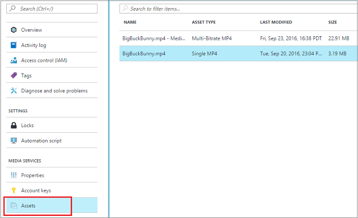
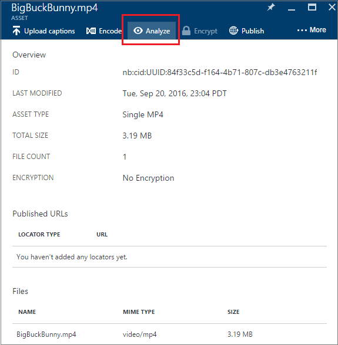
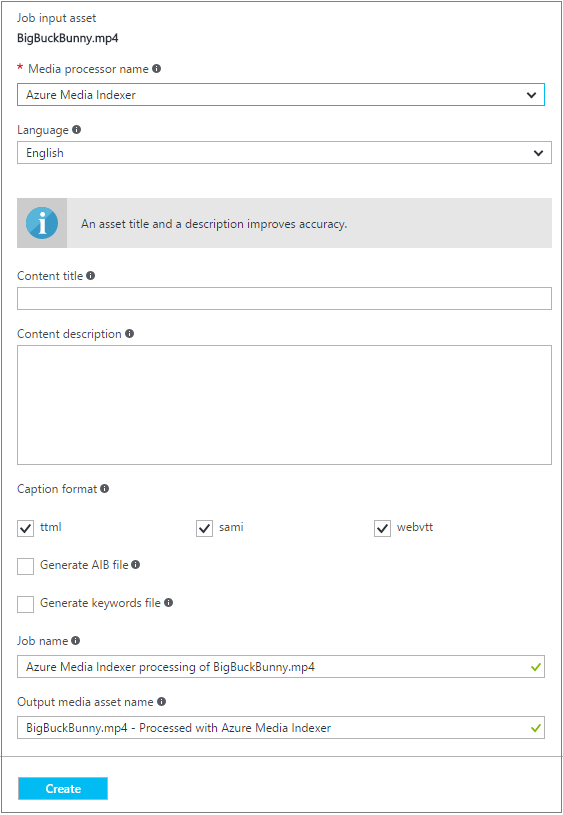
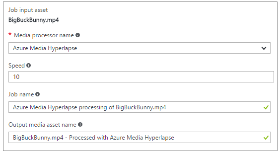
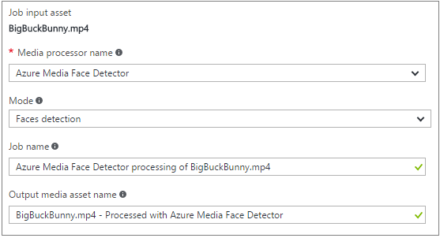
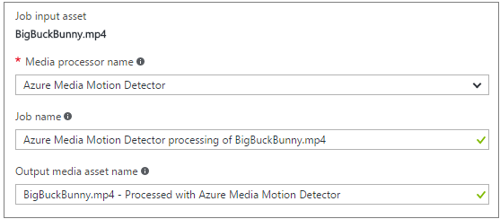
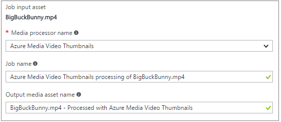
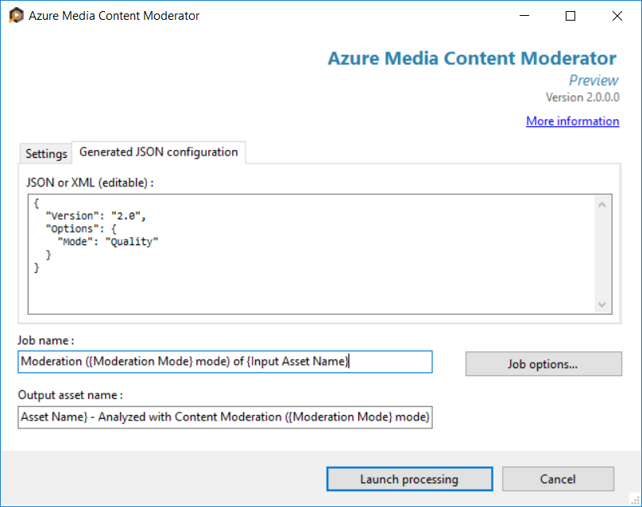

# Analyze your media using the Azure portal
> [!NOTE]
> To complete this tutorial, you need an Azure account. For details, see [Azure Free Trial](https://azure.microsoft.com/pricing/free-trial/). 
> 
> 

## Overview
Azure Media Services Analytics is a collection of speech and vision components (at enterprise scale, compliance, security and global reach) that make it easier for organizations and enterprises to derive actionable insights from their video files. For more detailed overview of Azure Media Services Analytics see [this](media-services-analytics-overview.md) topic. 

This topic discusses how to process your media with Media Analytics media processors (MPs) using the Azure portal. Media Analytics MPs produce MP4 files or JSON files. If a media processor produced an MP4 file, you progressively download the file. If a media processor produced a JSON file, you download the file from the Azure blob storage. 

## Choose an asset that you want to analyze
1. In the [Azure portal](https://portal.azure.com/), select your Azure Media Services account.
2. In the **Settings** window, select **Assets**.  
   .
    
3. Select the asset that you would like to analyze and press the **Analyze** button.
   
    
4. In the **Process media asset with  Media Analytics** window, select the processor. 
   
    The rest of the article explains why and how to use each processor. 
5. Press **Create** to the start a job.

## Azure Media Indexer
The **Azure Media Indexer** media processor enables you to make media files and content searchable, as well as generate closed captioning tracks. This section gives some details about options that you specify for this MP.

### Language
The natural language to be recognized in the multimedia file. For example, English or Spanish. 

### Captions
You can choose a caption format that will be generated from your content. An indexing job can generate closed caption files in the following formats:  

* **SAMI**
* **TTML**
* **WebVTT**

Closed Caption (CC) files in these formats can be used to make audio and video files accessible to people with hearing disability.

### AIB file
Select this option if you would like to generate the Audio Index Blob file for use with the custom SQL Server IFilter. For more information, see [this](https://azure.microsoft.com/blog/using-aib-files-with-azure-media-indexer-and-sql-server/) blog.

### Keywords
Select this option if you would like to generate a keywords XML file. This file contains keywords extracted from the speech content, with frequency and offset information.

### Job name
A friendly name that lets you identify the job. [This](media-services-portal-check-job-progress.md) article describes how you can monitor the progress of a job. 

### Output file
A friendly name that lets you identify the output content. 

## Azure Media Hyperlapse
Azure Media Hyperlapse is an MP that creates smooth time-lapsed videos from first-person or action-camera content.  For more information, see [this](media-services-hyperlapse-content.md) topic. This section gives some details about options that you specify for this MP.

### Speed
Specify the speed with which to speed up the input video. The output is a stabilized and time-lapsed rendition of the input video.

### Job name
A friendly name that lets you identify the job. [This](media-services-portal-check-job-progress.md) article describes how you can monitor the progress of a job. 

### Output file
A friendly name that lets you identify the output content. 

## Azure Media Face Detector
The **Azure Media Face Detector** media processor (MP) enables you to count, track movements, and even gauge audience participation and reaction via facial expressions. This service contains two features: 

* **Face detection**
  
    Face detection finds and tracks human faces within a video. Multiple faces can be detected and subsequently be tracked as they move around, with the time and location metadata returned in a JSON file. During tracking, it will attempt to give a consistent ID to the same face while the person is moving around on screen, even if they are obstructed or briefly leave the frame.
  
  > [!NOTE]
  > This services does not perform facial recognition. An individual who leaves the frame or becomes obstructed for too long will be given a new ID when they return.
  > 
  > 
* **Emotion detection**
  
    Emotion Detection is an optional component of the Face Detection Media Processor that returns analysis on multiple emotional attributes from the faces detected, including happiness, sadness, fear, anger, and more. 

### Detection mode
One of the following modes can be used by the processor:

* face detection
* per face emotion detection
* aggregate emotion detection

### Job name
A friendly name that lets you identify the job. [This](media-services-portal-check-job-progress.md) article describes how you can monitor the progress of a job. 

### Output file
A friendly name that lets you identify the output content. 

## Azure Media Motion Detector
The **Azure Media Motion Detector** media processor (MP) enables you to efficiently identify sections of interest within an otherwise long and uneventful video. Motion detection can be used on static camera footage to identify sections of the video where motion occurs. It generates a JSON file containing a metadata with timestamps and the bounding region where the event occurred.

Targeted towards security video feeds, this technology is able to categorize motion into relevant events and false positives such as shadows and lighting changes. This allows you to generate security alerts from camera feeds without being spammed with endless irrelevant events, while being able to extract moments of interest from extremely long surveillance videos.

## Azure Media Video Thumbnails
This processor can help you create summaries of long videos by automatically selecting interesting snippets from the source video. This is useful when you want to provide a quick overview of what to expect in a long video. For detailed information and examples, see [Use Azure Media Video Thumbnails to Create a Video Summarization](media-services-video-summarization.md)

### Job name
A friendly name that lets you identify the job. [This](media-services-portal-check-job-progress.md) article describes how you can monitor the progress of a job. 

### Output file
A friendly name that lets you identify the output content. 

## Azure Media Content Moderator
This processor helps you detect potential adult and racy content in videos. The processor automatically detects shots and keyframes in the video. It scores the keyframes for possible adult or racy content, and suggests reviews based on default thresholds. For detailed information and examples, see [Use Azure Media Content Moderator to moderate videos](media-services-content-moderation.md)

### Version 
Use "2.0".

### Mode
The 2.0 version ignore the `Mode` setting.

## Next steps
View Media Services learning paths.

[!INCLUDE [media-services-learning-paths-include](../../includes/media-services-learning-paths-include.md)]

## Provide feedback
[!INCLUDE [media-services-user-voice-include](../../includes/media-services-user-voice-include.md)]
