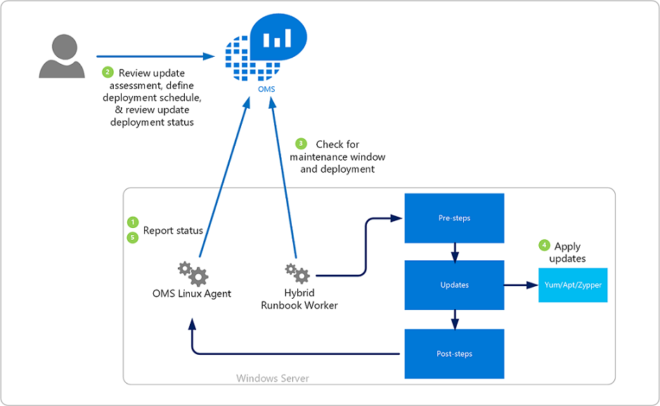
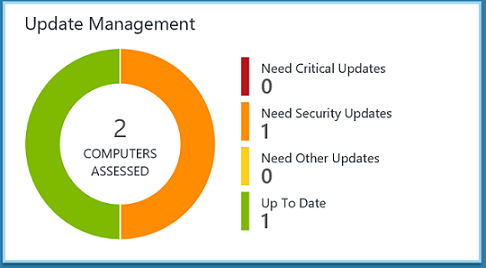
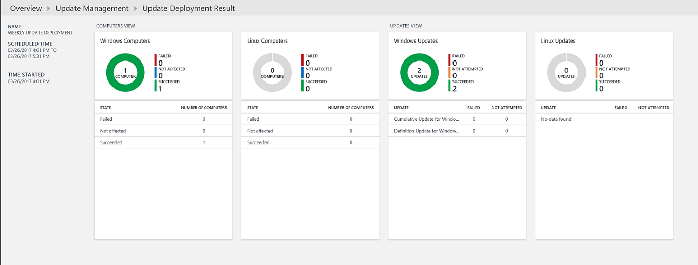
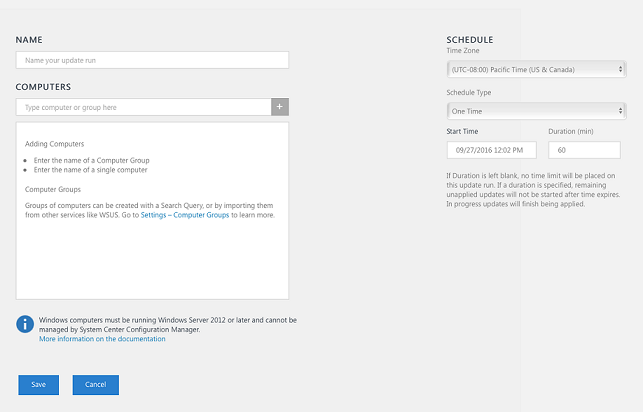
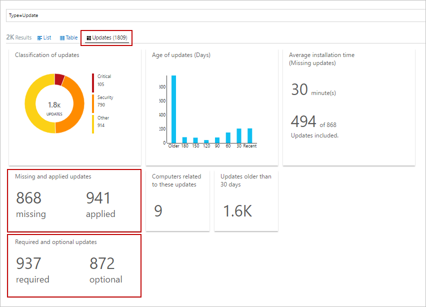
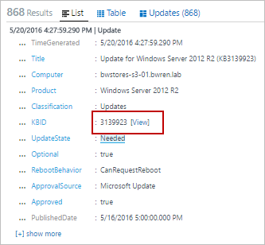
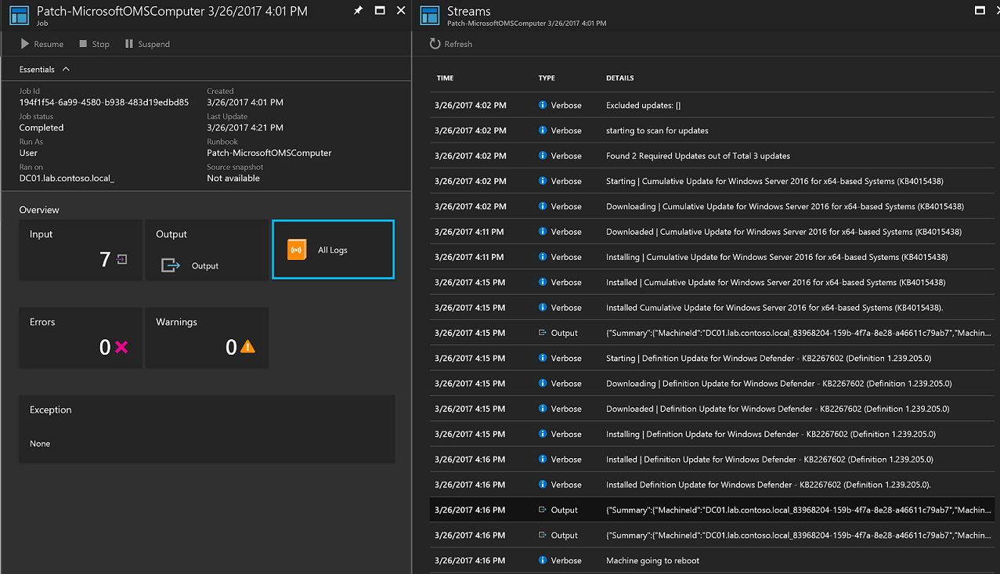

# Update Management solution in Azure

The Update Management solution in Azure allows you to manage operating system security updates for your Windows and Linux computers deployed in Azure, on-premises environments, or other cloud providers.  You can quickly assess the status of available updates on all agent computers and manage the process of installing required updates for servers.

## Update management in Azure Automation

You can enable Update management for virtual machines directly from your [Azure Automation](../automation/automation-offering-get-started.md) account.
To learn how to enable update management for virtual machines from your Automation account, see
[Manage updates for multiple virtual machines](../automation/manage-update-multi.md).

## Solution overview
Computers managed by OMS use the following for performing assessment and update deployments:

* OMS agent for Windows or Linux
* PowerShell Desired State Configuration (DSC) for Linux
* Automation Hybrid Runbook Worker
* Microsoft Update or Windows Server Update Services for Windows computers

The following diagrams shows a conceptual view of the behavior and data flow with how the solution assesses and applies security updates to all connected Windows Server and Linux computers in a workspace.    

#### Windows Server

#### Linux

After the computer performs a scan for update compliance, the OMS agent forwards the information in bulk to Log Analytics. On a Window computer, the compliance scan is performed every 12 hours by default.  In addition to the scan schedule, the scan for update compliance is  initiated within 15 minutes if the Microsoft Monitoring Agent (MMA) is restarted, prior to update installation, and after update installation.  With a Linux computer, the compliance scan is performed every 3 hours by default, and a compliance scan is initiated within 15 minutes if the MMA agent is restarted.  

The compliance information is then processed and summarized in the dashboards included in the solution or searchable using user-defined or pre-defiend queries.  The solution reports how up-to-date the computer is based on what source you are configured to synchronize with.  If the Windows computer is configured to report to WSUS, depending on when WSUS last synchronized with Microsoft Update, the results may differ from what Microsoft Updates shows.  The same for Linux computers that are configured to report to a local repo versus a public repo.   

You can deploy and install software updates on computers that require the updates by creating a scheduled deployment.  Updates classified as *Optional* are not included in the deployment scope for Windows computers, only required updates.  The scheduled deployment defines what target computers will receive the applicable updates, either by explicitly specifying computers or selecting a [computer group](../log-analytics/log-analytics-computer-groups.md) that is based off of log searches of a particular set of computers.  You also specify a schedule to approve and designate a period of time when updates are allowed to be installed within.  Updates are installed by runbooks in Azure Automation.  You cannot view these runbooks, and they don’t require any configuration.  When an Update Deployment is created, it creates a schedule that starts a master update runbook at the specified time for the included computers.  This master runbook starts a child runbook on each agent that performs installation of required updates.       

At the date and time specified in the update deployment, the target computers executes the deployment in parallel.  A scan is first performed to verify the updates are still required and installs them.  It is important to note for WSUS client computers, if the updates are not approved in WSUS, the update deployment will fail.  The results of the applied updates are forwarded to Log Analytics to be processed and summarized in the dashboards or by the searching the events.     

## Prerequisites
* The solution supports performing update assessments against Windows Server 2008 and higher, and update deployments against Windows Server 2008 R2 SP1 and higher.  Nano Server is not supported.

    > [!NOTE]
    > Support for deploying updates to Windows Server 2008 R2 SP1 requires .NET Framework 4.5 and WMF 5.0 or later.
    >  
* Windows client operating systems are not supported.  
* Windows agents must either be configured to communicate with a Windows Server Update Services (WSUS) server or have access to Microsoft Update.  

    > [!NOTE]
    > The Windows agent cannot be managed concurrently by System Center Configuration Manager.  
    >
* CentOS 6 (x86/x64), and 7 (x64)  
* Red Hat Enterprise 6 (x86/x64), and 7 (x64)  
* SUSE Linux Enterprise Server 11 (x86/x64) and 12 (x64)  
* Ubuntu 12.04 LTS and newer x86/x64   
    > [!NOTE]  
    > To avoid updates being applied outside of a maintenance window on Ubuntu, reconfigure  Unattended-Upgrade package to disable automatic updates. For information on how to configure this, see [Automatic Updates topic in the Ubuntu Server Guide](https://help.ubuntu.com/lts/serverguide/automatic-updates.html).

* Linux agents must have access to an update repository.  

    > [!NOTE]
    > An OMS Agent for Linux configured to report to multiple Log Analytics workspaces is not supported with this solution.  
    >

For additional information on how to install the OMS Agent for Linux and download the  latest version, refer to [Operations Management Suite Agent for Linux](https://github.com/microsoft/oms-agent-for-linux).  For information on how to install the OMS Agent for Windows, review [Operations Management Suite Agent for Windows](../log-analytics/log-analytics-windows-agent.md).  

### Permissions
In order to create update deployments, you need to be granted the contributor role in both your Automation account and Log Analytics workspace.  

## Solution components
This solution consists of the following resources that are added to your Automation account and directly connected agents or Operations Manager connected management group.

### Management packs
If your System Center Operations Manager management group is connected to a Log Analytics workspace,  the following management packs are installed in Operations Manager.  These management packs are also installed on directly connected Windows computers after adding this solution. There is nothing to configure or manage with these management packs.

* Microsoft System Center Advisor Update Assessment Intelligence Pack (Microsoft.IntelligencePacks.UpdateAssessment)
* Microsoft.IntelligencePack.UpdateAssessment.Configuration (Microsoft.IntelligencePack.UpdateAssessment.Configuration)
* Update Deployment MP

For more information on how solution management packs are updated, see [Connect Operations Manager to Log Analytics](../log-analytics/log-analytics-om-agents.md).

### Hybrid Worker groups
After you enable this solution, any Windows computer directly connected to your Log Analytics workspace is automatically configured as a Hybrid Runbook Worker to support the runbooks included in this solution.  For each Windows computer managed by the solution, it will be listed under the Hybrid Runbook Worker Groups blade of the Automation account following the naming convention *Hostname FQDN_GUID*.  You cannot target these groups with runbooks in your account, otherwise they will fail. These groups are only intended to support the management solution.   

You can however, add the Windows computers to a Hybrid Runbook Worker group in your Automation account to support Automation runbooks as long as you are using the same account for both the solution and Hybrid Runbook Worker group membership.  This functionality has been added to version 7.2.12024.0 of the Hybrid Runbook Worker.  

## Configuration
Perform the following steps to add the Update Management solution to your Log Analytics workspace and confirm agents are reporting. Windows agents already connected to your workspace are added automatically with no additional configuration.

You can deploy the solution from Azure Marketplace in the Azure portal by selecting either the Automation & Control offering or Update Management solution

If you already have an Automation account and Log Analytics workspace linked together in the same resource group and region, selecting Automation & Control will verify your configuration and only install the solution and configure it in both services.  Selecting the Update Management solution from Azure Marketplace delivers the same behavior.  If you do not have either services deployed in your subscription, follow the steps in the **Create new Solution** blade and confirm you want to install the other pre-selected recommended solutions.  Optionally, you can add the Update Management solution to your Log Analytics workspace using the steps described in [Add OMS solutions](../log-analytics/log-analytics-add-solutions.md).  

### Confirm OMS agents and Operations Manager management group connected to Log Analytics

To confirm directly connected OMS Agent for Linux and Windows are communicating with Log Analytics, after a few minutes you can run the following log search:

* Linux - `Type=Heartbeat OSType=Linux | top 500000 | dedup SourceComputerId | Sort Computer | display Table`.  

* Windows - `Type=Heartbeat OSType=Windows | top 500000 | dedup SourceComputerId | Sort Computer | display Table`

On a Windows computer, you can review the following to verify agent connectivity with Log Analytics:

1.  Open Microsoft Monitoring Agent in Control Panel, and on the **Azure Log Analytics (OMS)** tab, the agent displays a message stating: **The Microsoft Monitoring Agent has successfully connected to the Microsoft Operations Management Suite service**.   
2.  Open the Windows Event Log, navigate to **Application and Services Logs\Operations Manager** and search for Event ID 3000 and 5002 from source Service Connector.  These events indicate the computer has registered with the Log Analytics workspace and is receiving configuration.  

If the agent is not able to communicate with Log Analytics and it is configured to communicate with the internet through a firewall or proxy server, confirm the firewall or proxy server is properly configured by reviewing [Network configuration for Windows agent](../log-analytics/log-analytics-windows-agent.md) or [Network configuration for Linux agent](../log-analytics/log-analytics-agent-linux.md).

> [!NOTE]
> If your Linux systems are configured to communicate with a proxy or OMS Gateway and you are onboarding this solution, please update the *proxy.conf* permissions to grant the omiuser group read permission on the file by performing the following commands:  
> `sudo chown omsagent:omiusers /etc/opt/microsoft/omsagent/proxy.conf`  
> `sudo chmod 644 /etc/opt/microsoft/omsagent/proxy.conf`

Newly added Linux agents will show a status of **Updated** after an assessment has been performed.  This process can take up to 6 hours.

To confirm an Operations Manager management group is communicating with Log Analytics, see [Validate Operations Manager Integration with OMS](../log-analytics/log-analytics-om-agents.md#validate-operations-manager-integration-with-oms).

## Data collection
### Supported agents
The following table describes the connected sources that are supported by this solution.

| Connected Source | Supported | Description |
| --- | --- | --- |
| Windows agents |Yes |The solution collects information about system updates from Windows agents and initiates installation of required updates. |
| Linux agents |Yes |The solution collects information about system updates from Linux agents and initiates installation of required updates on supported distros. |
| Operations Manager management group |Yes |The solution collects information about system updates from agents in a connected management group. A direct connection from the Operations Manager agent to Log Analytics is not required. Data is forwarded from the management group to the Log Analytics workspace. |
| Azure storage account |No |Azure storage does not include information about system updates. |

### Collection frequency
For each managed Windows computer, a scan is performed twice per day. Every 15 minutes the Windows API is called to query for the last update time to determine if status has changed, and if so a compliance scan is initiated.  For each managed Linux computer, a scan is performed every 3 hours.

It can take anywhere from 30 minutes up to 6 hours for the dashboard to display updated data from managed computers.   

## Using the solution
When you add the Update Management solution to your Log Analytics workspace, the **Update Management** tile will be added to your Log Analytics dashboard. This tile displays a count and graphical representation of the number of computers in your environment and their update compliance.  
  

## Viewing update assessments
Click on the <strong>Update Management</strong> tile to open the <strong>Update Management</strong> dashboard.    

This dashboard provides a detailed breakdown of update status categorized by type of operating system and update classification - critical, security, or other (such as a definition update). The results in each tile on this dashboard reflect only updates that are approved for deployment, which is based based on the computers synchronization source.   The **Update Deployments** tile when selected, redirects you to the Update Deployments page where you can view schedules, deployments currently running, completed deployments, or schedule a new deployment.  

You can run a log search that returns all records by clicking on the specific tile or to run a query of a particular category and pre-defined criteria , select one from the list  available under the **Common Update Queries** column.    

## Installing updates
Once updates have been assessed for all of the Linux and Windows computers in your workspace, you can have required updates installed by creating an *Update Deployment*.  An Update Deployment is a scheduled installation of required updates for one or more  computers.  You specify the date and time for the deployment in addition to a computer or group of computers that should be included in the scope of a deployment.  To learn more about computer groups, see [Computer groups in Log Analytics](../log-analytics/log-analytics-computer-groups.md).  When you include computer groups in your update deployment, group memnbership is evaluated only once at the time of schedule creation.  Subsequent changes to a group are not reflected.  To work around this, delete the scheduled update deployment and recreate it.

> [!NOTE]
> Windows VMs deployed from the Azure Marketplace by default are set to receive automatic updates from Windows Update Service.  This behavior does not change after adding this solution or Windows VMs to your workspace.  If you do not actively managed updates with this solution, the default behavior (automatically apply updates) will apply.  

For virtual machines created from the on-demand Red Hat Enterprise Linux (RHEL) images available in Azure Marketplace, they are registered to access the [Red Hat Update Infrastructure (RHUI)](../virtual-machines/virtual-machines-linux-update-infrastructure-redhat.md) deployed in Azure.  Any other Linux distribution must be updated from the distros online file repository following their supported methods.  

### Viewing update deployments
Click the **Update Deployment** tile to view the list of existing Update Deployments.  They are grouped by status – **Scheduled**, **Running**, and **Completed**.      

The properties displayed for each Update Deployment are described in the following table.

| Property | Description |
| --- | --- |
| Name |Name of the Update Deployment. |
| Schedule |Type of schedule.  Options available are *One Time*, *Recurring Weekly*, or *Recurring Monthly*. |
| Start Time |Date and time that the Update Deployment is scheduled to start. |
| Duration |Number of minutes the Update Deployment is allowed to run.  If all updates are not installed within this duration, then the remaining updates must wait until the next Update Deployment. |
| Servers |Number of computers affected by the Update Deployment.  |
| Status |Current status of the Update Deployment.  Possible values are: - Not Started - Running - Finished |

Select a completed Update Deployment to view the detail screen which includes the columns in the following table.  These columns will not be populated if the Update Deployment has not yet started.   

| Column | Description |
| --- | --- |
| **Computers View** | |
| Windows Computers |Lists the number of Windows computers in the Update Deployment by status.  Click on a status to run a log search returning all update records with that status for the Update Deployment. |
| Linux Computers |Lists the number of Linux computers in the Update Deployment by status.  Click on a status to run a log search returning all update records with that status for the Update Deployment. |
| Computer Installation Status |Lists the computers involved in the Update Deployment and the percentage of updates that successfully installed. Click on one of the entries to run a log search returning all missing and critical updates. |
| **Updates View** | |
| Windows Updates |Lists Windows updates included in the Update Deployment and their installation status per each update.  Select an update to run a log search returning all update records for that specific update or click on the status to run a log search returning all update records for the deployment. |
| Linux Updates |Lists Linux updates included in the Update Deployment and their installation status per each update.  Select an update to run a log search returning all update records for that specific update or click on the status to run a log search returning all update records for the deployment. |

### Creating an Update Deployment
Create a new Update Deployment by clicking the **Add** button at the top of the screen to open the **New Update Deployment** page.  You must provide values for the properties in the following table.

| Property | Description |
| --- | --- |
| Name |Unique name to identify the update deployment. |
| Time Zone |Time zone to use for the start time. |
| Schedule Type | Type of schedule.  Options available are *One Time*, *Recurring Weekly*, or *Recurring Monthly*.  
| Start Time |Date and time to start the update deployment. **Note:** The soonest a deployment can run is 30 minutes from current time if you need to deploy immediately. |
| Duration |Number of minutes the Update Deployment is allowed to run.  If all updates are not installed within this duration, then the remaining updates must wait until the next Update Deployment. |
| Computers |Names of computers or computer groups to include and target in the Update Deployment.  Select one or more entries from the drop down list. |

   

### Time range
By default, the scope of the data analyzed in the Update Management solution is from all connected management groups generated within the last 1 day.

To change the time range of the data, select **Data based on** at the top of the dashboard. You can select records created or updated within the last 7 days, 1 day, or 6 hours. Or you can select **Custom** and specify a custom date range.

## Log Analytics records
The Update Management solution creates two types of records in the Log Analytics workspace.

### Update records
A record with a type of **Update** is created for each update that is either installed or needed on each computer. Update records have the properties in the following table.

| Property | Description |
| --- | --- |
| Type |*Update* |
| SourceSystem |The source that approved installation of the update. Possible values are: - Microsoft Update - Windows Update - SCCM - Linux Servers (Fetched from Package Managers) |
| Approved |Specifies whether the update has been approved for installation.  For Linux servers this is currently optional as patching is not managed by OMS. |
| Classification for Windows |Classification of the update. Possible values are: -    Applications - Critical Updates - Definition Updates - Feature Packs - Security Updates - Service Packs - Update Rollups - Updates |
| Classification for Linux |Cassification of the update. Possible values are: -Critical Updates - Security Updates - Other Updates |
| Computer |Name of the computer. |
| InstallTimeAvailable |Specifies whether the installation time is available from other agents that installed the same update. |
| InstallTimePredictionSeconds |Estimated installation time in seconds based on other agents that installed the same update. |
| KBID |ID of the KB article that describes the update. |
| ManagementGroupName |Name of the management group for SCOM agents.  For other agents, this is AOI-<workspace ID>. |
| MSRCBulletinID |ID of the Microsoft security bulletin describing the update. |
| MSRCSeverity |Severity of the Microsoft security bulletin. Possible values are: - Critical - Important - Moderate |
| Optional |Specifies whether the update is optional. |
| Product |Name of the product the update is for.  Click **View** to open the article in a browser. |
| PackageSeverity |The severity of the vulnerability fixed in this update, as reported by the  Linux distro vendors. |
| PublishDate |Date and time that the update was installed. |
| RebootBehavior |Specifies if the update forces a reboot. Possible values are: - canrequestreboot - neverreboots |
| RevisionNumber |Revision number of the update. |
| SourceComputerId |GUID to uniquely identify the computer. |
| TimeGenerated |Date and time that the record was last updated. |
| Title |Title of the update. |
| UpdateID |GUID to uniquely identify the update. |
| UpdateState |Specifies whether the update is installed on this computer. Possible values are: - Installed - The update is installed on this computer. - Needed - The update is not installed and is needed on this computer. |

When you perform any log search that returns records with a type of <strong>Update</strong> you can select the <strong>Updates</strong> view which displays a set of tiles summarizing the updates returned by the search. You can click on the entries in the <strong>Missing and applied updates</strong> and <strong>Required and optional updates</strong> tiles to scope the view to that set of updates. Select the <strong>List</strong> or <strong>Table</strong> view to return the individual records. 

  

In the <strong>Table</strong> view, you can click on the <strong>KBID</strong> for any record to open a browser with the KB article. This allows you to quickly read about the details of the particular update. 

In the <strong>List</strong> view, you click the <strong>View</strong> link next to the KBID to open the KB article. 

### UpdateSummary records
A record with a type of **UpdateSummary** is created for each Windows agent computer. This record is updated each time the computer is scanned for updates. **UpdateSummary** records have the properties in the following table.

| Property | Description |
| --- | --- |
| Type |UpdateSummary |
| SourceSystem |OpsManager |
| Computer |Name of the computer. |
| CriticalUpdatesMissing |Number of critical updates missing on the computer. |
| ManagementGroupName |Name of the management group for SCOM agents. For other agents, this is AOI-<workspace ID>. |
| NETRuntimeVersion |Version of the .NET runtime installed on the computer. |
| OldestMissingSecurityUpdateBucket |Bucket to categorize the time since the oldest missing security update on this computer was published. Possible values are: - Older -    180 days ago - 150 days ago -    120 days ago - 90 days ago - 60 days ago -    30 days go -    Recent |
| OldestMissingSecurityUpdateInDays |Number of days since the oldest missing security update on this computer was published. |
| OsVersion |Version of the operating system installed on the computer. |
| OtherUpdatesMissing |Number of other updates missing on the computer. |
| SecurityUpdatesMissing |Number of security updates missing on the computer. |
| SourceComputerId |GUID to uniquely identify the computer. |
| TimeGenerated |Date and time that the record was last updated. |
| TotalUpdatesMissing |Total number of updates missing on the computer. |
| WindowsUpdateAgentVersion |Version number of the Windows Update agent on the computer. |
| WindowsUpdateSetting |Setting for how the computer will install important updates. Possible values are: - Disabled - Notify before installation - Scheduled installation |
| WSUSServer |URL of WSUS server if the computer is configured to use one. |

## Sample log searches
The following table provides sample log searches for update records collected by this solution.

| Query | Description |
| --- | --- |
| Type:Update OSType!=Linux UpdateState=Needed Optional=false Approved!=false &#124; measure count() by Computer |Windows-based server computers that need updates |
| Type:Update OSType=Linux UpdateState!="Not needed" &#124; measure count() by Computer |Linux servers that need updates | 
| Type=Update UpdateState=Needed Optional=false &#124; select Computer,Title,KBID,Classification,UpdateSeverity,PublishedDate |All computers with missing updates |
| Type=Update UpdateState=Needed Optional=false Computer="COMPUTER01.contoso.com" &#124; select Computer,Title,KBID,Product,UpdateSeverity,PublishedDate |Missing updates for a specific computer (replace value with your own computer name)|
| Type=Update UpdateState=Needed Optional=false (Classification="Security Updates" OR Classification="Critical Updates") |All computers with missing critical or security updates | 
| Type=Update UpdateState=Needed Optional=false (Classification="Security Updates" OR Classification="Critical Updates") Computer IN {Type=UpdateSummary WindowsUpdateSetting=Manual &#124; Distinct Computer} &#124; Distinct KBID |Critical or security updates needed by machines where updates are manually applied |
| Type=Event EventLevelName=error Computer IN {Type=Update (Classification="Security Updates" OR Classification="Critical Updates") UpdateState=Needed Optional=false &#124; Distinct Computer} |Error events for machines that have missing critical or security required updates |
| Type=Update Optional=false Classification="Update Rollups" UpdateState=Needed &#124; select Computer,Title,KBID,Classification,UpdateSeverity,PublishedDate |All computers with missing update rollups | 
| Type=Update UpdateState=Needed Optional=false &#124; Distinct Title |Distinct missing updates across all computers | 
| Type:UpdateRunProgress InstallationStatus=failed &#124; measure count() by Computer, Title, UpdateRunName |Windows-based server computer with updates that failed in an update run | 
| Type:UpdateRunProgress InstallationStatus=failed &#124; measure count() by Computer, Product, UpdateRunName |Linux server with updates that failed an update run | 
| Type=UpdateSummary &#124; measure count() by WSUSServer |WSUS computer membership | 
| Type=UpdateSummary &#124; measure count() by WindowsUpdateSetting |Automatic update configuration | 
| Type=UpdateSummary WindowsUpdateSetting=Manual |Computers with automatic update disabled | 
| Type=Update and OSType=Linux and UpdateState!="Not needed" &#124; measure count() by Computer |List of all the Linux machines which have a package update available | 
| Type=Update and OSType=Linux and UpdateState!="Not needed" and (Classification="Critical Updates" OR Classification="Security Updates") &#124; measure count() by Computer |List of all the Linux machines which have a package update available which addresses Critical or Security vulnerability | 
| Type=Update and OSType=Linux and UpdateState!="Not needed" |List of all packages that have an update available | 
| Type=Update  and OSType=Linux and UpdateState!="Not needed" and (Classification="Critical Updates" OR Classification="Security Updates") |List of all packages that have an update available which addresses Critical or Security vulnerability | 
| Type:UpdateRunProgress &#124; measure Count() by UpdateRunName |List what update deployments have modified computers | 
| Type:UpdateRunProgress UpdateRunName="DeploymentName" &#124; measure Count() by Computer |Computers that were updated in this update run (replace value with your Update Deployment name | 
| Type=Update and OSType=Linux and OSName = Ubuntu &#124; measure count() by Computer |List of all the “Ubuntu” machines with any update available |

## Integrate with System Center Configuration Manager

Customers who have invested in System Center Configuration Manager to manage PCs, servers, and mobile devices also rely on it's strength and maturity in managing software updates as part of their software update management (SUM) cycle.

To learn how to integrate the OMS Update Management solution with System Center Configuration Manager, see [Integrate System Center Configuration Manager with OMS Update Management](../automation/oms-solution-updatemgmt-sccmintegration.md).

## Troubleshooting

This section provides information to help troubleshoot issues with the Update Management solution.

### How do I troubleshoot onboarding issues?
If you encounter issues while attempting to onboard the solution or a virtual machine, check the **Application and Services Logs\Operations Manager** event log for events with  event ID 4502 and event message containing **Microsoft.EnterpriseManagement.HealthService.AzureAutomation.HybridAgent**.  The following table highlights specific error messages and a possible resolution for each.  

|                                                                                                                                                                                                                     Message                                                                                                                                                                                                                     |                                 Reason                                  |                                                                        Solution                                                                        |
|-------------------------------------------------------------------------------------------------------------------------------------------------------------------------------------------------------------------------------------------------------------------------------------------------------------------------------------------------------------------------------------------------------------------------------------------------|-------------------------------------------------------------------------|--------------------------------------------------------------------------------------------------------------------------------------------------------|
|                                                                                                                       Unable to Register Machine for Patch Management, Registration Failed with Exception System.InvalidOperationException: {"Message":"Machine is already registered to a different account. "}                                                                                                                       | Machine is already onboarded to another workspace for Update Management | Perform cleanup of old artifacts by [deleting the hybrid runbook group](../automation/automation-hybrid-runbook-worker.md#remove-hybrid-worker-groups) |
| Unable to  Register Machine for Patch Management, Registration Failed with Exception System.Net.Http.HttpRequestException: An error occurred while sending the request. ---> System.Net.WebException: The underlying connection was closed: An unexpected error occurred on a receive. ---> System.ComponentModel.Win32Exception: The client and server cannot communicate, because they do not possess a common algorithm |              Proxy/Gateway/Firewall blocking communication              |                            [Review network requirements](../automation/automation-offering-get-started.md#network-planning)                            |
|                                                                                                                                      Unable to Register Machine for Patch Management, Registration Failed with Exception Newtonsoft.Json.JsonReaderException: Error parsing positive infinity value.                                                                                                                                      |              Proxy/Gateway/Firewall blocking communication              |                            [Review network requirements](../automation/automation-offering-get-started.md#network-planning)                            |
|                                                                                 The certificate presented by the service <wsid>.oms.opinsights.azure.com was not issued by a certificate authority used for Microsoft services. Please contact your network administrator to see if they are running a proxy that intercepts TLS/SSL communication.                                                                                 |              Proxy/Gateway/Firewall blocking communication              |                            [Review network requirements](../automation/automation-offering-get-started.md#network-planning)                            |
|                                                                        Unable to Register Machine for Patch Management, Registration Failed with Exception AgentService.HybridRegistration. PowerShell.Certificates.CertificateCreationException: Failed to create a self-signed certificate. ---> System.UnauthorizedAccessException: Access is denied.                                                                         |                   Self-signed cert generation failure                   |            Verify system account has read access to folder: <strong>C:\ProgramData\Microsoft\</strong> <strong>Crypto\RSA</strong>            |

### How do I troubleshoot update deployments?
You can view the results of the runbook responsible for deploying the updates included in the scheduled update deployment from the Jobs blade of your Automation account that is linked with the Log Analytics workspace supporting this solution.  The runbook <strong>Patch-MicrosoftOMSComputer</strong> is a child runbook that targets a specific managed computer, and reviewing the verbose Stream will present detailed information for that deployment.  The output will display which required updates are applicable, download status, installation status, and additional details.    

For further information, see [Automation runbook output and messages](../automation/automation-runbook-output-and-messages.md).   

## Next steps
* Use Log Searches in [Log Analytics](../log-analytics/log-analytics-log-searches.md) to view detailed update data.
* [Create your own dashboards](../log-analytics/log-analytics-dashboards.md) showing update compliance for your managed computers.
* [Create alerts](../log-analytics/log-analytics-alerts.md) when critical updates are detected as missing from computers or a computer has automatic updates disabled.  
