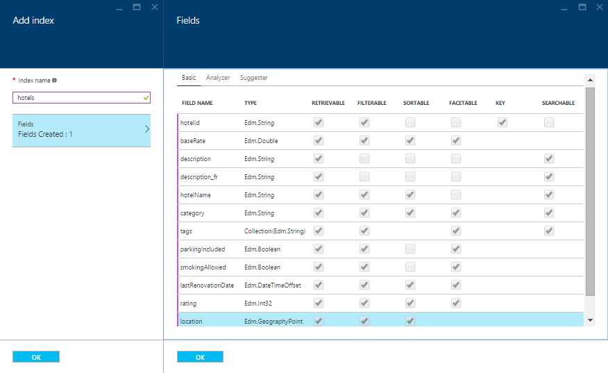
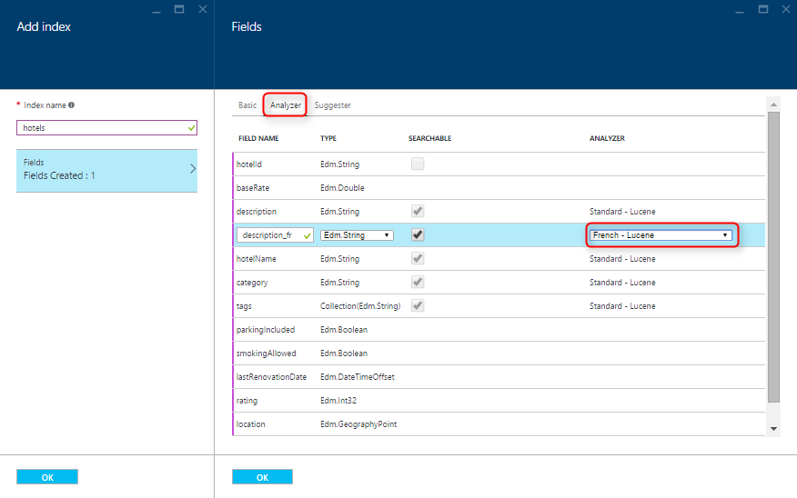

# Create an Azure Search index using the Azure Portal
> [!div class="op_single_selector"]
> * [Overview](search-what-is-an-index.md)
> * [Portal](search-create-index-portal.md)
> * [.NET](search-create-index-dotnet.md)
> * [REST](search-create-index-rest-api.md)
> 
> 

Use the built-in index designer in Azure portal to prototype or create a [search index](search-what-is-an-index.md) to run on your Azure Search service. 

## Prerequisites

This article assumes an [Azure subscription](https://azure.microsoft.com/pricing/free-trial/?WT.mc_id=A261C142F) and [Azure Search service](search-create-service-portal.md).  

## Find your search service
1. Sign in to the Azure portal page and review the [search services for your subscription](https://portal.azure.com/#blade/HubsExtension/BrowseResourceBlade/resourceType/Microsoft.Search%2FsearchServices)
2. Select your Azure Search service.

## Name the index

1. Click the **Add index** button in the command bar at the top of the page.
2. Name your Azure Search index. 
   * Start with a letter.
   * Use only lowercase letters, digits, or dashes ("-").
   * Limit the name to 60 characters.

   The index name becomes part of the endpoint URL used on connections to the index and for sending HTTP requests in the Azure Search REST API.

## Define the fields of your index

Index composition includes a *Fields collection* that defines the searchable data in your index. More specifically, it specifies the structure of documents that you upload separately. The Fields collection includes required and optional fields, named and typed, with index attributes to determine how the field can be used.

1. In the **Add Index** blade, click **Fields >** to slide open the field definition blade. 

2. Accept the generated *key* field of type Edm.String. By default, the field is named *id* but you can rename it as long as the string satisfies [naming rules](https://docs.microsoft.com/rest/api/searchservice/Naming-rules). A key field is mandatory for every Azure Search index and it must be a string.

3. Add fields to fully specify the documents you will upload. If documents consist of an *id*, *hotel name*, *address*, *city*, and *region*, create a corresponding field for each one in the index. Review the [design guidance in the section below](#design) for help in setting attributes.

4. Optionally, add any fields that are used internally in filter expressions. Attributes on the field can be set to exclude fields from search operations.

5. When finished, click **OK** to save and create the index.

## Tips for adding fields

Creating an index in the portal is keyboard intensive. Minimize steps by following this workflow:

1. First, build the field list by entering names and setting data types.

2. Next, use the check boxes at the top of each attribute to bulk enable the setting for all fields, and then selectively clear boxes for the few fields that don't require it. For example, string fields are typically searchable. As such, you might click **Retrievable** and **Searchable** to both return the values of the field in search results, as well as allow full text search on the field. 

## Design guidance for setting attributes

Although you can add new fields at any time, existing field definitions are locked in for the lifetime of the index. For this reason, developers typically use the portal for creating simple indexes, testing ideas, or using the portal pages to look up a setting. Frequent iteration over an index design is more efficient if you follow a code-based approach so that you can rebuild the index easily.

Analyzers and suggesters are associated with fields before the index is saved. Be sure to click through each tabbed page to add language analyzers or suggesters to your index definition.

String fields are often marked as **Searchable** and **Retrievable**.

Fields used to narrow search results include **Sortable**, **Filterable**, and **Facetable**.

Field attributes determine how a field is used, such as whether it is used in full text search, faceted navigation, sort operations, and so forth. The following table describes each attribute.

|Attribute|Description|  
|---------------|-----------------|  
|**searchable**|Full-text searchable, subject to lexical analysis such as word-breaking during indexing. If you set a searchable field to a value like "sunny day", internally it will be split into the individual tokens "sunny" and "day". For details, see [How full text search works](search-lucene-query-architecture.md).|  
|**filterable**|Referenced in **$filter** queries. Filterable fields of type `Edm.String` or `Collection(Edm.String)` do not undergo word-breaking, so comparisons are for exact matches only. For example, if you set such a field f to "sunny day", `$filter=f eq 'sunny'` will find no matches, but `$filter=f eq 'sunny day'` will. |  
|**sortable**|By default the system sorts results by score, but you can configure sort based on fields in the documents. Fields of type `Collection(Edm.String)` cannot be **sortable**. |  
|**facetable**|Typically used in a presentation of search results that includes a hit count by category (for example, hotels in a specific city). This option cannot be used with fields of type `Edm.GeographyPoint`. Fields of type `Edm.String` that are **filterable**, **sortable**, or **facetable** can be at most 32 kilobytes in length. For details, see [Create Index (REST API)](https://docs.microsoft.com/rest/api/searchservice/create-index).|  
|**key**|Unique identifier for documents within the index. Exactly one field must be chosen as the key field and it must be of type `Edm.String`.|  
|**retrievable**|Determines whether the field can be returned in a search result. This is useful when you want to use a field (such as *profit margin*) as a filter, sorting, or scoring mechanism, but do not want the field to be visible to the end user. This attribute must be `true` for `key` fields.|  

## Create the hotels index used in example API sections

Azure Search API documentation includes code examples featuring a simple *hotels* index. In the screenshots below, you can see the index definition, including the French language analyzer specified during index definition, which you can recreate as a practice exercise in the portal.

## Next steps

After creating an Azure Search index, you can move to the next step: [upload searchable data into the index](search-what-is-data-import.md).

Alternatively, you could also take a deeper look at indexes. In addition to the Fields collection, an index also specifies analyzers, suggesters, scoring profiles, and CORS settings. The portal provides tabbed pages for defining the most common elements: Fields, analyzers, and suggesters. To create or modify other elements, you can use the REST API or .NET SDK.

## See also

 [How full text search works](search-lucene-query-architecture.md)  
 [Search service REST API](https://docs.microsoft.com/rest/api/searchservice/)
 [.NET SDK](https://docs.microsoft.com/dotnet/api/overview/azure/search?view=azure-dotnet)

