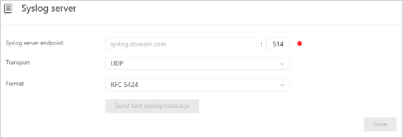
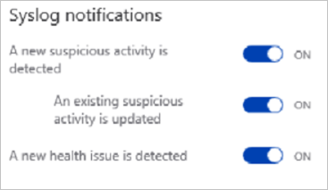
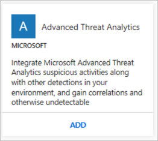
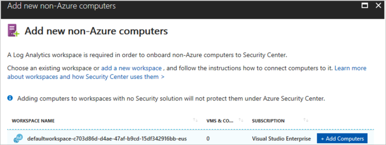
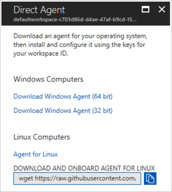

# Connecting Microsoft Advanced Threat Analytics to Azure Security Center
This document helps you to configure the integration between Microsoft Advanced Threat Analytics and Azure Security Center.

## Why add Advanced Threat Analytics data?
[Advanced Threat Analytics (ATA)](https://docs.microsoft.com/advanced-threat-analytics/what-is-ata) is an on-premises platform that helps detect suspicious user behaviors. When connected, you are able to view suspicious actions detected by ATA in Security Center. This integration enables you to view, correlate, and investigate all security alerts related to your hybrid cloud workloads in Security Center. 

## How do I configure this integration?
Assuming that you already have ATA installed, and working properly on-premises, follow these steps to configure this integration:

1. Log on to the ATA Center, and access the ATA portal.
2. Click **Syslog server** in the left pane.

    

3. In the **Syslog server endpoint** field, type 127.0.0.7 (it must be this address), and type 5114 on the port (recommended). While the port number is a recommendation, any unique port should work. Leave all other options as is, and click **Save**.
4. Click **Notifications** in the left pane, and enable all the Syslog notifications (recommended) as shown in the following image:

    

5. Click **Save**.
6. Open **Security Center** dashboard.
7. On the left pane, click **Security Solutions**.
8. Under **Advanced Threat Analytics**, click **ADD**.

    
    
9. Go to the last step, and click **Download agent**.

    

10. In the **Add new non-Azure computer** page, select the workspace.

    

11. In the **Direct Agent** page, download the appropriate Windows agent, and take notes of the **Workspace ID** and **Primary Key**.

    

12. Install this agent in the ATA Center. During the installation, make sure to select the option **Connect the agent to Azure Log Analytics (OMS)**, and provide the *workspace ID*, and *primary key* when requested.

Once you finish the installation, the integration is completed, and you will be able to see new alerts sent from ATA to Security Center in **Security Alerts** and **Search**. The solution appears in the **Security Solutions** page, under **Connected solutions**. 

## Next steps
In this document, you learned how to connect Microsoft ATA to Security Center. To learn more about Security Center, see the following articles:

* [Connecting Azure Active Directory Identity Protection to Azure Security Center](security-center-aadip-integration.md)
* [Setting security policies in Azure Security Center](security-center-policies.md) — Learn how to configure security policies for your Azure subscriptions and resource groups.
* [Managing security recommendations in Azure Security Center](security-center-recommendations.md) — Learn how recommendations help you protect your Azure resources.
* [Security health monitoring in Azure Security Center](security-center-monitoring.md) — Learn how to monitor the health of your Azure resources.
* [Managing and responding to security alerts in Azure Security Center](security-center-managing-and-responding-alerts.md) — Learn how to manage and respond to security alerts.
* [Monitoring partner solutions with Azure Security Center](security-center-partner-solutions.md) — Learn how to monitor the health status of your partner solutions.
* [Azure Security Center data security](security-center-data-security.md) - Learn how data is managed and safeguarded in Security Center.
* [Azure Security Center FAQ](security-center-faq.md) — Find frequently asked questions about using the service.
* [Azure Security blog](http://blogs.msdn.com/b/azuresecurity/) — Get the latest Azure security news and information.

