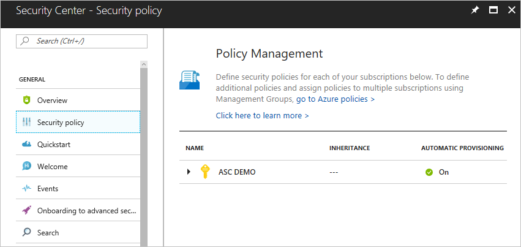
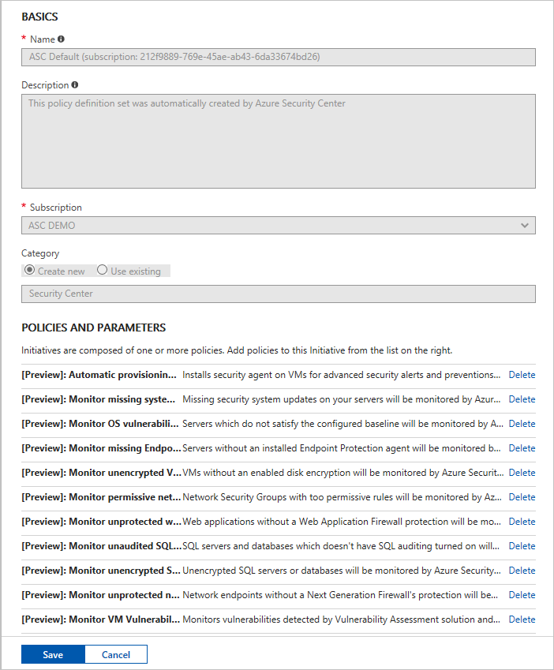

# Integrate Security Center security policies with Azure Policy
This article helps you configure Azure Security Center security policies, which are powered by Azure Policy.

## How security policies work
Security Center automatically creates a default security policy for each of your Azure subscriptions. You can edit the policies in Security Center or use [Azure Policy](http://docs.microsoft.com/azure/azure-policy/azure-policy-introduction) to do the following:
* Create new policy definitions.
* Assign policies across management groups, which can represent an entire organization or a business unit within the organization.
* Monitor policy compliance.

> [!NOTE]
> Azure Policy is in limited preview. To join, go to [Sign up for Azure Policy](https://aka.ms/getpolicy). For more information about Azure Policy, see [Create and manage policies to enforce compliance](http://docs.microsoft.com/azure/azure-policy/create-manage-policy).

## Edit security policies
You can edit the default security policy for each of your Azure subscriptions in Security Center. To modify a security policy, you must be an owner, contributor, or security administrator of the subscription or the containing management group. To view your security polices in Security Center, do the following:

1. Sign in to the Azure portal.

2. On the **Security Center** dashboard, under **General**, select **Security policy**.

	

3. Select the subscription that you want to enable a security policy for.  

4. In the **Policy Components** section, select **Security policy**.  
    The **Basics** window opens.

	

5. To delete a policy definition, under **Policies and Parameters**, next to the definition you want to delete, select **Delete**.

6. Click **Save**.  
    The **Available Definitions** window opens, displaying the default policy that's assigned to Security Center via Azure Policy.

7. (Optional) In the **Available Definitions** window, do either of the following:

    * To add a policy definition, select the plus sign (+) next to the definition.

	

    * For a detailed explanation of a policy, select it.  
    A definition **Preview** window opens. It displays a description of the definition and a link to the JSON code that provides the [policy definition](../azure-policy/policy-definition.md) structure.

	

7. When you finish editing, select **Save**.

## Available security policy definitions

To understand the policy definitions that are available in the default security policy, refer to the following table:

| Policy | What the enabled policy does |
| --- | --- |
| System updates |Retrieves a daily list of available security and critical updates from Windows Update or Windows Server Update Services. The retrieved list depends on the service that's configured for your virtual machines, and it recommends that missing updates be applied. For Linux systems, the policy uses the distro-provided package-management system to determine packages that have available updates. It also checks for security and critical updates from [Azure Cloud Services](../cloud-services/cloud-services-how-to-configure-portal.md) virtual machines. |
| Security configurations |Analyzes operating system configurations daily to determine issues that could make the virtual machine vulnerable to attack. The policy also recommends configuration changes to address these vulnerabilities. For more information about the specific configurations that are being monitored, see the [list of recommended baselines](https://gallery.technet.microsoft.com/Azure-Security-Center-a789e335). (At this time, Windows Server 2016 is not fully supported.) |
| Endpoint protection |Recommends that endpoint protection be set up for all Windows virtual machines (VMs) to help identify and remove viruses, spyware, and other malicious software. |
| Disk encryption |Recommends enabling disk encryption in all virtual machines to enhance data protection at rest. |
| Network security groups |Recommends that [network security groups](../virtual-network/virtual-networks-nsg.md) be configured to control inbound and outbound traffic to VMs that have public endpoints. Network security groups that are configured for a subnet are inherited by all virtual-machine network interfaces unless otherwise specified. In addition to checking to see whether a network security group has been configured, this policy assesses inbound security rules to identify rules that allow incoming traffic. |
| Web application firewall |Recommends that a web application firewall be set up on virtual machines when either of the following is true: <ul><li>An [instance-level public IP](../virtual-network/virtual-networks-instance-level-public-ip.md) is used, and the inbound security rules for the associated network security group are configured to allow access to port 80/443.</li><li>A load-balanced IP is used, and the associated load balancing and inbound network address translation (NAT) rules are configured to allow access to port 80/443. For more information, see [Azure Resource Manager support for Load Balancer](../load-balancer/load-balancer-arm.md).</li> |
| Next generation firewall |Extends network protections beyond network security groups, which are built into Azure. Security Center discovers deployments for which a next generation firewall is recommended, and then you can set up a virtual appliance. |
| SQL auditing and threat detection |Recommends that auditing of access to Azure Database be enabled for compliance and advanced threat detection, for investigation purposes. |
| SQL encryption |Recommends that encryption at rest be enabled for your Azure SQL database, associated backups, and transaction log files. Even if your data is breached, it is not readable. |
| Vulnerability assessment |Recommends that you install a vulnerability assessment solution on your VM. |
| Storage encryption |Currently, this feature is available for Azure Blob storage and Azure Files. After you enable Storage Service Encryption, only new data is encrypted, and any existing files in this storage account remain unencrypted. |
| JIT network access |When just-in-time network access is enabled, Security Center locks down inbound traffic to your Azure VMs by creating a network security group rule. You select the ports on the VM to which inbound traffic should be locked down. For more information, see [Manage virtual machine access using just in time](https://docs.microsoft.com/azure/security-center/security-center-just-in-time). |

## Next steps
In this article, you learned how to configure security policies in Security Center. To learn more about Security Center, see the following articles:

* [Azure Security Center planning and operations guide](security-center-planning-and-operations-guide.md): Learn how to plan and understand the design considerations about Azure Security Center.
* [Security health monitoring in Azure Security Center](security-center-monitoring.md): Learn how to monitor the health of your Azure resources.
* [Manage and respond to security alerts in Azure Security Center](security-center-managing-and-responding-alerts.md): Learn how to manage and respond to security alerts.
* [Monitor partner solutions with Azure Security Center](security-center-partner-solutions.md): Learn how to monitor the health status of your partner solutions.
* [Azure Security Center FAQ](security-center-faq.md): Get answers to frequently asked questions about using the service.
* [Azure Security Blog](http://blogs.msdn.com/b/azuresecurity/): Find blog posts about Azure security and compliance.
