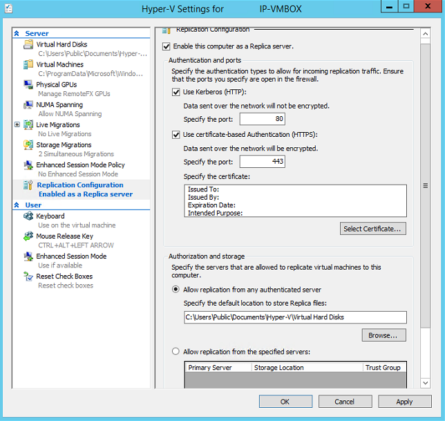
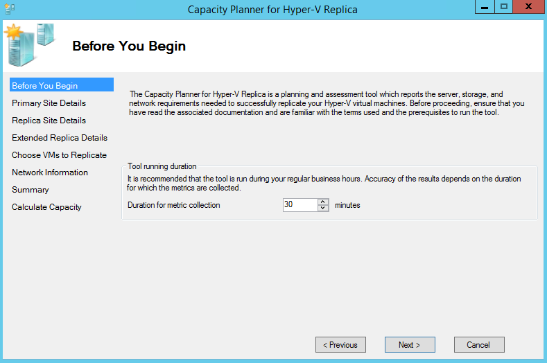
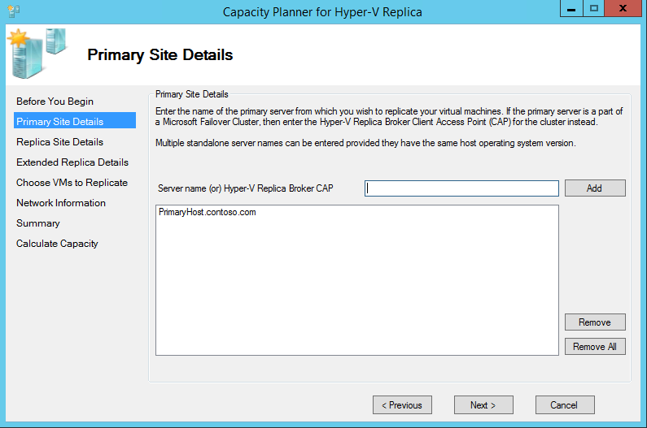
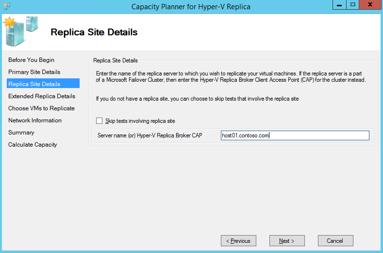
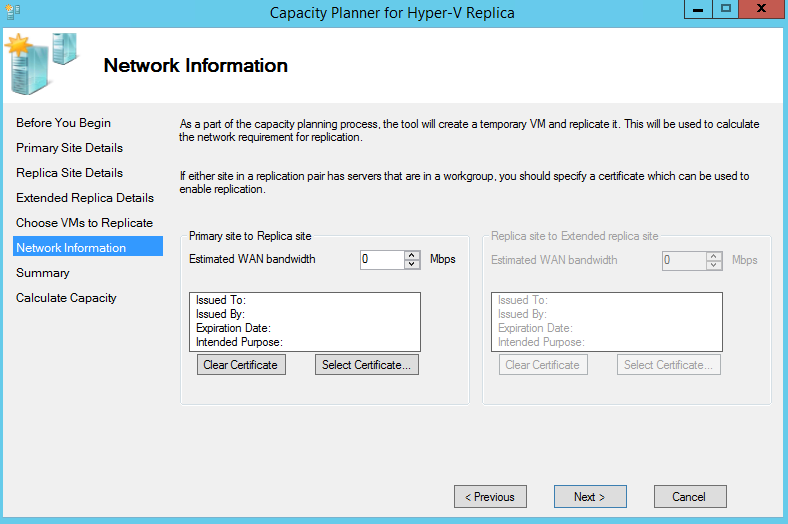
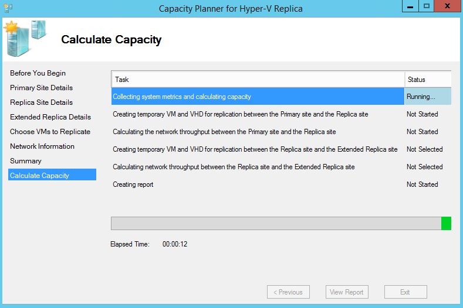

# Hyper-V capacity planning tool for Site Recovery

A new enhanced version of [Azure Site Recovery Deployment Planner for Hyper-V to Azure deployment](site-recovery-hyper-v-deployment-planner.md) is now available. It replaces the old tool. Use the new tool for your deployment planning. 
The tool provides the following guidelines:

* VM eligibility assessment, based on the number of disks, disk size, IOPS, churn, and a few VM characteristics
* Network bandwidth need versus RPO assessment
* Azure infrastructure requirements
* On-premises infrastructure requirements
* Initial replication batching guidance
* Estimated total disaster recovery cost to Azure

As part of your Azure Site Recovery deployment, you need to figure out your replication and bandwidth requirements. The Hyper-V capacity planning tool for Site Recovery helps you determine these requirements for Hyper-V VM replication.

This article describes how to run the Hyper-V capacity planning tool. You use this tool together with the information in [Capacity planning for Site Recovery](site-recovery-capacity-planner.md).

## Before you start
You run the tool on a Hyper-V server or cluster node in your primary site. To run the tool, the Hyper-V host servers need:

* Operating system: Windows Server 2012 or 2012 R2
* Memory: 20 MB (minimum)
* CPU: 5 percent overhead (minimum)
* Disk space: 5 MB (minimum)

Before you run the tool, you need to prepare the primary site. If you replicate between two on-premises sites and you want to check bandwidth, you need to prepare a replica server as well.

## Step 1: Prepare the primary site

1. On the primary site, make a list of all the Hyper-V VMs you want to replicate. List the Hyper-V hosts or clusters where they're located. The tool can run for multiple standalone hosts or for a single cluster, but not both together. It also needs to run separately for each operating system. Gather the following information about Hyper-V servers:

   * Windows Server 2012 standalone servers
   * Windows Server 2012 clusters
   * Windows Server 2012 R2 standalone servers
   * Windows Server 2012 R2 clusters

2. Enable remote access to Windows Management Instrumentation on all the Hyper-V hosts and clusters. Run this command on each server or cluster to make sure firewall rules and user permissions are set:

        netsh firewall set service RemoteAdmin enable
3. Enable performance monitoring on servers and clusters as follows:

   a. Open Windows Firewall with the **Advanced Security** snap-in. 
   
   b. Select the inbound rule **COM+ Network Access (DCOM-IN)**. Select all the rules in the **Remote Event Log Management** group.

## Step 2: Prepare a replica server (on-premises to on-premises replication)
If you replicate to Azure, you don't need to do this step.

We recommend that you set up a single Hyper-V host as a recovery server so that a dummy VM can be replicated to it to check bandwidth. You can skip this step, but you can't measure bandwidth unless you do it.

1. If you want to use a cluster node as the replica, configure the Hyper-V Replica Broker:

   a. In **Server Manager**, open **Failover Cluster Manager**.

   b. Connect to the cluster, and highlight the cluster name. Select **Actions** > **Configure Role** to open the High Availability wizard.

   c. In **Select Role**, select **Hyper-V Replica Broker**. In the wizard, enter a name for **NetBIOS name**. Enter an address for **IP address** to be used as the connection point to the cluster (called a client access point). The **Hyper-V Replica Broker** is configured, which results in a client access point name that you should note.

   d. Verify that the Hyper-V Replica Broker role comes online successfully and can fail over between all nodes of the cluster. Right-click the role, and select **Move** > **Select Node**. Select a node, and then select **OK**.

   e. If you use certificate-based authentication, make sure each cluster node and the client access point all have the certificate installed.

2. To enable a replica server, take these steps:

   a. For a cluster, open **Failure Cluster Manager** and connect to the cluster. Select **Roles**, and then select a role. Select **Replication Settings** > **Enable this cluster as a Replica server**. If you use a cluster as the replica, you need to have the Hyper-V Replica Broker role present on the cluster in the primary site as well.

   b. For a standalone server, open **Hyper-V Manager**. In the **Actions** pane, select **Hyper-V Settings** for the server you want to enable. In **Replication Configuration**, select **Enable this computer as a Replica server**.

3. To set up authentication, take these steps:

   a. Under **Authentication and ports**, select how to authenticate the primary server and the authentication ports. If you use a certificate, select **Select Certificate** to select one. Use Kerberos if the primary and recovery Hyper-V hosts are in the same domain or in trusted domains. Use certificates for different domains or for a workgroup deployment.

   b. Under **Authorization and storage**, allow **any** authenticated (primary) server to send replication data to this replica server.

   

   c. To check that the listener is running for the protocol or port you specified, run **netsh http show servicestate**. 

4. Set up firewalls. During Hyper-V installation, firewall rules are created to allow traffic on the default ports (HTTPS on 443 and Kerberos on 80). Enable these rules as follows:

    - Certificate authentication on cluster (443): ``Get-ClusterNode | ForEach-Object {Invoke-command -computername \$\_.name -scriptblock {Enable-Netfirewallrule -displayname "Hyper-V Replica HTTPS Listener (TCP-In)"}}``
    - Kerberos authentication on cluster (80): ``Get-ClusterNode | ForEach-Object {Invoke-command -computername \$\_.name -scriptblock {Enable-Netfirewallrule -displayname "Hyper-V Replica HTTP Listener (TCP-In)"}}``
    - Certificate authentication on standalone server: ``Enable-Netfirewallrule -displayname "Hyper-V Replica HTTPS Listener (TCP-In)"``
    - Kerberos authentication on standalone server: ``Enable-Netfirewallrule -displayname "Hyper-V Replica HTTP Listener (TCP-In)"``

## Step 3: Run the capacity planning tool
After you prepare your primary site and set up a recovery server, you can run the tool.

1. [Download](https://www.microsoft.com/download/details.aspx?id=39057) the tool from the Microsoft Download Center.

2. Run the tool from one of the primary servers or one of the nodes from the primary cluster. Right-click the .exe file, and then choose **Run as administrator**.

3. In **Before You Begin**, specify for how long you want to collect data. We recommend that you run the tool during production hours to ensure that data is representative. If you want to validate network connectivity only, you can collect for only a minute.

    

4. In **Primary Site Details**, specify the server name or FQDN for a standalone host. For a cluster, specify the FQDN of the client access point, cluster name, or any node in the cluster. Select **Next**. The tool automatically detects the name of the server it's running on. The tool picks up VMs that can be monitored for the specified servers.

    

5. In **Replica Site Details**, if you replicate to Azure or if you replicate to a secondary datacenter and haven't set up a replica server, select **Skip tests involving replica site**. If you replicate to a secondary datacenter and you set up a replica type, enter the FQDN of the standalone server or the client access point for the cluster in **Server name (or) Hyper-V Replica Broker CAP**.

    

6. In **Extended Replica Details**, select **Skip the tests involving Extended Replica site**. These tests aren't supported by Site Recovery.

7. In **Choose VMs to Replicate**, the tool connects to the server or cluster. It displays VMs and disks running on the primary server, based on the settings you specified on the **Primary Site Details** page. VMs that are already enabled for replication or that aren't running won't be displayed. Select the VMs for which you want to collect metrics. Selecting the VHDs automatically collects data for the VMs, too.

8. If you configured a replica server or cluster, in **Network information**, specify the approximate WAN bandwidth to be used between the primary and replica sites. If you configured certificate authentication, select the certificates.

    

9. In **Summary**, check the settings. Select **Next** to begin collecting metrics. Tool progress and status are displayed on the **Calculate Capacity** page. When the tool finishes running, select **View Report** to view the output. By default, reports and logs are stored in **%systemdrive%\Users\Public\Documents\Capacity Planner**.

   

## Step 4: Interpret the results

Here are the important metrics. You can ignore metrics that aren't listed here. They're not relevant for Site Recovery.

### On-premises to on-premises replication

* Impact of replication on the primary host's compute and memory
* Impact of replication on the primary host's and the recovery host's storage disk space and IOPS
* Total bandwidth required for delta replication (Mbps)
* Observed network bandwidth between the primary host and the recovery host (Mbps)
* Suggestion for the ideal number of active parallel transfers between the two hosts or clusters

### On-premises to Azure replication

* Impact of replication on the primary host's compute and memory
* Impact of replication on the primary host's storage disk space and IOPS
* Total bandwidth required for delta replication (Mbps)

## More resources

* For more information about the tool, read the document that accompanies the tool download.
* Watch a walkthrough of the tool on Keith Mayer's [TechNet blog](http://blogs.technet.com/b/keithmayer/archive/2014/02/27/guided-hands-on-lab-capacity-planner-for-windows-server-2012-hyper-v-replica.aspx).
* [Get the results](site-recovery-performance-and-scaling-testing-on-premises-to-on-premises.md) of performance testing for on-premises to on-premises Hyper-V replication.

## Next steps

After you finish capacity planning, you can deploy Site Recovery:
* [Replicate Hyper-V VMs in VMM clouds to Azure](site-recovery-vmm-to-azure.md)
* [Replicate Hyper-V VMs (without VMM) to Azure](site-recovery-hyper-v-site-to-azure.md)
* [Replicate Hyper-V VMs between VMM sites](site-recovery-vmm-to-vmm.md)
