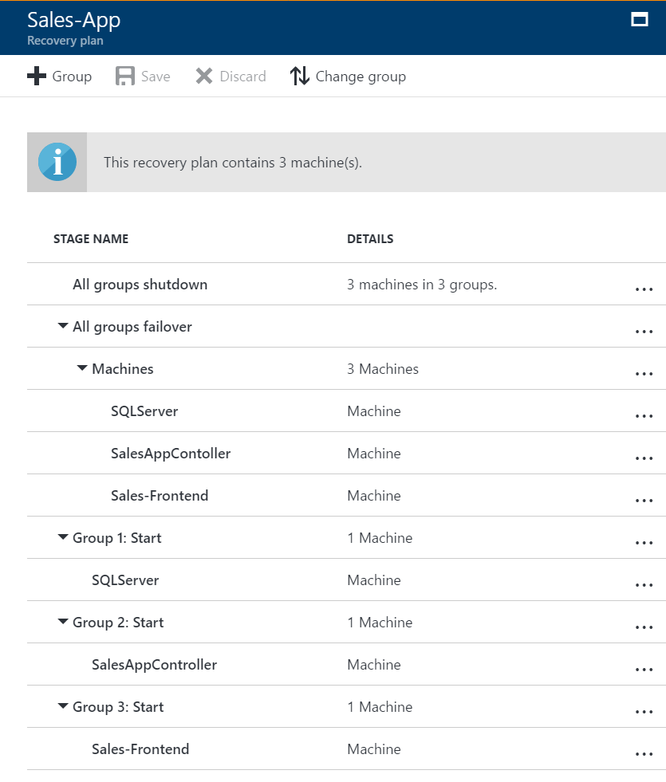
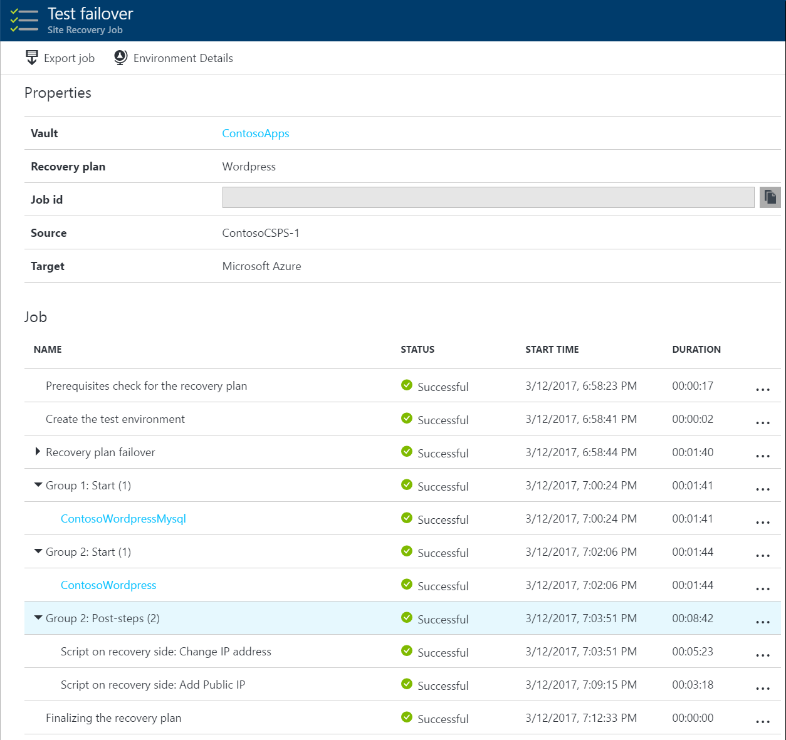

# Create recovery plans

This article provides information about creating and customizing recovery plans in [Azure Site Recovery](site-recovery-overview.md).

Post any comments or questions at the bottom of this article, or on the [Azure Recovery Services Forum](https://social.msdn.microsoft.com/forums/azure/home?forum=hypervrecovmgr).

 Create recovery plans to do the following:

* Define groups of machines that fail over together, and then start up together.
* Model dependencies between machines, by grouping them together into a recovery plan group. For example, to fail over and bring up a specific application, you group all of the VMs for that application into the same recovery plan group.
* Run a failover. You can run a test, planned, or unplanned failover on a recovery plan.

## Why use recovery plans?

Recovery plans help you plan for a systematic recovery process by creating small independent units that you can manage. These units will typically represent an application in your environment. Recovery plan not only allows you to define the sequence in which the virtual machines start, but also helps you automate common tasks during recovery.

**Essentially, one way to check that you are prepared for cloud migration or disaster recovery is by ensuring that every application of yours is part of a recovery plan and each of the recovery plans is tested for recovery to Microsoft Azure. With this preparedness, you can confidently migrate or failover your complete datacenter to Microsoft Azure.**
 
Following are the three key value propositions of a recovery plan:

### Model an application to capture dependencies

A recovery plan is a group of virtual machines generally comprising an application that failover together. Using the recovery plan constructs, you can enhance this group to capture your application-specific properties.
 
Let us take the example of a typical three tier application with

* one SQL backend
* one middleware
* one web frontend

The recovery plan can be customized to ensure that the virtual machines come up in the right order post a failover. The SQL backend should come up first, the middleware should come up next, and the web frontend should come up last. This order makes certain that the application is working by the time the last virtual machine comes up. For example, when the middleware comes up, it will try to connect to the SQL tier, and the recovery plan has ensured that the SQL tier is already running. Frontend servers coming up last also ensures that end users do not connect to the application URL by mistake until all the components are up are running and the application is ready to accept requests. To build these dependencies, you can customize the recovery plan to add groups. Then select a virtual machine and change its group to move it between groups.

Once you complete the customization, you can visualize the exact steps of the recovery. Here is the order of steps executed during the failover of a recovery plan:

* First there is a shutdown step that attempts to turn off the virtual machines on-premises (except in test failover where the primary site needs to continue to be running)
* Next it triggers failover of all the virtual machines of the recovery plan in parallel. The failover step prepares the virtual machines’ disks from replicated data.
* Finally the startup groups execute in their order, starting the virtual machines in each group - Group 1 first, then Group 2, and finally Group 3. If there are more than one virtual machines in any group (for example, a load-balanced web frontend) all of them are booted up in parallel.

**Sequencing across groups ensures that dependencies between various application tiers are honored and parallelism where appropriate improves the RTO of application recovery.**

   > [!NOTE]
   > Machines that are part of a single group will failover in parallel. Machines that are part of different groups will failover in the oder of the groups. Only after all machines of Group 1 have failed over and booted, will the machines of Group 2 start their failover.

### Automate most recovery tasks to reduce RTO

Recovering large applications can be a complex task. It is also difficult to remember the exact customization steps post failover or migration. Sometimes, it is not you, but someone else who is unaware of the application intricacies, who needs to trigger the failover. Remembering too many manual steps in times of chaos is difficult and error prone. A recovery plan gives you a way to automate the required actions you need to take at every step, by using Microsoft Azure Automation runbooks. With runbooks, you can automate common recovery tasks like the examples given below. For those tasks that cannot be automated, recovery plans also provide you the ability to insert manual actions.

* Tasks on the Azure virtual machine post failover – these are required typically so that you can connect to the virtual machine, for example:
    * Create a public IP on the virtual machine post failover
    * Assign an NSG to the failed over virtual machine’s NIC
    * Add a load balancer to an availability set
* Tasks inside the virtual machine post failover – these reconfigure the application so that it continues to work correctly in the new environment, for example:
    * Modify the database connection string inside the virtual machine
    * Change web server configuration/rules

**With a complete recovery plan that automates the post recovery tasks using automation runbooks, you can achieve one-click failover and optimize the RTO.**

### Test failover to be ready for a disaster

A recovery plan can be used to trigger both a failover or a test failover. You should always complete a test failover on the application before doing a failover. Test failover helps you to check whether the application will come up on the recovery site.  If you have missed something, you can easily trigger cleanup and redo the test failover. Do the test failover multiple times until you know with certainty that the application recovers smoothly.

**Each application is different and you need to build recovery plans that are customized for each. Also, in this dynamic datacenter world, the applications and their dependencies keep changing. Test failover your applications once a quarter to check that the recovery plan is current.**

## How to create a recovery plan

1. Click **Recovery Plans** > **Create Recovery Plan**.
   Specify a name for the recovery plan, and a source and target. The source location must have virtual machines that are enabled for failover and recovery. Choose a source and target based on the virtual machines that you want to be part of the recovery plan. 

   |Scenario                   |Source               |Target           |
   |---------------------------|---------------------|-----------------|
   |Azure to Azure             |Azure region         |Azure Region     |
   |Vmware to Azure            |Configuration server |Azure            |
   |VMM to Azure               |VMM friendly name    |Azure            |
   |Hyper-v Site to Azure      |Hyper-v site name    |Azure            |
   |Physical machines to Azure |Configuration server |Azure            |
   |VMM to VMM                 |VMM friendly name    |VMM friendly name|

   > [!NOTE]
   > A recovery plan can contain virtual machines that have the same source and target. Virtual machines of VMware and VMM cannot be part of the same recovery plan. VMware virtual machines and physical machines can however be added to the same plan as the source for both of them is a configuration server.

2. In **Select virtual machines**, select the virtual machines (or replication group) that you want to add to the default group (Group 1) in the recovery plan. Only those virtual machines that were protected on Source (as selected in the recovery plan) and are protected to the Target (as selected in the recovery plan) will be allowed for selection.

## How to customize and extend recovery plans

You can customize and extend recovery plans by going to the Site Recovery recovery plan resource blade and clicking the Customize tab.

You can customize and extend recovery plans:

- **Add new groups**—Add additional recovery plan groups (up to seven) to the default group, and then add more machines or replication groups to those recovery plan groups. Groups are numbered in the order in which you add them. A virtual machine, or replication group, can only be included in one recovery plan group.
- **Add a manual action**—You can add manual actions that run before or after a recovery plan group. When the recovery plan runs, it stops at the point at which you inserted the manual action. A dialog box prompts you to specify that the manual action was completed.
- **Add a script**—You can add scripts that run before or after a recovery plan group. When you add a script, it adds a new set of actions for the group. For example, a set of pre-steps for Group 1 will be created with the name: Group 1: pre-steps. All pre-steps are listed inside this set. You can only add a script on the primary site if you have a VMM server deployed. [Learn more](site-recovery-how-to-add-vmmscript.md).
- **Add Azure runbooks**—You can extend recovery plans with Azure runbooks. For example, to automate tasks, or to create single-step recovery. [Learn more](site-recovery-runbook-automation.md).

## How to add a script, runbook or manual action to a plan

You can add a script or manual action to the default recovery plan group after you've added VMs or replication groups to it, and created the plan.

1. Open the recovery plan.
2. Click an item in the **Step** list, and then click **Script** or **Manual Action**.
3. Specify whether to want to add the script or action before or after the selected item. To move the position of the script up or down, use the **Move Up** and **Move Down**  buttons.
4. If you add a VMM script, select **Failover to VMM script**. In **Script Path**, type the relative path to the share. In the VMM example below, you specify the path: **\RPScripts\RPScript.PS1**.
5. If you add an Azure automation run book, specify the Azure Automation account in which the runbook is located, and select the appropriate Azure runbook script.
6. To make sure the script works as expected, do a failover of the recovery plan.

The script or runbook options are available only in the following scenarios when doing a failover or failback. A manual action is available for both failover and failback.

|Scenario               |Failover |Failback |
|-----------------------|---------|---------|
|Azure to Azure         |Runbooks |Runbook  |
|Vmware to Azure        |Runbooks |NA       | 
|VMM to Azure           |Runbooks |Script   |
|Hyper-v site to Azure  |Runbooks |NA       |
|VMM to VMM             |Script   |Script   |

## Next steps

[Learn more](site-recovery-failover.md) about running failovers.

Watch this video to see the recovery plan in action.

> [!VIDEO https://channel9.msdn.com/Series/Azure-Site-Recovery/One-click-failover-of-a-2-tier-WordPress-application-using-Azure-Site-Recovery/player]
