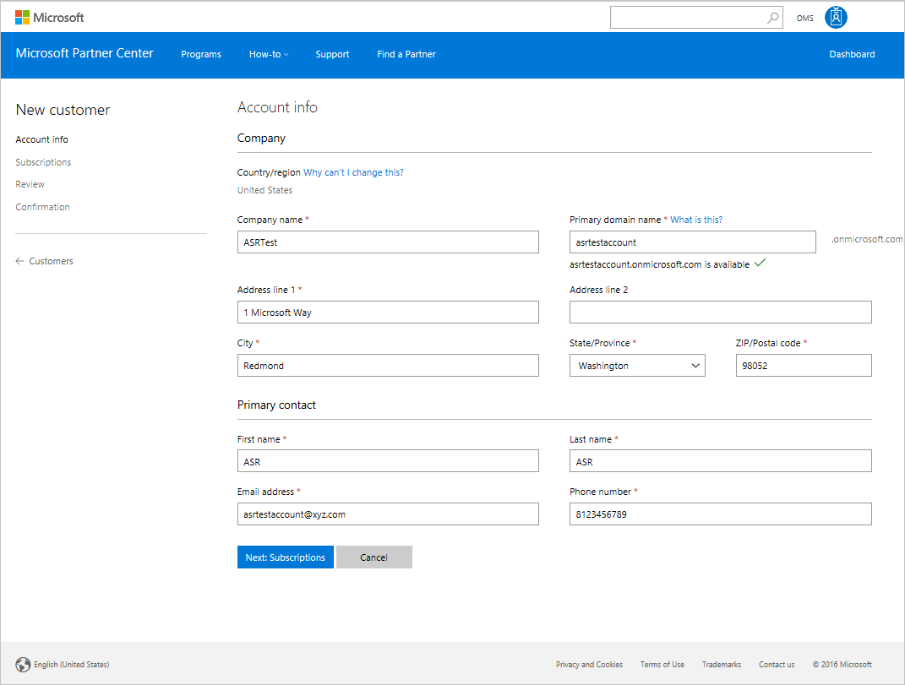
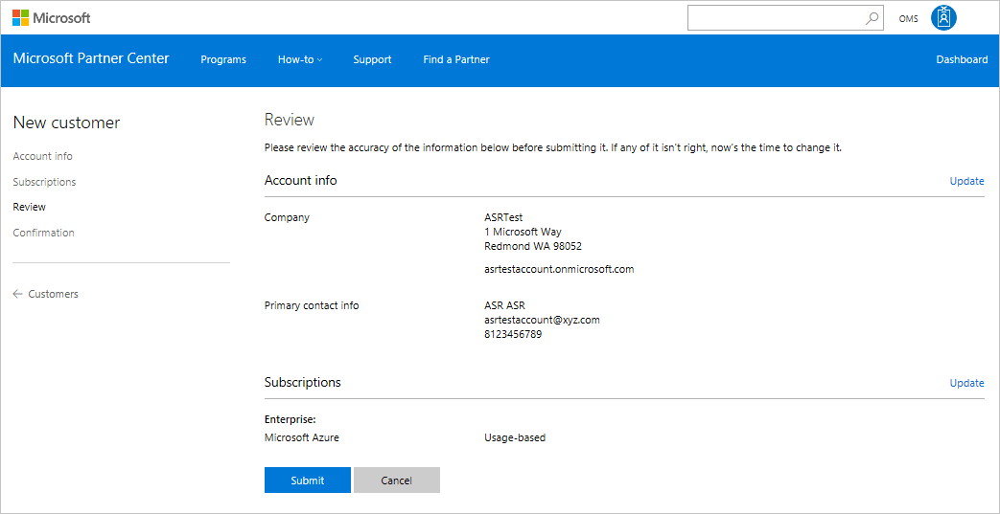
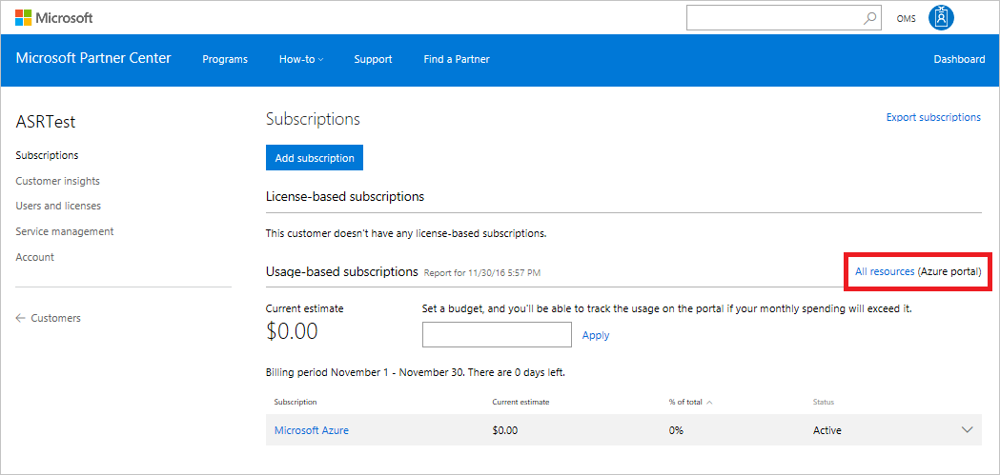
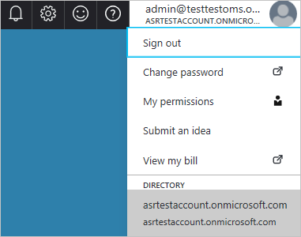
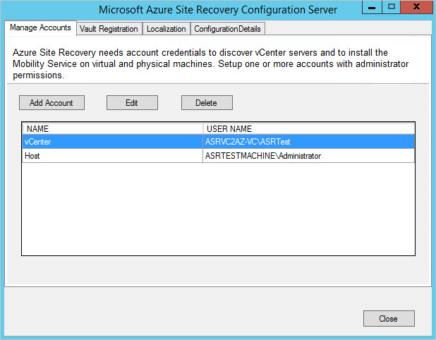
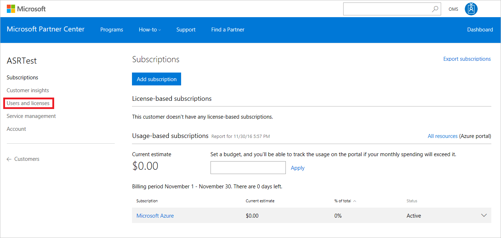

# Manage multi-tenancy with the Cloud Solution Provider (CSP) program

The [CSP program](https://partner.microsoft.com/en-US/cloud-solution-provider) fosters better-together stories for Microsoft cloud services, including Office 365, Enterprise Mobility Suite, and Microsoft Azure. With CSP, partners own the end-to-end relationship with customers and become the primary relationship contact point. Partners can deploy Azure subscriptions for customers and combine the subscriptions with their own value-added, customized offerings.

With Azure Site Recovery, partners can manage the complete Disaster Recovery solution for customers directly through CSP. Or they can use CSP to set up Site Recovery environments and let customers manage their own disaster-recovery needs in a self-service manner. In both scenarios, partners are the liaison between Site Recovery and their customers. Partners service the customer relationship and bill customers for Site Recovery usage.

This article describes how a partner can create and manage tenant subscriptions through CSP, for a multi-tenant VMware setup.

## Prerequisites

- [Prepare](tutorial-prepare-azure.md) Azure resources, including an Azure subscription, an Azure virtual network, and a storage account.
- [Prepare](tutorial-prepare-on-premises-vmware.md) VMware on-premises VMware servers and VMs.
- For each tenant, create a separate management server that can communicate with the tenant VMs and partner’s vCenter. Only the partner has access rights to this server. For more details on  different multi-tenant environments refer to the [multi-tenant VMware](site-recovery-multi-tenant-support-vmware-using-csp.md) guidance .

## Create a tenant account

1. Through [Microsoft Partner Center](https://partnercenter.microsoft.com/), sign in to your CSP account.

2. On the **Dashboard** menu, select **Customers**.

	

3. On the page that opens, click the **Add customer** button.

	

4. On the **New Customer** page, fill in the account information details for the tenant, and then click **Next: Subscriptions**.

	

5. On the subscriptions selection page, select the **Microsoft Azure** check box. You can add other subscriptions now or at any other time.

	

6. On the **Review** page, confirm the tenant details, and then click **Submit**.

	  

    After you've created the tenant account, a confirmation page appears, displaying the details of the default account and the password for that subscription.

7. Save the information, and change the password later as necessary through the Azure portal sign-in page.  

    You can share this information with the tenant as is, or you can create and share a separate account if necessary.

## Access the tenant account

You can access the tenant’s subscription through the Microsoft Partner Center Dashboard, as described in "Step 1: Create a tenant account."

1. Go to the **Customers** page, and then click the name of the tenant account.

2. On the **Subscriptions** page of the tenant account, you can monitor the existing account subscriptions and add more subscriptions, as required. To manage the tenant’s disaster-recovery operations, select **All resources (Azure portal)**.

	  

    Clicking **All resources** grants you access to the tenant’s Azure subscriptions. You can verify access by clicking the Azure Active Directory link at the top right of the Azure portal.

	

You can now perform all site-recovery operations for the tenant through the Azure portal and manage the disaster-recovery operations. To access the tenant subscription through CSP for managed disaster recovery, follow the previously described process.

## Deploy resources to the tenant subscription
1. On the Azure portal, create a resource group, and then deploy a Recovery Services vault per the usual process.

2. Download the vault registration key.

3. Register the CS for the tenant by using the vault registration key.

4. Enter the credentials for the two access accounts: vCenter access account and VM access account.

	

## Register Site Recovery infrastructure to the Recovery Services vault
1. In the Azure portal, on the vault that you created earlier, register the vCenter server to the CS that you registered in "Step 3: Deploy resources to the tenant subscription." Use the vCenter access account for this purpose.
2. Finish the "Prepare infrastructure" process for Site Recovery per the usual process.
3. The VMs are now ready to be replicated. Verify that only the tenant’s VMs are displayed on the **Select virtual machines** blade under the **Replicate** option.

	

## Assign tenant access to the subscription

For self-service disaster recovery, provide to the tenant the account details, as mentioned in step 6 of the "Step 1: Create a tenant account" section. Perform this action after the partner sets up the disaster-recovery infrastructure. Whether the disaster-recovery type is managed or self-service, partners must access tenant subscriptions through the CSP portal. They set up the partner-owned vault and register infrastructure to the tenant subscriptions.

Partners can also add a new user to the tenant subscription through the CSP portal by doing the following:

1. Go to the tenant’s CSP subscription page, and then select the **Users and licenses** option.

	

	You can now create a new user by entering the relevant details, and selecting permissions, or by uploading the list of users in a CSV file.

2. After you've created a new user, go back to the Azure portal, and then, on the **Subscription** blade, select the relevant subscription.

3. On the blade that opens, select **Access Control (IAM)**, and then click **Add** to add a user with the relevant access level.      
    The users that were created through the CSP portal are automatically displayed on the blade that opens after you click an access level.

	

	For most management operations, the *Contributor* role is sufficient. Users with this access level can do everything on a subscription except change access levels (for which *Owner*-level access is required).

  Azure Site Recovery also has three [pre-defined user roles](site-recovery-role-based-linked-access-control.md) that can be used to further restrict access levels as required.

## Next steps
  [Learn more](site-recovery-role-based-linked-access-control.md) about role-based access control to manage Azure Site Recovery deployments.

  [Manage multi-tenant VMware environments](site-recovery-multi-tenant-support-vmware-using-csp.md)
